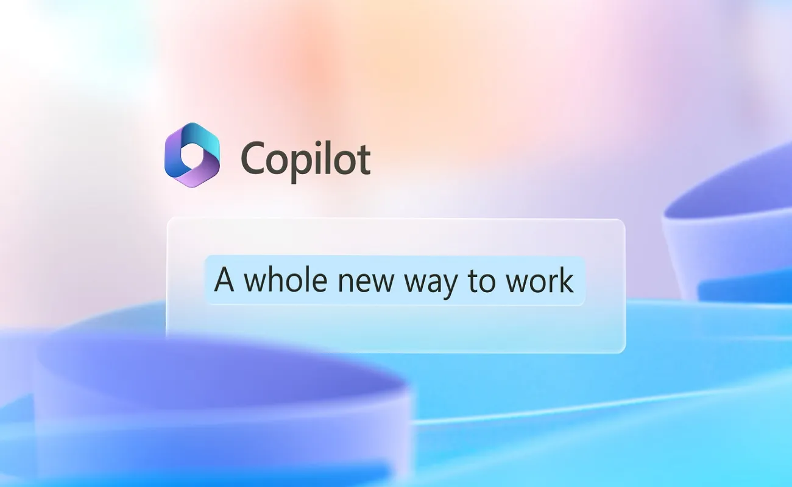

# Introduction to Microsoft Copilot for Microsoft 365

Welcome to the Microsoft Copilot for Microsoft 365 Lab, an immersive exploration into the revolutionary world of AI-powered productivity. In this guide, we'll delve into the groundbreaking features of Microsoft Copilot, an upcoming AI-driven tool that promises to redefine the way we approach everyday tasks within the Microsoft 365 ecosystem.

## Unleashing Creativity, Unlocking Productivity, and Up-leveling Skills

At its core, Copilot for Microsoft 365 is a fusion of cutting-edge technology and the vast capabilities of Large Language Models (LLMs). By seamlessly integrating with Microsoft Graph and the suite of Microsoft 365 applications, Copilot transforms natural language into a potent force for innovation and growth. This transformative tool aims to revolutionize work in three fundamental ways:

1. **Unleash Creativity:** Copilot empowers you to create content with unprecedented speed and efficiency, offering intelligent suggestions that elevate the creative process.

2. **Unlock Productivity:** By assisting you in focusing on what truly matters, Copilot streamlines tasks, allowing you to channel your energy into the most impactful aspects of your work.

3. **Up-level Skills:** Copilot acts as a personalized learning companion, helping you enhance your existing skills and swiftly acquire new ones, thereby fostering continuous professional growth.

## Table of Contents

- [Introduction to M365 Copilot](#introduction-to-m365-copilot)
- [Understanding M365 Copilot Architecture](#understanding-m365-copilot-architecture)
- [Preparing for M365 Copilot Deployment](#preparing-for-m365-copilot-deployment)
   - [Organizing Sharepoint teams and files](#organizing-sharepoint-teams-and-files)
   - [Understand Semantic Index](#understand-semantic-index)
- [Using Copilot in M365 Applications](#using-copilot-in-m365-applications)
   - [Using Microsoft 365 Copilot in Word](#using-microsoft-365-copilot-in-word)
   - [Using Microsoft 365 Copilot in Outlook](#using-microsoft-365-copilot-in-outlook)
   - [Using Microsoft 365 Copilot in Powerpoint](#using-microsoft-365-copilot-in-powerpoint)
   - [Using Microsoft 365 Copilot in Excel](#using-microsoft-365-copilot-in-excel)
   - [Using Microsoft 365 Copilot in Teams](#using-microsoft-365-copilot-in-teams)
   - [Using Microsoft 365 Copilot in Loop](#using-microsoft-365-copilot-in-loop)
   - [Using Microsoft 365 chat](#using-microsoft-365-chat)
- [Administer M365 Copilot](#manage-copilot)
   - [Managing Microsoft 365 Copilot Licenses in Admin Center](#Managing-Microsoft-365-Copilot-Licenses-in-Admin-Center)
   - [Managing Microsoft 365 Copilot Services](#Manage-Microsoft-365-Copilot-Services)
   - [Managing Public web content access](#Managing-Public-web-content-access)
   - [Change update channel of Microsoft 365 Apps to enable Copilot](#Change-update-channel-of-Microsoft-365-Apps-to-enable-Copilot)
- [Reviewing Security and Compliance in Copilot](#reviewing-security-and-compliance-in-copilot)
   - [Reviewing Security and Compliance in Copilot using Sensitivity Labels](#reviewing-security-and-compliance-in-copilot-using-sensitivity-labels)
   - [Implementing sensitivity label](#implementing-sensitivity-label)
   - [Reviewing Security and Compliance in Copilot Using Data Classification](#reviewing-security-and-compliance-in-copilot-using-data-classification)
   - [Reviewing Security and Compliance in Copilot Using Customer Keys](#reviewing-security-and-compliance-in-copilot-using-customer-keys)
   - [Reviewing Security and Compliance in Copilot Using Communication Compliance](#reviewing-security-and-compliance-in-copilot-using-communication-compliance)
   - [Reviewing Security and Compliance in Copilot Using Audit](#reviewing-security-and-compliance-in-copilot-using-audit)
   - [Reviewing Security and Compliance in Copilot Using Content Search](#reviewing-security-and-compliance-in-copilot-using-content-search)
   - [Reviewing Security and Compliance in Copilot Using eDiscovery](#reviewing-security-and-compliance-in-copilot-using-ediscovery)
   - [Reviewing Security and Compliance in Copilot using Retention Policies](#reviewing-security-and-compliance-in-copilot-using-retention-policies)
- [Exploring Microsoft Copilot Lab](#exploring-microsoft-copilot-lab)
- [Try Out Your Organizational Use Cases with M365 Copilot Capabilities](#try-out-your-organizational-use-cases-with-m365-copilot-capabilities)

## Scenario

**Contoso Ltd.**, a leading IT Consultancy firm, is always in search of ways to improve its efficiency and productivity. To achieve this, they've decided to incorporate **Microsoft Copilot for Microsoft 365** into their operations. With its extensive range of features and the ability to streamline tasks, automate workflows, and enhance collaboration, Contoso is confident that Copilot will be a game-changer.

As part of the lab, you've been given access to Contoso's Microsoft 365 environment to test and demonstrate the capabilities of **Microsoft 365 Copilot**. You have the access to Contoso's data present in various SharePoint sites, namely Human Resource, Marketing and Finance, which you will utilize in future in the lab. You also have been provided the access to Teams environment as an employee of the **Contoso Ltd.** By the end of this lab, you'll have a thorough understanding of how **Microsoft 365 Copilot** can transform an organization's productivity and efficiency, just as it's doing for **Contoso Ltd**.

## The AI-Employee Collaboration Advantage

In a world where the pace of work often surpasses our ability to keep up, Copilot for Microsoft 365 emerges as a vital ally. Statistics reveal that a significant percentage of individuals struggle with time and energy in their professional lives, and a growing number are willing to delegate tasks to AI to alleviate workloads. Copilot stands as a testament to a new era of collaboration, where AI and employees join forces to enhance productivity and job satisfaction.

## Seamless Integration with Microsoft 365

Designed to address the challenges of the digital age, Copilot seamlessly integrates with popular Microsoft 365 applications such as Teams, Word, Outlook, PowerPoint, and Excel. This integration, coupled with its ability to leverage business data from Microsoft Graph, positions Copilot as a catalyst for sparking creativity, boosting productivity, and cultivating new skills within the workplace.

## Examples in Action

Throughout this lab guide, we'll explore real-world examples of Copilot for Microsoft 365 in action. From summarizing email threads in Outlook to transforming text-heavy slides into concise bullet points in PowerPoint, and even rewriting paragraphs in different tones or styles in Word, you'll witness firsthand the transformative power of Copilot across various scenarios.

## Conclusion

The aim of Copilot for Microsoft 365 is clear – to change the way you work, turning routine tasks into opportunities for growth and innovation. Join us on this journey as we unlock the full potential of Microsoft Copilot, and discover how AI can truly become an invaluable ally in your quest for professional excellence. 
