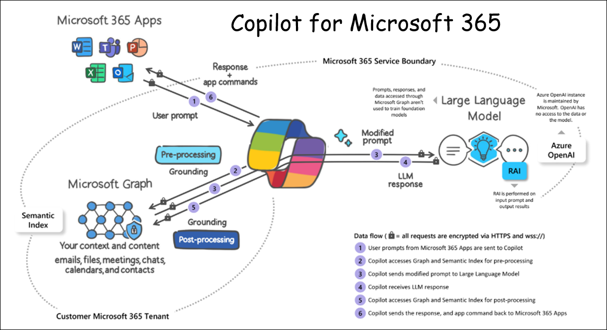

# Exercise 1: Understanding M365 Copilot Architecture (Read Only)

>**Note:** The following exercise is Read-Only to let you understand the architecture of **M365 Copilot** and to get well-versed with its features and the transformative actions it can take.

## Overview

At its core, Copilot for Microsoft 365 isn't merely a feature but an intelligent partner that seamlessly integrates into your daily Microsoft 365 interactions. Whether you're using Outlook, PowerPoint, Word, Excel, Teams, or other applications, Copilot aims to enhance your efficiency by generating content, providing relevant suggestions, and optimizing your processes.

Microsoft Copilot for Microsoft 365 operates through a sophisticated architecture and prompt flow, ensuring that user inputs are not only understood but also generate tailored and contextually relevant responses. In this section, we'll explore the step-by-step process that Copilot follows, from the user prompt to the final response.

## Copilot's Understanding of Context and User Needs

Copilot's effectiveness lies in its unparalleled ability to understand users, achieved through:

- **Analyzing Content:** Scrutinizing documents, emails, and meeting content to discern intent, meaning, tone, structure, and semantics.
- **Gaining Personal Insights:** Utilizing profile information, communication patterns, and activity history to understand user interests, expertise, and preferences.
- **Real-time Monitoring:** Continuously observing user actions to gauge immediate needs and determine how best to assist.

## Transformative Actions

With a deep understanding of user context, Copilot doesn't just observe; it takes action:

- **Search and Retrieval:** Leveraging powerful search capabilities to identify valuable data and content sources for assistance.
- **Natural Phrasing with Large Language Models:** Harnessing Large Language Models (LLMs) to craft naturally phrased recommendations aligned with the user's unique situation.
- **Refining Recommendations:** Focusing on quality over quantity, Copilot evaluates and refines suggestions to ensure contextually relevant and specific results.

## Features and Transformations by Copilot

Copilot for Microsoft 365 is designed to transform the way employees work in the digital age, offering features such as:

- **Reduction in Digital Overload:** By combining LLMs with work content and context, Copilot tackles tasks and alleviates the burden of digital overload
- **Enhanced Meeting Engagement:** Assisting users in staying more engaged in meetings and providing quick catch-ups for missed meetings, ensuring continuous participation.
- **Efficient Email Management:** Summarizing lengthy email threads and aiding in drafting responses, streamlining email communication.
- **Writing Assistance:** Transforming writing processes by drafting, editing, summarizing, and creating alongside users, enhancing document quality and efficiency.
- **Presentation Development:** Simplifying the initiation of presentations with natural language commands, sparking creativity and idea generation.
- **Data Analysis and Visualization:** Assisting in identifying trends, creating visualizations, and providing recommendations to simplify data analysis.
- **Security and Compliance:** Ensuring comprehensive enterprise compliance and security controls for data protection and peace of mind.
- **User Control:** Empowering users with control over AI suggestions, allowing modification or discard, emphasizing the human element in AI interaction.

## Copilot's Architecture and Processing Flow: Step-by-Step

The following steps outline the processing flow of Copilot for Microsoft 365, from user prompt to Copilot response:

### User Interaction

1. **User Input:**
   
   - A user provides input or asks a question within a Microsoft 365 app, such as Word or PowerPoint.

### Grounding and Data Preparation

2. **Grounding:**
   - Copilot prepares the user's input using a method known as "grounding." This step ensures that responses are specific and directly related to the user's task.
   
3. **Consulting Microsoft Graph:**
   - During grounding, Copilot consults Microsoft Graph to gather related data from the organization. It accesses only the data that the user is permitted to see based on their role and permissions in Microsoft 365.

### Retrieval-Augmented Generation

4. **Retrieval-Augmented Generation:**
   - This step involves combining the user's data with other relevant sources, such as knowledge base articles, to refine the question for a more accurate answer.

### Large Language Model (LLM) Consultation

5. **Consulting the LLM:**
   - With the improved input, Copilot consults the Large Language Model (LLM) to generate an initial answer.

### Answer Refinement

6. **Refinement Process:**
   - Copilot further refines the initial answer by conducting additional checks against Microsoft Graph.
   - Evaluations for responsible AI practices, security assessments, and compliance checks are performed.
   - The answer may be converted into actionable commands, ensuring practicality and usability.

### User Response

7. **Offering Suggestions:**
   - Finally, Copilot offers a well-formed, relevant suggestion back to the user, accompanied by any actionable commands.
   - The results are closely tied to the organization's specific data, ensuring relevance and context.

## Conclusion

Understanding the intricate architecture and prompt flow of Copilot for Microsoft 365 provides insights into how this AI-powered tool delivers tailored and intelligent responses. As we proceed in this lab guide, we will explore these processes in more detail, offering you a deeper understanding of how Copilot enhances your productivity within the Microsoft 365 environment.
