# Exercise 2.1: Preparing for M365 Copilot Deployment

In this exercise, you will explore organized SharePoint sites and use M365 Copilot to efficiently retrieve and manage information from them.

## Overview

In this exercise, you will explore how well-organized SharePoint sites enhance M365 Copilot's ability to retrieve and manage information. You will navigate through two pre-configured SharePoint sites for Contoso Ltd. - **Finance** and **Human Resources** - to understand their structure, including document libraries and folders. You'll then use M365 Copilot to query these sites, retrieve specific file details, and generate content based on stored documents. This exercise demonstrates how proper SharePoint organization directly impacts Copilot's effectiveness in delivering accurate and relevant information to enhance collaboration and productivity.

## Task 1: Exploring SharePoint Sites and Using Copilot

A well-organized and structured SharePoint site can help Microsoft 365 Copilot by making it easier to find and retrieve relevant information. When the site is organized and the content is properly tagged and categorized, it makes it easier for Copilot to search and retrieve the information you need. This can help provide you with more accurate and relevant responses to your queries. Additionally, a well-organized SharePoint site can help improve collaboration and productivity within your organization by making it easier for everyone to find and access the information they need.

Let's explore the SharePoint sites we have set up for Contoso Ltd. These sites serve as a collaborative platform integrated with Microsoft 365, facilitating seamless document management and team collaboration.

### Task 1.1: Explore SharePoint Sites.

In this task you will navigate to and familiarize yourself with the SharePoint sites for Contoso Ltd., particularly the "Finance" and "Human Resources" sites. You will explore the structure, including document libraries and folders, to understand how information is organized.

1. Use the link below to sign in to Microsoft 365.

   ```
   https://m365.cloud.microsoft/
   ```

1. From the Microsoft 365 home page, select **Apps (1)**, and then choose **More apps (2)**.

   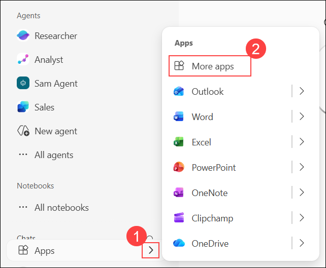

1. On the **Apps** page, select **SharePoint**.

   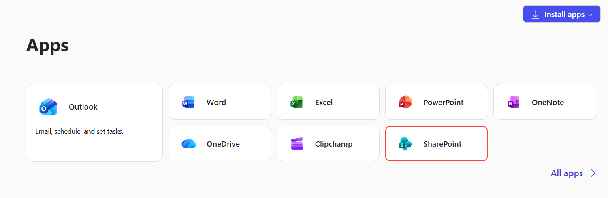

1. In SharePoint, select the **My sites (1)** icon, and then choose the **Finance (2)** site under *Frequent*.

   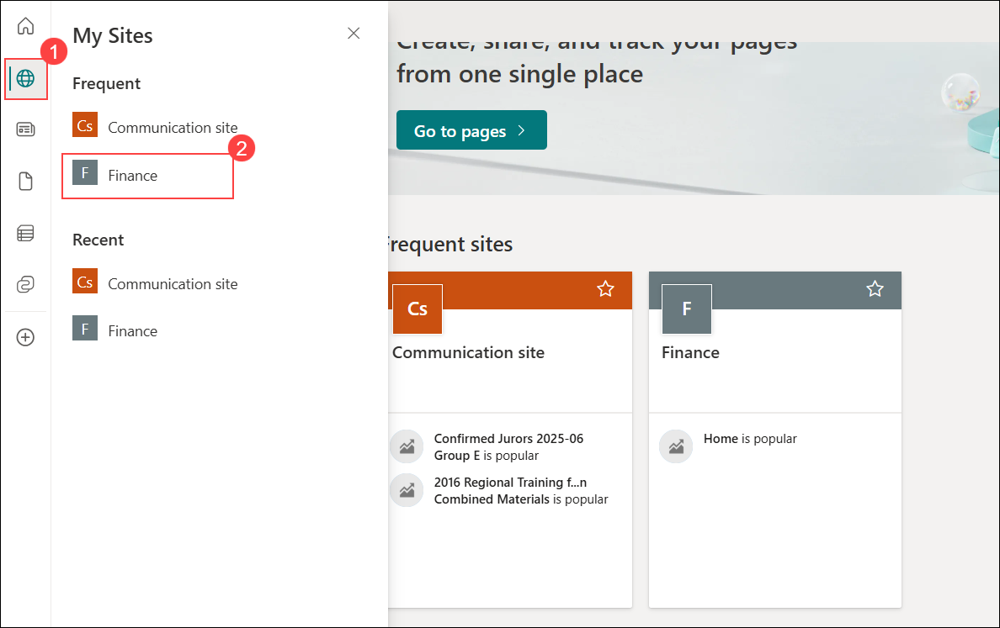

   >**Note:** If the **Finance** site is not visible, use the **Search (2)** box to search for **Finance**, select the **Sites (1)** tab, and then choose the **Finance (2)** site from the results.

   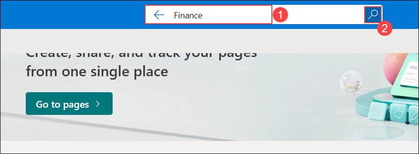

   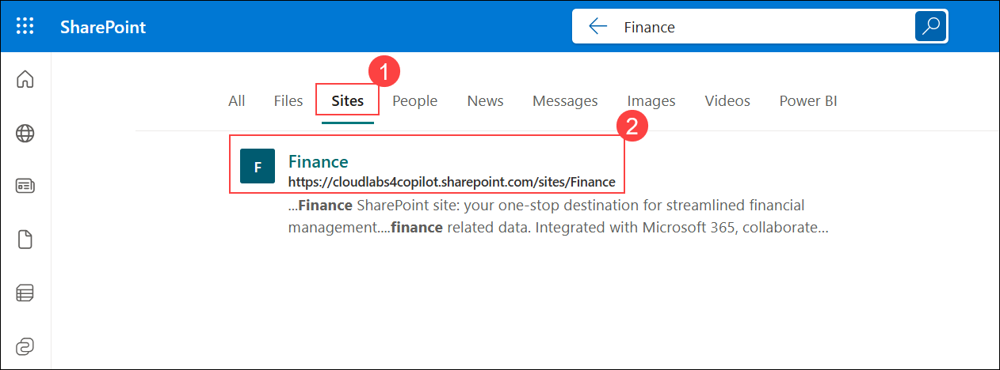

1. In the **Finance** SharePoint site, select **Site contents (1)** to view the available document libraries (2).

   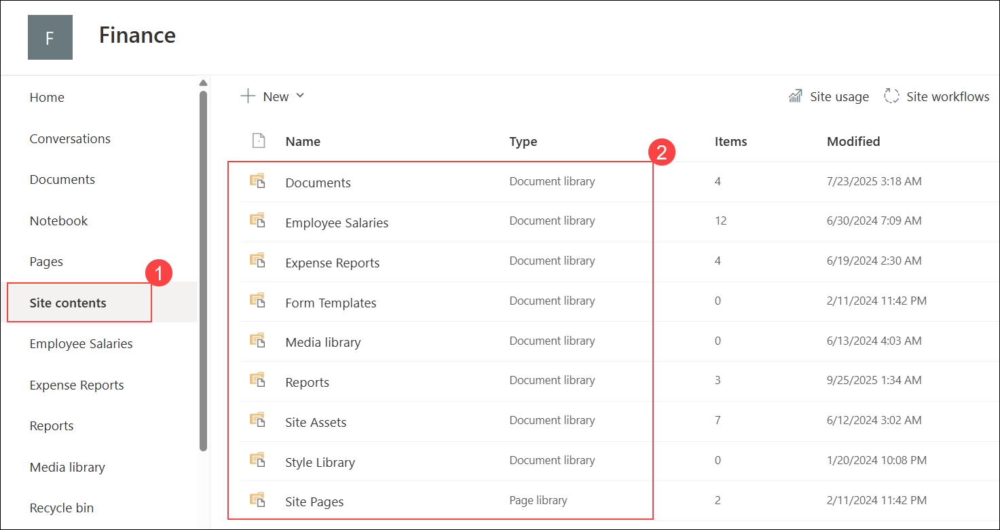

1. Now, let's enter the "Employee Salaries" document library. In the **Site contents** page, select the **Employee Salaries** document library.

   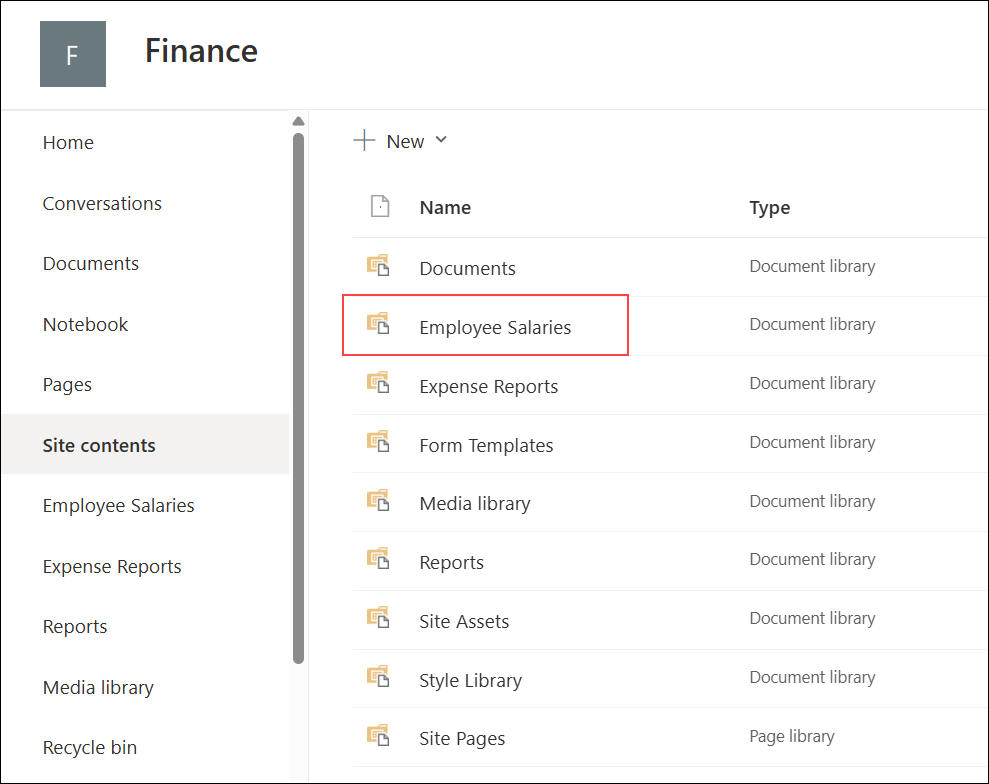
   
1. Inside, you'll notice two distinct folders: **Monthly Payroll** and **Yearly Payroll**. This clear division within the Employee Salaries document library highlights the separation between monthly and yearly payroll information.

   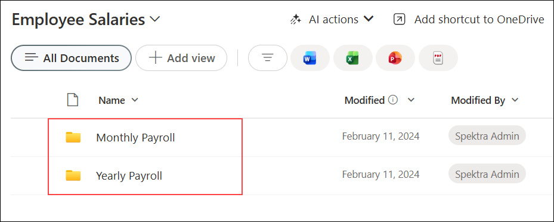

**Using Copilot to fetch data.**

1. Navigate back to **Microsoft 365** tab.

   ```
   https://m365.cloud.microsoft/
   ```

1. Select the **Copilot** icon to open the Copilot chat.
   
   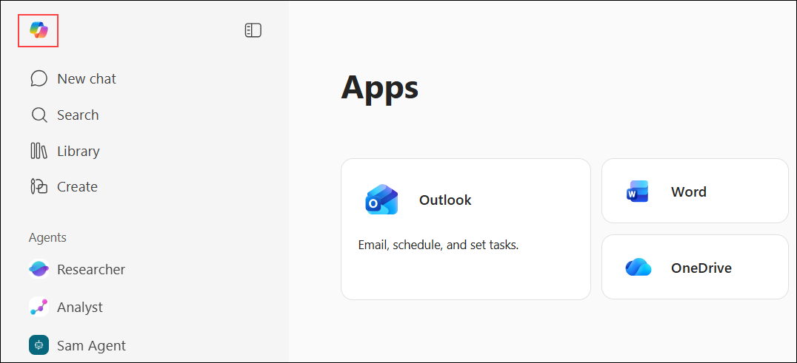
   
1. In Copilot chat, ensure **Work** is selected.

   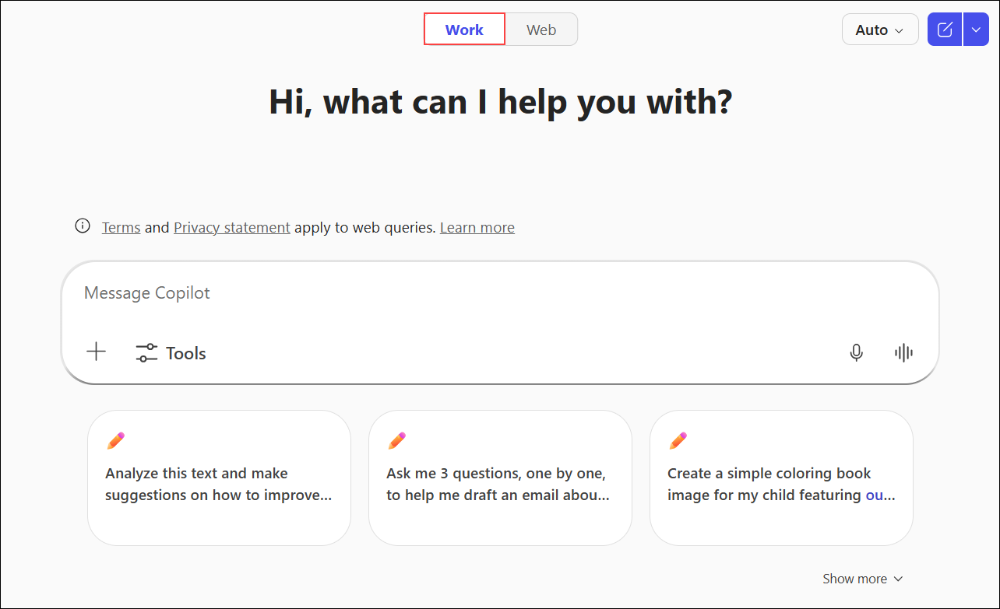

1. Let's ask Copilot to fetch some details of the **Finance** sharepoint site. Please use the prompt below.

   >**Note**: The responses generated by Copilot in the provided examples can differ during your lab sessions.

   ```
   Retrieve details about the Finance SharePoint site.
   ```
   
   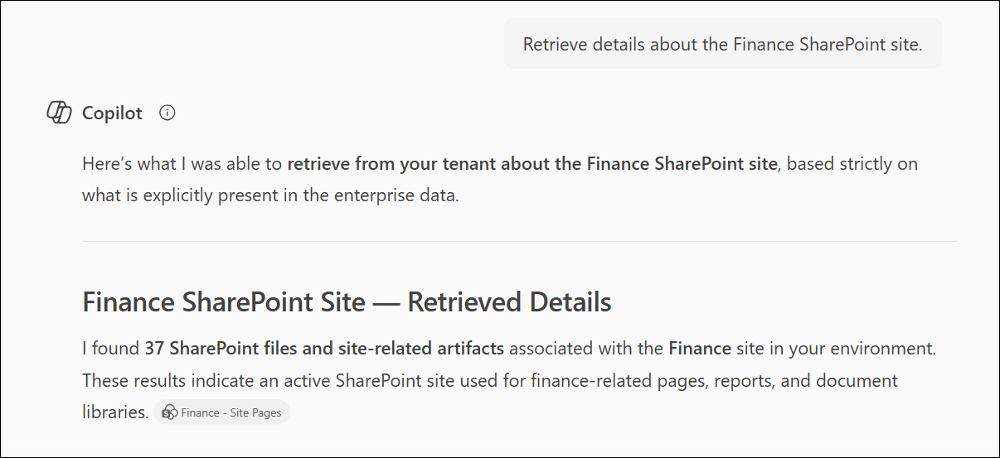

   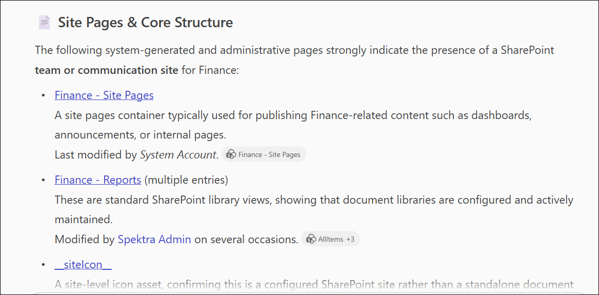
   
1. You can also request Copilot to retrieve specific information about a file within the SharePoint site. Use the following prompt.

   ```
   Could you elaborate more on February Payroll?
   ```

   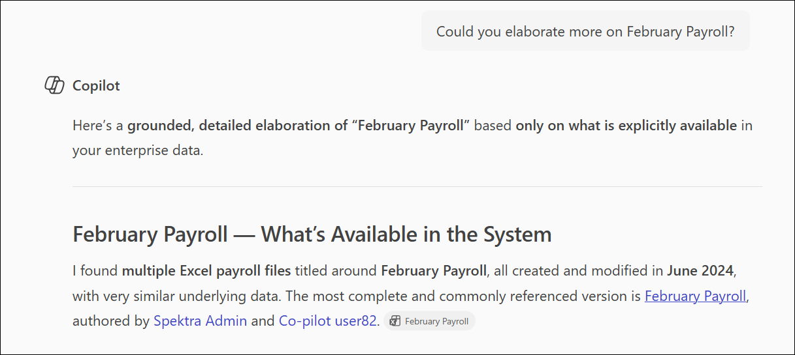

1. Select **SharePoint** to return to the SharePoint home page so you can search for other sites.

   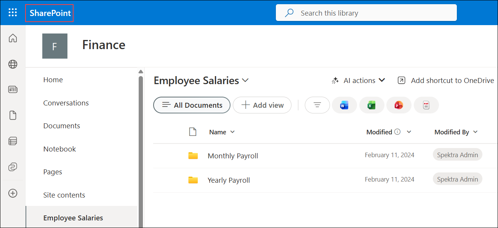

1. In the SharePoint home page, enter **Human Resource (1)** in the search box, and then select **Search (2)**.
     
   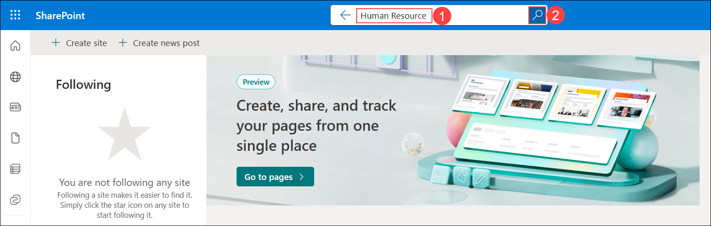

1. Select the **Sites (1)** tab, and then choose the **Human Resources (2)** site from the results.

   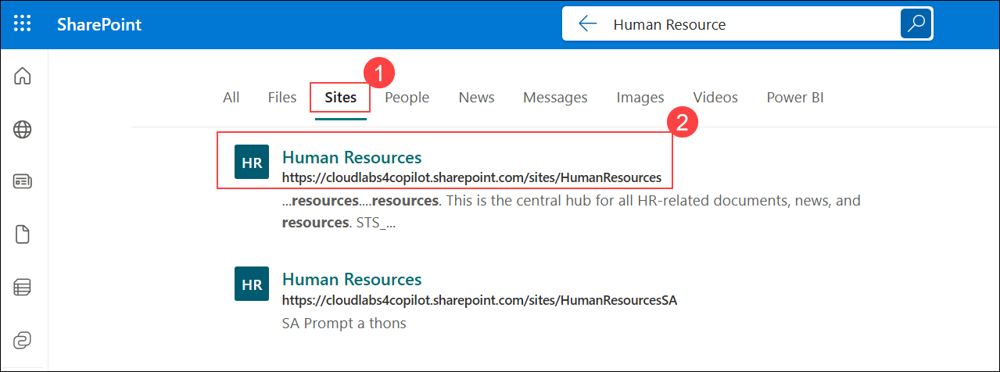

1. In the **Human Resources** SharePoint site, select **Site contents (1)** to view the available document libraries (2).

   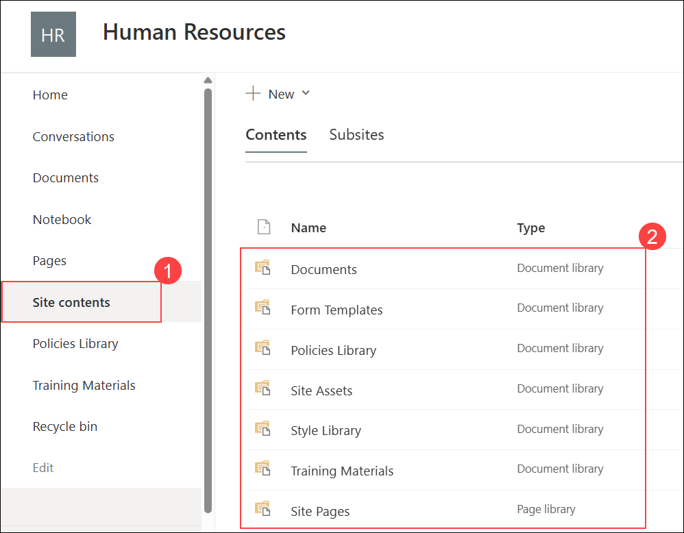

   >**Note**: The **Human Resources SharePoint site** is a crucial resource for any organization, as it serves as a central repository for various Human Resources (HR) related documents and information. The structure of this site is designed to ensure easy access and efficient navigation of all its contents. 
   
   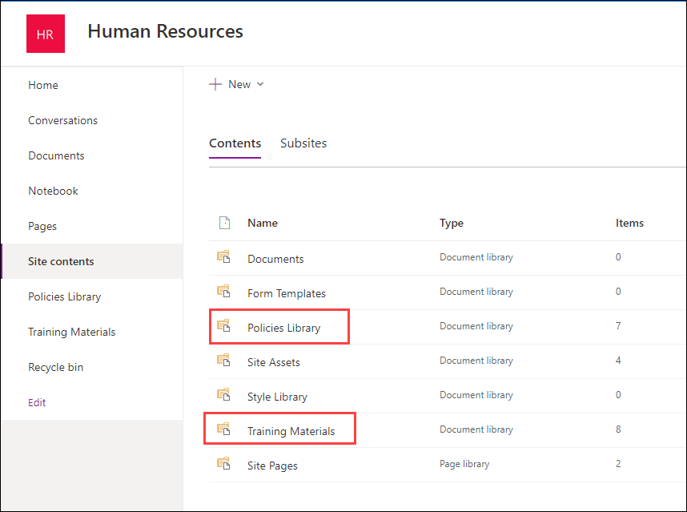

1. The first part of the HR site is the 'Policies Library.' This library is an organized collection of all HR-related policies and procedures, which are important documents that guide the conduct and operations of employees within the organization. These include, but are not limited to, rules and regulations regarding behavior, dress code, and usage of internet and email.

   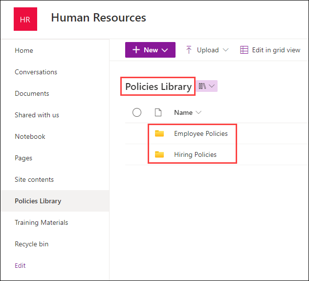

1. The Policies Library is further divided into different folders for effective organization. For example, there is an 'Employee Policies' folder, which contains files like the 'Code of Conduct,' 'Dress Code Policy,' and 'Internet and Email Policy.' These files are essentially documents that detail the organization's expected codes of behavior, dress standards, and rules for using internet and email services.

   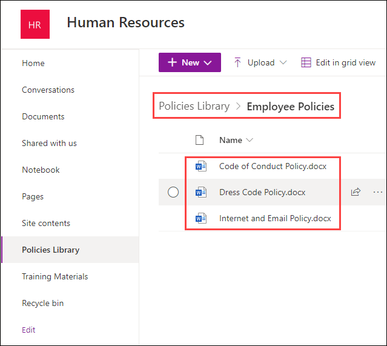

1. you can even ask Copilot regarding the Policies of our Organization from the **Human Resources** SharePoint site. Please use the following prompt.

   ```
   Create an FAQ based on Code of Conduct Policy.docx
   ```

   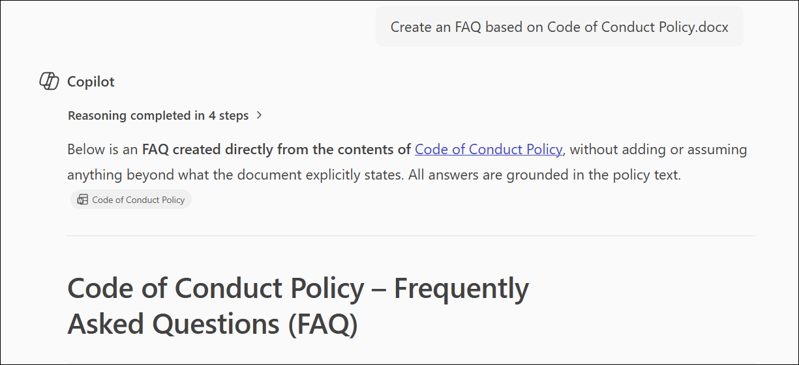

**Congratulations!** You've successfully explored well-organized SharePoint sites and experienced how proper structure enhances M365 Copilot's capabilities. You navigated through the **Finance** and **Human Resources** SharePoint sites, examined their document libraries and folders, and used **Microsoft 365 Copilot** to retrieve specific information from files like the **February Payroll** report and generate content like FAQs from the **Code of Conduct Policy**. This demonstrates how organized SharePoint sites enable Copilot to deliver more accurate and relevant information, enhancing collaboration and productivity.

### Summary

In this exercise, you explored the Finance and Human Resources SharePoint sites for Contoso Ltd. and used M365 Copilot to query and retrieve information from them. You learned how well-organized SharePoint sites enable Copilot to deliver more accurate and relevant responses, ultimately improving collaboration and productivity.
