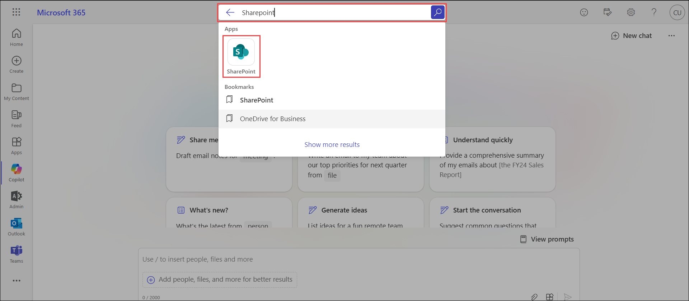
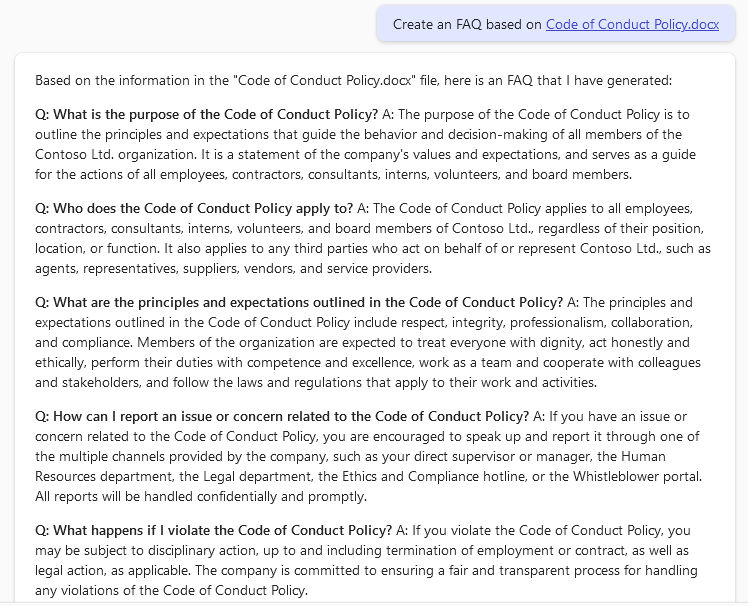

# Exercise 2.1: Preparing for M365 Copilot Deployment

In this exercise, you will organize SharePoint sites and use M365 Copilot to efficiently retrieve and manage information, enhancing collaboration and productivity.

## Introduction

In this exercise we will walkthrough a comprehensive journey, skillfully preparing users for the deployment of M365 Copilot through three interconnected tasks. Efficient collaboration and information management within an organization hinge on the meticulous organization of SharePoint sites. We will delve into the critical process of structuring SharePoint teams and files for optimal functionality and productivity. Through meticulous organization, SharePoint becomes a powerhouse for streamlined information retrieval and enhanced collaboration. By navigating through a structured "Finance" SharePoint site and leveraging the capabilities of Microsoft 365 Copilot, this exercise illuminates the importance of organized information architecture in driving organizational efficiency and productivity.

## Task 1: Organizing SharePoint Teams and Files

Organizing your SharePoint site is crucial for efficient collaboration and information management within your organization. A well-organized and structured SharePoint site can help Microsoft 365 Copilot by making it easier to find and retrieve relevant information. When the site is organized and the content is properly tagged and categorized, it makes it easier for me to search and retrieve the information you need. This can help me provide you with more accurate and relevant responses to your queries. Additionally, a well-organized SharePoint site can help improve collaboration and productivity within your organization by making it easier for everyone to find and access the information they need.

Let's explore the SharePoint sites we have set up for Contoso Ltd. These sites serves as a collaborative platform integrated with Microsoft 365, facilitating seamless document management and team collaboration.


### Task 1.1: Explore SharePoint Sites.

In this task you will navigate to and familiarize yourself with the SharePoint sites for Contoso Ltd., particularly the "Finance" and "Human Resources" sites. You will explore the structure, including document libraries and folders, to understand how information is organized.

- **Login to Microsoft 365:**
   - Navigate to the Environment details page and click on it. You will find M365 Copilot User Details tab. Click on the tab and copy the Username | Password provided there.

      

   - Open your web browser and sign in to `https://www.office.com/login?`. You will see the login screen, enter the username and click on **Next**. 

      

   - Now enter the password and click on **Sign in**.

      

- **Navigate to SharePoint:**
   - Go to the SharePoint homepage by clicking on the **SharePoint (2)** app or through the **Microsoft 365 app launcher (1)**.

      

     Alternatively, you can also search **SharePoint** in the searchbar and select the icon.

     

   - Click on the Finance Sharepoint site.

      >**Note:** If the Finance SharePoint site isn't visible in your Frequent sites, please utilize the search box and enter "Finance" to locate it. 

      

   - Navigate to the **Site Contents** section, where you'll find pre-created document libraries arranged in an organized and structured manner.

      

   - Now, let's enter the "Employee Salaries" document library. Inside, you'll notice two distinct folders: **Monthly Payroll** and **Yearly Payroll**. This clear division within the Employee Salaries document library highlights the separation between monthly and yearly payroll information.

      

- **Using Copilot to fetch data.**

   - Navigate back to `https://www.office.com` and click on **Copilot** to open the M365 Copilot chat.
   
      

   - Let's ask Copilot to fetch some details of the **Finance** sharepoint site. Please use the prompt below.

      >**Note**: The responses generated by Copilot in the provided examples can differ during your lab sessions.

      ```
      Retrieve details about the Finance SharePoint site.
      ```
      
      
   
   - We can also request Copilot to retrieve specific information about a file within the SharePoint site. Use the following prompt.

      ```
      Could you elaborate more on February Payroll?
      ```

      

   - Navigate back to sharepoint and search for **Human Resource** Sharepoint site from the search bar and select it.
     
      

   - The **Human Resources SharePoint site** is a crucial resource for any organization, as it serves as a central repository for various Human Resources (HR) related documents and information. The structure of this site is designed to ensure easy access and efficient navigation of all its contents. 
   
      

   - The first part of the HR site is the 'Policies Library.' This library is an organized collection of all HR-related policies and procedures, which are important documents that guide the conduct and operations of employees within the organization. These include, but are not limited to, rules and regulations regarding behavior, dress code, and usage of internet and email.

      

   - The Policies Library is further divided into different folders for effective organization. For example, there is an 'Employee Policies' folder, which contains files like the 'Code of Conduct,' 'Dress Code Policy,' and 'Internet and Email Policy.' These files are essentially documents that detail the organization's expected codes of behavior, dress standards, and rules for using internet and email services.

      

   - We can even ask Copilot regarding the Policies of our Organization from the **Human Resources** SharePoint site. Please use the following prompt.

      ```
      Create an FAQ based on Code of Conduct Policy.docx
      ```

      

**Congratulations!** We emphasized the importance of organizing SharePoint sites for efficient collaboration and management of information within organizations. We explored the structured **Finance** SharePoint site, showcasing its document libraries and folders. Leveraging **Microsoft 365 Copilot**, we effortlessly retrieved specific details and even summarized data from files like the **February Payroll** report. By integrating organized SharePoint sites with Copilot's capabilities, organizations can streamline information retrieval, enhance collaboration, and optimize productivity across teams and departments.
