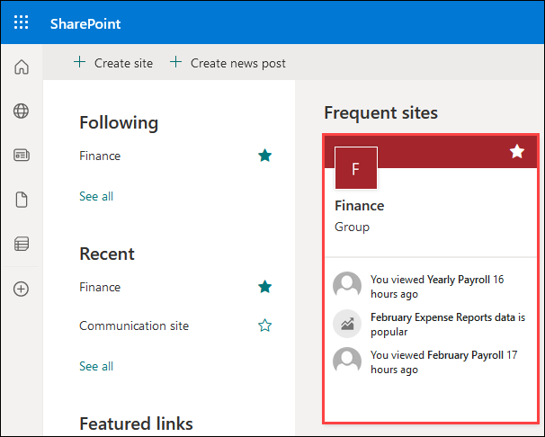
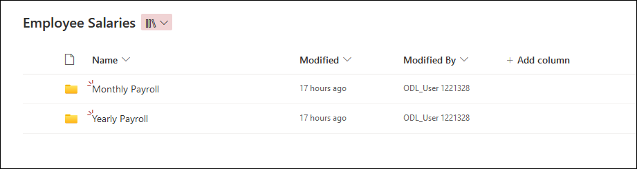
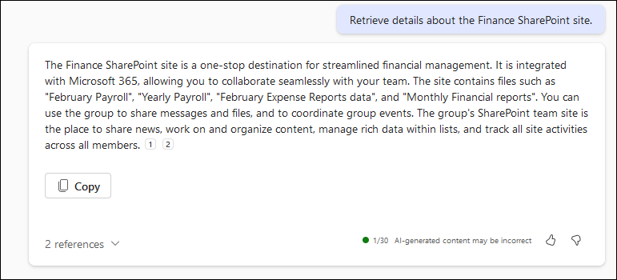

# Exercise 2: Preparing for M365 Copilot Deployment

In this exercise we will walkthrough a comprehensive journey, skillfully preparing users for the deployment of M365 Copilot through three interconnected tasks. Efficient collaboration and information management within an organization hinge on the meticulous organization of SharePoint sites. We will delve into the critical process of structuring SharePoint teams and files for optimal functionality and productivity. Through meticulous organization, SharePoint becomes a powerhouse for streamlined information retrieval and enhanced collaboration. By navigating through a structured "Finance" SharePoint site and leveraging the capabilities of Microsoft 365 Copilot, this exercise illuminates the importance of organized information architecture in driving organizational efficiency and productivity.

Safeguarding sensitive data is paramount for any organization's security and compliance efforts. We will also delve into the implementation of sensitivity labels using Microsoft Purview, a pivotal tool for categorizing and protecting data based on its level of confidentiality. By establishing sensitivity labels such as "Confidential" and "Highly Confidential," organizations can ensure that sensitive information is appropriately protected and accessed only by authorized personnel. This exercise provides a comprehensive guide to creating and publishing sensitivity labels, showcasing the integration of robust data protection measures within the organizational framework.

The Semantic Index stands at the forefront of Copilot for Microsoft 365, revolutionizing data understanding and contextual comprehension within the ecosystem. We will unravel the intricate workings of the Semantic Index, elucidating its role in connecting billions of objects, concepts, and relationships. By parsing intent beyond literal words and continuously expanding its knowledge graph, the Semantic Index empowers Copilot to deliver personalized and actionable responses. This task exercise underscores the transformative impact of the Semantic Index in driving deeper contextual understanding and fostering continuous improvement within Microsoft 365.


## Task 1: Organizing SharePoint Teams and Files

Organizing your SharePoint site is crucial for efficient collaboration and information management within your organization. A well-organized and structured SharePoint site can help Microsoft 365 Copilot by making it easier to find and retrieve relevant information. When the site is organized and the content is properly tagged and categorized, it makes it easier for me to search and retrieve the information you need. This can help me provide you with more accurate and relevant responses to your queries. Additionally, a well-organized SharePoint site can help improve collaboration and productivity within your organization by making it easier for everyone to find and access the information they need.

Let's explore the "Finance" SharePoint site we have set up for Contoso Ltd. This site serves as a collaborative platform integrated with Microsoft 365, facilitating seamless document management and team collaboration.


### Task 1.1: Explore Finance SharePoint Site.

- **Login to Microsoft 365:**
   - Open your web browser and sign in to [Microsoft 365](https://www.office.com/login?). You will see the login screen, enter the username and click on **Next**. 

      

   - Now enter the password and click on **Sign in**.

      

- **Navigate to SharePoint:**
   - Go to the SharePoint homepage by clicking on the **SharePoint (2)** app or through the **Microsoft 365 app launcher (1)**.

      

   - Click on the Finance Sharepoint site.

      >**Note:** If the Finance SharePoint site isn't visible in your Frequent sites, please utilize the search box and enter "Finance" to locate it. 

      

   - Navigate to the **Site Contents** section, where you'll find pre-created document libraries arranged in an organized and structured manner.

      

   - Now, let's enter the "Employee Salaries" document library. Inside, you'll notice two distinct folders: **Monthly Payroll** and **Yearly Payroll**. This clear division within the Employee Salaries document library highlights the separation between monthly and yearly payroll information.

      

- **Using Copilot to fetch data.**

   - Navigate back to [Microsoft 365](https://www.office.com/login?) and click on **Copilot** to open the M365 Copilot chat.
   
      

   - Let's ask Copilot to fetch some details of the **Finance** sharepoint site. Please use the prompt below.

      >**Note**: The responses generated by Copilot in the provided examples can differ during your lab sessions.

      ```
      Retrieve details about the Finance SharePoint site.
      ```
      
      
   
   - We can also request Copilot to retrieve specific information about a file within the SharePoint site. Use the following prompt.

      ```
      Could you elaborate more on February Payroll?
      ```

      

   - We can even ask Copilot regarding the Policies of our Organization from the **Human Resources** SharePoint site. Please use the following prompt.

      ```
      Create an FAQ based on Code of Conduct Policy.docx
      ```

      

**Congratulations!** We emphasized the importance of organizing SharePoint sites for efficient collaboration and management of information within organizations. We explored the structured **Finance** SharePoint site, showcasing its document libraries and folders. Leveraging **Microsoft 365 Copilot**, we effortlessly retrieved specific details and even summarized data from files like the **February Payroll** report. By integrating organized SharePoint sites with Copilot's capabilities, organizations can streamline information retrieval, enhance collaboration, and optimize productivity across teams and departments.

## Task 3: Understand Semantic Index (Read Only)

Microsoft technologies underpin **Copilot for Microsoft 365**, with a key role played by the Semantic Index. This vast knowledge graph, connecting billions of objects, concepts, and relationships, introduces a new dimension to data understanding within Microsoft 365.

The Semantic Index for Copilot constructs an intricate map of your personal and company data, establishing important connections and identifying significant relationships. This design is much like the inner workings of the human brain. It goes beyond the confines of keyword search by interpreting and encoding the conceptual relationships between data elements. By analyzing your Microsoft Graph data - encompassing emails, documents, calendars, chats, and more - and working synergistically with LLMs, it delivers personalized, relevant, and actionable responses.

## Key Features

1. **Rich Knowledge Base:**
   - The Semantic Index is powered by Microsoft Graph, enhancing Microsoft 365 search capabilities.
   - Security is paramount, ensuring that users only access data within their designated permissions.

2. **Contextual Responses:**
   - Leveraging individual and company data, Semantic Index enables Copilot to provide pertinent and actionable responses.
   - Through a secure and compliant process, it constructs a sophisticated map of relationships, respecting user privacy.

## How Copilot Uses Semantic Index

1. **Vectorized Indices:**
   - Advances keyword matching with vectorized indices, fostering conceptual understanding.
   - Multi-dimensional spaces facilitate semantic similarity, moving beyond rigid exact matches. These vectors enable Copilot to handle a broader set of search queries beyond “exact match.”

2. **Semantic Search:**
   - Captures semantic meaning, comprehending relationships between diverse forms of words.
   - Enhances understanding of sentences, snippets, and documents, broadening search capabilities. Semantic Search uses vectors to understand relationships, capturing synonyms and expanding the scope of searchable information.

3. **Grounding and Natural Language Processing (NLP):**
   - Implements grounding, associating words with real-world entities for nuanced understanding.
   - Enhances Copilot's intelligence in understanding user intent and connecting inputs to broader meanings. Grounding is a common approach in NLP systems that associates words and phrases with real-world entities that the AI understands.

## Semantic Relationships

Microsoft's Semantic Index enables grounding through its predefined knowledge graph that contains billions of concepts interconnected by semantic relationships. A semantic relationship refers to a typed connection between two entities or concepts that encodes some meaningful association between them. The graph contains semantic data on people, places, organizations, products, concepts, and the relationships between them all. This graph provides the semantic "understanding" of words, phrases, and entities that Microsoft products use.

The Semantic Index relies on a predefined knowledge graph that features various semantic relationships, such as "is-a," "part-of," "works-for," etc. These relationships enable Copilot to infer new knowledge, enriching language grounding and contextual understanding.

- **"is-a":** Used for categorization or inheritance (e.g., "dog is-a mammal").
- **"part-of":** Describes composition or properties of an entity (e.g., "wheel part-of car").
- **"works-for":** Associates an employee with an employer (e.g., "John works-for Microsoft").
- **"located-in":** Relates an entity to its geographic location (e.g., "Paris located-in France").
- **"causes":** Connects a cause to an effect (e.g., "rain causes wet").

Semantic Index uses billions of these structured relationships between entities, concepts, and data to encode human-like understanding of the connections between things. This web of semantic relationships is what enables context and language grounding.

## Customer Data and Security

Semantic Index doesn't change a customer's data. It simply indexes an organization's Microsoft 365 data across Microsoft 365 apps. The permissions model within your Microsoft 365 tenant can help ensure that data doesn't unintentionally leak between users, groups, and tenants. The Semantic Index only presents data that each individual can access using the same underlying controls for data access used in other Microsoft 365 services. Semantic Index honors the user identity-based access boundary so that the grounding process only accesses content that the current user is authorized to access. Data generated by the Semantic Index remains within your company’s tenant, and complies with your security, compliance, identity, and privacy policies and processes. The Semantic Index works only with content to which your users already have permission and doesn't affect storage quotas.

## Benefits for Users

1. **Deeper Contextual Understanding:**
   - Parses intent beyond literal words, comprehending organizational jargon and language nuances.
   - Contextualizes broad queries, interprets ambiguous instructions, and links concepts across domains.

2. **Continuous Improvement:**
   - New content is continually indexed. This action constantly expands the Semantic Index knowledge graph, which increases its ability to understand an ever growing number of objects, concepts, and the relationships between them. In doing so, Copilot for Microsoft 365's contextual comprehension continues to grow more powerful over time.

## Incorporating Third-Party Information

Graph connectors empower the integration of external data, enriching Copilot with a diverse range of content. Microsoft ensures that the indexing of Graph connectors' data maintains access controls, providing an expanded and searchable content landscape.

## Conclusion

In conclusion, the Semantic Index is a pivotal component empowering Copilot for Microsoft 365. It not only provides a foundation for intelligent code and text generation but also ensures continuous improvement and integration with third-party data, enhancing user experiences over time.
