# Exercise 3: Preparing for M365 Copilot Deployment
In this exercise we will walkthrough a comprehensive journey, skillfully preparing users for the deployment of M365 Copilot through three interconnected tasks. Organizing SharePoint Teams and Files lays the groundwork by guiding users in creating a collaborative workspace on SharePoint. This involves setting up a Team Site, configuring a Document Library for monthly reports, and leveraging M365 Copilot for detailed analysis within the SharePoint team site. This task ensures a robust foundation for seamless collaboration and information management.

We will be Implementing Sensitivity Labels with Purview, users delve into the intricacies of data security. The task navigates the creation and configuration of sensitivity labels, encompassing encryption and content marking for safeguarding data based on sensitivity levels. This step ensures users are adept at implementing measures crucial for classifying and protecting information, a key aspect in the preparation for M365 Copilot deployment. We will Understand Semantic Index, which offers a nuanced exploration of the Semantic Index's role in Copilot, these tasks collectively equip users with the necessary skills and insights. This holistic preparation not only addresses collaborative workspace organization and data protection but also establishes a profound understanding of the Semantic Index, setting the stage for a seamless integration of M365 Copilot into their workflows for enhanced productivity and intelligent data handling.

## Task 1: Organizing SharePoint Teams and Files

Organizing your SharePoint site is crucial for efficient collaboration and information management within your organization. A well-organized and structured SharePoint site can help Microsoft 365 Copilot by making it easier to find and retrieve relevant information. When the site is organized and the content is properly tagged and categorized, it makes it easier for me to search and retrieve the information you need. This can help me provide you with more accurate and relevant responses to your queries. Additionally, a well-organized SharePoint site can help improve collaboration and productivity within your organization by making it easier for everyone to find and access the information they need.

Let's explore the "Finance" SharePoint site we have set up for Contoso Ltd. This site serves as a collaborative platform integrated with Microsoft 365, facilitating seamless document management and team collaboration.


### Task 1.1: Explore Finance SharePoint Site.

- **Login to Microsoft 365:**
   - Open your web browser and sign in to [Microsoft 365](https://www.office.com/login?). You will see the login screen, enter the following username and click on **Next**. 

   * Email/Username: **<inject key="AzureAdUserEmail"></inject>**

      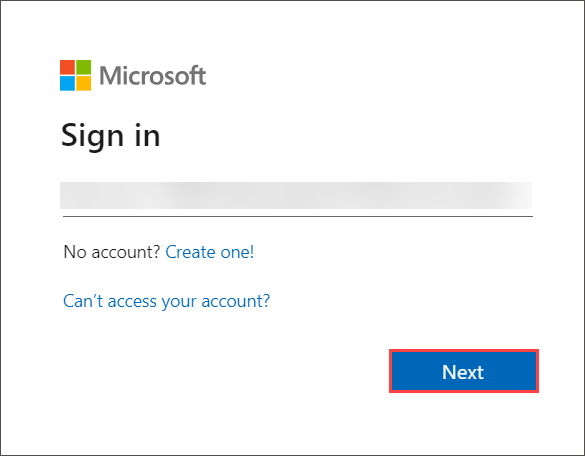

   - Now enter the following password and click on **Sign in**.

   * Password: **<inject key="AzureAdUserPassword"></inject>**

      

- **Navigate to SharePoint:**
   - Go to the SharePoint homepage by clicking on the **SharePoint (2)** app or through the **Microsoft 365 app launcher (1)**.

      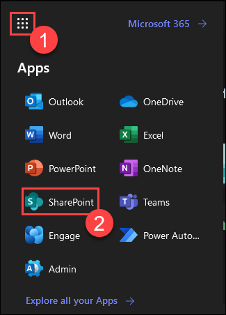

   - Click on the Finance Sharepoint site.

      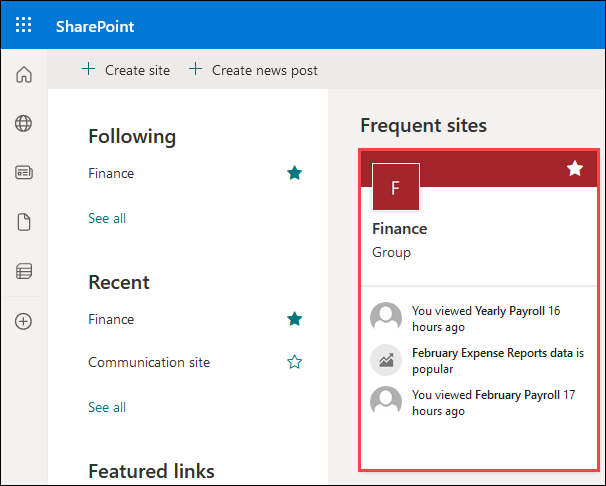

   - Navigate to the "Site Contents" section, where you'll find pre-created document libraries arranged in an organized and structured manner.

      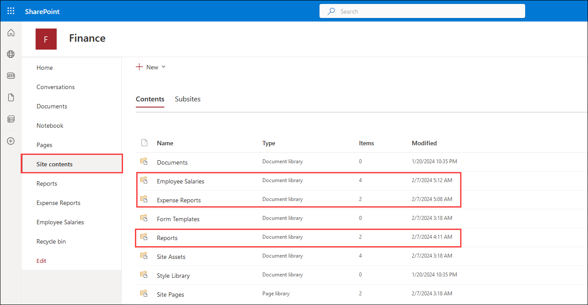

   - Now, let's enter the "Employee Salaries" document library. Inside, you'll notice two distinct folders: "Monthly Payroll" and "Yearly Payroll." This clear division within the Employee Salaries document library highlights the separation between monthly and yearly payroll information.

      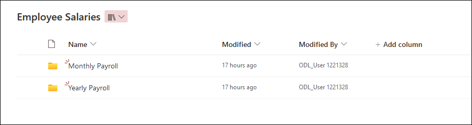

- **Using Copilot to fetch data.**

   - Navigate back to [Microsoft 365](https://www.office.com/login?) and click on "Copilot" to open the M365 Copilot chat.
   
      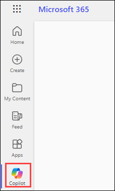

   - Let's ask Copilot to fetch some details of the Finance sharepoint site. Please use the prompt below.

      >**Note**: Please note that the responses generated by Copilot in the provided examples can differ during your lab sessions.

      ```
      Retrieve details about the Finance SharePoint site.
      ```
      
      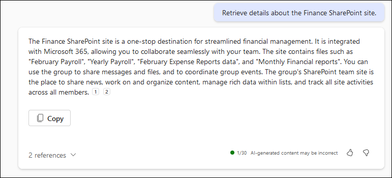
   
   - We can also request Copilot to retrieve specific information about a file within the SharePoint site. Use the following prompt.

      ```
      Could you elaborate more on February Payroll?
      ```

      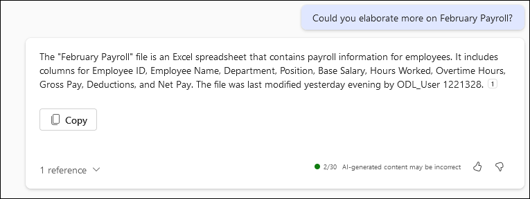

   - We can even ask Copilot regarding the Policies of our Organization from the Human Resources SharePoint site. Please use the following prompt.

      ```
      Create an FAQ based on Code of Conduct Policy.docx
      ```

      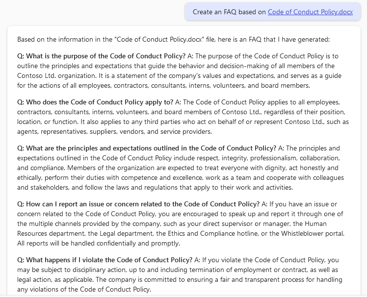

**Congratulations!** we emphasized the importance of organizing SharePoint sites for efficient collaboration and management of information within organizations. We explored the structured "Finance" SharePoint site, showcasing its document libraries and folders. Leveraging Microsoft 365 Copilot, we effortlessly retrieved specific details and even summarized data from files like the "February Payroll" report. By integrating organized SharePoint sites with Copilot's capabilities, organizations can streamline information retrieval, enhance collaboration, and optimize productivity across teams and departments.

### Task 1.2: Explore Creating a New Team Site (Optional)

In this optional task, we offer users the opportunity to create a collaborative workspace on SharePoint for team projects. This step-by-step guide empowers users to organize a SharePoint site, establish a structured document library for monthly reports, and foster seamless collaboration among team members. Utilizing M365 Chat, users can explore the details present in a SharePoint team site and experiment with its functionalities at their discretion.

- **Navigate to SharePoint:**
   - Go to the SharePoint homepage by clicking on the **SharePoint (2)** app or through the **Microsoft 365 app launcher (1)**.

      

- **Initiate Team Site Creation:**
   - Click on **+ Create site** or find the option in the left navigation menu.

      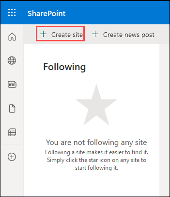

- **Choose Team Site:**
   - Select **Team site** as the site type suitable for team collaboration.

      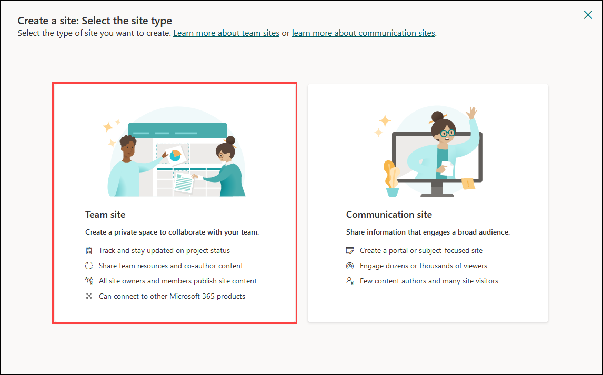

- **Choose a Template**   
   - Select **Standard team** as the template for this site.

      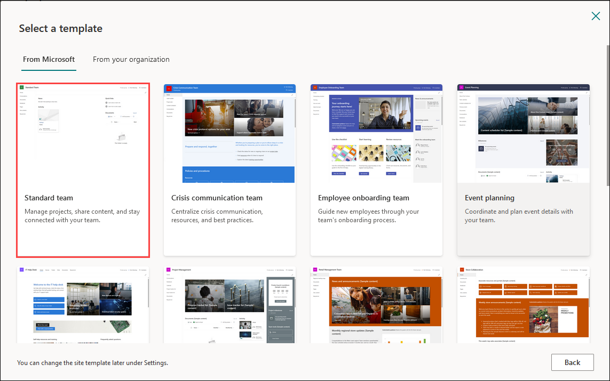
   
   - Click on **Use template**.

      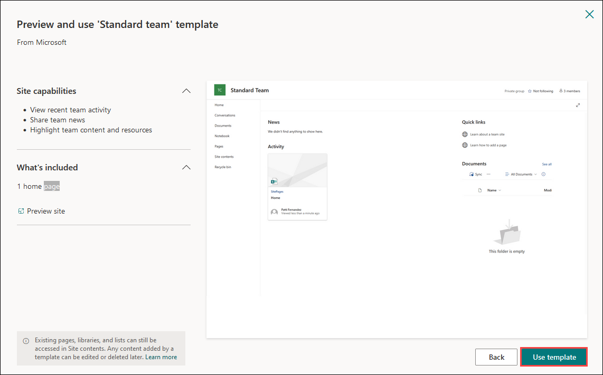

- **Fill Site Information:**
   - Provide the Site name as **Sales team**. Click **Next** to proceed.

      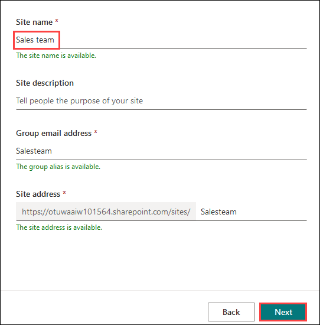

   - Select the Privacy settings as **Public - anyone in the organization can access this site**. Click on **Create site** to create the site.

      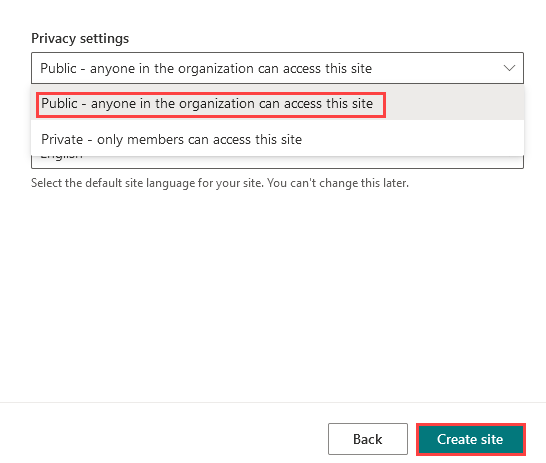

   - Add members to the Sharepoint site by searching for the **ODL_User <inject key="DeploymentID"></inject>**, then click on **Finish**.

      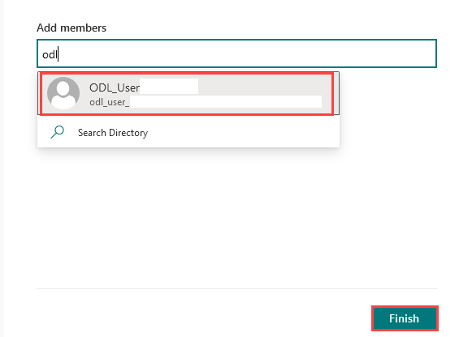

### Task 1.3: Set Up Document Library for Monthly Reports

- **Create Document Library**
   - Navigate to the left menu and click on **Site contents** then click on **+ New** and select **Document Library**.

      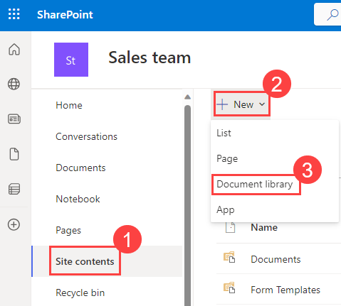

- **Name the Document Library:**
   - Select the **"Blank library"** and then give the library a name, e.g., **Reports**, and click on **Create**.

      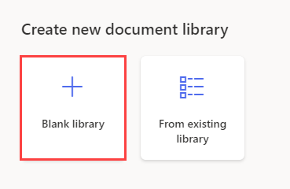

      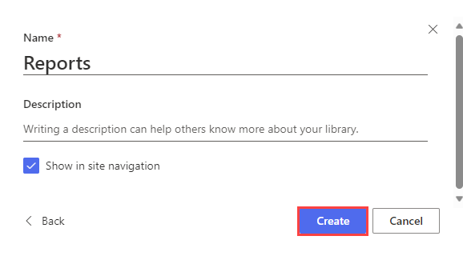

### Task 1.4: Organize Monthly Reports

- **Create Monthly Reports Folder:**
   - Inside the document library, click **New (1)** and choose **"Folder (2)"** Name it "Monthly Reports."

      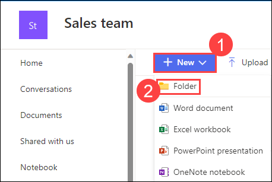
      
      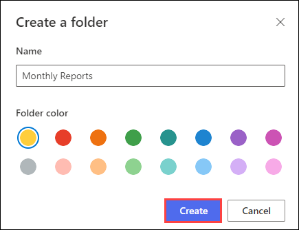

- **Create Mock Reports:**
   - Open the "Monthly Reports" folder and click **New**. Choose "Excel workbook" to open a blank excel workbook.

      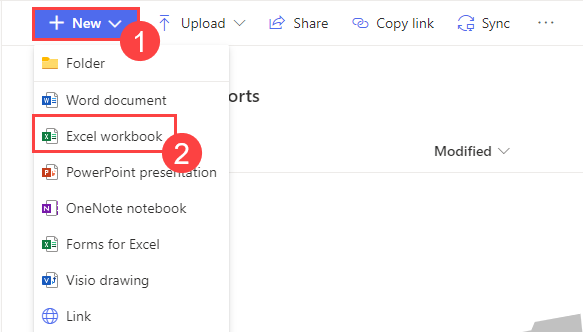

   - On the left hand side corner you will find the **"Copilot"** icon, click on it to open the copilot chat. 

      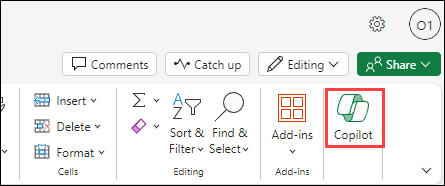

   - On the coppilot chat click on **"Try an example"** to generate mock data for the excel workbook.

      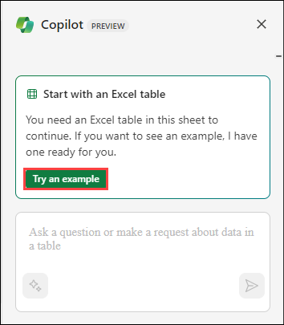

      >**Note**: Please note that the responses generated by Copilot in the provided examples can differ during your lab sessions.

   - Copilot will generate sample data for the excel similar to the below example.

      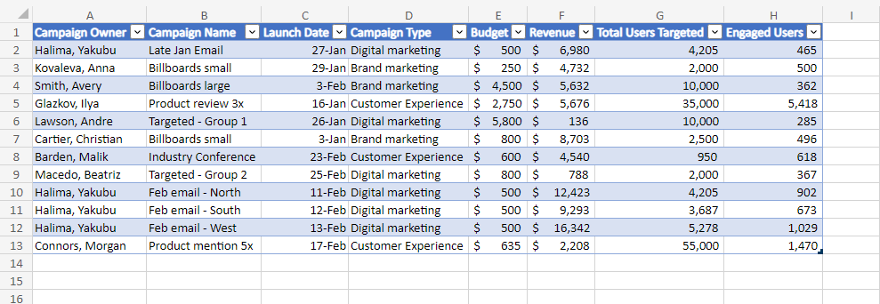

   - Click on the excel workbook name **"Book(1)"** on the top left corner. Save the excel workbook as **"Reports-data(2)"** and then press **Enter**.

      

### Task 1.5: Using Copilot to analyze the data.

- **Navigate to Office Apps**
    - Go back to the home page of the [Office Apps](https://www.office.com/login?) and then click on **"Copilot"** to open the M365 copilot chat.

      

- **Analyze the data**
    - In the chat box copy paste the below and ask the Copilot chat to summarize the data present in the **Reports-data** excel workbook and then press **Enter**

      ```
      Summarize the data present in /
      ```
      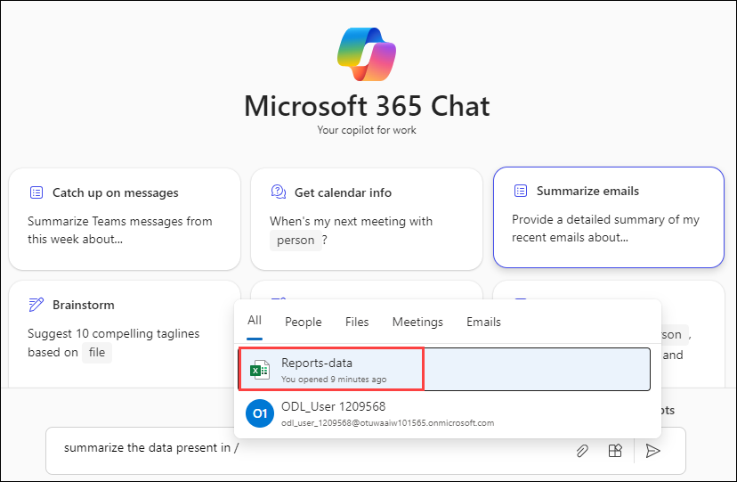
   
   - Copilot will summarize the data present in the excel workbook and respond like shown in the example.
      >**Note**: Please note that the responses generated by Copilot in the provided examples can differ during your lab sessions.

      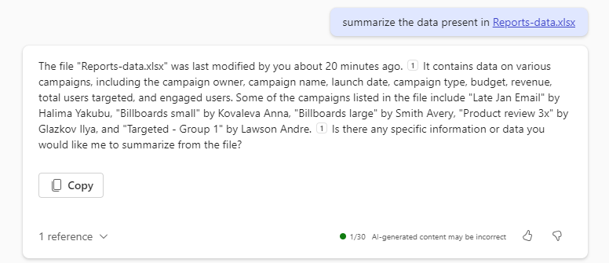

**Congratulations!** we navigated the process of preparing for M365 Copilot deployment by organizing SharePoint Teams and Files. We initiated the creation of a collaborative workspace on SharePoint, establishing a Team Site for the Sales team and configuring a Document Library for monthly reports. Utilizing M365 Copilot, we seamlessly generated mock data for an Excel workbook. Finally, we demonstrated the power of M365 Copilot by analyzing the data within the Excel workbook. By engaging with Copilot through the chat interface, we requested a summary of the data, showcasing how Copilot can assist in data analysis tasks. 

## Task 2: Implementing Sensitivity Labels with Purview 

Sensitivity labels are a way of categorizing and protecting your data based on its level of confidentiality and the impact to your business if it is leaked or misused. You can use sensitivity labels to apply metadata tags and encryption settings to your data sources, columns, tables, and files. Purview is a service that helps you manage and govern your data across your organization.

CoPilot is a system that aids in the management and control of data within an organization. It can work in conjunction with Sensitivity Labels to classify and protect sensitive information. Sensitivity Labels are attributes that can be applied to documents and emails to classify them based on the content sensitivity. These labels can trigger protective actions like encryption or visual markings. Once a sensitivity label is applied to content, it stays with the content regardless of where it's stored or with whom it's shared.

### Understanding Sensitivity labels

Sensitivity labels in Microsoft 365 allow organizations to classify and protect their sensitive content. Here's some information on what these labels represent in Contoso Ltd:

- **Confidential:**
The "Confidential" sensitivity label is used when information is meant to be restricted to a specific group of people within an organization. This label is typically used for data such as employee records, internal policies, or strategic plans. Unauthorized disclosure of this information can lead to potential damage to the organization, but not to the same extent as that classified as "Highly Confidential."

- **Highly Confidential:**
The "Highly Confidential" sensitivity label is assigned to the most sensitive information that, if disclosed, could result in severe harm to the organization. This might include trade secrets, legal documents, or personally identifiable information (PII) such as social security numbers, credit card information, or health records. Extra security measures, like encryption, are often applied to these documents to prevent unauthorized access or sharing.

- **Internal:**
The "Internal" sensitivity label is used for information that is not intended for public view but doesn't necessarily contain sensitive data. This could include internal newsletters, meeting minutes, or project plans. This label serves as a reminder to employees that the information should not be shared outside the organization, though its disclosure wouldn't cause significant harm.

- **Public**
The "Public" sensitivity label is applied to information that can be freely shared both inside and outside the organization. This information poses no risk if disclosed and is often intended for public consumption. Examples could include press releases, marketing materials, or public-facing reports.

   >**Note:** Remember, sensitivity labels are a tool for managing and protecting data, but they are most effective when combined with user education about data handling and security best practices.

### Task 2.1: Applying Sensitivity label to Documents.

- Navigate to [Microsoft 365](https://www.office.com), then click on Word in the Application launcher. In the new tab, click on "Blank document".

   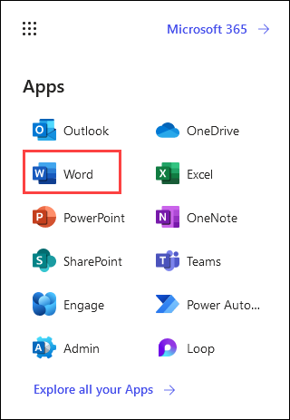

   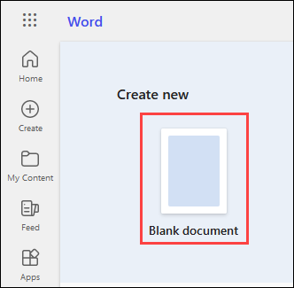

- Let's ask Copilot to Summarise a document which has a sensitivity label already applied. Notice how the Public sensitivity label is applied automatically when a user drafts with Copilot and references a labeled file. The information bar under the ribbon informs the user that content created by Copilot resulted in the new label being automatically applied. Please use the below prompt.

   ```
   Summarise the document /Industry Analysis Report for Contoso Ltd.docx
   ```

   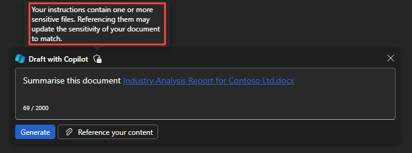


   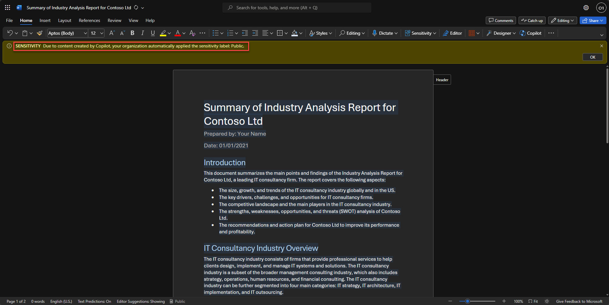

### Task 2.2: How are sensitivity labels created in Microsoft Purview (Read Only)

In this task, you will learn how to use Purview to implement sensitivity labels for your data assets.

- Navigate to the [Microsoft Purview](https://compliance.microsoft.com/homepage) portal and from the left menu select labels (1) and in the yellow information box, indicate that Your organization has not turned on the ability to process content in Office online files that have encrypted sensitivity labels applied and are stored in OneDrive and SharePoint. Select Turn on now (2). Once you do this, there can be a delay for the setting to propagate through the system.

   .png)

- On Labels (1) page, select + Create a label (2).

   .png)

- Provide a name and description for your label. Select **Next (4)** at the bottom of the page.

    | Setting | Action |
    | -- | -- |
    | **Name** | Enter **Confidential-Finance (1)** |
    | **Display name** | Enter **Confidential-Finance (2)** |
    | **Description for users** | Enter **Confidential-Finance Demo (3)** | 

   .png)

- Note the scope for this label. The scope is set to Items. Read the description but don’t change anything. Select Next at the bottom of the page.

   .png)

- On the Choose protection settings for labeled items select the Apply or remove encryption (1) and Apply content marking (2), then select Next (3).

   .png)   

- The Encryption window shows the configuration for the encryption settings. Review the information box under Configure encryption settings and review the configured settings. Notice how the user access to content is set to never expire. You can also assign permissions to specific users and groups By clicking on the Assign permissions (1). On the Assign permissions blade, click on + Add users or groups (2).

   .png)

-  On the **Add users or groups** window, select the user name **ODL_User <inject key="DeploymentID" enableCopy="false"/> (1)** and click on **Add (2)**.

   .png)

- You will be redirected to the Assign Permission page. Verify that the (1) is selected and click on Save (2).

   .png)

   >**Note:** Only selected users can interact with content that has this label applied. Under users and groups, the tenant is defined so all users in your tenant can view content that has this label.

- Click Next on Encryption window.

   .png)

- On the content markings page, take note of the information box at the top of the page. Turn on the Content Making (1) and select the check box for Add a watermark (2), Add a header (3) and Add a footer (4).

   .png)

- Under Add a watermark, click on Customize text (1). Under Watermark text, type Confidential watermark text (2) and click on Save (3).

   .png)

- Under Add a header, click on Customize text (1). Under Header text, type Confidential Document (2) and click on Save (3).

   .png)

- Under Add a footer, click on Customize text (1). Under Footer text, type Confidential Document (2) and click on Save (3).

   .png)

   >**Note**: Content markings will be applied to documents but only headers and footers will be applied to email messages. In other words, watermarks are not applied to emails.

- The content marking associated with this label is a watermark. Select Next at the bottom of the page.

   .png)

- You are now in the Auto-labeling for files and emails window. Turn on the Auto-labeling for files and emails (1) and Read the description of auto-labelling on the top of the page and the information box below it and under Detect content that matches these conditions click on + Add condition (2) from the drop-down select Content contains (3) then under Group name select Add (4) drop-down, select Sensitive info type and in Sensitive info type (5) window search for Credit (6) and select the Credit card number (7), select Add (8) from the button, select Next (9) on the bottom of the page.

   .png)
   .png)
   .png)
   .png)

- This next window defines protection settings for groups and sites that have this label applied. If this is not enabled, select Next at the bottom of the page.

   .png)

- Review the settings and click on Create label.

   .png)

### Task 2.3: Publish sensitivity label (Read Only)

The task aims to provide a streamlined method for publishing sensitivity labels to users. Users are guided through a series of steps within Microsoft Purview, specifically under Label policies. The objective is to make the selected labels, such as Confidential-Finance and Highly-Confidential, available to all users, ensuring consistent and standardized data protection measures.

- In the Microsoft Purview. portal, under Solutions, expand Information protection and in the drop-down select Label policies (1) and click on Publish label (2).

   .png)

- Select Choose sensitivity labels to publish (1). A window opens that provides information about the policy. Select Confidential-Finance (2) from the label and select Add (3).

   .png)

- Back on Choose sensitivity labels to publish blade, click on Next.

   .png)

- Click on Next on the Assign Admin Units page.

   .png)

- Read the description under Publish to users and groups. Notice that this label is available to all users. Don’t change any settings. Select Next at the bottom of the page.

   .png)

- Under the policy settings. Don’t change any settings. Select Next at the bottom of the page.

   .png)

- Under the Apply a Default label to documents. Don’t change any settings. Select Next at the bottom of the page.

   .png)

- Under the Apply a Default label to emails.Don’t change any settings. Select Next at the bottom of the page.

   .png)

- Under the Apply a default label to meetings and calendar events. Don’t change any settings. Select Next at the bottom of the page.

   .png)

- Under the Apply a default label to Fabric and Power BI content. Don’t change any settings. Select Next at the bottom of the page.

   .png)

- The last configuration option is to name your policy. Enter the policy name as Confidential-Policy (1). Select Next (2) on the bottom of the page to exit the policy configuration and return to the Information Protection page.

   .png)

- Review the settings and click on Submit and then select Done.

   .png)
   .png)

- Back to Label policies blade and notice the newly published label.

   .png)

### Task 2.4: Applying a Sensitivity label to a Word document (Read Only)

-  Navigate back to the [Microsoft Purview](https://compliance.microsoft.com/homepage) home page, select the App launcher icon (1), on the Word select Open context menu (2) and select Open in new tab (3).

   .png)

- Select blank document, then enter some text on the page. On the blue bar on the top of the page, select the down arrow, next to where it says Document (1), and in the File Name box enter, Test-label (2) and press enter.

   .png)

   >**Note:** In this step, we are creating a new Word document that will be utilized for applying a sensitivity lab

- From the top menu bar, select Sensitivity (1). (Note: If the option is not available, it will take some time wait until you see the Sensitivity option, reflect Alternatively try refreshing the page or sign out and sign in again) From the drop-down select Confidential-Finance (2).

   .png)


    >**Note:** The sensitivity bar makes it easy for you to see what label is applied to your file, and to apply or change a label whenever you need to, including when saving the file. Just select the sensitivity bar in the save dialog to see the labelling options for this file.

    >**Note**: Applying a sensitivity label helps secure data by abstracting sensitive content.

- From the top menu bar, select View (1), then select Reading view (2).

   .png)

   >**Note:** Reading view allows you to observe how the document includes a watermark, a visual indication of the document's sensitivity level.

- Notice how the document includes the watermark.

   .png)

This task has provided a clear walkthrough for implementing sensitivity labels in Microsoft Purview, enabling users to categorize and safeguard data based on confidentiality. The guided steps cover label creation, encryption configuration, content marking, and automated labeling, fostering a strong understanding of data protection. Customization options for watermarks, headers, and footers enhance security measures. Demonstrating practical application, the task integrates sensitivity labels seamlessly into Word documents, emphasizing their importance in real-world scenarios. The subsequent label publishing and application steps ensure consistent and standardized data protection, contributing to a robust organizational data governance framework.

## Task 3: Understand Semantic Index (Read Only)

Microsoft technologies underpin Copilot for Microsoft 365, with a key role played by the Semantic Index. This vast knowledge graph, connecting billions of objects, concepts, and relationships, introduces a new dimension to data understanding within Microsoft 365.

The Semantic Index for Copilot constructs an intricate map of your personal and company data, establishing important connections and identifying significant relationships. This design is much like the inner workings of the human brain. It goes beyond the confines of keyword search by interpreting and encoding the conceptual relationships between data elements. By analyzing your Microsoft Graph data - encompassing emails, documents, calendars, chats, and more - and working synergistically with LLMs, it delivers personalized, relevant, and actionable responses.

## Key Features

1. **Rich Knowledge Base:**
   - The Semantic Index is powered by Microsoft Graph, enhancing Microsoft 365 search capabilities.
   - Security is paramount, ensuring that users only access data within their designated permissions.

2. **Contextual Responses:**
   - Leveraging individual and company data, Semantic Index enables Copilot to provide pertinent and actionable responses.
   - Through a secure and compliant process, it constructs a sophisticated map of relationships, respecting user privacy.

## How Copilot Uses Semantic Index

1. **Vectorized Indices:**
   - Advances keyword matching with vectorized indices, fostering conceptual understanding.
   - Multi-dimensional spaces facilitate semantic similarity, moving beyond rigid exact matches. These vectors enable Copilot to handle a broader set of search queries beyond “exact match.”

2. **Semantic Search:**
   - Captures semantic meaning, comprehending relationships between diverse forms of words.
   - Enhances understanding of sentences, snippets, and documents, broadening search capabilities. Semantic Search uses vectors to understand relationships, capturing synonyms and expanding the scope of searchable information.

3. **Grounding and Natural Language Processing (NLP):**
   - Implements grounding, associating words with real-world entities for nuanced understanding.
   - Enhances Copilot's intelligence in understanding user intent and connecting inputs to broader meanings. Grounding is a common approach in NLP systems that associates words and phrases with real-world entities that the AI understands.

## Semantic Relationships

Microsoft's Semantic Index enables grounding through its predefined knowledge graph that contains billions of concepts interconnected by semantic relationships. A semantic relationship refers to a typed connection between two entities or concepts that encodes some meaningful association between them. The graph contains semantic data on people, places, organizations, products, concepts, and the relationships between them all. This graph provides the semantic "understanding" of words, phrases, and entities that Microsoft products use.

The Semantic Index relies on a predefined knowledge graph that features various semantic relationships, such as "is-a," "part-of," "works-for," etc. These relationships enable Copilot to infer new knowledge, enriching language grounding and contextual understanding.

- **"is-a":** Used for categorization or inheritance (e.g., "dog is-a mammal").
- **"part-of":** Describes composition or properties of an entity (e.g., "wheel part-of car").
- **"works-for":** Associates an employee with an employer (e.g., "John works-for Microsoft").
- **"located-in":** Relates an entity to its geographic location (e.g., "Paris located-in France").
- **"causes":** Connects a cause to an effect (e.g., "rain causes wet").

Semantic Index uses billions of these structured relationships between entities, concepts, and data to encode human-like understanding of the connections between things. This web of semantic relationships is what enables context and language grounding.

## Customer Data and Security

Semantic Index doesn't change a customer's data. It simply indexes an organization's Microsoft 365 data across Microsoft 365 apps. The permissions model within your Microsoft 365 tenant can help ensure that data doesn't unintentionally leak between users, groups, and tenants. The Semantic Index only presents data that each individual can access using the same underlying controls for data access used in other Microsoft 365 services. Semantic Index honors the user identity-based access boundary so that the grounding process only accesses content that the current user is authorized to access. Data generated by the Semantic Index remains within your company’s tenant, and complies with your security, compliance, identity, and privacy policies and processes. The Semantic Index works only with content to which your users already have permission and doesn't affect storage quotas.

## Benefits for Users

1. **Deeper Contextual Understanding:**
   - Parses intent beyond literal words, comprehending organizational jargon and language nuances.
   - Contextualizes broad queries, interprets ambiguous instructions, and links concepts across domains.

2. **Continuous Improvement:**
   - New content is continually indexed. This action constantly expands the Semantic Index knowledge graph, which increases its ability to understand an ever growing number of objects, concepts, and the relationships between them. In doing so, Copilot for Microsoft 365's contextual comprehension continues to grow more powerful over time.

## Incorporating Third-Party Information

Graph connectors empower the integration of external data, enriching Copilot with a diverse range of content. Microsoft ensures that the indexing of Graph connectors' data maintains access controls, providing an expanded and searchable content landscape.

## Conclusion

In conclusion, the Semantic Index is a pivotal component empowering Copilot for Microsoft 365. It not only provides a foundation for intelligent code and text generation but also ensures continuous improvement and integration with third-party data, enhancing user experiences over time.
