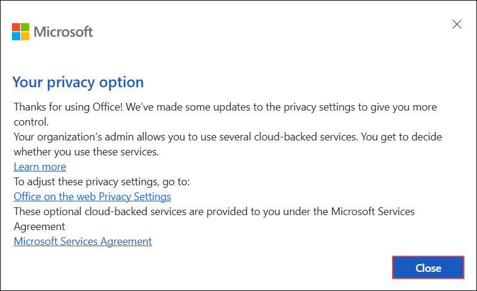
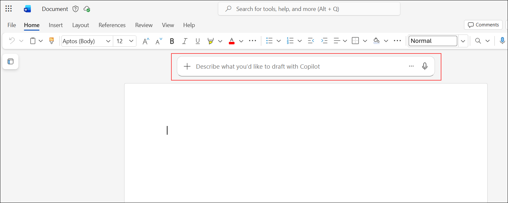
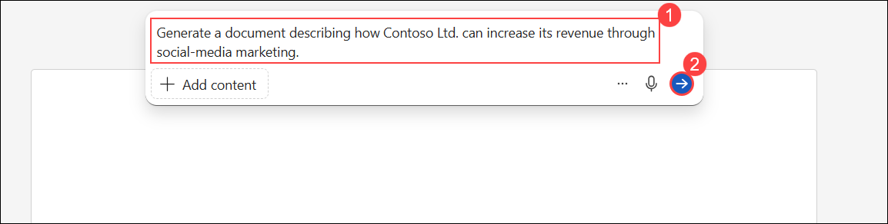
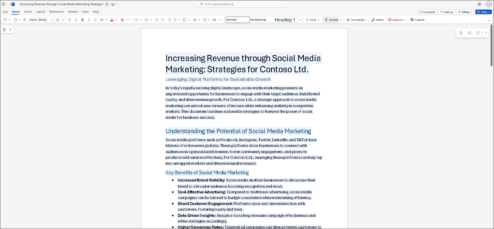
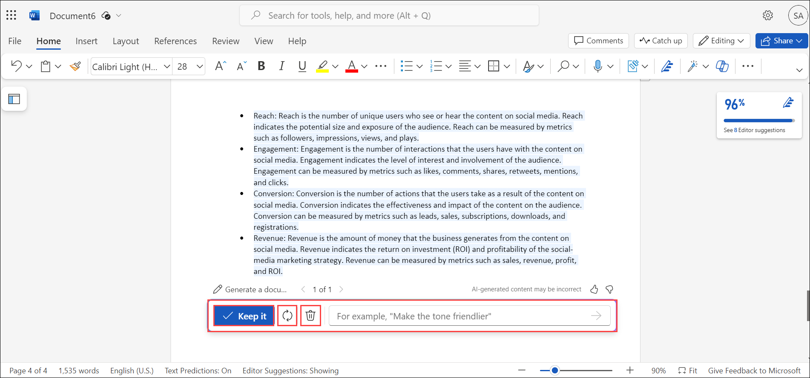
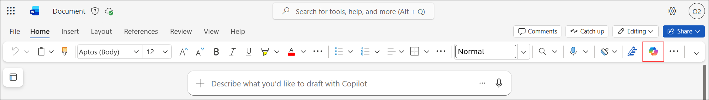
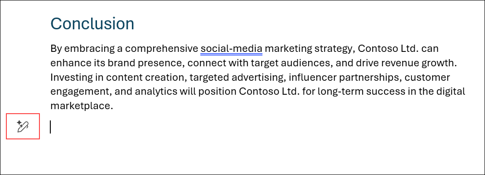
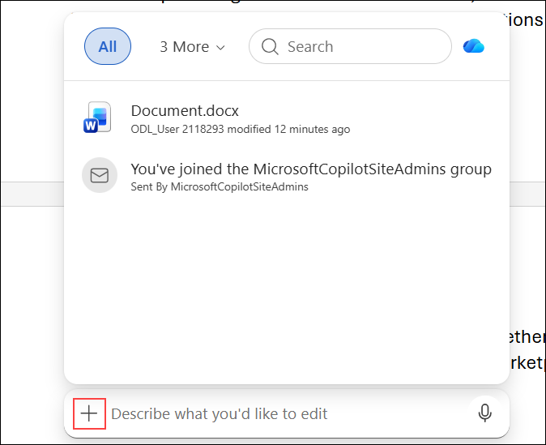
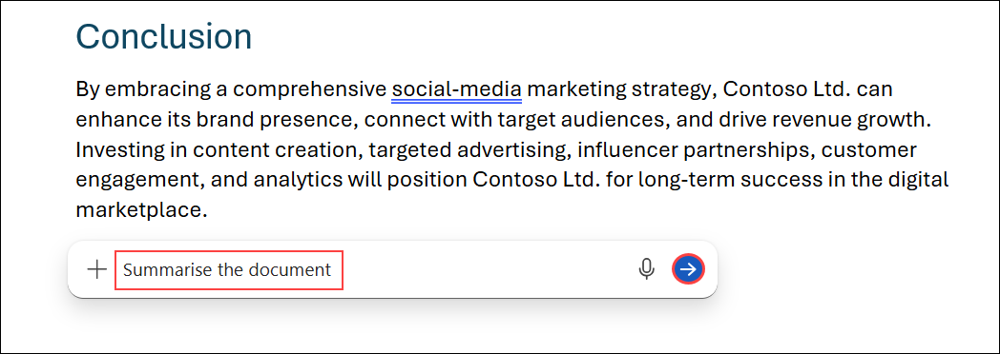

# Exercise 3.1: Using Microsoft 365 Copilot in Word

In this exercise, you will use Microsoft 365 Copilot in Word to generate new documents from prompts and summarize existing documents from your OneDrive.

## Overview

**Microsoft Copilot** is a chatbot developed by Microsoft. **Microsoft Copilot for Microsoft 365** combines the power of large language models (LLMs) with your organization’s data all in the flow of work to turn your words into one of the most powerful productivity tools on the planet.

**Copilot** is designed to benefit everyone in an organization. From leaders to IT professional managers, Copilot offers features that streamline tasks, automate workflows, and enhance collaboration. Its adaptability means that it can be customized to meet the unique needs of any organization. The ability to extend its capabilities through plugins makes it a continually evolving asset that can adapt to the ever-changing landscape of business needs.

It works alongside popular **Microsoft 365** apps such as Word, Excel, PowerPoint, Outlook, Teams, and more. **Microsoft 365 Copilot** provides real-time intelligent assistance, enabling users to enhance their creativity, productivity, and skills.

In Word, **Copilot for Microsoft 365** transforms the process of document creation and refinement, allowing you to produce compelling content with ease. Copilot helps draft from scratch, enhance the existing text, and capture the essence of lengthy articles. With Copilot, you can initiate a document using brief prompts, seamlessly incorporate resources from across Microsoft 365, and readily adjust both the tone and conciseness of your writing.

## **Content Generation in Word:**

One of the goals of Copilot in Word is to simplify the creation and modification of documents. It uses artificial intelligence to understand your writing goals and generate relevant and original content for you. You can use Copilot in Word to:

- **Write faster and easier:** You can simply type a few words or sentences to describe what you want to write about, and Copilot in Word will generate a paragraph or more of text for you. You can also edit, refine, or expand the generated text as you wish.

- **Write with confidence:** You can rely on Copilot in Word to produce accurate and coherent content that matches your tone and style. You can also use the built-in proofreading and editing tools to check your spelling, grammar, and readability.

- **Write with creativity:** You can explore different ways of expressing your ideas and arguments with Copilot in Word. You can also use the suggested images, icons, and charts to add visual appeal and clarity to your document.

To use **Copilot in Word**, follow the below steps:

1. Navigate back to **Microsoft 365** tab.

   ```
   https://m365.cloud.microsoft/
   ```

1. Select **Apps (1)**, and then choose **Word (2)**.

   

1. Select **Blank document** to open a new Word document.

   

1. If the **Your privacy option** dialog appears, select **Close**.

   

1. In the **Word** document, locate the **Describe what you'd like to draft with Copilot** prompt, enter the prompt provided below, and then select **Generate**. If the prompt is not visible, select the **Copilot** icon to open the Copilot draft experience.

   ```
   Generate a document describing how Contoso Ltd. can increase its revenue through social-media marketing.
   ```

   

   

1. It will create a document on the given topic with its transformative and innovative capabilities. Choose **Keep it** if you are satisfied with the content, else you can also **Regenerate** or **Discard** it.

   

   

   >**Note:** You can also choose the **"Copilot"** icon present on the top of the page and utilise the service.

   

## Referencing Existing Documents in Word

You can also link an external Word document present in your **OneDrive account** and generate output based on that. To do so, follow the given steps:

1. Select the **Copilot** icon to open the Copilot draft experience, or press **Alt + I**.

   

1. Select **Add content**, and then choose the preferred document to reference.

   

1. In the Copilot prompt box, enter **Summarise the document**, and then select **Send**.

   

## Try Out Yourself

You can also try your own scenarios and examples out to analyse the functioning of Copilot.
Here are some of the example prompts which you can take help of to explore more on **Copilot in Word**. Besides these, you can also create your own prompts and interact with Copilot.

1. **For Creating New Documents:**

   ```
   Write an essay about Microsoft 365.
   ```
   ```
   Give detailed instructions, including outlines, notes, or file references on use of artificial intelligence in IT companies.
   ```
   ```
   List the technologies used in app development in a bulleted format.
   ```

1. **For Referencing Old Documents:**

   ```
   What are the key points in this doc?
   ```
   ```
   Summarize this document.
   ```
   ```
   Is there a call to action?
   ```

## Conclusion: 

You've successfully used Microsoft 365 Copilot in Word to generate a complete document from a simple prompt and summarize existing documents from your OneDrive. You've seen how Copilot can quickly create relevant content and extract key information from existing files, significantly reducing the time needed for document creation and review.

## Summary

In this exercise, you used Microsoft 365 Copilot in Word to generate a new document about social media marketing for Contoso Ltd. from a prompt, and learned how to reference and summarize existing documents stored in OneDrive.
