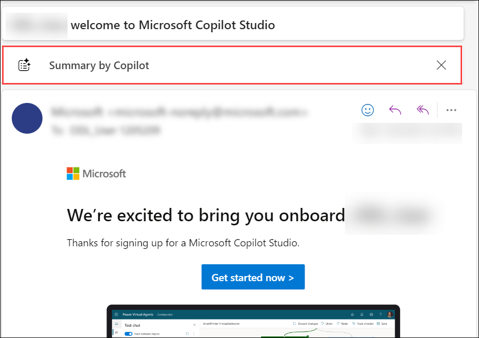
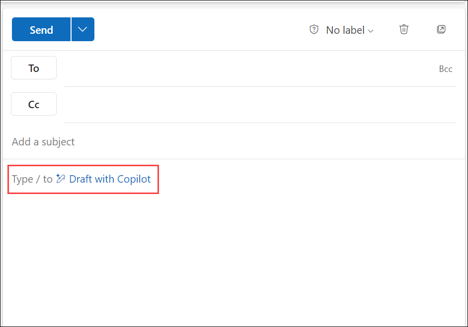
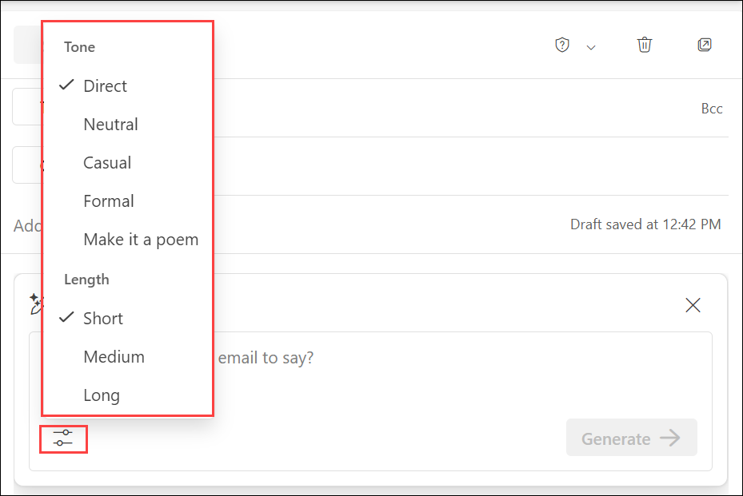

# Exercise 4.2: Using Microsoft 365 Copilot in Outlook

## Introduction

**Microsoft Copilot** is a chatbot developed by Microsoft. **Microsoft Copilot for Microsoft 365** combines the power of large language models (LLMs) with your organization’s data all in the flow of work to turn your words into one of the most powerful productivity tools on the planet.

**Copilot** is designed to benefit everyone in an organization. From leaders to IT professional managers, Copilot offers features that streamline tasks, automate workflows, and enhance collaboration. Its adaptability means that it can be customized to meet the unique needs of any organization. The ability to extend its capabilities through plugins makes it a continually evolving asset that can adapt to the ever-changing landscape of business needs.

It works alongside popular **Microsoft 365** apps such as Word, Excel, PowerPoint, Outlook, Teams, and more. **Microsoft 365 Copilot** provides real-time intelligent assistance, enabling users to enhance their creativity, productivity, and skills.

In Outlook, **Copilot for Microsoft 365** makes managing emails easier, letting you focus more on effective communication. It helps you understand long email threads, see different viewpoints, and spot unanswered questions. With Copilot, you can quickly reply using prompts or turn short notes into full emails using resources from Microsoft 365. You can also easily adjust your message's tone and length.

## **Summarizating email threads in Outlook:**

**Copilot in Outlook** introduces the "Thread Summarize" feature, designed to simplify your email management. With this feature, Outlook either offers concise bullet points or generates an entire summary of the chosen email thread, displayed above the thread in the reading pane. This design makes it easier to grasp the main points of extended email conversations. Additionally, the summary includes links to specific responses, allowing for quick access to different parts of the thread.

## **Drafting Emails in Outlook**

**Copilot in Outlook** also introduces the draft email feature, which helps you draft emails faster. This feature uses natural language processing to help you write emails by offering suggestions based on the context of your message. Copilot in Outlook can also help you write emails from scratch, using the information you provide. For example, you can start a new email by providing a topic and a few bullet points. Copilot in Outlook then uses this information to draft a full email for you.

To use **Copilot in Outlook**, follow the below steps:

1. Open **Microsoft 365** application and sign in using **CloudLabs provided credentials**.

   

1. Select **Apps** from the left pane and select **Outlook** from the apps list.

   

1. Open your **Outlook** and click on any of the emails. Choose **Summary by Copilot** to generate an entire summary of the chosen email thread, displayed above the thread in the reading pane.

   

1. You can also generate a complete email using **Copilot**. To do this, click on **New Email** and choose **Draft with Copilot** in the body. Provide an input and click on **Generate**.

   

    >**Note:** You can also choose the length and tone of your output by clicking on the **Generate options** sign present on the bottom left of the box.

    >
