# Exercise 3.2: Using Microsoft 365 Copilot in Outlook

In this exercise, you will use Microsoft 365 Copilot in Outlook to summarize email threads and generate professional emails from prompts, demonstrating how AI can streamline email management.

## Overview

**Microsoft Copilot** is a chatbot developed by Microsoft. **Microsoft Copilot for Microsoft 365** combines the power of large language models (LLMs) with your organization’s data all in the flow of work to turn your words into one of the most powerful productivity tools on the planet.

**Copilot** is designed to benefit everyone in an organization. From leaders to IT professional managers, Copilot offers features that streamline tasks, automate workflows, and enhance collaboration. Its adaptability means that it can be customized to meet the unique needs of any organization. The ability to extend its capabilities through plugins makes it a continually evolving asset that can adapt to the ever-changing landscape of business needs.

It works alongside popular **Microsoft 365** apps such as Word, Excel, PowerPoint, Outlook, Teams, and more. **Microsoft 365 Copilot** provides real-time intelligent assistance, enabling users to enhance their creativity, productivity, and skills.

In this exercise, you will explore how **Microsoft 365 Copilot** in Outlook can streamline email management and composition. You'll start by sending yourself an email about scheduled maintenance, then use Copilot's **Summary by Copilot** feature to quickly extract key points from the email thread. Next, you'll use the **Draft with Copilot** feature to generate a complete email from a simple prompt. You'll also learn how to customize Copilot's drafting behavior by setting custom instructions for tone and style. This hands-on exercise demonstrates how Copilot can significantly reduce the time spent reading long email threads and composing professional emails.

## **Summarizing email threads in Outlook:**

**Copilot in Outlook** introduces the "Thread Summarize" feature, designed to simplify your email management. With this feature, Outlook either offers concise bullet points or generates an entire summary of the chosen email thread, displayed above the thread in the reading pane. This design makes it easier to grasp the main points of extended email conversations. Additionally, the summary includes links to specific responses, allowing for quick access to different parts of the thread.

## **Drafting Emails in Outlook**

**Copilot in Outlook** also introduces the draft email feature, which helps you draft emails faster. This feature uses natural language processing to help you write emails by offering suggestions based on the context of your message. Copilot in Outlook can also help you write emails from scratch, using the information you provide. For example, you can start a new email by providing a topic and a few bullet points. Copilot in Outlook then uses this information to draft a full email for you.

To use **Copilot in Outlook**, follow the below steps:

1. Navigate back to **Microsoft 365** tab.

   ```
   https://m365.cloud.microsoft/
   ```

1. Select **Apps (1)**, and then choose **Outlook** from the apps list.

   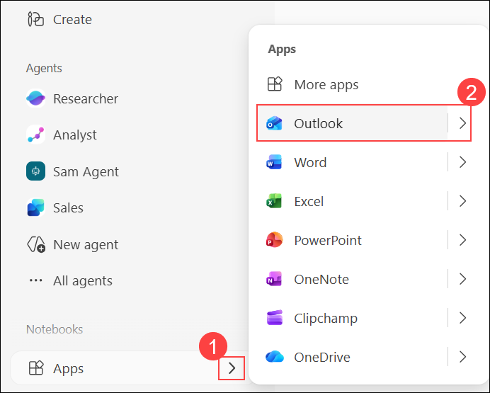

1. In **Outlook**, select **New mail** to compose a new email.

    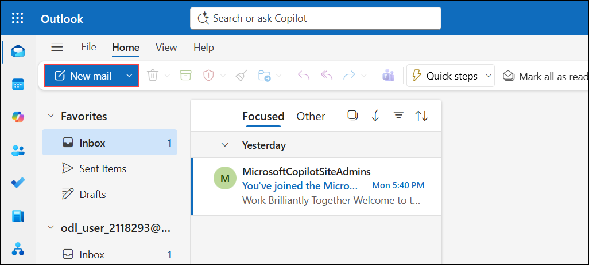
   
1. In the new email window, enter **<inject key="AzureAdUserEmail"></inject> (1)** in the **To** field, add **Scheduled maintenance of our Admin portal (2)** as the subject, paste the following email content in the message body **(3)**, and then select **Send (4)**.

   ```
   Dear team,

   We would like to inform you that the Contoso Admin Portal will undergo scheduled maintenance this Friday at 1:00 PM. During this time, the portal will be temporarily unavailable for approximately one hour while our IT team performs system updates and performance improvements.

   As a result, users will not be able to access the portal or perform administrative tasks during the maintenance window. We recommend completing any urgent activities before the maintenance begins to avoid disruptions.

   This update is part of our ongoing effort to improve system reliability, enhance security, and ensure a better experience for all employees using the platform.

   We apologize for any inconvenience this may cause and appreciate your understanding and cooperation.

   Best regards,  
   Spektra Admin
   ```

   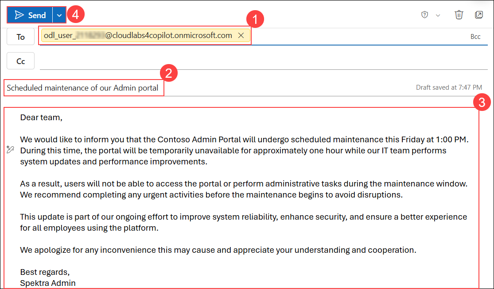

1. From the **Inbox**, select the email with the subject **Scheduled maintenance of our Admin portal** to open the email thread.

   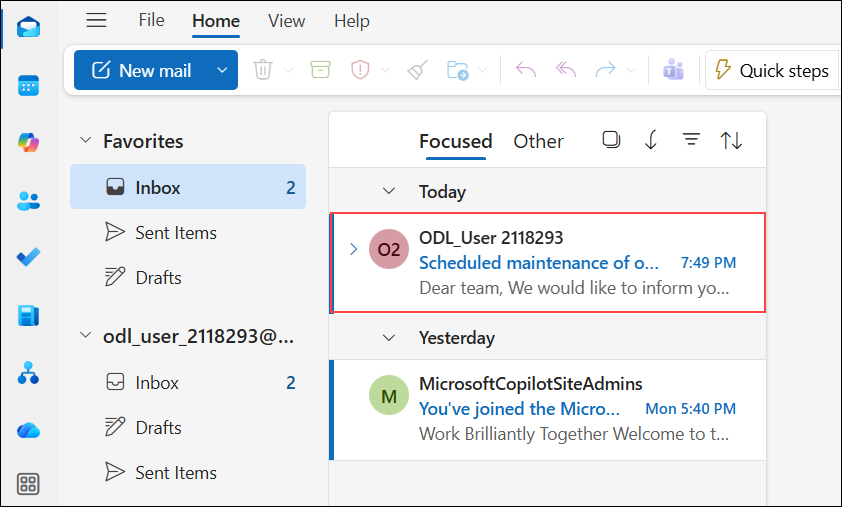

1. In the email thread, select **Summary by Copilot** to generate a summary of the email conversation.

   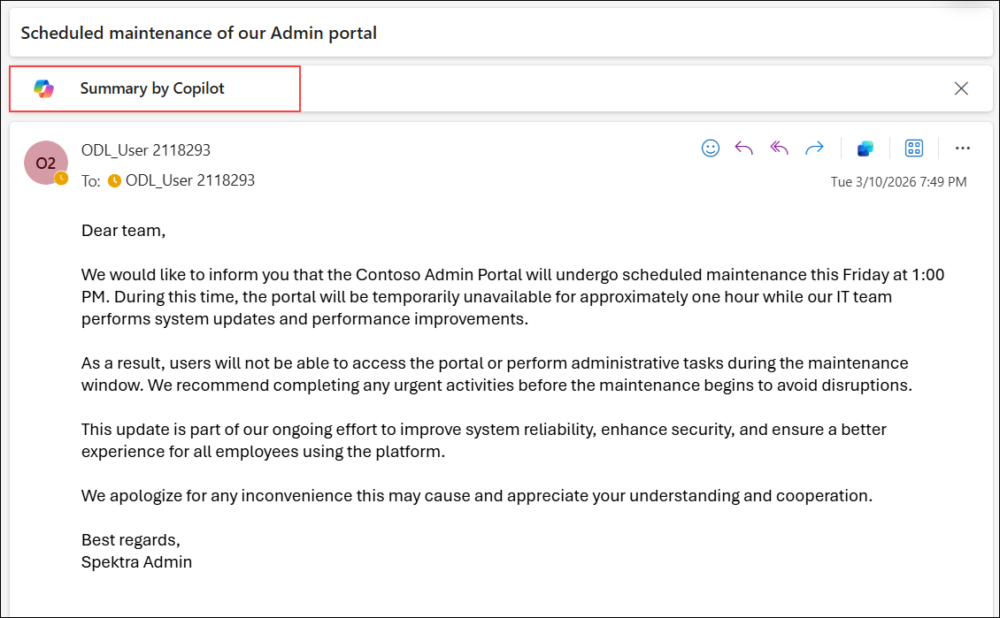

1. Review the summary generated by **Copilot**, which highlights the key points from the email thread.

    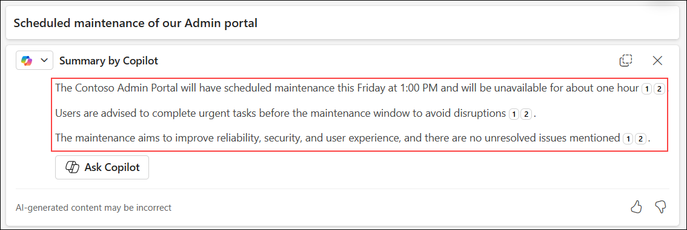

1. In **Outlook**, select **New mail** to compose another email.

    

1. In the new email window, enter **<inject key="AzureAdUserEmail"></inject> (1)** in the **To** field, and then select **Draft with Copilot (2)**.

   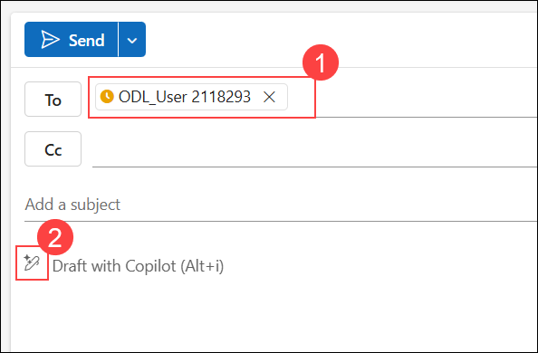

   > **Note:** You can also press **Alt + I** to open **Draft with Copilot**.

1. In the **Draft with Copilot** menu, scroll down and select **Customize drafts**.

   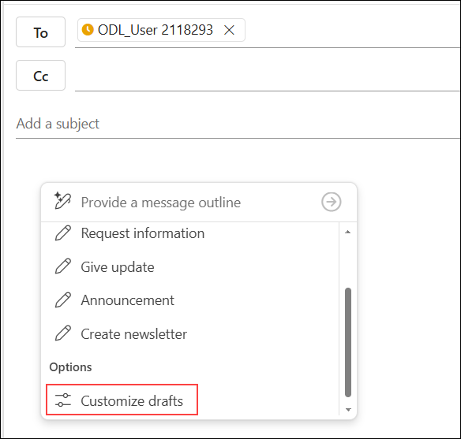

1. In the **Draft Instructions** window, enable **Use custom instructions when drafting email (1)**, enter the following instructions **(2)**, select **Save (3)**, and then close the window **(4)**.

   ```
   Use a professional and friendly tone. Keep emails short and clear. Start with a simple greeting and end with a polite closing.
   ```

   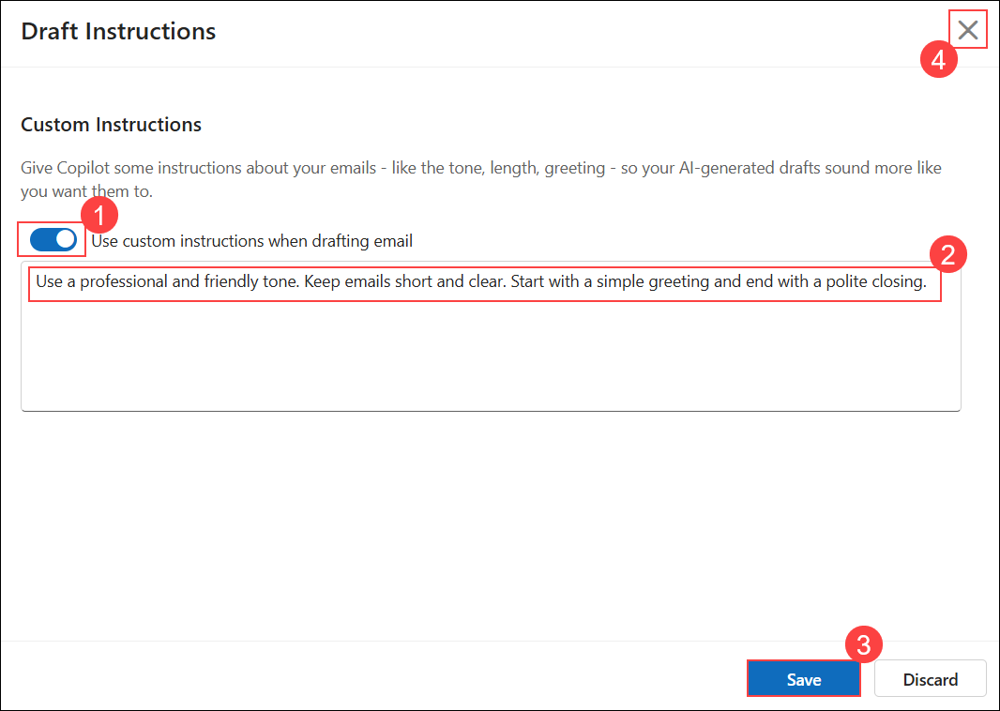

1. In the **Draft with Copilot** prompt box, enter the following prompt **(1)** and select **Generate (2)**.

   ```
   Compose an email asking the employees of Contoso Ltd. to join an organisation-level meeting on upcoming Friday asking employees to come up with their reviews, issues and suggestions which they feel should be implemented for the skyrocketing growth of organisation.
   ```

   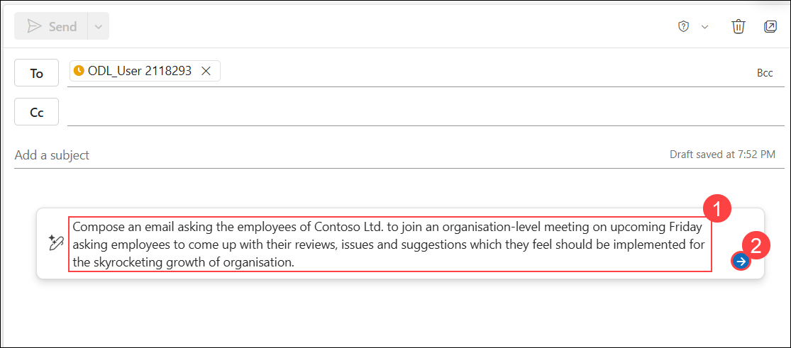

1. Review the email generated by **Copilot**, and choose options such as **Keep it**, **Discard**, **Make it shorter**, **Make it longer**, or **Change Tone** to modify the draft as needed.

   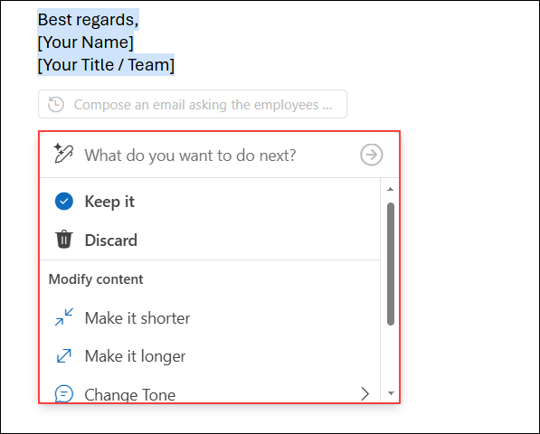

## Try Yourself Out

You can also try your own scenarios and examples out to analyse the functioning of Copilot. Here are some of the example prompts which you can take help of to explore more on **Copilot in Outlook**. Besides these, you can also create your own prompts and interact with Copilot.

```
Write an email congratulating my team on the end of the fiscal year.
```
```
Draft an email asking your manager for your planned leaves.
```

## Conclusion:

You've successfully used Microsoft 365 Copilot in Outlook to summarize email threads and draft professional emails from prompts. You learned how the **Summary by Copilot** feature can quickly extract key points from email conversations, and how **Draft with Copilot** can generate complete emails based on your instructions. By customizing draft instructions, you also saw how to tailor Copilot's tone and style to match your communication preferences, significantly reducing time spent on email management.

## Summary

In this exercise, you used Microsoft 365 Copilot in Outlook to summarize an email thread about scheduled maintenance and generate a professional email about an organization meeting using custom draft instructions.
