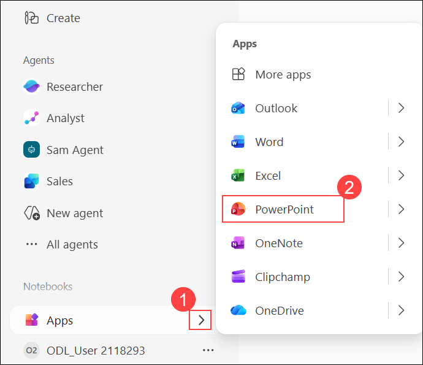
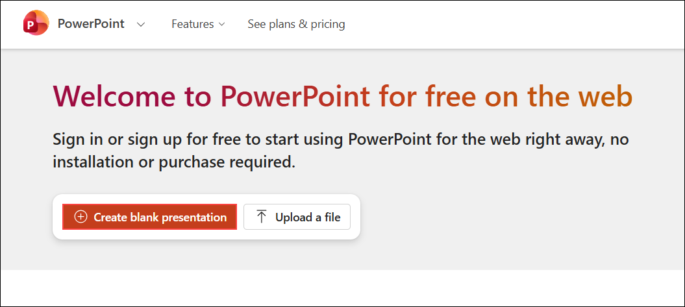
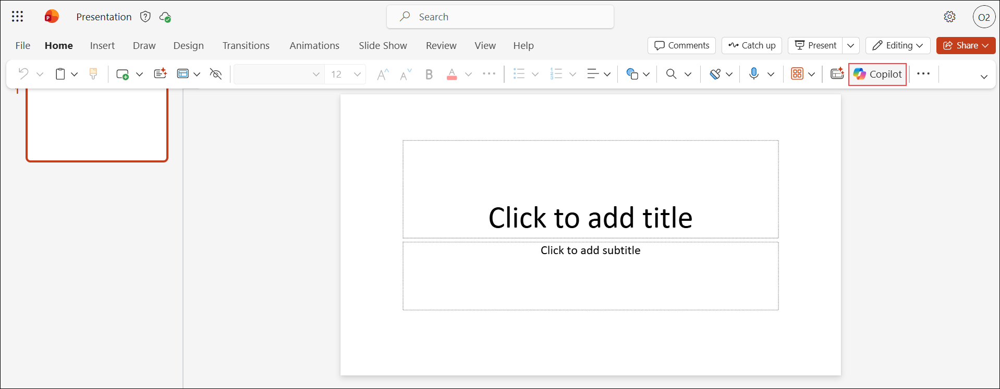
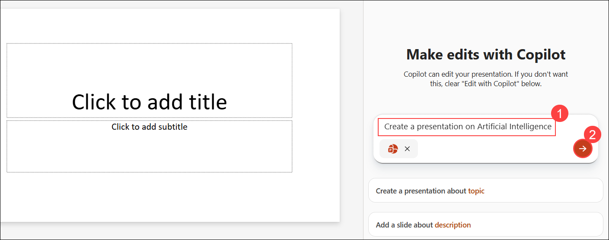
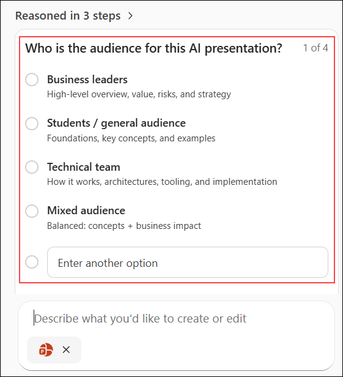
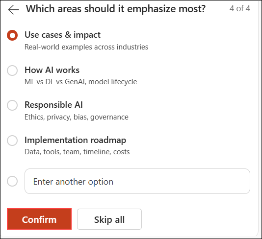
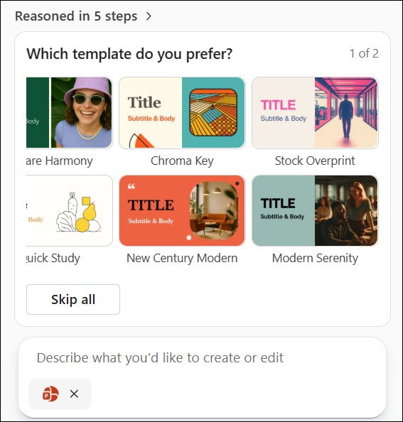
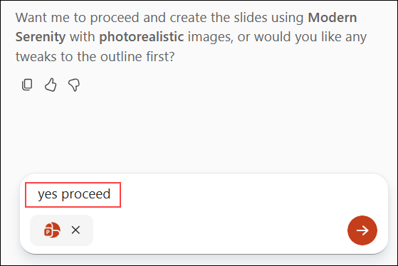
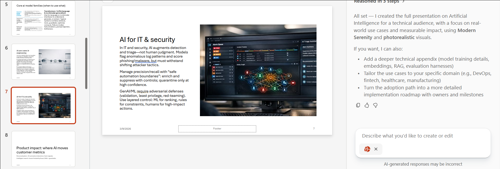
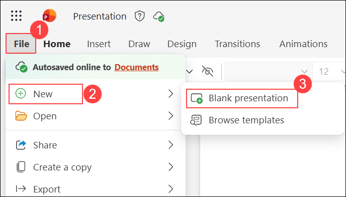

# Exercise 3.3: Using Microsoft 365 Copilot in PowerPoint

In this exercise, you will use Microsoft 365 Copilot in PowerPoint to generate a complete presentation from a simple prompt about Artificial Intelligence.

## Overview

**Microsoft Copilot** is a chatbot developed by Microsoft. **Microsoft Copilot for Microsoft 365** combines the power of large language models (LLMs) with your organization’s data all in the flow of work to turn your words into one of the most powerful productivity tools on the planet.

**Copilot** is designed to benefit everyone in an organization. From leaders to IT professional managers, Copilot offers features that streamline tasks, automate workflows, and enhance collaboration. Its adaptability means that it can be customized to meet the unique needs of any organization. The ability to extend its capabilities through plugins makes it a continually evolving asset that can adapt to the ever-changing landscape of business needs.

It works alongside popular **Microsoft 365** apps such as Word, Excel, PowerPoint, Outlook, Teams, and more. **Microsoft 365 Copilot** provides real-time intelligent assistance, enabling users to enhance their creativity, productivity, and skills.

In PowerPoint, **Copilot for Microsoft 365** acts as your presentation assistant, turning your concepts into impactful slides. With Copilot, you can effortlessly convert written documents into presentation decks, complete with speaker notes and references. Beyond creation, it also offers tools to streamline long presentations and uses intuitive commands to refine layouts, adjust text formatting, and synchronize animations.

## Crafting Presentations in PowerPoint

**Copilot in PowerPoint** transforms the way you craft your slides. When you launch a blank PowerPoint document, it stands ready to shape your ideas into a structured presentation, initiating the creation process based on your directives and incorporating a tailored narrative to craft a compelling story. Copilot bridges the gap between idea and visual representation with ease, amplifying your key messages to resonate with your audience.

## Creating Presentations from Word documents

**Copilot in PowerPoint** simplifies the transformation of existing files, streamlining the conversion of your documents into vivid visual presentations effortlessly. With this capability, you can easily transform a Word document into a structured PowerPoint presentation, ensuring your content gets the visual representation it deserves. This process not only streamlines your workflow but also brings a new dimension to your written content.

To use **Copilot in PowerPoint**, follow the below steps:

1. Navigate back to **Microsoft 365** tab.

   ```
   https://m365.cloud.microsoft/
   ```

1. Select **Apps** from the left pane and select **PowerPoint** from the apps list.

   

1. Open your **PowerPoint** and select a **Blank Presentation** then select **Copilot** on top of the screen.

    

   

   > **Note:** If the **Copilot** option is not visible in the ribbon, move your mouse to the ribbon area at the top of the screen to expand and display the available options.

1. In the Copilot pane, enter the prompt provided below in the **prompt box (1)**, and then select **Send (2)**.

   ```
   Create a presentation on Artificial Intelligence
   ```

   

   > **Note:** If the **Copilot** pane does not appear, refresh the page and wait for 2–3 minutes for it to load.

1. If Copilot prompts you to select an audience or other preferences, choose any option based on your preference to continue.

   

1. After selecting your preferred options, select **Confirm** to proceed.

   

1. If prompted to choose a template, select any preferred template to continue.

   

   > **Note:** In some cases, Copilot may ask for confirmation before generating the presentation. Enter **Yes proceed**, and then select **Send** to continue.

      

1. And it will generate a PowerPoint presentation for you.

   

1. Select **File (1)**, choose **New (2)**, and then select **Blank presentation (3)**.

   

## Try Out Yourself

You can also try out your own scenarios and examples to analyse the functioning of Copilot. Here are some of the example prompts you can take help of to explore more on **Copilot in PowerPoint**. Besides these, you can also create your own prompts and interact with Copilot.

```
Create a presentation on the use of Copilot in Contoso Ltd. as an IT Consultancy.
```
```
Add a slide about the use of Copilot in app development.
```
```
Add an image related to encryption coding in slide number 4.
```

## Conclusion:

In conclusion, **Microsoft 365 Copilot** enhances the PowerPoint experience by simplifying the creation of impactful presentations. With its intuitive interface and AI-powered capabilities, Copilot streamlines the process of crafting slides, transforming concepts into visually compelling narratives. Whether starting from scratch or converting existing documents, Copilot empowers users to create professional presentations efficiently. By bridging the gap between idea and visual representation, Copilot elevates the quality and efficiency of PowerPoint presentations, ultimately enhancing communication and collaboration in the workplace.

## Summary

In this exercise, you explored how Microsoft 365 Copilot can streamline PowerPoint presentations. You learned to create presentations from scratch or convert Word documents into slide decks. Copilot’s capabilities simplify slide creation and refinement, enabling you to transform ideas into compelling presentations efficiently.
