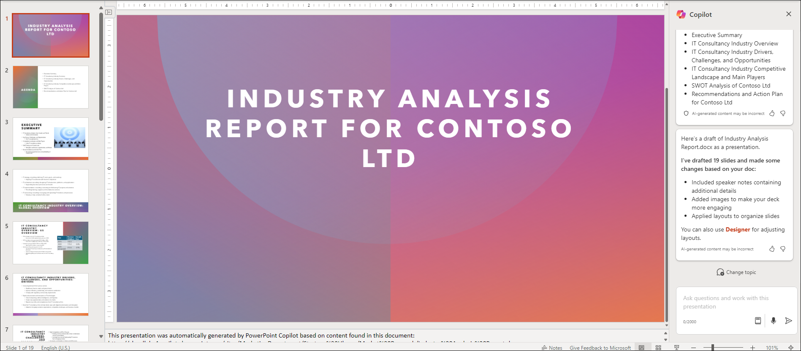

# Exercise 3.3: Using Microsoft 365 Copilot in PowerPoint

## Introduction

**Microsoft Copilot** is a chatbot developed by Microsoft. **Microsoft Copilot for Microsoft 365** combines the power of large language models (LLMs) with your organization’s data all in the flow of work to turn your words into one of the most powerful productivity tools on the planet.

**Copilot** is designed to benefit everyone in an organization. From leaders to IT professional managers, Copilot offers features that streamline tasks, automate workflows, and enhance collaboration. Its adaptability means that it can be customized to meet the unique needs of any organization. The ability to extend its capabilities through plugins makes it a continually evolving asset that can adapt to the ever-changing landscape of business needs.

It works alongside popular **Microsoft 365** apps such as Word, Excel, PowerPoint, Outlook, Teams, and more. **Microsoft 365 Copilot** provides real-time intelligent assistance, enabling users to enhance their creativity, productivity, and skills.

In PowerPoint, **Copilot for Microsoft 365** acts as your presentation assistant, turning your concepts into impactful slides. With Copilot, you can effortlessly convert written documents into presentation decks, complete with speaker notes and references. Beyond creation, it also offers tools to streamline long presentations and uses intuitive commands to refine layouts, adjust text formatting, and synchronize animations.

## Crafting Presentations in PowerPoint

**Copilot in PowerPoint** transforms the way you craft your slides. When you launch a blank PowerPoint document, it stands ready to shape your ideas into a structured presentation, initiating the creation process based on your directives and incorporating a tailored narrative to craft a compelling story. Copilot bridges the gap between idea and visual representation with ease, amplifying your key messages to resonate with your audience.

## Creating Presentations from Word documents

**Copilot in PowerPoint** simplifies the transformation of existing files, streamlining the conversion of your documents into vivid visual presentations effortlessly. With this capability, you can easily transform a Word document into a structured PowerPoint presentation, ensuring your content gets the visual representation it deserves. This process not only streamlines your workflow but also brings a new dimension to your written content.

To use **Copilot in PowerPoint**, follow the below steps:

1. Navigate to `https://www.office.com/` and sign in using **CloudLabs provided credentials**.

   

1. Select **Apps** from the left pane and select **PowerPoint** from the apps list.

   

1. Open your **PowerPoint** and select **Copilot** on top of the screen.

     
   

1. Click **Create a presentation...** and provide your preferred topic and related information to draft your presentation.

   

1. Imagine you need to create a PowerPoint presentation on Artificial Intelligence. You can provide Copilot with the following prompt, and it will generate a PowerPoint presentation for you.

   

1. Alternatively, you can also choose **Create a presentation from file...** and attach a Word document as a reference and craft a presentation based on it.

   

1. Suppose you wish to convert a report, such as an Industry Analysis Report for Contoso LTD, into a presentation. You can provide Copilot with the following prompt.

   

1. Copilot will craft an exceptional presentation from the report, complete with speaker notes.

   

## Try Out Yourself

You can also try out your own scenarios and examples to analyse the functioning of Copilot. Here are some of the example prompts you can take help of to explore more on **Copilot in PowerPoint**. Besides these, you can also create your own prompts and interact with Copilot.

```
Create a presentation on the use of Copilot in Contoso Ltd. as an IT Consultancy.
```
```
Add a slide about the use of Copilot in app development.
```
```
Add an image related to encryption coding in slide number 4.
```

## Conclusion:

In conclusion, **Microsoft 365 Copilot** enhances the PowerPoint experience by simplifying the creation of impactful presentations. With its intuitive interface and AI-powered capabilities, Copilot streamlines the process of crafting slides, transforming concepts into visually compelling narratives. Whether starting from scratch or converting existing documents, Copilot empowers users to create professional presentations efficiently. By bridging the gap between idea and visual representation, Copilot elevates the quality and efficiency of PowerPoint presentations, ultimately enhancing communication and collaboration in the workplace.
