# Exercise 3.4: Using Microsoft 365 Copilot in Excel

In this exercise, you will use Microsoft 365 Copilot in Excel to analyze a Campaign Awareness Report, generate insights, and create calculated columns using AI-powered formulas.

## Overview

**Microsoft Copilot** is a chatbot developed by Microsoft. **Microsoft Copilot for Microsoft 365** combines the power of large language models (LLMs) with your organization’s data, all in the flow of work to turn your words into one of the most powerful productivity tools on the planet.

**Copilot** is designed to benefit everyone in an organization. From leaders to IT professional managers, Copilot offers features that streamline tasks, automate workflows, and enhance collaboration. Its adaptability means that it can be customized to meet the unique needs of any organization. The ability to extend its capabilities through plugins makes it a continually evolving asset that can adapt to the ever-changing landscape of business needs.

It works alongside popular **Microsoft 365** apps such as Word, Excel, PowerPoint, Outlook, Teams, and more. **Microsoft 365 Copilot** provides real-time intelligent assistance, enabling users to enhance their creativity, productivity, and skills.

In **Excel**, **Copilot for Microsoft 365** is your data analysis companion, making complex datasets easy to understand. Copilot can help you find patterns, explore 'what-if' scenarios, get new formula suggestions, explore data without changing it, spot trends, create visuals, or get recommendations.

## **Analyzing Data in Excel**

With **Copilot in Excel**, analyzing business data becomes a seamless experience. As soon as you input your datasets into Excel, Copilot stands ready to transform these complex figures into comprehensible insights.

Beyond standard data analysis, Copilot crafts a coherent narrative from the patterns it identifies, ensuring a smooth transition from raw data to meaningful understanding. This process allows your key findings to become powerful drivers in making informed business decisions.

## **Transforming Data in Excel**

With **Copilot in Excel**, taking control of your data visualization and management is straightforward and intuitive. Copilot empowers you to not only clean and organize your data but also to enhance it through various stylistic and structural modifications. From applying styles, fonts, and colors to extending your data’s capabilities through pivot tables and graphs, Copilot helps in every step. Easily command Copilot to create new columns, define conditions for data representation, and formulate graphs for a comprehensive view.

To use **Copilot in Excel**, follow the below steps:

1. Navigate back to **Microsoft 365** tab.

   ```
   https://m365.cloud.microsoft/
   ```

1. From the Microsoft 365 home page, select **Apps (1)**, and then choose **More apps (2)**.

   

1. On the **Apps** page, select **SharePoint**.

   

1. In the search results page, select the **Sites (3)** tab, and then choose **Marketing Department (4)**.

   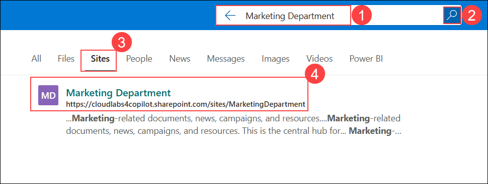

1. From the left pane, select **Site contents (1)**, and then choose **Strategy Library (2)**.

   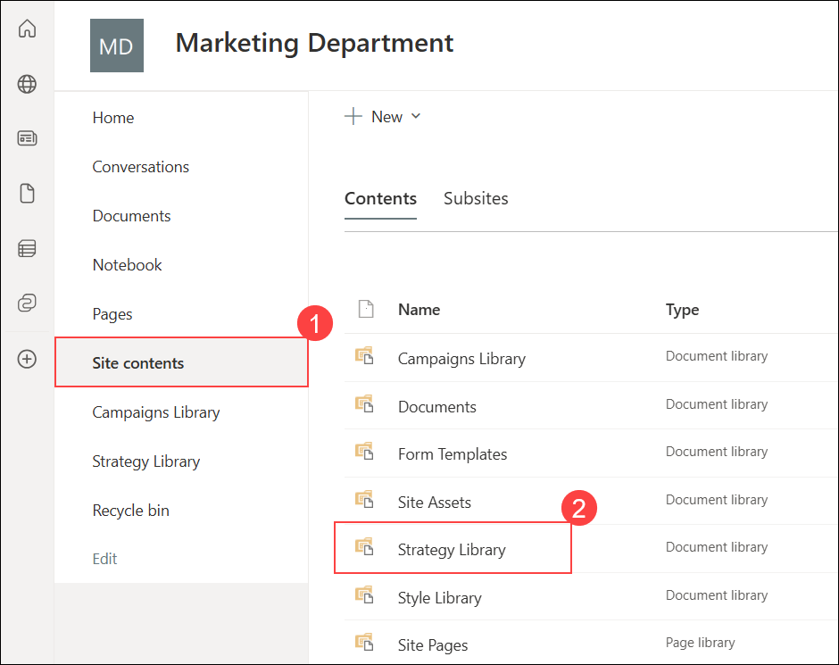

1. Double-click to open the **Market Research** folder.

   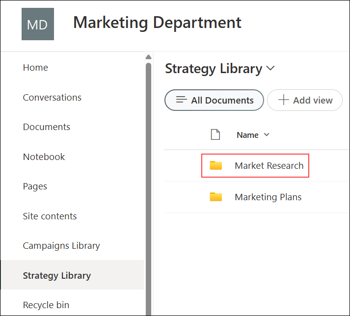

1. In the **Market Research** folder, select **Campaign Awareness.xlsx**.

   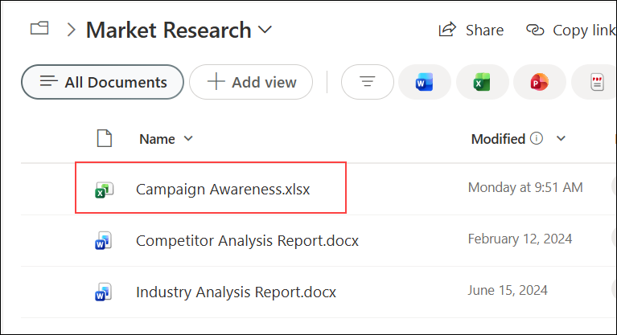

1. Your Excel file will open, containing the data. Select the **File** tab. 

   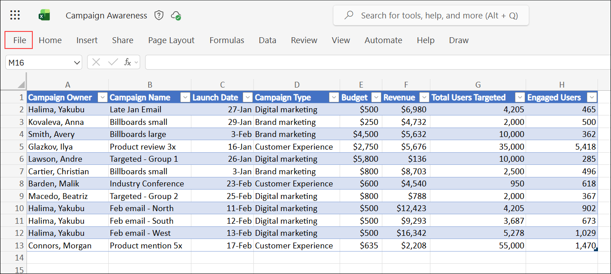

   >**Note:** Make sure not to edit anything in the file here, as it is shared with other users as well.

1. In the **File** menu, select **Create a Copy (1)**, and then choose **Create a copy online (2)**.

   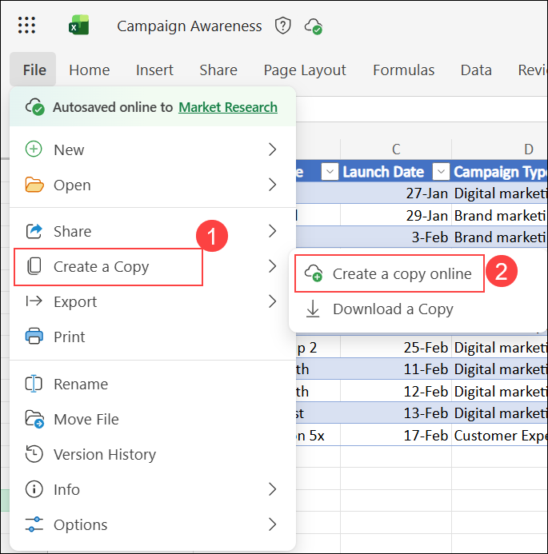

1. In the **Create a Copy Online** window, enter your preferred name in the **File Name (1)** field, select the **Location (2)** dropdown, and then choose **More save locations (3)**.

   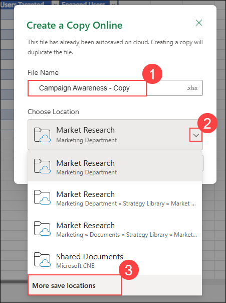

1. In the **Create A Copy** window, select **My files (1)** from the left pane, and then choose **Save Here (2)**.

   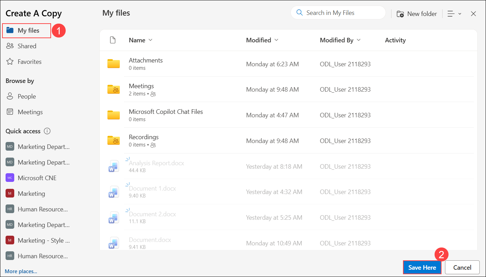

1. From the ribbon, select **Copilot**.

   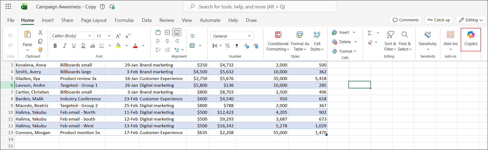

   > **Note:** If the ribbon is minimized, hover your mouse near the top of the Excel window to display the ribbon and access the **Copilot** option.

1. Provide your input. You can provide prompts like `Show data insights` to see the insights from the given Excel table. and clicking on the **Send** icon.

   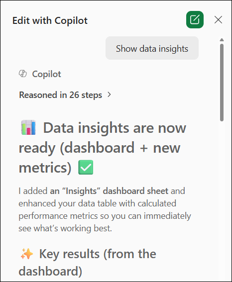

   Some other sample prompts that you can provide are:
   ```
   Show suggestions for formula column.
   ```
   ```
   How can I highlight, filter and sort data?
   ```

1. The following output appears, showing the insights for the provided table.

   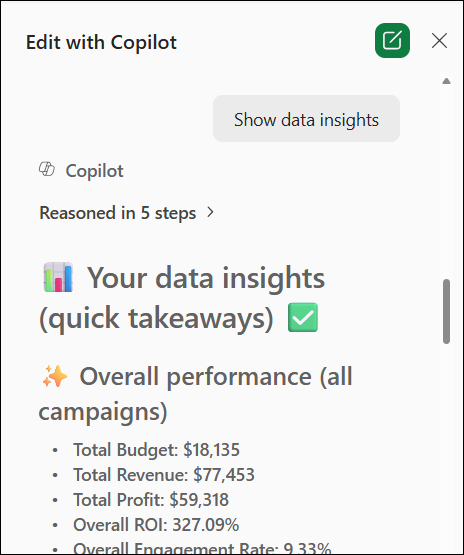

   > **Note:** The output generated by Copilot may vary based on the data and prompts provided.

1. You can also add a new column in your report by providing Copilot with the necessary information regarding the column.

1. In the **Copilot** pane, enter the prompt in the message box **(1)**, and then select **Send (2)**.

   ```
   Add a column called 'Engagement Rate' that divides the number of Engaged Users by the total number of Users Targeted and display the result as a percentage.
   ```

   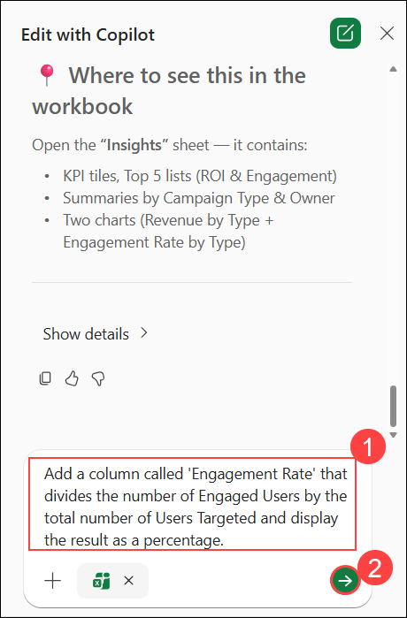

1. The new column named **Engagement Rate** will be added to your table as shown below:

   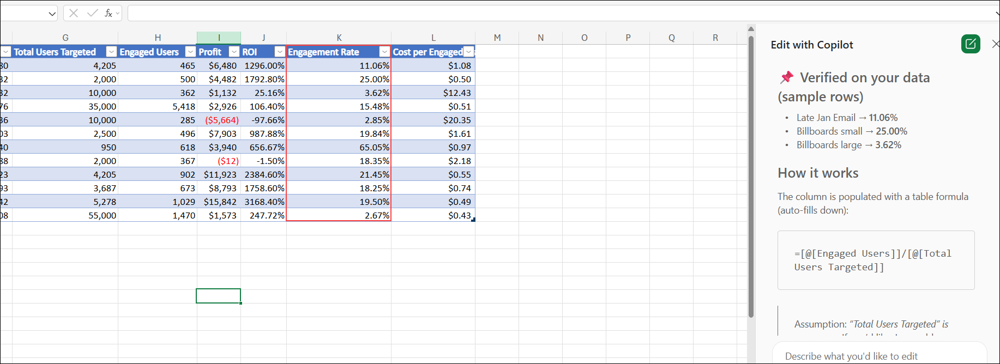

   It exemplifies the simplicity of transforming your data with **Copilot in Excel**. 

## Try Out Yourself

You can also try out your own scenarios and examples to analyse the functioning of Copilot. Here are some of the example prompts you can take help of to explore more on **Copilot in Excel**. Besides these, you can also create your own prompts and interact with Copilot.

```
Analyze this quarter's business results and summarize three key trends.
```
```
Sort data by launch date.
```
```
Change the table style to light gray,
```
```
Create a pivot table where the row is category, the column is supplier, and the values represent the sum of the minimum reorder quantity.
```

## Conclusion

You've successfully used Microsoft 365 Copilot in Excel to analyze the Campaign Awareness Report from SharePoint. You learned how Copilot can quickly generate data insights, suggest formulas, and create calculated columns like the Engagement Rate. By using simple natural language prompts, you can transform and analyze complex datasets without manually writing formulas or performing calculations, significantly improving data analysis efficiency.

## Summary

In this exercise, you used Microsoft 365 Copilot in Excel to analyze a Campaign Awareness Report. You generated data insights, added a calculated Engagement Rate column using Copilot-suggested formulas, and explored how Copilot simplifies data analysis and management tasks.
