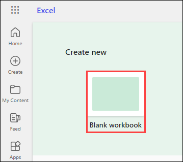

# Exercise 3.4: Using Microsoft 365 Copilot in Excel

## Introduction

**Microsoft Copilot** is a chatbot developed by Microsoft. **Microsoft Copilot for Microsoft 365** combines the power of large language models (LLMs) with your organization’s data all in the flow of work to turn your words into one of the most powerful productivity tools on the planet.

**Copilot** is designed to benefit everyone in an organization. From leaders to IT professional managers, Copilot offers features that streamline tasks, automate workflows, and enhance collaboration. Its adaptability means that it can be customized to meet the unique needs of any organization. The ability to extend its capabilities through plugins makes it a continually evolving asset that can adapt to the ever-changing landscape of business needs.

It works alongside popular **Microsoft 365** apps such as Word, Excel, PowerPoint, Outlook, Teams, and more. **Microsoft 365 Copilot** provides real-time intelligent assistance, enabling users to enhance their creativity, productivity, and skills.

In **Excel**, **Copilot for Microsoft 365** is your data analysis companion, making complex datasets easy to understand. Copilot can help you find patterns, explore 'what-if' scenarios, get new formula suggestions, explore data without changing it, spot trends, create visuals, or get recommendations.

## **Analyzing Data in Excel**

With **Copilot in Excel**, analyzing business data becomes a seamless experience. As soon as you input your datasets into Excel, Copilot stands ready to transform these complex figures into comprehensible insights.

Beyond standard data analysis, Copilot crafts a coherent narrative from the patterns it identifies, ensuring a smooth transition from raw data to meaningful understanding. This process allows your key findings to become powerful drivers in making informed business decisions.

## **Transforming Data in Excel**

With **Copilot in Excel**, taking control of your data visualization and management is straightforward and intuitive. Copilot empowers you to not only clean and organize your data but also to enhance it through various stylistic and structural modifications. From applying styles, fonts, and colors to extending your data’s capabilities through pivot tables and graphs, Copilot helps in every step. Easily command Copilot to create new columns, define conditions for data representation, and formulate graphs for a comprehensive view.

To use **Copilot in Excel**, follow the below steps:

1. Navigate to `https://www.office.com` and sign in using **CloudLabs provided credentials**.

   

1. Select **Apps** from the left pane and select **Excel** from the apps list.

   

1. Select **Blank Workbook** to open a new Excel workbook.

    

1. In the new **Excel** workbook , choose **Copilot** on top of the screen.

   

1. The **Copilot** popup will appear. As **Copilot in Excel** needs some data to work on it, select **Try an example** to get a sample table.

    

1. Provide your input. You can you can provide prompts like `Show data insights` to see the insights from the given Excel table. and clicking on the **Send** icon.

   

   Some other sample prompts that you can provide are:
   ```
   Show suggestions for formula column.
   ```
   ```
   How can I highlight, filter and sort data?
   ```

1. The following output appears showing the insights for the provided table.

    

## Try Yourself Out

You can also try out your own scenarios and examples to analyse the functioning of Copilot. Here are some of the prompts you can take help of to explore more on **Copilot in Excel**:

```
Analyze this quarter's business results and summarize three key trends.
```
```
Sort data by launch date.
```
```
Change the table style to light gray,
```
```
Create a pivot table where the row is category, the column is supplier, and the values represent the sum of the minimum reorder quantity.
```

## Conclusion

In conclusion, Copilot is an intuitive and powerful tool that simplifies data analysis, making it easy for users to derive meaningful insights from complex datasets. It also offers robust data visualization and management features, enabling users to customize and enhance their data presentations. Through a series of simple commands, Copilot can execute intricate tasks such as creating pivot tables, sorting and filtering data, and performing 'what-if' analyses. Thus, **Microsoft 365 Copilot** significantly enhances the Excel user experience, facilitating seamless data analysis, management, and visualization, thereby proving to be a valuable asset for any organization seeking to optimize their data handling and decision-making processes.
