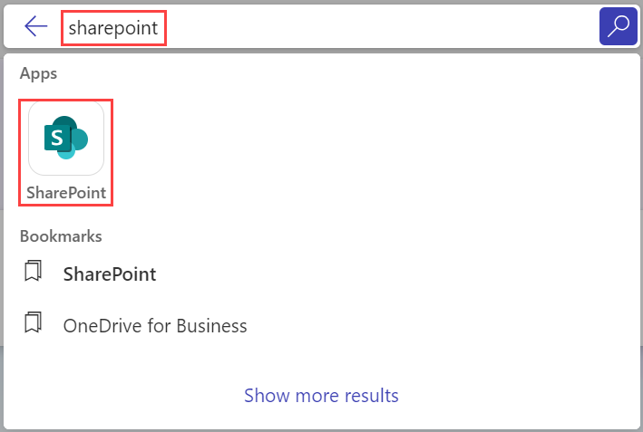

# Exercise 3.4: Using Microsoft 365 Copilot in Excel

In this exercise, you will learn how to use Microsoft 365 Copilot to enhance your data analysis and management in Excel. You will explore how Copilot helps with finding insights, creating formulas, and transforming data into visual representations. This includes tasks such as generating data insights, creating new columns, and customizing your data presentation efficiently.

## Overview

**Microsoft Copilot** is a chatbot developed by Microsoft. **Microsoft Copilot for Microsoft 365** combines the power of large language models (LLMs) with your organization’s data all in the flow of work to turn your words into one of the most powerful productivity tools on the planet.

**Copilot** is designed to benefit everyone in an organization. From leaders to IT professional managers, Copilot offers features that streamline tasks, automate workflows, and enhance collaboration. Its adaptability means that it can be customized to meet the unique needs of any organization. The ability to extend its capabilities through plugins makes it a continually evolving asset that can adapt to the ever-changing landscape of business needs.

It works alongside popular **Microsoft 365** apps such as Word, Excel, PowerPoint, Outlook, Teams, and more. **Microsoft 365 Copilot** provides real-time intelligent assistance, enabling users to enhance their creativity, productivity, and skills.

In **Excel**, **Copilot for Microsoft 365** is your data analysis companion, making complex datasets easy to understand. Copilot can help you find patterns, explore 'what-if' scenarios, get new formula suggestions, explore data without changing it, spot trends, create visuals, or get recommendations.

## **Analyzing Data in Excel**

With **Copilot in Excel**, analyzing business data becomes a seamless experience. As soon as you input your datasets into Excel, Copilot stands ready to transform these complex figures into comprehensible insights.

Beyond standard data analysis, Copilot crafts a coherent narrative from the patterns it identifies, ensuring a smooth transition from raw data to meaningful understanding. This process allows your key findings to become powerful drivers in making informed business decisions.

## **Transforming Data in Excel**

With **Copilot in Excel**, taking control of your data visualization and management is straightforward and intuitive. Copilot empowers you to not only clean and organize your data but also to enhance it through various stylistic and structural modifications. From applying styles, fonts, and colors to extending your data’s capabilities through pivot tables and graphs, Copilot helps in every step. Easily command Copilot to create new columns, define conditions for data representation, and formulate graphs for a comprehensive view.

To use **Copilot in Excel**, follow the below steps:

1. Navigate to the Environment details page and click on it. You will find M365 Copilot User Details tab. Click on the tab and copy the Username | Password provided there.

   

1. Navigate to `https://www.office.com` and sign in using **CloudLabs provided credentials**.

   

1. Select **Apps** from the left pane and search for **SharePoint** from the apps list. Select it.

   

1. You will be navigated to the **SharePoint** homepage.  Select **Marketing Department** to go to the site of Marketing department.

   

   >**Note:** If you are not able to find **Marketing Department** sharepoint, Search for **Marketing Department** sharepoint site from the search bar.

      

1. From the left pane, select **Site Contents** and then, choose **Strategy Library** folder.

   

1. Double-click to open **Market Research** folder and select **Campaign Awareness.xlsx**.

   

1. Your excel file will open containing the data, Select **File** tab. 

   

   

   >**Note:** Make sure not to edit anything on the file here as it is shared with other users as well.

1. Select **Save As** and choose **Save a Copy** to save a copy of the **Campaign Awareness Report** in your own OneDrive.

   

1. You can provide your preferred name to the file you will save to your personal **OneDrive** account in the **File name** textbox. Select **Location** to set the location of the saved copy of the file to your personal **OneDrive** account. Choose **More save locations**.

   

1. Select **My Files** from the left pane and select **Save Here** to save the copy of the file to your personal **OneDrive** account.

   

1. Your new **Excel** workbook will open that you saved by your preferred name, click on any cell of the table to select it and choose **Copilot** on top of the screen.

   

1. The **Copilot** popup will appear, Click on it.

1. Provide your input. You can you can provide prompts like `Show data insights` to see the insights from the given Excel table. and clicking on the **Send** icon.

   

   Some other sample prompts that you can provide are:
   ```
   Show suggestions for formula column.
   ```
   ```
   How can I highlight, filter and sort data?
   ```

1. The following output appears showing the insights for the provided table.

    

1. You can also add a new column in your report by providing Copilot the necessary information regarding the column. For instance, ask Copilot to `Add a column called 'Engagement Rate' that divides the number of Engaged Users by the total number of Users Targeted and display the result as a percentage.` in the prompt-box and send it.

   

1. The **Copilot** would provide you the formula that it used for creating the column you asked. Select **Insert column** to insert the column based on the same formula.

   

1. The new column named **Engagement Rate** will be addded to your table as shown below:

   

   It exemplifies the simplicity of transforming your data with **Copilot in Excel**. 

## Try Out Yourself

You can also try out your own scenarios and examples to analyse the functioning of Copilot. Here are some of the example prompts you can take help of to explore more on **Copilot in Excel**. Besides these, you can also create your own prompts and interact with Copilot.

```
Analyze this quarter's business results and summarize three key trends.
```
```
Sort data by launch date.
```
```
Change the table style to light gray,
```
```
Create a pivot table where the row is category, the column is supplier, and the values represent the sum of the minimum reorder quantity.
```

## Conclusion

In conclusion, Copilot is an intuitive and powerful tool that simplifies data analysis, making it easy for users to derive meaningful insights from complex datasets. It also offers robust data visualization and management features, enabling users to customize and enhance their data presentations. Through a series of simple commands, Copilot can execute intricate tasks such as creating pivot tables, sorting and filtering data, and performing 'what-if' analyses. Thus, **Microsoft 365 Copilot** significantly enhances the Excel user experience, facilitating seamless data analysis, management, and visualization, thereby proving to be a valuable asset for any organization seeking to optimize their data handling and decision-making processes.

## Summary

In this exercise, you explored how Microsoft 365 Copilot assists with data analysis in Excel. You learned to use Copilot for tasks such as generating insights, creating formulas, and transforming data. Copilot simplifies data management and visualization, making it easier to derive actionable insights and enhance your data presentations efficiently.
