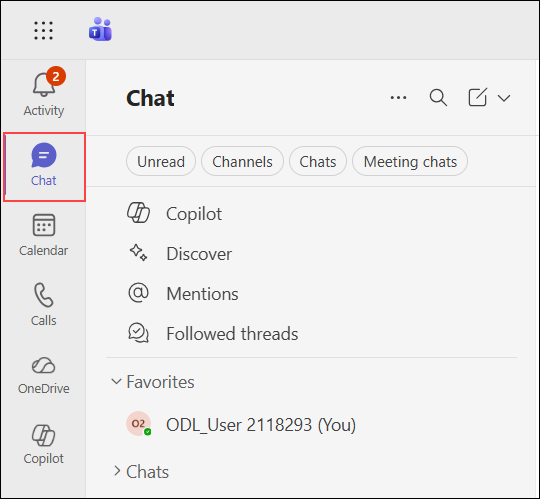
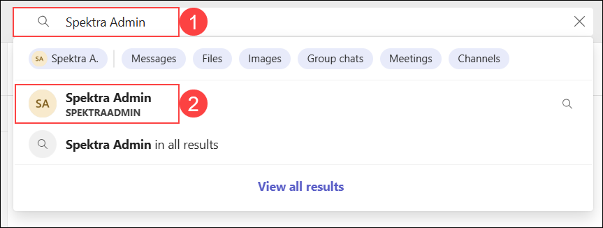
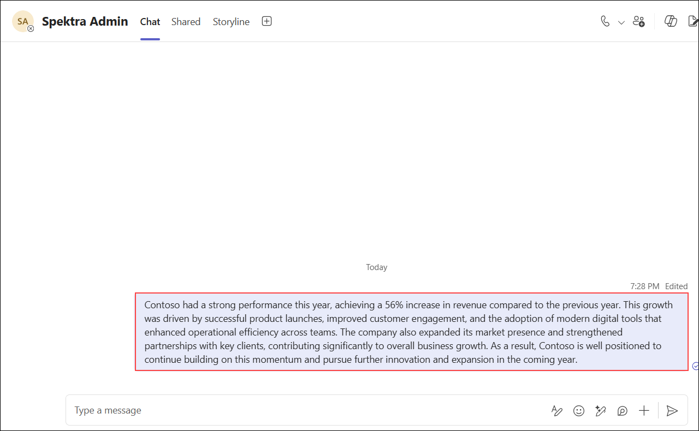
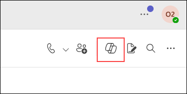
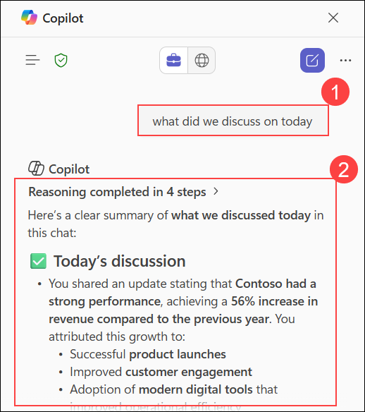

# Exercise 3.5: Using Microsoft 365 Copilot in Teams

In this exercise, you will use Microsoft 365 Copilot in Teams to summarize chat conversations and understand how Copilot can help you quickly catch up on discussions.

## Overview

**Microsoft Copilot** is a chatbot developed by Microsoft. **Microsoft Copilot for Microsoft 365** combines the power of large language models (LLMs) with your organization’s data, all in the flow of work to turn your words into one of the most powerful productivity tools on the planet.

**Copilot** is designed to benefit everyone in an organization. From leaders to IT professional managers, Copilot offers features that streamline tasks, automate workflows, and enhance collaboration. Its adaptability means that it can be customized to meet the unique needs of any organization. The ability to extend its capabilities through plugins makes it a continually evolving asset that can adapt to the ever-changing landscape of business needs.

It works alongside popular **Microsoft 365** apps such as Word, Excel, PowerPoint, Outlook, Teams, and more. **Microsoft 365 Copilot** provides real-time intelligent assistance, enabling users to enhance their creativity, productivity, and skills.

In Teams, **Copilot for Microsoft 365** elevates the efficiency of teamwork, facilitating seamless conversations and more productive meetings. It helps keep you updated with discussions, summarizing key actions, and organizing focal points of conversations to promote a streamlined workflow within your team.

## Enhancing Teams Chat Experience

In chat threads, **Copilot in Teams** can help users get up to speed on conversations by quickly reviewing the main points, action items, and decisions without having to scroll through long threads. Users can ask Copilot to generate a summary of the chat conversation over a recent time period they specify (Copilot provides prompts for the past day, seven days, or 30 days). Copilot can also draft an email to the meeting participants that summarizes the meeting and includes the action items. Overall, Copilot in Teams is a powerful tool that can help users stay organized and productive in their online meetings and conversations.

## Harness meeting insights

**Copilot in Teams** furnishes you with a succinct summary of the missed discussions, empowering you to catch up swiftly. You can utilize the suggested prompts or craft your personalized questions to garner essential insights about the ongoing meeting context, enhancing your engagement and comprehension.

Copilot aids you in steering the conversation forward with confidence, suggesting questions that you can pose to the group, helping to facilitate a richer and more inclusive discussion. Its goal is to help summarize the key discussions and identify the next actionable steps. Doing so helps ensure that all meeting attendants are on the same page with the agreed-upon tasks.

To use **Copilot in Teams**, follow the below steps:

1. Navigate to **Microsoft Teams** using the following URL.

    ```
    https://teams.microsoft.com/v2/
    ```

1. If prompted to sign in, use the lab credentials to sign in.

   - **Email/Username:** <inject key="AzureAdUserEmail"></inject>
   
   - **Temporary Access Pass:** <inject key="AzureAdUserPassword"></inject>

1. In **Microsoft Teams**, select **Chat** from the left navigation pane.

    

1. In the **Search** bar, enter **Spektra Admin (1)** and select the **Spektra Admin** user from the results **(2)** to open the chat.

    

    > **Note:** If you do not find **Spektra Admin**, search for **ODL_User (You)** and open that chat to continue the exercise.

1. In the chat with **Spektra Admin**, enter the following message in the chat box and send it.

    ```
    Contoso had a strong performance this year, achieving a 56% increase in revenue compared to the previous year. This growth was driven by successful product launches, improved customer engagement, and the adoption of modern digital tools that enhanced operational efficiency across teams. The company also expanded its market presence and strengthened partnerships with key clients, contributing significantly to overall business growth. As a result, Contoso is well-positioned to continue building on this momentum and pursue further innovation and expansion in the coming year.
    ```

    

1. Select the **Copilot** icon from the top right corner to use Copilot on the provided chat.

    

1. In the **Copilot** pane, enter the prompt **what did we discuss today (1)** and review the summary generated by **Copilot (2)**.

    

1. Feel free to explore **Copilot** further by trying different prompts to analyze or summarize the chat conversation.

    Example prompts:

    ```
    List the key action items from this chat.
    ```

    ```
    Summarize the main points discussed in this conversation.
    ```

## Conclusion

In conclusion, Copilot can significantly enhance the Teams user experience, promoting a more organized, productive, and effective communication environment. It can generate summaries of chat threads, identify key action points, and help users catch up on missed discussions efficiently. Furthermore, the tool empowers users to direct conversations confidently by suggesting potential questions to facilitate rich and inclusive discussions. It also aids in maintaining alignment within the team by summarizing key discussions and identifying next steps. Thus, **Microsoft 365 Copilot** is a valuable tool for any team-oriented setting, boosting productivity, enhancing engagement, and streamlining workflows.

## Summary

In this exercise, you discovered how Microsoft 365 Copilot improves the Teams experience by summarizing chat conversations, organizing meeting insights, and aiding in email drafting. Copilot enhances productivity by providing clear summaries, identifying action items, and facilitating effective communication during meetings. This makes it easier to stay organized, engaged, and aligned with your team’s goals.
