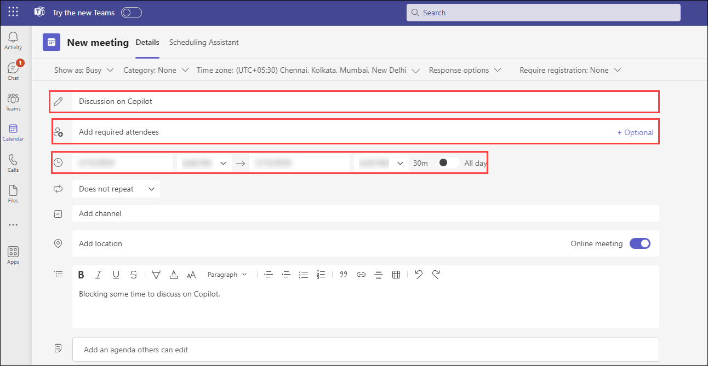
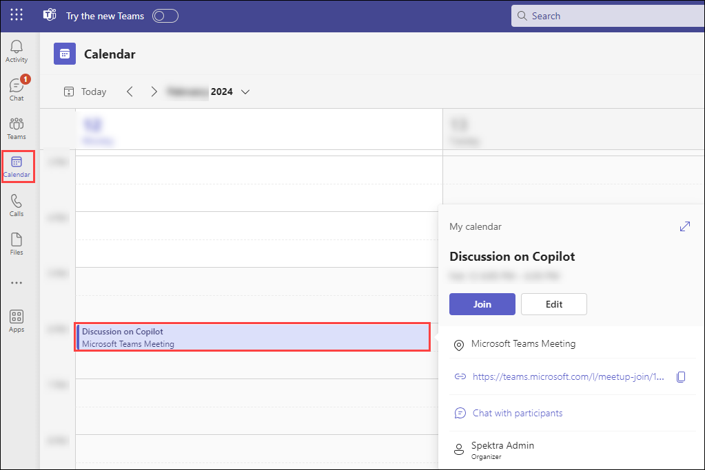
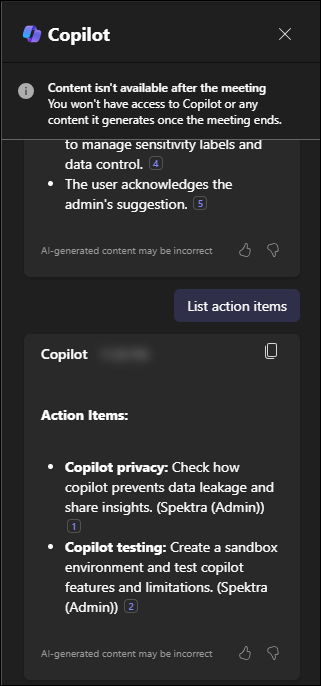
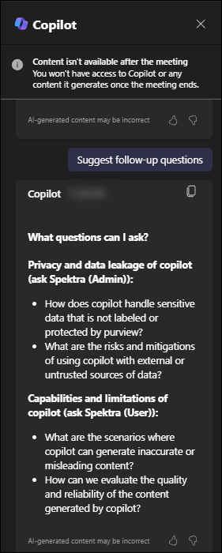

# Exercise 3.5: Using Microsoft 365 Copilot in Teams

In this exercise, you will explore how Microsoft 365 Copilot enhances teamwork and communication in Microsoft Teams. You'll learn how Copilot helps summarize chat threads, organize meeting insights, and draft emails based on meeting discussions. You will also gain practical experience by scheduling and managing meetings using Copilot to streamline communications and improve productivity.

## Overview

**Microsoft Copilot** is a chatbot developed by Microsoft. **Microsoft Copilot for Microsoft 365** combines the power of large language models (LLMs) with your organization’s data all in the flow of work to turn your words into one of the most powerful productivity tools on the planet.

**Copilot** is designed to benefit everyone in an organization. From leaders to IT professional managers, Copilot offers features that streamline tasks, automate workflows, and enhance collaboration. Its adaptability means that it can be customized to meet the unique needs of any organization. The ability to extend its capabilities through plugins makes it a continually evolving asset that can adapt to the ever-changing landscape of business needs.

It works alongside popular **Microsoft 365** apps such as Word, Excel, PowerPoint, Outlook, Teams, and more. **Microsoft 365 Copilot** provides real-time intelligent assistance, enabling users to enhance their creativity, productivity, and skills.

In Teams, **Copilot for Microsoft 365** elevates the efficiency of teamwork, facilitating seamless conversations and more productive meetings. It helps keep you updated with discussions, summarizing key actions, and organizing focal points of conversations to promote a streamlined workflow within your team.

## Enhancing Teams Chat Experience

In chat threads, **Copilot in Teams** can help users get up to speed on conversations by quickly reviewing the main points, action items, and decisions without having to scroll through long threads. Users can ask Copilot to generate a summary of the chat conversation over a recent time period they specify (Copilot provides prompts for the past day, seven days, or 30 days). Copilot can also draft an email to the meeting participants that summarizes the meeting and includes the action items. Overall, Copilot in Teams is a powerful tool that can help users stay organized and productive in their online meetings and conversations.

## Harness meeting insights

**Copilot in Teams** furnishes you with a succinct summary of the missed discussions, empowering you to catch up swiftly. You can utilize the suggested prompts or craft your personalized questions to garner essential insights about the ongoing meeting context, enhancing your engagement and comprehension.

Copilot aids you in steering the conversation forward with confidence, suggesting questions that you can pose to the group, helping to facilitate a richer and more inclusive discussion. Its goal is to help summarize the key discussions and identify the next actionable steps. Doing so helps ensure that all meeting attendants are on the same page with the agreed-upon tasks.

To use **Copilot in Teams**, follow the below steps:

1. Navigate to the Environment details page and click on it. You will find M365 Copilot User Details tab. Click on the tab and copy the Username | Password provided there.

   

1. Navigate to `https://www.office.com` and sign in using **CloudLabs provided credentials**.

   

1. Select **Apps** from the left pane and select **Teams** from the apps list.

   

1. Open **Teams** and go to the chat with a user named as **Spektra Admin**.
   
    

1. The following screen will appear presenting a pre-built chat with **Spektra Admin**. You can use this chat to see the transformative capabilities of **Copilot in Teams**.

    

1. Select the **Copilot** icon from the top right corner to use Copilot on the provided chat.

    

1. Here you can provide prompts like listing actions points from the chat, summarizing the chat etc. as per your needs. A sample prompt is given below with the output delivered by **Copilot**.

    

## Utilizing Copilot in Meetings

Here you will see the practical utility and capabilities of the **M365 Copilot** in a real-world context. You'll conduct a meeting and a chat conversation with your colleagues, using the M365 Copilot to streamline and summarize these interactions. The goal is to gain hands-on experience with the tool and understand its potential to enhance productivity and communication within your organization.

- ### Scheduling a Meeting

    To schedule a meeting in Microsoft Teams with your colleagues, follow the given steps:

    1. Select **Calender** from the left pane. Choose **New Meeting** from the top right corner.

    1. A  new page will open where you can add a title to your meeting, add required attendees, select the date and time and add any other required information.

        Give a name to your meeting and add your colleagues by typing their usernames in the appropriate box, and choose your favourable time slot.

        

    1. Select **Save** from the top right corner. A meeting invite will be sent to the attendees of the meeting. You can find it on your **Calender** page in the time slot you chose.

        

    1. To start the meeting, click on the invite and select **Join**.

- ### Utilizing M365 Copilot during the Meeting

    To utilise the capabilities of **Microsoft 365 Copilot** in a meeting, follow the given steps:

    1. Organise a meeting and select **Copilot** from the top bar. A side pane will open where you can give prompts to the Copilot.

    1. During the meeting, ask Copilot to take notes, list action items or generate relevant questions.

        

        

    1. Review the Meeting Summary by asking Copilot to provide a summary of the meeting when it's about to end, which will highlight key points, decisions, and action items.

        

        Share the summary with others who may have missed the meeting.

## Try Out Yourself

You can also try out your own scenarios and examples to analyse the functioning of Copilot. For this, ask the username of one of your colleagues and search his/her name on the search bar present on top of the screen. Chat with him/her and then, you can use the following example prompts or provide your own prompts to the Copilot:

```
List action points from the chat.
```
```
Summarise the chat.
```
```
On what points an agreement is reached?
```


## Conclusion

In conclusion, Copilot can significantly enhance the Teams user experience, promoting a more organized, productive, and effective communication environment. It can generate summaries of chat threads, identify key action points, and help users catch up on missed discussions efficiently. Furthermore, the tool empowers users to direct conversations confidently by suggesting potential questions to facilitate rich and inclusive discussions. It also aids in maintaining alignment within the team by summarizing key discussions and identifying next steps. Thus, **Microsoft 365 Copilot** is a valuable tool for any team-oriented setting, boosting productivity, enhancing engagement, and streamlining workflows.

## Summary

In this exercise, you discovered how Microsoft 365 Copilot improves the Teams experience by summarizing chat conversations, organizing meeting insights, and aiding in email drafting. Copilot enhances productivity by providing clear summaries, identifying action items, and facilitating effective communication during meetings. This makes it easier to stay organized, engaged, and aligned with your team’s goals.
