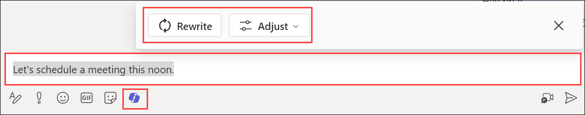
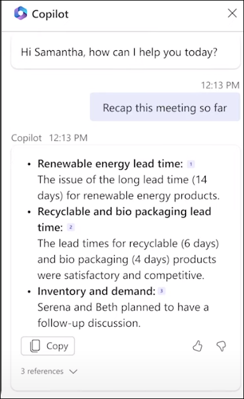

# Exercise 4.5: Using Microsoft 365 Copilot in Teams

## Introduction

**Microsoft Copilot** is a chatbot developed by Microsoft. **Microsoft Copilot for Microsoft 365** combines the power of large language models (LLMs) with your organization’s data all in the flow of work to turn your words into one of the most powerful productivity tools on the planet.

**Copilot** is designed to benefit everyone in an organization. From leaders to IT professional managers, Copilot offers features that streamline tasks, automate workflows, and enhance collaboration. Its adaptability means that it can be customized to meet the unique needs of any organization. The ability to extend its capabilities through plugins makes it a continually evolving asset that can adapt to the ever-changing landscape of business needs.

It works alongside popular **Microsoft 365** apps such as Word, Excel, PowerPoint, Outlook, Teams, and more. **Microsoft 365 Copilot** provides real-time intelligent assistance, enabling users to enhance their creativity, productivity, and skills.

In Teams, **Copilot for Microsoft 365** elevates the efficiency of teamwork, facilitating seamless conversations and more productive meetings. It helps keep you updated with discussions, summarizing key actions, and organizing focal points of conversations to promote a streamlined workflow within your team.

## **Enhancing Teams Chat Experience**

In chat threads, **Copilot in Teams** can help users get up to speed on conversations by quickly reviewing the main points, action items, and decisions without having to scroll through long threads. Users can ask Copilot to generate a summary of the chat conversation over a recent time period they specify (Copilot provides prompts for the past day, seven days, or 30 days). Copilot can also draft an email to the meeting participants that summarizes the meeting and includes the action items. Overall, Copilot in Teams is a powerful tool that can help users stay organized and productive in their online meetings and conversations.

## **Harness meeting insights**

**Copilot in Teams** furnishes you with a succinct summary of the missed discussions, empowering you to catch up swiftly. You can utilize the suggested prompts or craft your personalized questions to garner essential insights about the ongoing meeting context, enhancing your engagement and comprehension.

Copilot aids you in steering the conversation forward with confidence, suggesting questions that you can pose to the group, helping to facilitate a richer and more inclusive discussion. Its goal is to help summarize the key discussions and identify the next actionable steps. Doing so helps ensure that all meeting attendants are on the same page with the agreed-upon tasks.

To use **Copilot in Teams**, follow the below steps:

1. Open **Microsoft 365** application and sign in using **CloudLabs provided credentials**.

   

1. Select **Apps** from the left pane and select **Teams** from the apps list.

   

1. Open **Teams** and go to any chat. You will find the **Copilot** icon on the bottom of the chatbox which will help you to rewrite a message or even select its tone and length.

    

    It can help you get up to speed on conversations by quickly reviewing the main points, action items, and decisions without having to scroll through long threads.

1. **During a meeting**, Copilot can summarize key discussion points—including who said what and where people are aligned or disagree—and suggest action items, all in real-time.

   

1. **After a meeting ends**, Select **Open Copilot** to see a summary of key points of discussion and identify agreed-upon next steps, including tasks assigned to specific people.

   Here are some of the prompts you can take help of to explore more on Copilot in Teams:

   - **During a meeting:**

      ```
      Where do we disagree on this topic? 
      ```
      ```
      What questions can I ask to move the meeting forward?
      ```
      ```
      Create a table with the ideas discussed and their pros and cons.
      ```
   - **After a meeting:**
      ```
      What questions were asked, answered, and unresolved?
      ```
      ```
      Summarize what people said, in a less technical way. 
      ```
      ```
      What was the mood of the meeting?  
      ```
