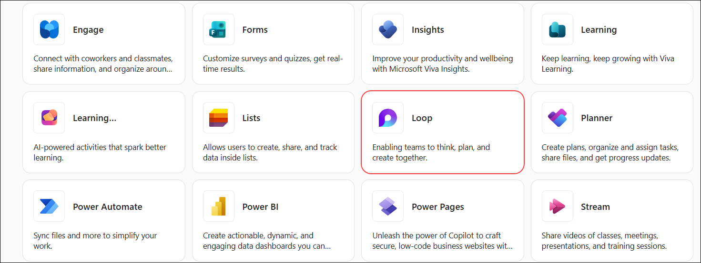
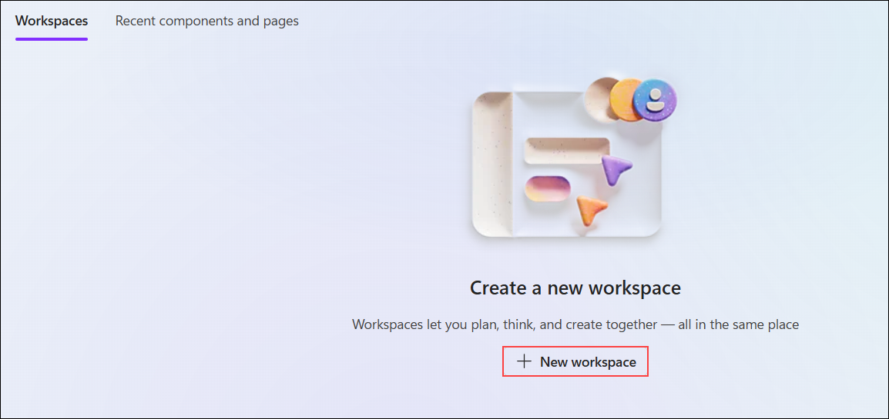
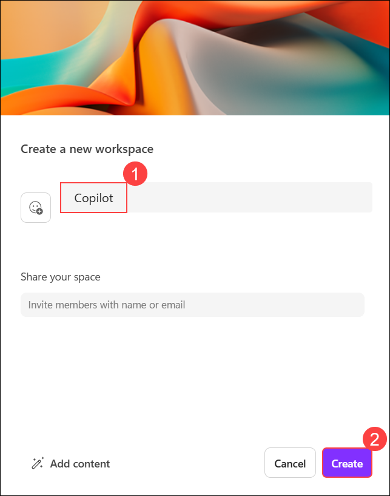
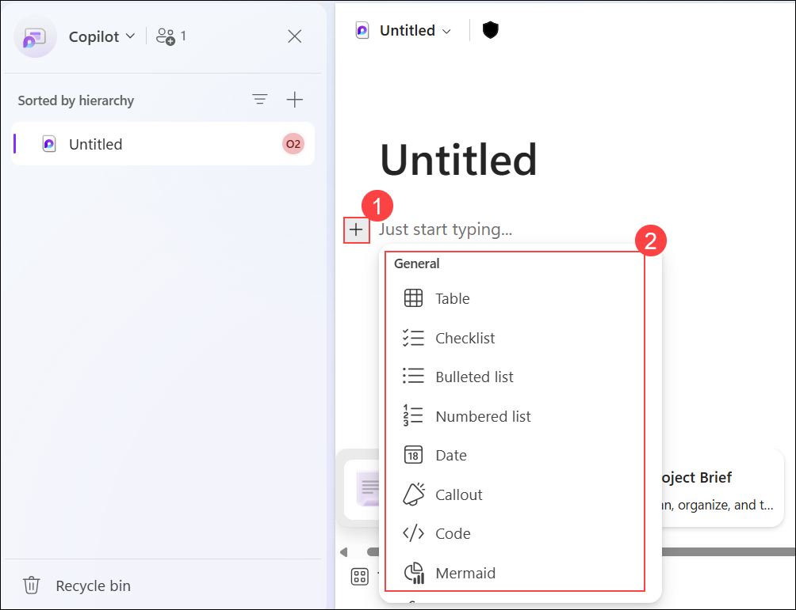
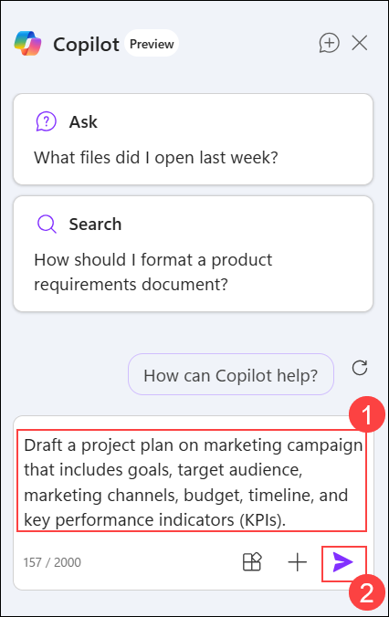
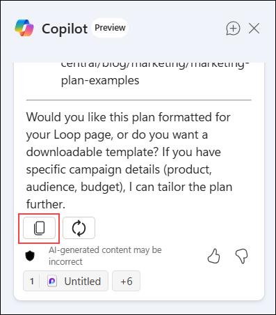
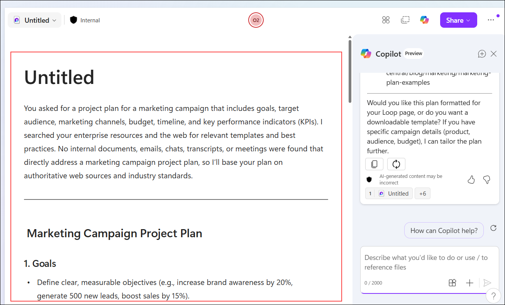
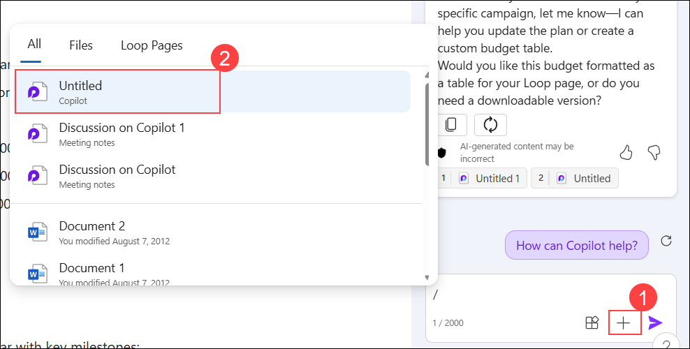
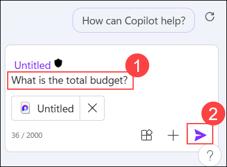
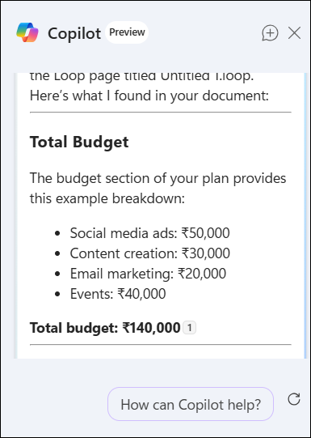

# Exercise 3.6: Using Microsoft 365 Copilot in Loop

In this exercise, you will learn how to use Microsoft 365 Copilot in Loop to enhance team collaboration and content creation. Copilot assists with drafting, brainstorming, and refining ideas in a shared workspace, making it easier to plan projects, develop content, and generate creative solutions. You will practice creating and updating workspaces, refining generated content, and using Copilot to streamline team efforts.

## Overview

**Microsoft Copilot** is a chatbot developed by Microsoft. **Microsoft Copilot for Microsoft 365** combines the power of large language models (LLMs) with your organization’s data all in the flow of work to turn your words into one of the most powerful productivity tools on the planet.

**Copilot** is designed to benefit everyone in an organization. From leaders to IT professional managers, Copilot offers features that streamline tasks, automate workflows, and enhance collaboration. Its adaptability means that it can be customized to meet the unique needs of any organization. The ability to extend its capabilities through plugins makes it a continually evolving asset that can adapt to the ever-changing landscape of business needs.

It works alongside popular **Microsoft 365** apps such as Word, Excel, PowerPoint, Outlook, Teams, and more. **Microsoft 365 Copilot** provides real-time intelligent assistance, enabling users to enhance their creativity, productivity, and skills.

**Copilot for Microsoft 365 in Loop** transforms your team’s co-creation and collaboration experience to help you plan, brainstorm, and create using AI-powered contextual suggestions. When you start or update a shared workspace, Copilot can assist you when you need inspiration or want help tackling a blank page. Pick from a set of prompts or add your own. As you and your teammates work, you can go back to earlier prompts, add language to refine the output, and edit the generated responses for better, personalized results.

To use **Copilot in Loop**, follow the below steps:

1. Navigate back to **Microsoft 365** tab.

   ```
   https://m365.cloud.microsoft/
   ```

1. From the Microsoft 365 home page, select **Apps (1)**, and then choose **More apps (2)**.

   

1. From the **All apps** page, select **Loop** to open the Microsoft Loop application.

   

1. On the **Microsoft Loop** welcome page, select **Get Started** to begin using Loop.

   

1. On the **Workspaces** page, select **New workspace** to create a new workspace.

   

1. In the **Create a new workspace** pane, enter **Copilot (1)** as the workspace name, and then select **Create (2)**.

   

1. In the workspace page, select the **+ (1)** icon to view the available content options **(2)**.

   

1. In the top-right corner of the workspace, select the **Copilot** icon to open Copilot in Loop.

   

1. In the **Copilot** pane, enter the following prompt **(1)** and select **Send (2)**.

   ```
   Draft a project plan on marketing campaign that includes goals, target audience, marketing channels, budget, timeline, and key performance indicators (KPIs).
   ```

   

1. Review the content generated by **Copilot**, and then select **Copy** to copy the generated response.

   

1. Paste the copied content into the blank **Loop** page to add the generated project plan.

   

   > **Note:** The **Copilot generate** feature is currently limited in Loop, and Copilot cannot directly insert content into the page. You must copy the generated response from the Copilot pane and paste it manually into the workspace.

1. In the **Copilot** pane, select the **Add (1)** icon, and then choose the **Untitled** page **(2)** to reference it.

   

1. In the **Copilot** prompt box, enter **What is the total budget? (1)** and select **Send (2)** to ask Copilot about the referenced page.

   

1. Review the response generated by **Copilot**, which displays the **Total Budget** extracted from the Loop page content.

   

## Try Out Yourself

You can also try out your own scenarios and examples to analyse the functioning of Copilot. **Copilot** offers suggested prompts you can choose, or you can type your own. To stay inspired and in your flow, **Copilot** can generate additional ideas for you.

   You will find 4 options to start with:

   - **Create:** Select **Create** if you want Copilot to help you start new content and provide a first draft of a value proposition or an outline for a presentation or marketing plan.

      Suppose you want to create a marketing plan for a product launch. Use the **Create** prompt and include some refiners that contain more details about your product, desired channels, and length. Encourage your team members to add their own input and any additional refiners that they think might help with the end-result.

      **Example prompts include:**

      ```
      Draft a mission statement for Contoso Ltd., an IT Consultancy company.
      ```
      ```
      Draft a work ticket for an app that isn't responding when people try to zoom in.
      ```
      ```
      Draft an agenda for a meeting about creating a machine learning solution to analyse customer's behaviour and mood.
      ```

   - **Brainstorm:** Choose **Brainstorm** to start a brainstorming session with **Copilot**. You can add some refiners to provide a better fit for your specific product, and edit generated names down to the ones you think are strong.

      **Example prompts include:**

      ```
      Brainstorm strategies to attract new customers using social media.
      ```
      ```
      Brainstorm ways to boost team morale.
      ```
      ```
      Brainstorm outstanding titles for an award function for the organisation to honour best employees in different fields.
      ```

   - **Blueprint:** Select the **Blueprint** prompt to let **Copilot** quickly offer information about general best practices to help you be successful. You can add refining information and edit the content inline to make the results more contextual to your event. Ask Copilot for a structured output (e.g. ask for them as bullet) and use the results and the Loop page as a set of actions to work through with your team.

      **Example prompts include:**

      ```
      Blueprint steps for a product launch.
      ```
      ```
      Blueprint how to conduct a sales meeting with a potential client.
      ```
      ```
      Blueprint plans for a conference for marketing professionals in technology.
      ```

   - **Describe:** The **Describe** prompt will ask Copilot to describe a concept in the way that will make it easier for you to understand.

      **Example prompts include:**

      ```
      Describe the importance of two-factor authentication to an employee.
      ```
      ```
      Describe how technology effects the brain in the style of a psychology professor.
      ```
      ```
      Describe how to prepare for a job interview for the role of AI Developer for Contoso Ltd., an IT Consultancy.
      ```

## Conclusion

In conclusion, **Copilot** is a powerful AI tool designed to automate tasks, enhance collaboration, and streamline workflows across various Microsoft 365 apps, including Loop. It helps in co-creating and planning by offering AI-powered contextual suggestions, making it easier to start or update a shared workspace. It aids in creating new content, brainstorming ideas, providing blueprints for best practices, or describing concepts in an easily understandable manner. Thus, **Microsoft 365 Copilot in Loop** is an invaluable tool for any organization, enhancing productivity and creativity while fostering effective team collaboration. Its intelligent assistance capabilities make it a continually evolving asset that can adapt to an organization's ever-changing needs.

## Summary

In this exercise, you explored how Microsoft 365 Copilot in Loop enhances team collaboration by providing AI-powered suggestions for drafting, brainstorming, and refining content. Copilot helps automate the creation of project plans, marketing strategies, and more by generating initial drafts and allowing for iterative refinement. This tool facilitates effective teamwork and creative processes, making it easier to manage and develop content in a shared workspace. Microsoft 365 Copilot in Loop is a valuable asset for improving productivity and collaboration within any organization.
