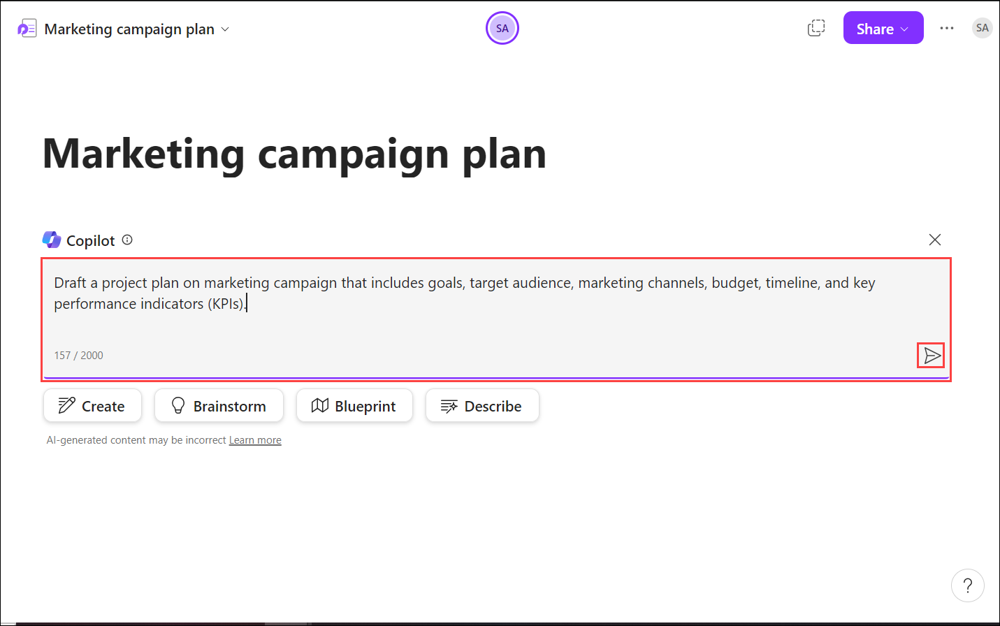

# Exercise 3.6: Using Microsoft 365 Copilot in Loop

## Introduction

**Microsoft Copilot** is a chatbot developed by Microsoft. **Microsoft Copilot for Microsoft 365** combines the power of large language models (LLMs) with your organization’s data all in the flow of work to turn your words into one of the most powerful productivity tools on the planet.

**Copilot** is designed to benefit everyone in an organization. From leaders to IT professional managers, Copilot offers features that streamline tasks, automate workflows, and enhance collaboration. Its adaptability means that it can be customized to meet the unique needs of any organization. The ability to extend its capabilities through plugins makes it a continually evolving asset that can adapt to the ever-changing landscape of business needs.

It works alongside popular **Microsoft 365** apps such as Word, Excel, PowerPoint, Outlook, Teams, and more. **Microsoft 365 Copilot** provides real-time intelligent assistance, enabling users to enhance their creativity, productivity, and skills.

**Copilot for Microsoft 365 in Loop** transforms your team’s co-creation and collaboration experience to help you plan, brainstorm, and create using AI-powered contextual suggestions. When you start or update a shared workspace, Copilot can assist you when you need inspiration or want help tackling a blank page. Pick from a set of prompts or add your own. As you and your teammates work, you can go back to earlier prompts, add language to refine the output, and edit the generated responses for better, personalized results.

To use **Copilot in Loop**, follow the below steps:

1. Navigate to the Environment details page and click on it. You will find M365 Copilot User Details tab. Click on the tab and copy the Username | Password provided there.

   

1. Navigate to `https://www.office.com` and sign in using **CloudLabs provided credentials**.

   

1. Select **Apps** from the left pane and search for **Loop** in the search bar.

   

   

1. Select **+** icon to create a new workspace.

   

1. Provide a name to your workspace under the **Name** column and select **Continue**. Your workspace will open with a blank page.

   

   

1. Provide a heading to your page and in body section, type **"/"** and select **Draft page content** from the drop-down menu.

   

1. The Copilot prompt-box will appear where you can give prompts to let Copilot do the things for you. For instance, you can provide the prompt - `Draft a project plan on marketing campaign that includes goals, target audience, marketing channels, budget, timeline, and key performance indicators (KPIs).`  to create a project plan for you with the necessary details.

   

1. You will get the results on the page. If the results are not exactly what you are looking for, you can refine the results by using the box immediately below the response. Change the tone, format, or ask for a more specific subset of ideas.

   

   Let's say Copilot offers a result that includes a bulleted list that you don't want. You can remove them, add a few of your own, and even ask Copilot to convert the bulleted list into a table. 

>**Note:** When crafting your prompts, provide context, be specific about what you want and use common language. With **Copilot**, you are always in control and if it doesn’t give you the right response the first time, revise and refine your prompts, then try again. **Remember that** AI generated content may be sensitive or factually incorrect. Be sure to verify the information, its sources, and use your judgment.

## Try Out Yourself

You can also try out your own scenarios and examples to analyse the functioning of Copilot. **Copilot** offers suggested prompts you can choose, or you can type your own. To stay inspired and in your flow, **Copilot** can generate additional ideas for you.

   You will find 4 options to start with:

   - **Create:** Select **Create** if you want Copilot to help you start new content and provide a first draft of a value proposition or an outline for a presentation or marketing plan.

      Suppose you want to create a marketing plan for a product launch. Use the **Create** prompt and include some refiners that contain more details about your product, desired channels, and length. Encourage your team members to add their own input and any additional refiners that they think might help with the end-result.

      **Example prompts include:**

      ```
      Draft a mission statement for Contoso Ltd., an IT Consultancy company.
      ```
      ```
      Draft a work ticket for an app that isn't responding when people try to zoom in.
      ```
      ```
      Draft an agenda for a meeting about creating a machine learning solution to analyse customer's behaviour and mood.
      ```

   - **Brainstorm:** Choose **Brainstorm** to start a brainstorming session with **Copilot**. You can add some refiners to provide a better fit for your specific product, and edit generated names down to the ones you think are strong.

      **Example prompts include:**

      ```
      Brainstorm strategies to attract new customers using social media.
      ```
      ```
      Brainstorm ways to boost team morale.
      ```
      ```
      Brainstorm outstanding titles for an award function for the organisation to honour best employees in different fields.
      ```

   - **Blueprint:** Select the **Blueprint** prompt to let **Copilot** quickly offer information about general best practices to help you be successful. You can add refining information and edit the content inline to make the results more contextual to your event. Ask Copilot for a structured output (e.g. ask for them as bullet) and use the results and the Loop page as a set of actions to work through with your team.

      **Example prompts include:**

      ```
      Blueprint steps for a product launch.
      ```
      ```
      Blueprint how to conduct a sales meeting with a potential client.
      ```
      ```
      Blueprint plans for a conference for marketing professionals in technology.
      ```

   - **Describe:** The **Describe** prompt will ask Copilot to describe a concept in the way that will make it easier for you to understand.

      **Example prompts include:**

      ```
      Describe the importance of two-factor authentication to an employee.
      ```
      ```
      Describe how technology effects the brain in the style of a psychology professor.
      ```
      ```
      Describe how to prepare for a job interview for the role of AI Developer for Contoso Ltd., an IT Consultancy.
      ```

## Conclusion

In conclusion, **Copilot** is a powerful AI tool designed to automate tasks, enhance collaboration, and streamline workflows across various Microsoft 365 apps, including Loop. It helps in co-creating and planning by offering AI-powered contextual suggestions, making it easier to start or update a shared workspace. It aids in creating new content, brainstorming ideas, providing blueprints for best practices, or describing concepts in an easily understandable manner. Thus, **Microsoft 365 Copilot in Loop** is an invaluable tool for any organization, enhancing productivity and creativity while fostering effective team collaboration. Its intelligent assistance capabilities make it a continually evolving asset that can adapt to an organization's ever-changing needs.
