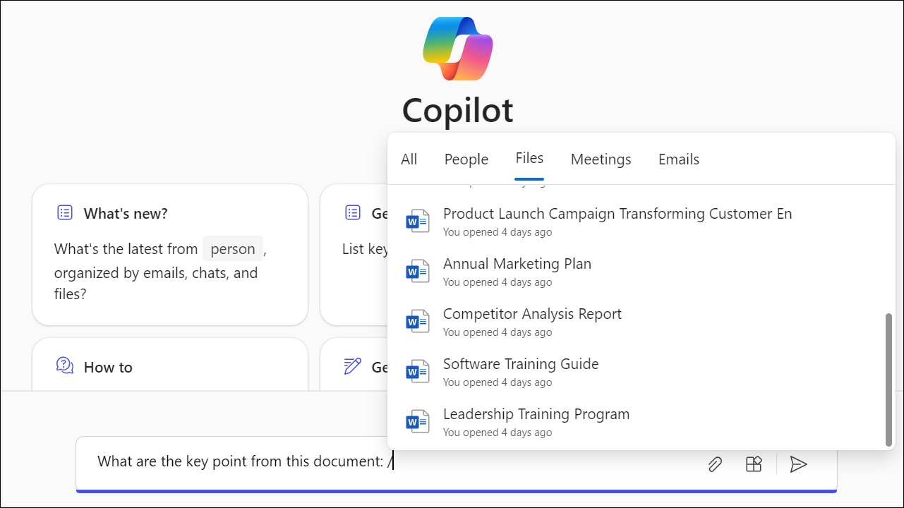
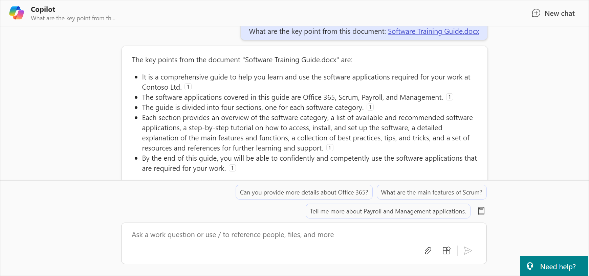

# Exercise 3.7: Using Microsoft 365 Copilot with M365 Chat to Access Microsoft Graph Data

In this exercise, you will learn how to use Microsoft 365 Copilot with M365 Chat to access and interact with Microsoft Graph data. Copilot’s integration with M365 Chat enables users to make data-driven requests and receive tailored responses based on organizational knowledge and connected services. This exercise will guide you through querying data, summarizing documents, and automating tasks within your Microsoft 365 environment.

## Overview

**Microsoft Copilot** is a chatbot developed by Microsoft. **Microsoft Copilot for Microsoft 365** combines the power of large language models (LLMs) with your organization’s data all in the flow of work to turn your words into one of the most powerful productivity tools on the planet.

**Copilot** is designed to benefit everyone in an organization. From leaders to IT professional managers, Copilot offers features that streamline tasks, automate workflows, and enhance collaboration. Its adaptability means that it can be customized to meet the unique needs of any organization. The ability to extend its capabilities through plugins makes it a continually evolving asset that can adapt to the ever-changing landscape of business needs.

It works alongside popular **Microsoft 365** apps such as Word, Excel, PowerPoint, Outlook, Teams, and more. **Microsoft 365 Copilot** provides real-time intelligent assistance, enabling users to enhance their creativity, productivity, and skills.

**M365 Chat** enables users to engage in work-related conversations within SharePoint sites, lists, and libraries. Chats within these collaboration spaces, powered by Microsoft 365 Copilot's AI capabilities, can understand user intents and questions and provide personalized responses to your organization's Microsoft 365 data via Microsoft Graph.  

For example, within a SharePoint site dedicated to a specific project, users can use natural language in M365 Chat to ask questions or make requests such as:

"Copilot, show me my most recent draft documents related to this customer project"

"Copilot, who has presented proposals to our largest customer in the last 6 months?"  


Copilot can then query connected services such as SharePoint, Exchange, Teams, and more via Microsoft.

"Copilot, set up a meeting for the project team next Wednesday at 2 pm to discuss our timeline."

Copilot can then query connected services such as SharePoint, Exchange, Teams, and others via Microsoft Graph to provide answers and recommendations tailored to the user's specific M365 dataset and context. This includes surfacing relevant documents, conversations, employee insights, and calendar availability.


**Key advantages of this integration include:**

- Access to organizational knowledge through M365.

- Time savings with automated assistance

- Increased team collaboration and sharing.

By incorporating Copilot's intelligence into the collaboration flow via chat in M365, users can more easily gather information to make decisions and coordinate teamwork efficiently.

To use **M365 Chat**, follow the below steps:

1. Navigate to the Environment details page and click on it. You will find M365 Copilot User Details tab. Click on the tab and copy the Username | Password provided there.

   

1. Navigate to the home page of the `https://www.office.com/login?`, click on **Copilot** icon to open copilot chat application.

   

1. Say **Hi** or **Hello** to initiate a conversation with Copilot.

1. Ask Copilot - **What are the key points from this document:**. Then provide **/** and goto **Files** to select a file, say "Software Training Guide".

   


1. This response will be presented as below:

   

   >**Note:** At rare times, the **M365 Copilot Chat** reauthenticates itelf, and during that some issues may arise, causing the **M365 Copilot Chat** to be unresponsive. Whenever that happens, make sure to close the browser, reopen, clear all the cache and cookies, and sign in again. Ensure closing all the incognito tabs as well when trying in Incognito/Private mode.

## Try Out Yourself

You can also try out your own scenarios and examples to analyse the functioning of Copilot. Here are some of the example prompts you can take help of to explore more on **Microsoft 365 Chat**. Besides these, you can also create your own prompts and interact with Copilot.

```
Summarize this document: /(document)
```
```
Draft FAQs based on this file: /(file)
```
```
List ideas for a fun remote team even for Contoso Ltd.
```

## Conclusion

In conclusion, the integration of Microsoft 365 Copilot with M365 Chat revolutionizes how users access and interact with organizational data. By seamlessly embedding Copilot's AI capabilities into the collaboration flow, users can effortlessly retrieve information, automate tasks, and enhance teamwork efficiency. This powerful integration not only saves time but also fosters increased collaboration and knowledge sharing across teams, ultimately driving productivity and innovation within the organization.

## Summary

In this exercise, you explored the powerful integration of Microsoft 365 Copilot with M365 Chat. By leveraging Copilot’s AI capabilities, you learned to access organizational data, automate tasks, and enhance team collaboration. Copilot allows you to query documents, draft responses, and manage tasks efficiently through natural language interactions. This integration significantly improves how users access and utilize organizational knowledge, fostering better teamwork and productivity.
