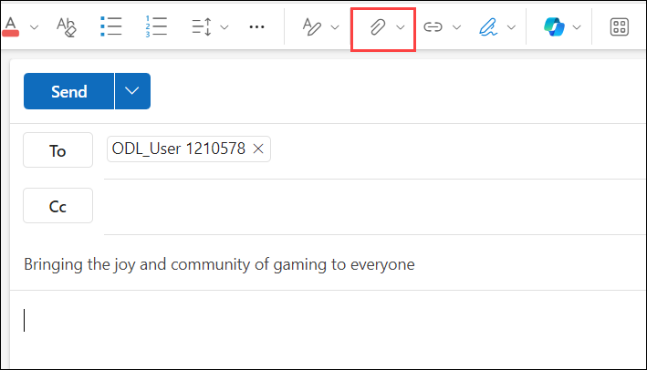
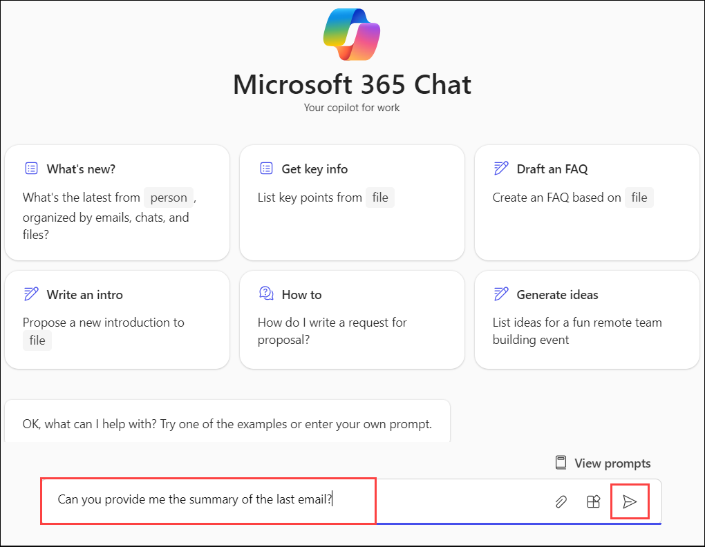

# Exercise 4.7: Using Microsoft 365 Copilot with M365 Chat to Access Microsoft Graph Data

## Introduction

**Microsoft Copilot** is a chatbot developed by Microsoft. **Microsoft Copilot for Microsoft 365** combines the power of large language models (LLMs) with your organization’s data all in the flow of work to turn your words into one of the most powerful productivity tools on the planet.

**Copilot** is designed to benefit everyone in an organization. From leaders to IT professional managers, Copilot offers features that streamline tasks, automate workflows, and enhance collaboration. Its adaptability means that it can be customized to meet the unique needs of any organization. The ability to extend its capabilities through plugins makes it a continually evolving asset that can adapt to the ever-changing landscape of business needs.

It works alongside popular **Microsoft 365** apps such as Word, Excel, PowerPoint, Outlook, Teams, and more. **Microsoft 365 Copilot** provides real-time intelligent assistance, enabling users to enhance their creativity, productivity, and skills.

**M365 Chat** enables users to engage in work-related conversations within SharePoint sites, lists, and libraries. Chats within these collaboration spaces, powered by Microsoft 365 Copilot's AI capabilities, can understand user intents and questions and provide personalized responses to your organization's Microsoft 365 data via Microsoft Graph.  

For example, within a SharePoint site dedicated to a specific project, users can use natural language in M365 Chat to ask questions or make requests such as:

"Copilot, show me my most recent draft documents related to this customer project"

"Copilot, who has presented proposals to our largest customer in the last 6 months?"  

Copilot can then query connected services such as SharePoint, Exchange, Teams, and more via Microsoft.

"Copilot, set up a meeting for the project team next Wednesday at 2 pm to discuss our timeline."

Copilot can then query connected services such as SharePoint, Exchange, Teams, and others via Microsoft Graph to provide answers and recommendations tailored to the user's specific M365 dataset and context. This includes surfacing relevant documents, conversations, employee insights, and calendar availability.

**Key advantages of this integration include:**

- Access to organizational knowledge through M365.

- Time savings with automated assistance

- Increased team collaboration and sharing.

By incorporating Copilot's intelligence into the collaboration flow via chat in M365, users can more easily gather information to make decisions and coordinate teamwork efficiently.

To use **M365 Chat**, follow the below steps:

1. Navigate to the [Microsoft 365](https://www.office.com/login?), click on **Outlook** icon to open Outlook web application.

   

1. Compose a **New email** to yourself or another person.

   

   - **To:** <inject key="AzureAdUserEmail"></inject>

   - **Subject:** Bringing the joy and community of gaming to everyone

   - On the **textbox** field, click on the **Insert** icon on the top bar and navigate to the **.........**, select, and open it.

     

   - Click on **Send** it.

     

1. Navigate back to the home page of the [Microsoft 365](https://www.office.com/login?), click on **Copilot** icon to open copilot chat application.

   

1. Say **Hi** or **Hello** to initiate a conversation with Copilot.

1. Ask Copilot - **Can you provide me with the summary of the last email?**.

   

1. This will look like the following:

   
