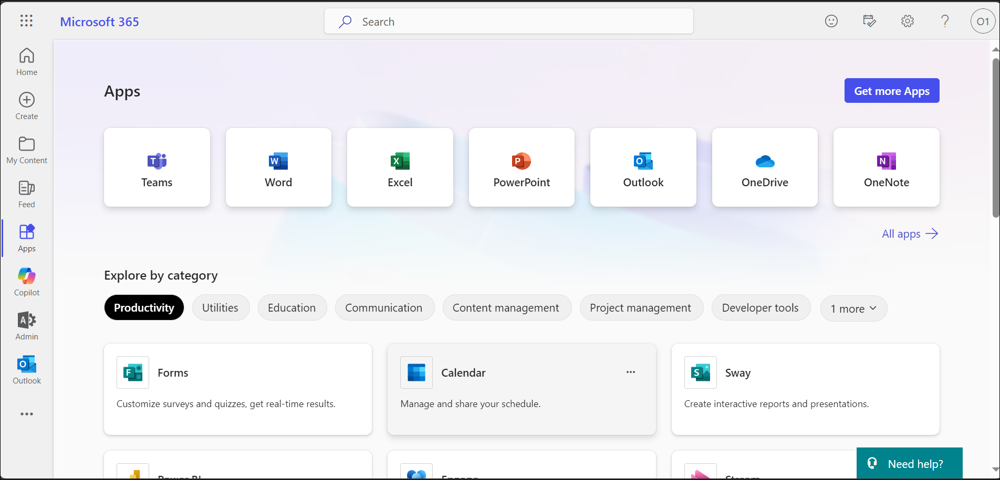
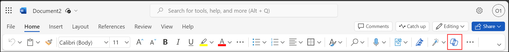
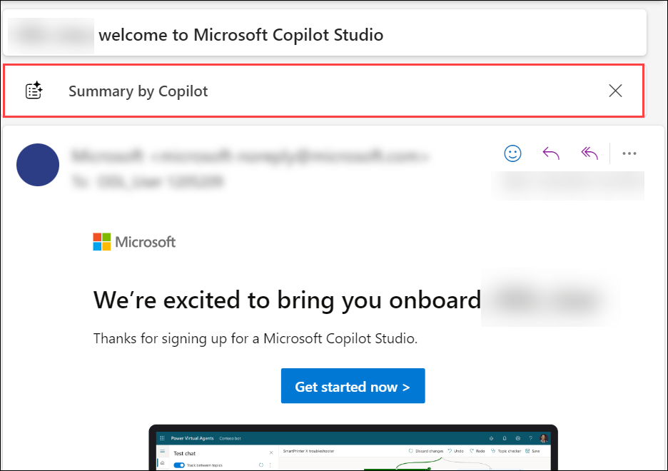
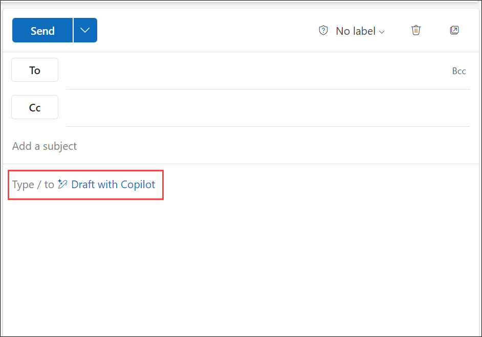
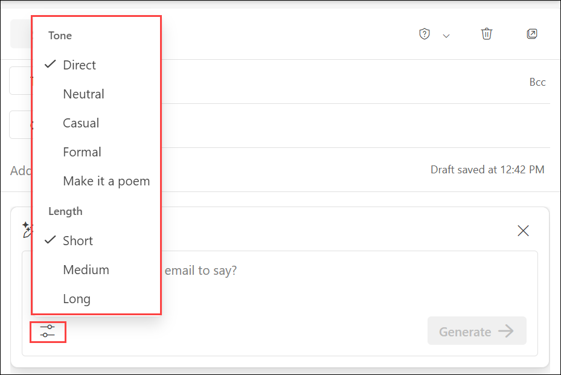
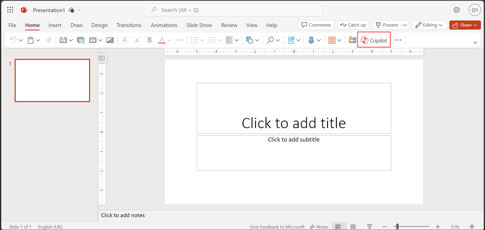
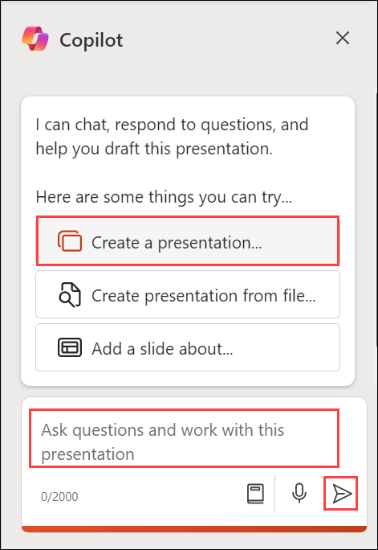
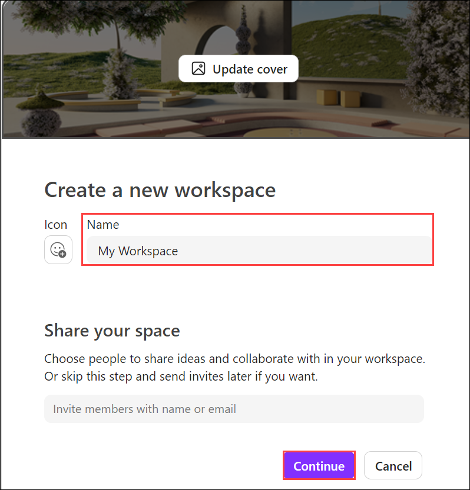
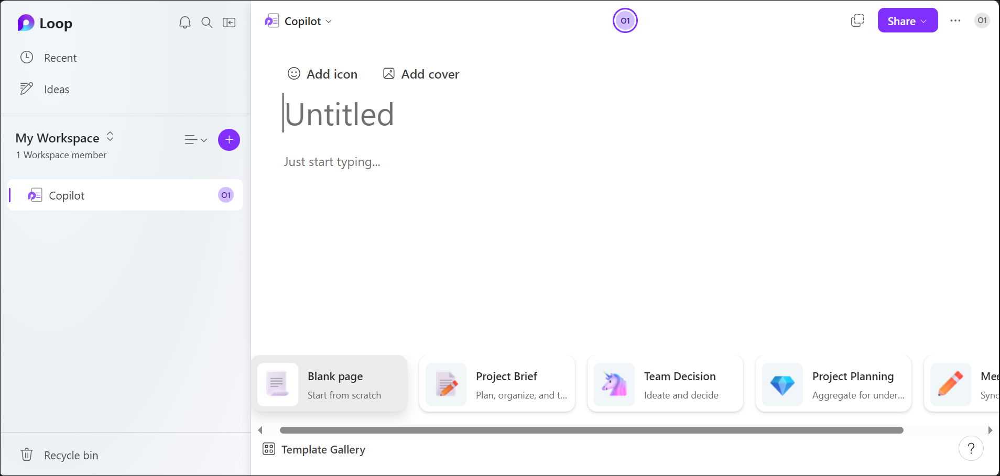

# Exercise 04: Using Microsoft 365 Copilot

## Overview

**Microsoft Copilot** is a chatbot developed by Microsoft. **Microsoft Copilot for Microsoft 365** combines the power of large language models (LLMs) with your organization’s data all in the flow of work to turn your words into one of the most powerful productivity tools on the planet.

**Copilot** is designed to benefit everyone in an organization. From leaders to IT professional managers, Copilot offers features that streamline tasks, automate workflows, and enhance collaboration. Its adaptability means that it can be customized to meet the unique needs of any organization. The ability to extend its capabilities through plugins makes it a continually evolving asset that can adapt to the ever-changing landscape of business needs.

It works alongside popular **Microsoft 365** apps such as Word, Excel, PowerPoint, Outlook, Teams, and more. **Microsoft 365 Copilot** provides real-time intelligent assistance, enabling users to enhance their creativity, productivity, and skills.

## Task 1: Downloading and Using Copilot in Office Apps:

Here is how you can use the transformative power of Microsoft Copilot in different Microsoft 365 apps like Word, Outlook, PowerPoint, Excel and Teams.

### Task 1.1: Using Copilot in Word:

In Word, **Copilot for Microsoft 365** transforms the process of document creation and refinement, allowing you to produce compelling content with ease. Copilot helps draft from scratch, enhance the existing text, and capture the essence of lengthy articles. With Copilot, you can initiate a document using brief prompts, seamlessly incorporate resources from across Microsoft 365, and readily adjust both the tone and conciseness of your writing.

#### **Content Generation in Word:**

One of the goals of Copilot in Word is to simplify the creation and modification of documents. It uses artificial intelligence to understand your writing goals and generate relevant and original content for you. You can use Copilot in Word to:

- **Write faster and easier:** You can simply type a few words or sentences to describe what you want to write about, and Copilot in Word will generate a paragraph or more of text for you. You can also edit, refine, or expand the generated text as you wish.

- **Write with confidence:** You can rely on Copilot in Word to produce accurate and coherent content that matches your tone and style. You can also use the built-in proofreading and editing tools to check your spelling, grammar, and readability.

- **Write with creativity:** You can explore different ways of expressing your ideas and arguments with Copilot in Word. You can also use the suggested images, icons, and charts to add visual appeal and clarity to your document.

To use **Copilot in Word**, follow the below steps:

1. Navigate to `https://www.office.com/` and sign in using **CloudLabs provided credentials**.

   

1. Select **Apps** from the left pane and select **Word** from the apps list.

   

1. Open a **Word** document and you will find the prompt **Draft with Copilot**. Provide any input which you want the Copilot to execute and click on **Generate**.

   

    Examples of sample inputs include:
    ```
    Write an essay about baseball.
    ```
    ```
    Give detailed instructions, including outlines, notes, or file references on mechatronics.
    ```
    ```
    List the ingredients for a cheesecake in a bulleted format.
    ```

1. It will create a document on that topic of interest with its transformative and innovative capabilities. Choose **Keep it** if you are satisfied with the content, else you can also **Regenerate** or **Discard** it.

   

    >**Note:** You can also choose the **"Copilot"** icon present on the top of the page and utilise the service.

    >

1. You can also link an external Word document present in your **OneDrive account** and generate output based on that by choosing **Reference your content** and selecting the preferred document.

   

    Here are some of the prompts you can take help of to explore more on Copilot in Word on existing documents: 

    ```
    What are the key points in this doc?
    ```
    ```
    Summarize this document.
    ```
    ```
    Is there a call to action?
    ```

### Task 1.2: Using Copilot in Outlook

In Outlook, **Copilot for Microsoft 365** makes managing emails easier, letting you focus more on effective communication. It helps you understand long email threads, see different viewpoints, and spot unanswered questions. With Copilot, you can quickly reply using prompts or turn short notes into full emails using resources from Microsoft 365. You can also easily adjust your message's tone and length.

#### **Summarizating email threads in Outlook:**

**Copilot in Outlook** introduces the "Thread Summarize" feature, designed to simplify your email management. With this feature, Outlook either offers concise bullet points or generates an entire summary of the chosen email thread, displayed above the thread in the reading pane. This design makes it easier to grasp the main points of extended email conversations. Additionally, the summary includes links to specific responses, allowing for quick access to different parts of the thread.

#### **Drafting Emails in Outlook**

**Copilot in Outlook** also introduces the draft email feature, which helps you draft emails faster. This feature uses natural language processing to help you write emails by offering suggestions based on the context of your message. Copilot in Outlook can also help you write emails from scratch, using the information you provide. For example, you can start a new email by providing a topic and a few bullet points. Copilot in Outlook then uses this information to draft a full email for you.

To use **Copilot in Outlook**, follow the below steps:

1. Navigate to `https://www.office.com/` and sign in using **CloudLabs provided credentials**.

   

1. Select **Apps** from the left pane and select **Outlook** from the apps list.

   

1. Open your **Outlook** and click on any of the emails. Choose **Summary by Copilot** to generate an entire summary of the chosen email thread, displayed above the thread in the reading pane.

   

1. You can also generate a complete email using **Copilot**. To do this, click on **New Email** and choose **Draft with Copilot** in the body. Provide an input and click on **Generate**.

   

    >**Note:** You can also choose the length and tone of your output by clicking on the **Generate options** sign present on the bottom left of the box.

    >

### Task 1.3: Using Copilot in PowerPoint

In PowerPoint, **Copilot for Microsoft 365** acts as your presentation assistant, turning your concepts into impactful slides. With Copilot, you can effortlessly convert written documents into presentation decks, complete with speaker notes and references. Beyond creation, it also offers tools to streamline long presentations and uses intuitive commands to refine layouts, adjust text formatting, and synchronize animations.

#### **Crafting Presentations in PowerPoint**

**Copilot in PowerPoint** transforms the way you craft your slides. When you launch a blank PowerPoint document, it stands ready to shape your ideas into a structured presentation, initiating the creation process based on your directives and incorporating a tailored narrative to craft a compelling story. Copilot bridges the gap between idea and visual representation with ease, amplifying your key messages to resonate with your audience.

#### **Creating Presentations from Word documents**

Copilot in PowerPoint simplifies the transformation of existing files, streamlining the conversion of your documents into vivid visual presentations effortlessly. With this capability, you can easily transform a Word document into a structured PowerPoint presentation, ensuring your content gets the visual representation it deserves. This process not only streamlines your workflow but also brings a new dimension to your written content.

To use **Copilot in PowerPoint**, follow the below steps:

1. Navigate to `https://www.office.com/` and sign in using **CloudLabs provided credentials**.

   

1. Select **Apps** from the left pane and select **PowerPoint** from the apps list.

   

1. Open your **PowerPoint** and select **Copilot** on top of the screen.

   

1. Click **Create a presentation...** and provide your preferred topic and related information to draft your presentation.

   

1. Alternatively, you can also choose **Create a presentation from file...** and attach a Word document as a reference and craft a presentation based on it.

   

Here are some of the prompts you can take help of to explore more on Copilot in PowerPoint:

```
Create a presentation on outdoor activities. Include sections on Hiking, Camping, Water Sports, and Biking
```
```
Add a slide about ______(Your preferred topic).
```
```
Add an image of a lakeside campfire.
```

### Task 1.4: Using Copilot in Excel

In Excel, **Copilot for Microsoft 365** is your data analysis companion, making complex datasets easy to understand. Copilot can help you find patterns, explore 'what-if' scenarios, get new formula suggestions, explore data without changing it, spot trends, create visuals, or get recommendations.

#### **Analyzing Data in Excel**

With **Copilot in Excel**, analyzing business data becomes a seamless experience. As soon as you input your datasets into Excel, Copilot stands ready to transform these complex figures into comprehensible insights.

Beyond standard data analysis, Copilot crafts a coherent narrative from the patterns it identifies, ensuring a smooth transition from raw data to meaningful understanding. This process allows your key findings to become powerful drivers in making informed business decisions.

#### **Transforming Data in Excel**

With **Copilot in Excel**, taking control of your data visualization and management is straightforward and intuitive. Copilot empowers you to not only clean and organize your data but also to enhance it through various stylistic and structural modifications. From applying styles, fonts, and colors to extending your data’s capabilities through pivot tables and graphs, Copilot helps in every step. Easily command Copilot to create new columns, define conditions for data representation, and formulate graphs for a comprehensive view.

To use **Copilot in Excel**, follow the below steps:

1. Navigate to `https://www.office.com/` and sign in using **CloudLabs provided credentials**.

   

1. Select **Apps** from the left pane and select **Excel** from the apps list.

   

1. Open an **Excel** workbook and choose **Copilot** on top of the screen.

   

1. Provide your input. You can choose prompts like Adding a formula column, highlighting data, sorting and filtering the data, analysing the data and clicking on the **Send** icon.

   

Here are some of the prompts you can take help of to explore more on Copilot in Excel:

```
Analyze this quarter's business results and summarize three key trends.
```
```
Sort data by launch date.
```
```
Change the table style to light gray,
```
```
Create a pivot table where the row is category, the column is supplier, and the values represent the sum of the minimum reorder quantity.
```

### Task 1.5: Using Copilot in Teams

In Teams, **Copilot for Microsoft 365** elevates the efficiency of teamwork, facilitating seamless conversations and more productive meetings. It helps keep you updated with discussions, summarizing key actions, and organizing focal points of conversations to promote a streamlined workflow within your team.

#### **Enhancing Teams Chat Experience**

In chat threads, **Copilot in Teams** can help users get up to speed on conversations by quickly reviewing the main points, action items, and decisions without having to scroll through long threads. Users can ask Copilot to generate a summary of the chat conversation over a recent time period they specify (Copilot provides prompts for the past day, seven days, or 30 days). Copilot can also draft an email to the meeting participants that summarizes the meeting and includes the action items. Overall, Copilot in Teams is a powerful tool that can help users stay organized and productive in their online meetings and conversations.

#### **Harness meeting insights**

**Copilot in Teams** furnishes you with a succinct summary of the missed discussions, empowering you to catch up swiftly. You can utilize the suggested prompts or craft your personalized questions to garner essential insights about the ongoing meeting context, enhancing your engagement and comprehension.

Copilot aids you in steering the conversation forward with confidence, suggesting questions that you can pose to the group, helping to facilitate a richer and more inclusive discussion. Its goal is to help summarize the key discussions and identify the next actionable steps. Doing so helps ensure that all meeting attendants are on the same page with the agreed-upon tasks.

To use **Copilot in Teams**, follow the below steps:

1. Navigate to `https://www.office.com/` and sign in using **CloudLabs provided credentials**.

   

1. Select **Apps** from the left pane and select **Teams** from the apps list.

   

1. Open **Teams** and go to any chat. You will find the **Copilot** icon on the bottom of the chatbox which will help you to rewrite a message or even select its tone and length.

    

    It can help you get up to speed on conversations by quickly reviewing the main points, action items, and decisions without having to scroll through long threads.

1. **During a meeting**, Copilot can summarize key discussion points—including who said what and where people are aligned or disagree—and suggest action items, all in real-time.

   

1. **After a meeting ends**, Select **Open Copilot** to see a summary of key points of discussion and identify agreed-upon next steps, including tasks assigned to specific people.

   Here are some of the prompts you can take help of to explore more on Copilot in Teams:

   - **During a meeting:**

      ```
      Where do we disagree on this topic? 
      ```
      ```
      What questions can I ask to move the meeting forward?
      ```
      ```
      Create a table with the ideas discussed and their pros and cons.
      ```
   - **After a meeting:**
      ```
      What questions were asked, answered, and unresolved?
      ```
      ```
      Summarize what people said, in a less technical way. 
      ```
      ```
      What was the mood of the meeting?  
      ```

### Task 1.6: Using Copilot in Loop

**Copilot for Microsoft 365 in Loop** transforms your team’s co-creation and collaboration experience to help you plan, brainstorm, and create using AI-powered contextual suggestions. When you start or update a shared workspace, Copilot can assist you when you need inspiration or want help tackling a blank page. Pick from a set of prompts or add your own. As you and your teammates work, you can go back to earlier prompts, add language to refine the output, and edit the generated responses for better, personalized results.

To use **Copilot in Loop**, follow the below steps:

1. Navigate to `https://www.office.com/` and sign in using **CloudLabs provided credentials**.

   

1. Select **Apps** from the left pane and scroll down to select **Loop** from the apps list.

   

1. Select **+** icon to create a new workspace.

   

1. Provide a name to your workspace under the **Name** column and select **Continue**. Your workspace will open with a blank page.

   

   

1. Provide a heading to your page and in body section, type **"/"** and select **Copilot** from the drop-down menu.

   

1. **Copilot** offers suggested prompts you can choose, or you can type your own. To stay inspired and in your flow, **Copilot** can generate additional ideas for you.

   You will find 4 options to start with:

   - **Create:** Select **Create** if you want Copilot to help you start new content and provide a first draft of a value proposition or an outline for a presentation or marketing plan.

      Suppose you want to create a marketing plan for a product launch. Use the **Create** prompt and include some refiners that contain more details about your product, desired channels, and length. Encourage your team members to add their own input and any additional refiners that they think might help with the end-result.

      **Example prompts include:**

      ```
      Draft a mission statement for a new space exploration company.
      ```
      ```
      Draft a work ticket for an app that isn't responding when people try to zoom in.
      ```
      ```
      Draft an agenda for a meeting about creating bikes lanes in a small town.
      ```

   - **Brainstorm:** Choose **Brainstorm** to start a brainstorming session with **Copilot**. You can add some refiners to provide a better fit for your specific product, and edit generated names down to the ones you think are strong.

      **Example prompts include:**

      ```
      Brainstorm strategies to attract new customers using social media.
      ```
      ```
      Brainstorm ways to boost team morale.
      ```
      ```
      Brainstorm character names for an animated movie about the life of dogs in the year 2035.
      ```

   - **Blueprint:** Select the **Blueprint** prompt to let **Copilot** quickly offer information about general best practices to help you be successful. You can add refining information and edit the content inline to make the results more contextual to your event. Ask Copilot for a structured output (e.g. ask for them as bullet) and use the results and the Loop page as a set of actions to work through with your team.

      **Example prompts include:**

      ```
      Blueprint steps for a product launch.
      ```
      ```
      Blueprint how to conduct a sales meeting with a potential client.
      ```
      ```
      Blueprint plans for a conference for marketing professionals in technology.
      ```

   - **Describe:** The **Describe** prompt will ask Copilot to describe a concept in the way that will make it easier for you to understand.

      **Example prompts include:**

      ```
      Describe the importance of two-factor authentication to a kid.
      ```
      ```
      Describe how meditation effects the brain in the style of a psychology professor.
      ```
      ```
      Describe how to prepare for a job interview.
      ```

   >**Note:** You can also type your own prompt in the text box and click **Send** to get the results.

1. You will get the results on the page. If the results are not exactly what you are looking for, you can refine the results by using the box immediately below the response. Change the tone, format, or ask for a more specific subset of ideas.

   

   Let's say Copilot offers a result that includes a bulleted list that you don't want. You can remove them, add a few of your own, and even ask Copilot to convert the bulleted list into a table. 

>**Note:** When crafting your prompts, provide context, be specific about what you want and use common language. With **Copilot**, you are always in control and if it doesn’t give you the right response the first time, revise and refine your prompts, then try again. **Remember that** AI generated content may be sensitive or factually incorrect. Be sure to verify the information, its sources, and use your judgment.


### Task 1.7: Using Microsoft 365 Copilot with M365 Chat to Access Microsoft Graph Data

**M365 Chat** enables users to engage in work-related conversations within SharePoint sites, lists, and libraries. Chats within these collaboration spaces, powered by Microsoft 365 Copilot's AI capabilities, can understand user intents and questions and provide personalized responses to your organization's Microsoft 365 data via Microsoft Graph.  

For example, within a SharePoint site dedicated to a specific project, users can use natural language in M365 Chat to ask questions or make requests such as:

"Copilot, show me my most recent draft documents related to this customer project"

"Copilot, who has presented proposals to our largest customer in the last 6 months?"  


Copilot can then query connected services such as SharePoint, Exchange, Teams, and more via Microsoft.

"Copilot, set up a meeting for the project team next Wednesday at 2 pm to discuss our timeline."

Copilot can then query connected services such as SharePoint, Exchange, Teams, and others via Microsoft Graph to provide answers and recommendations tailored to the user's specific M365 dataset and context. This includes surfacing relevant documents, conversations, employee insights, and calendar availability.


**Key advantages of this integration include:**

- Access to organizational knowledge through M365.

- Time savings with automated assistance

- Increased team collaboration and sharing.

By incorporating Copilot's intelligence into the collaboration flow via chat in M365, users can more easily gather information to make decisions and coordinate teamwork efficiently.

To use **M365 Chat**, follow the below steps:

1. Navigate to the [Microsoft 365](https://www.office.com/login?), click on **Outlook** icon to open Outlook web application.

   


1. Compose a **New email** to yourself or another person.

   

   - **To:** <inject key="AzureAdUserEmail"></inject>

   - **Subject:** Bringing the joy and community of gaming to everyone

   - On the **textbox** field, click on the **Insert** icon on the top bar and navigate to the **.........**, select, and open it.

     

   - Click on **Send** it.

     


1. Navigate back to the home page of the [Microsoft 365](https://www.office.com/login?), click on **Copilot** icon to open copilot chat application.

   

1. Say **Hi** or **Hello** to initiate a conversation with Copilot.

1. Ask Copilot - **Can you provide me with the summary of the last email?**.

   

1. This will look like the following:

   


