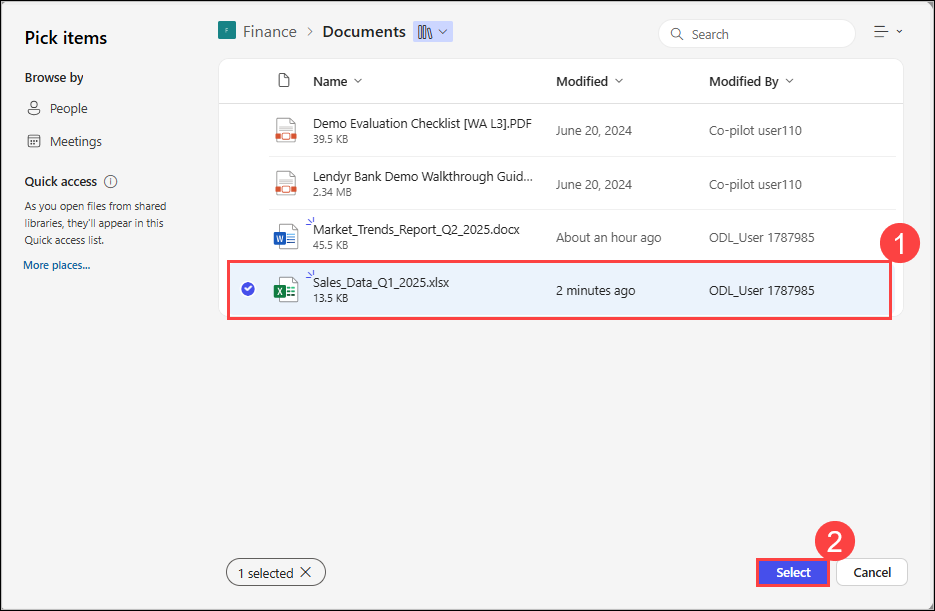
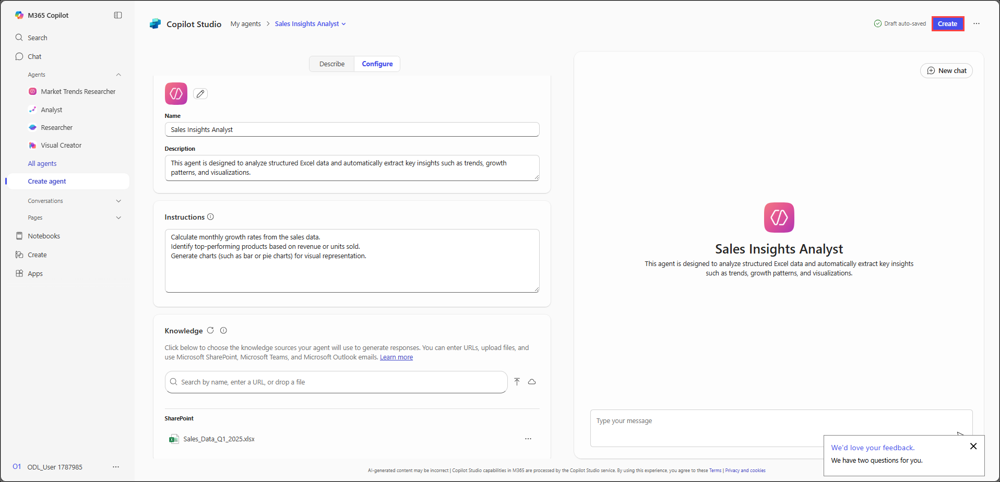

# Exercise 4: Overview of M365 Copilot App

### Estimated time: 30 minutes

## Overview:

In this exercise, we will explore the Copilot interface, understand the concept of reusable no-code agents, and create two powerful agents – Researcher and Analyst – without writing any code. These agents are designed to assist with tasks such as content summarization, document synthesis, data analysis, and insight generation, using data already available in your Microsoft environment.

## Objective: 

In this exercise, we will complete the following tasks

- Understand the M365 Copilot App interface and capabilities

- Learn about No-code agents in M365 Copilot

- Create and experiment with “Researcher” and “Analyst” No-code agents

- Perform basic tasks with each agent to see their use cases

### Task 1: Introduction to M365 Copilot App

Walk through of M365 Copilot:

1. Open your browser and go to: https://www.office.com.

1. Sign in with your Microsoft 365 account with the credentials below if required.

    **Email/Username:** <inject key="AzureAdUserEmail"></inject>
 
    **Password:** <inject key="AzureAdUserPassword"></inject>

1. Locate the Chat in the app launcher (waffle menu) or search bar.

   

### Task 2: Understanding No-Code Agents in Copilot

1. In the Copilot app, navigate to the Agents section (may also appear as “Custom Agents” or “Create Agent”).

1. There should be some agents already available.

    

1. Discuss use cases.

    - **Researcher Agent:** Synthesizes large volumes of information.

    - **Analyst Agent:** Performs calculations, summarizes data, and creates visual reports.

> **Notes:** You don’t need to code or script. The configuration is based on task type and data input. Mention security and data compliance through Microsoft 365’s boundaries

### Task 3: Creating a “Researcher” No-Code Agent

Build and test a Researcher agent that can summarize documents and compile findings.

1. Click **Create Agent**

    

1. Click on **Configure**

    - Give your agent a name: **Market Trends Researcher**

    - **Description:** This intelligent agent is designed to help users analyze documents and extract key insights — such as summaries, common themes, and trends — without needing to write any code or use custom logic.

    - **Instructions:** 
        - Summarize all documents into concise bullet points

        - Identify trends and common themes across the uploaded content

    - **Knowledge:**

        - Click on **Attach cloud files** button.
        
            
        
        - Click on **Finance** SharePoint site.

            
        
        - Select **Market_Trends_Report_Q2_2025.docx (1)** file and click **Select (2)**.

            

1. Leave all other settings as default and click on **Create**.

    

### Task 4: Creating a “Analyst” No-Code Agent

Build an Analyst agent to work with Excel data and generate insights.

1. 1. Click **Create Agent**

    

1. Click on **Configure**

    - Give your agent a name: **Sales Insights Analyst**

    - **Description:** This agent is designed to analyze structured Excel data and automatically extract key insights such as trends, growth patterns, and visualizations.

    - **Instructions:** 
        - Calculate monthly growth rates from the sales data.
        - Identify top-performing products based on revenue or units sold.
        - Generate charts (such as bar or pie charts) for visual representation.

    - **Knowledge:**

        - Click on **Attach cloud files** button.
        
            
        
        - Click on **Finance** SharePoint site.

            
        
        - Select **Sales Data – Q1 2025 (1)** file and click **Select (2)**.

            

1. Leave all other settings as default and click on **Create**.

    

> **Note:** Copilot should generate summary insights and create visualizations directly in Excel or as a report.