# Exercise 4: Overview of M365 Copilot App

### Estimated time: 30 minutes

## Overview:

In this exercise, we will explore the Copilot interface, understand the concept of reusable no-code agents, and create a powerful agent without writing any code. This agent will be designed to assist with tasks such as content summarization, document synthesis, data analysis, and insight generation, using data already available in your Microsoft environment.

## Objective: 

In this exercise, we will complete the following tasks

- **Understand the M365 Copilot App interface and capabilities:** Get familiar with the layout, features, and functions of the Microsoft 365 Copilot App.

- **Learn about No-code agents and discuss use cases in M365 Copilot:** Explore how no-code agents work in Copilot and identify scenarios where they can be effectively applied. And execute sample actions with Researcher and Analyst agents to understand their practical business applications.

- **Create and experiment with **Researcher** No-code agent:** Build a Researcher agent to summarize documents and extract key insights without writing any code.

### Task 1: Introduction to M365 Copilot App

In this task, you will explore the Microsoft 365 Copilot App interface and its core features - Search, Chat, and Notebooks.

1. Open your browser and go to: https://www.office.com.

1. If required, sign in with your Microsoft 365 account with the credentials below.

    **Email/Username:** <inject key="AzureAdUserEmail"></inject>
 
    **Password:** <inject key="AzureAdUserPassword"></inject>

1. Locate the **Chat** in the app launcher (waffle menu) or search bar.

   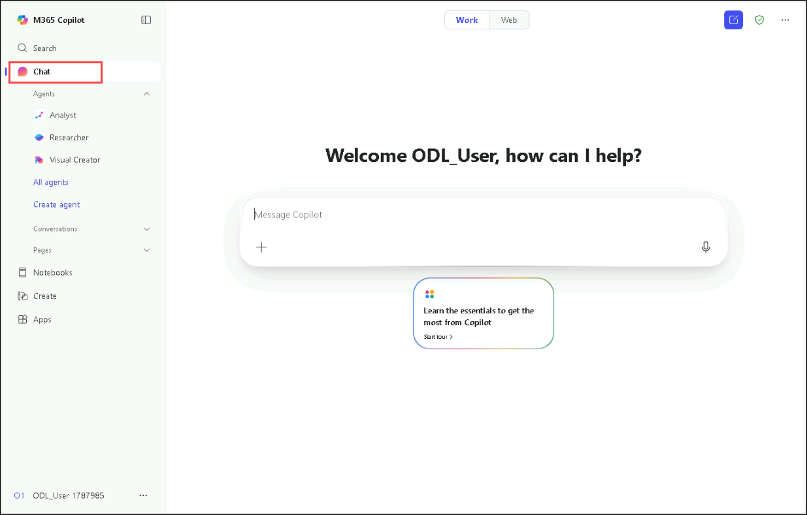

1. Other M365 functionalities

    - **Search:** You can search for documents, meetings, emails, notes, chats, or even tasks using AI-driven contextual results from Microsoft Graph.
        > **Example:** "Find the latest project update from XYZ” or “Show me Q2 financial reports".
    - **Chat:** Use this area to ask Copilot questions, summarize content, draft emails, or retrieve insights from your documents or organizational data.
        > **Example:** “Summarize the last meeting with the marketing team” or “Draft a follow-up email for the sales pitch.”
    - **Notebooks:** You can combine AI-generated content, summaries, and your own notes into organized sections — similar to a digital binder powered by Copilot.
        > **Example:** Ideal for organizing research findings, training materials, or long-term planning documents collaboratively.

### Task 2: Understanding and using No-Code Agents in Copilot

In this task, you will explore and interact with no-code Copilot Agents - **Researcher** and **Analyst** to analyze documents and data, summarize insights, and generate visual reports using natural language prompts.

1. In the Copilot app, navigate to the **Agents** section.

1. There should be some Agents already available.

    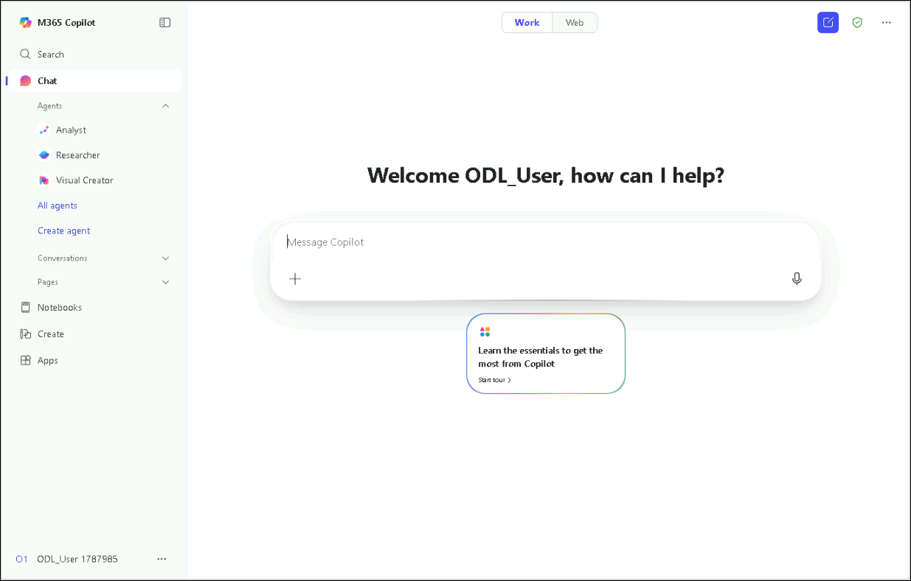

1. Discuss use cases for **Researcher** and **Analyst** agents.

1. **Researcher Agent:** Synthesizes large volumes of information.

    - Click on the **Researcher (1)** agent from the menu, then click on **+ (2)**, and then click on **Add Content (3)**

        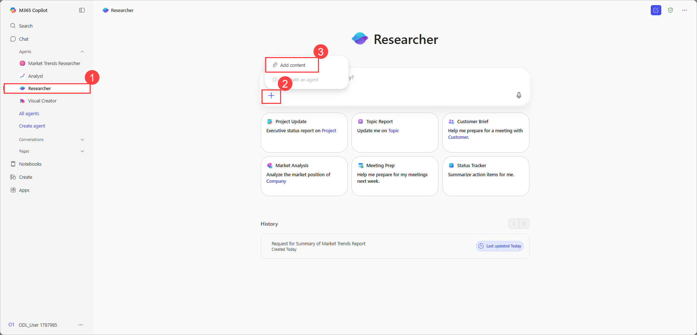
        
    - Select **Market_Trends_Report_2025.docx (1)**
            
        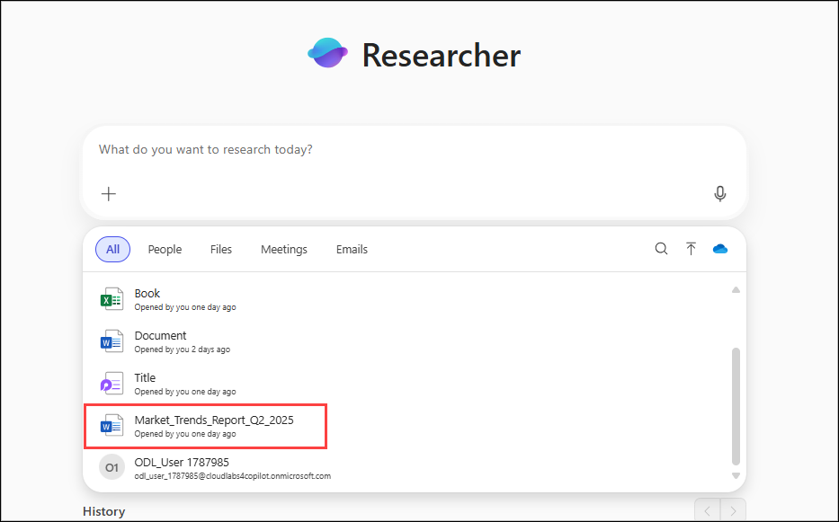

    - Enter one of the prompts from below.

        - “Summarize the documents into key bullet points.”

        - “What are the key takeaways from this report?”

        - “Identify common themes across these files.”

    - The agent will request to proceed with the details with a response, use **Go ahead** or **Go ahead and summarize** to respond to the agent.

        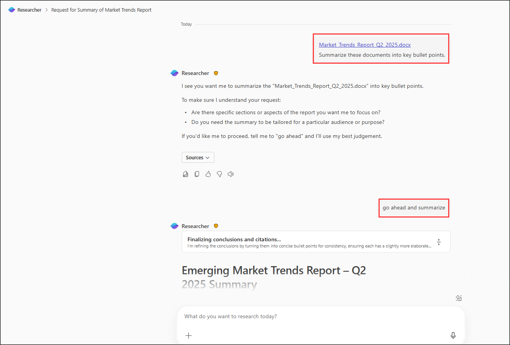

    - The response from the agent for the summary of the provided document into bullet points.

        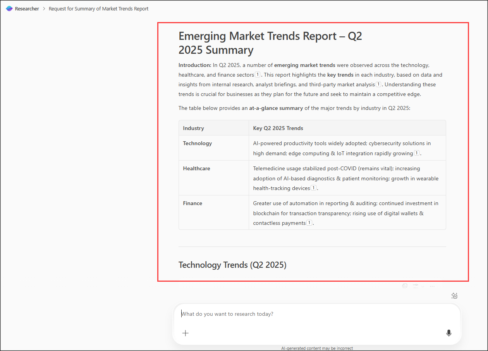

        > **Note:** The responses from the agent may vary.

1. **Analyst Agent:** Performs calculations, summarizes data, and creates visual reports.

    - Click on the **Analyst (1)** agent from the menu, then click on **+ (2)**, and then click on **Add Content (3)**

        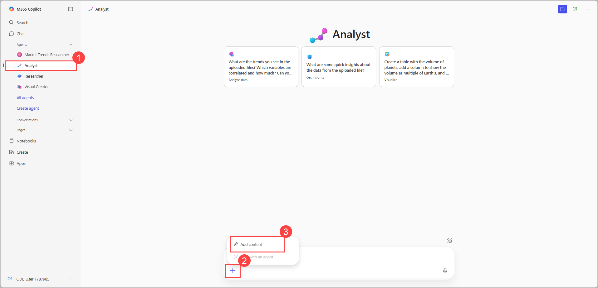

    - Select **Sales_Data_Q1_2025 (1)**.

        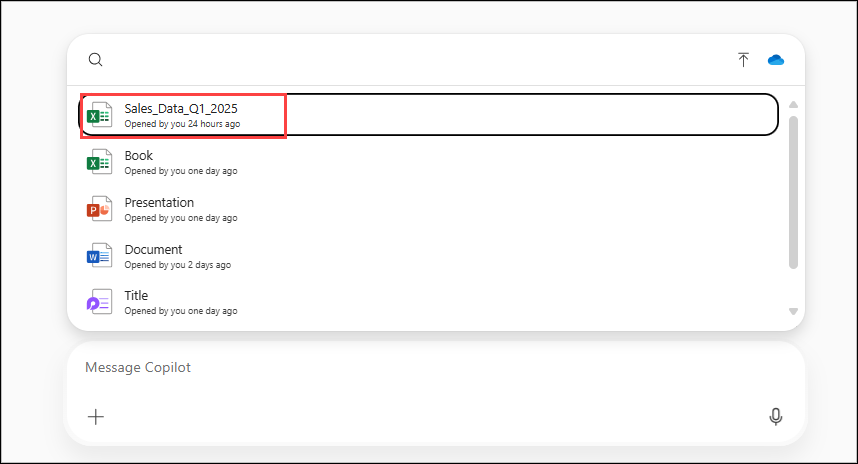

    - Interact with the Agent using the prompts.
            
        - “Summarize the monthly revenue trends.”

        - “Which products performed best last quarter?”

        - “Create a pie chart of total sales by region.”

    - The agent will inspect and read the excel file.

        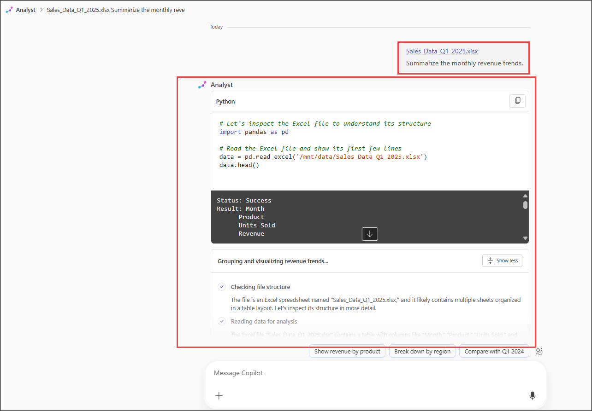

    - The response from the agent for the summary of the provided document into bullet points.

        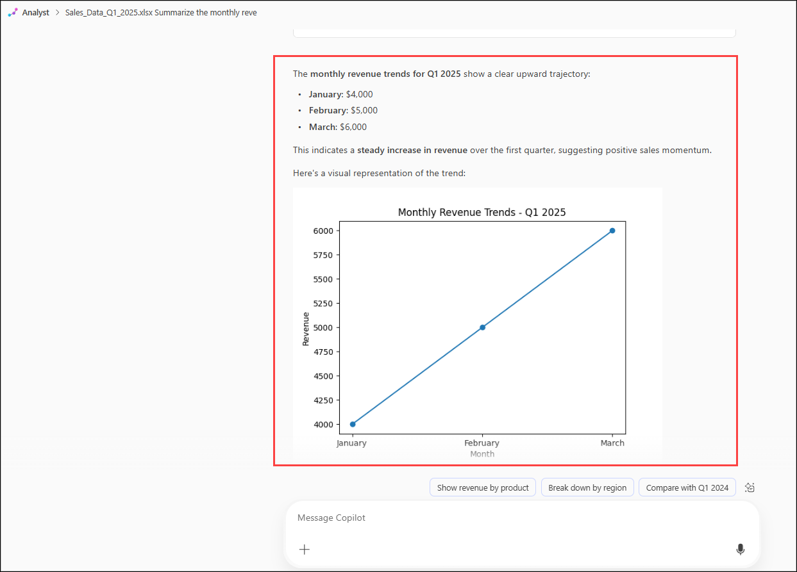

        > **Note:** The responses from the agent may vary. Copilot should generate summary insights and create visualizations directly in Excel or as a report.

1. To explore further, you can click on **All Agents (1)** which will take you to the **Agent Store (2)**. Here you can find **your Agents (3)** and the Agents **Built by Microsoft**. You can click on any of them and interact to explore the Agents further. 

    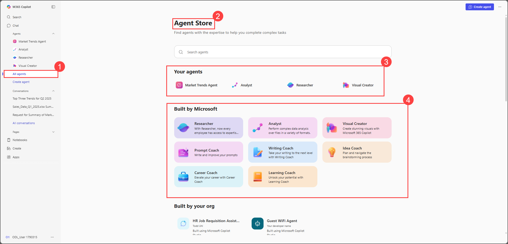

### Task 3: Creating and using a No-Code Agent

In this task, you will build and test an agent that can summarize documents and compile findings.
> **Note:** You don’t need to code or script. The configuration is based on task type and data input.

1. Click **Create Agent**

    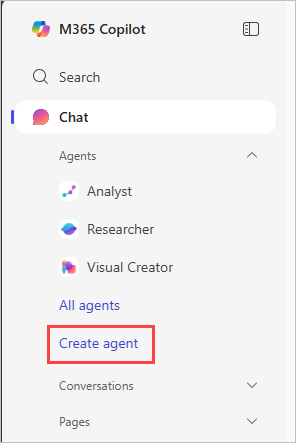

1. Click on **Configure**

    - Give your agent a name: **Market Trends Agent**

    - **Description:** This intelligent agent is designed to help users analyze documents and extract key insights - such as summaries, common themes, and trends - without needing to write any code or use custom logic.

    - **Instructions:** 
        - Summarize all documents into concise bullet points

        - Identify trends and common themes across the uploaded content

        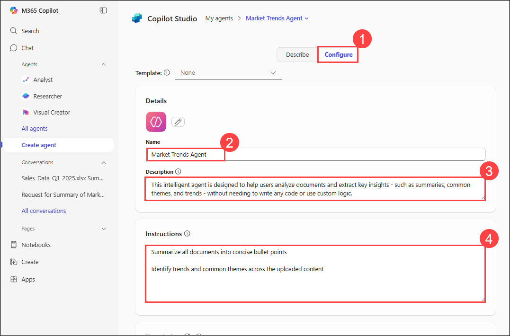

    - **Knowledge:**

        - Click on **Attach cloud files** button.
        
            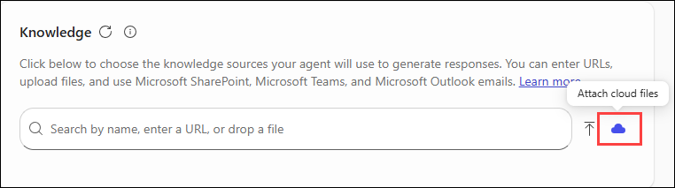
        
        - Click on **Finance** SharePoint site.

            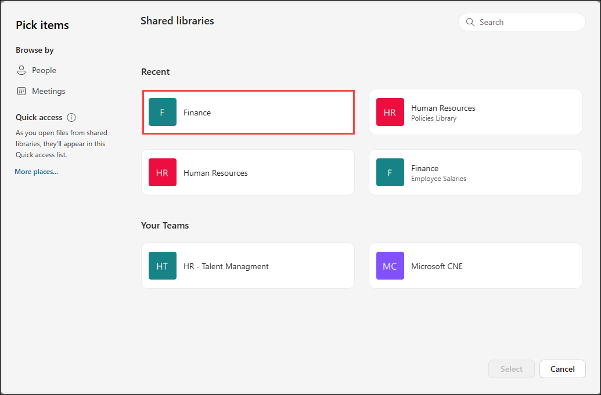
        
        - Select **Market_Trends_Report_2025.docx (1)** file and click **Select (2)**.

            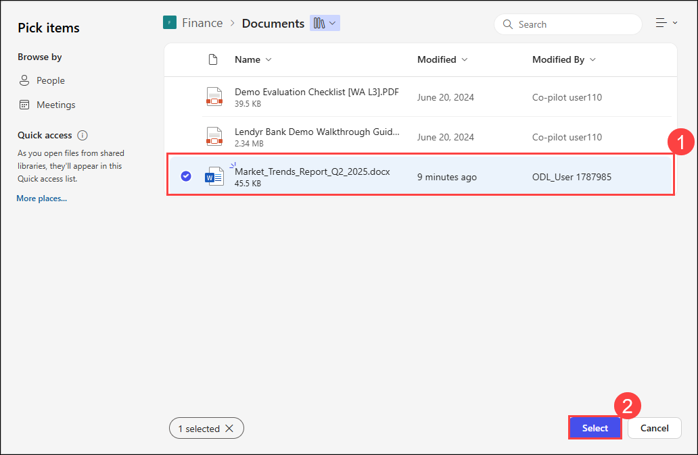

    - Leave all other settings as default and click on **Create**.
        
        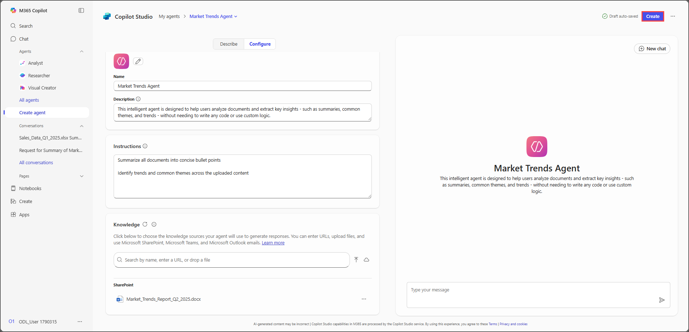

1. Once the agent is created you will see the prompt below, click on **Go to agent**.

    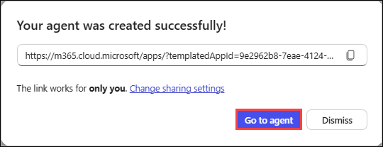

1. Interact with the Agent using the prompts.

    - “What are the top three trends in Q2 2025?”

    - “Summarize the key points from the Market Trends report.”

    - “Compare Q2 trends with Q1 if such data is available.”

1. The **Response (1)** from the agent are below, you can also move forward with one of the **Suggested Prompts (2)** or use the prompts in **step 5**

    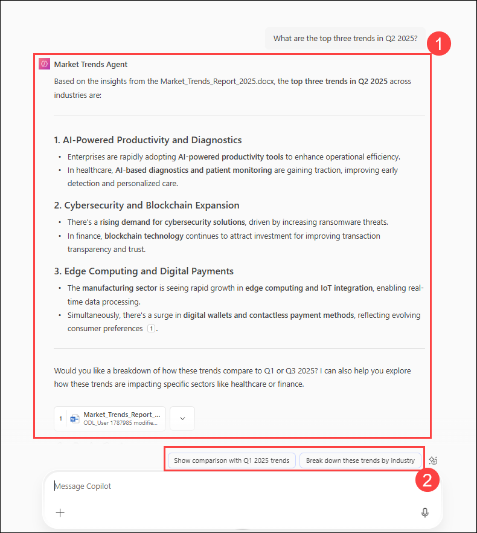
    
    > **Notes:** The responses from the agent may vary.