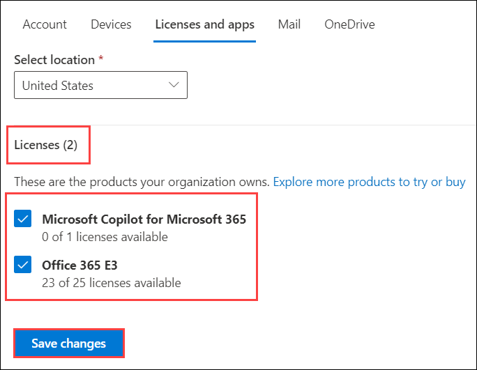

# Exercise 4.1: Administering M365 Copilot

This exercise is aimed at understanding how to manage Microsoft 365 Copilot licenses through the Microsoft 365 Admin Center. Although you are in read-only mode with Global Reader access, you will learn how to view, assign, and remove Copilot licenses.

## Introduction

This exercise is designed to provide a comprehensive understanding of how to effectively administer and manage the AI-powered **Microsoft Copilot** in a **Microsoft 365** environment through the **Microsoft 365 Admin Center**. Understanding these operations is crucial for the efficient utilization and management of Copilot in your organization. You will delve into the administrative side of **Microsoft Copilot**, exploring how to configure, manage, and optimize it for an organization's specific needs, equipping you with the knowledge and skills needed to maximize the benefits of this powerful tool in your organization.

## Managing Microsoft 365 Copilot Licenses in Admin Center (Read Only)

This exercise guides you through the process of managing **Microsoft 365 Copilot** licenses for users in your tenant through the **Microsoft 365 Admin Center**. You'll learn how to assign and remove licenses, manage Microsoft 365 Copilot services, and configure public web content access. Understanding these operations is crucial for the efficient utilization and management of **Copilot** in your organization.

>**Note:** Your access has been set to Global Reader, meaning you won't be able to make changes. These instructions are for viewing only, reflecting the read-only access granted in your environment.

### Task 1: Assign Copilot licenses to the user

Follow these steps to assign a Copilot license for an existing user from the admin center:

1. Navigate to the Environment details page and click on it. You will find M365 Copilot User Details tab. Click on the tab and copy the Username | Password provided there.

   

1. Go to [Microsoft 365 Admin Center] `https://admin.microsoft.com/` and sign in with your admin credentials.

1. From the left side navigation pane, click on **Users (1)** and then choose **Active users (2)**.

    

1.  In the Active Users page, search or find the user you want to manage the Copilot license. Click on the user.

    

1. On the user's profile page, on the right side click on **Licenses and apps** to go to their license details.

    

1. To assign, expand the **Licenses (1)** section, select the boxes for the licenses that you want to assign, then select **Save changes (3)**.

   >**Note:** In this case, we have already assigned the licences to the account.

    

 All license changes are saved automatically after you make an assignment change.

### Task 2: Remove a Copilot licenses

To remove an already assigned Copilot license:

1. Follow the steps above to open the user's **Licenses and apps**.

    

1. Uncheck the **Microsoft Copilot for Microsoft 365** under the licenses section.

    

    >**Note:** In this case, you don't need to remove the licenses.

1. Changes apply automatically after saving.

Now the user's Copilot license assignment status will be updated.

## Conclusion

In conclusion, you've gained an in-depth understanding of how to effectively manage Microsoft Copilot licenses through the **Microsoft 365 Admin Center**.

You've learned how to assign and remove licenses for specific users, an essential function for managing access to **Microsoft Copilot**. You've also gained a strong understanding of how to manage Microsoft Copilot services and configure public web content access, key skills for optimizing the usage of this AI tool in your organization.

## Summary

In this exercise,you've learned how to manage Microsoft 365 Copilot licenses, including how to view, assign, and remove licenses. This knowledge is crucial for ensuring the effective use of Copilot and managing user access in your organization. Even with read-only access, understanding these processes will help you support effective license management and tool utilization.
