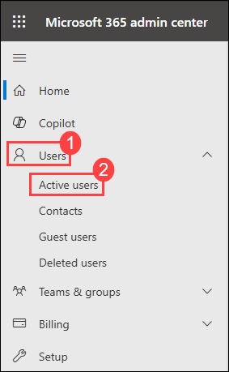
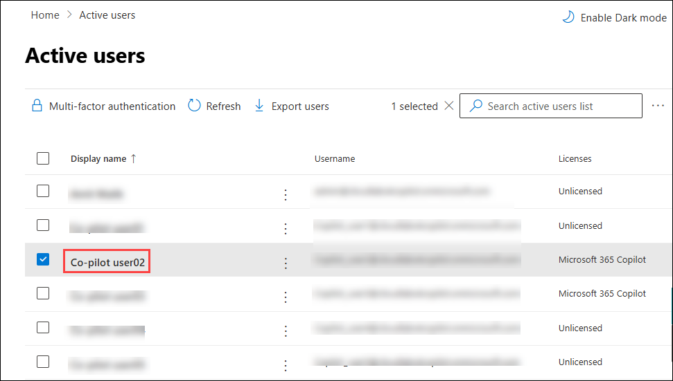
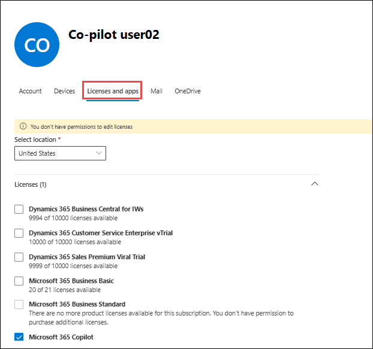
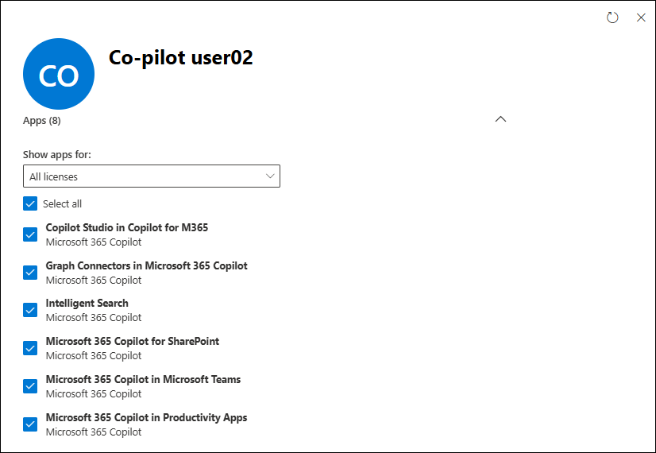

# Exercise 3.2: Administering M365 Copilot

This exercise is designed to provide a comprehensive understanding of how to effectively administer and manage the AI-powered **Microsoft Copilot** in a **Microsoft 365** environment through the **Microsoft 365 Admin Center**. Understanding these operations is crucial for the efficient utilization and management of Copilot in your organization. You will delve into the administrative side of **Microsoft Copilot**, exploring how to configure, manage, and optimize it for an organization's specific needs, equipping you with the knowledge and skills needed to maximize the benefits of this powerful tool in your organization.

### Task 1: Manage Microsoft 365 Copilot Services

**Microsoft 365 Copilot** comes with different services that can be enabled or disabled as per your preferences. This can be configured from the **Microsoft 365 Admin Center**.

>**Note:** Your access has been set to Global Reader, meaning you won't be able to make changes. These instructions are for viewing only, reflecting the read-only access granted in your environment.

1. log in to [Microsoft 365 Admin Center](admin.microsoft.com).

1. Go to **Users (1)** > **Active Users (2)**.

    

1. Select the user for which **Microsoft 365 Copilot** license has been assigned.

    

1. On the user pane navigate to **Licenses and apps.** 

   

1. Scroll down to Apps section, you will see a detailed list of enabled services tied to the Microsoft 365 Copilot license. 
 
   
   
   Given below are the features of each of the following services of **Microsoft 365 Copilot**:

    - **Copilot Studio in Copilot for Microsoft 365:** Copilot Studio in Copilot for Microsoft 365 enables users and administrators to customize and extend the functionality of Copilot across Microsoft 365 applications. This feature allows organizations to tailor Copilot's behavior by creating custom workflows, integrating third-party apps or internal tools, and managing specific skills or actions. It also provides insights into usage patterns and supports no-code/low-code customization, making it accessible for all users.
      
    - **Graph Connectors in Microsoft 365 Copilot:** These connectors enable Copilot to access data from **Microsoft Graph**, a cloud-based service that provides a unified programmability model to access data in Microsoft 365. This feature allows Copilot to source information from a wide range of Microsoft services and apps, enriching its responses with contextually relevant data.

    - **Intelligent Search:** This feature uses AI technology to streamline the process of searching for information across Microsoft 365 apps. Instead of merely returning results based on keywords, Intelligent Search understands the context of the search query, providing more relevant results. It can also suggest answers to questions or direct users to specific documents or data points.

    - **Microsoft 365 Copilot for SharePoint:** Microsoft 365 Copilot for SharePoint enhances productivity by assisting with content creation and management. It can generate and refine content for pages and news posts, optimize search results using AI, and suggest metadata for better organization. Additionally, it streamlines workflows, improves collaboration by summarizing discussions, and ensures content adheres to governance and compliance policies.

    - **Microsoft 365 Copilot in Microsoft Teams:** In Teams, Copilot can help summarize key points in a conversation, suggest next steps, and even help with meeting notes. This feature can keep you updated and organized, and enhance the efficiency of teamwork by turning conversations into actions.

    - **Microsoft 365 Copilot in Productivity Apps:** Copilot is integrated with productivity apps like Word, Excel, PowerPoint, and more. It can provide suggestions, automate tasks, and even generate content based on user input. In PowerPoint, for example, it can help design slides, while in Word it can help draft and edit documents.
  
    - **Microsoft Copilot with Graph-Grounded Chat:** Microsoft Copilot with Graph-Grounded Chat uses the power of Microsoft Graph to provide a highly contextual and intelligent chat experience. This service enables Copilot to access and understand organizational data such as files, meetings, emails, and more from Microsoft Graph, ensuring responses are grounded in real-time, relevant information. It can assist with answering complex queries, providing actionable insights, and automating tasks, all while maintaining data security and compliance.

    - **Power Platform Connectors in Microsoft 365 Copilot:** These connectors allow Copilot to interact with the **Power Platform**, a suite of tools including Power Apps, Power Automate, Power BI, and Power Virtual Agents. This enables the AI to access data, perform operations, or trigger workflows within these tools, further enhancing its capabilities and the range of tasks it can help automate.

    Together, these features make **Microsoft 365 Copilot** a powerful tool that can significantly enhance productivity and simplify workflows in an organization.

## Conclusion

In conclusion, you have learned how to administer and manage the AI-powered **Microsoft Copilot** in a Microsoft 365 environment using the **Microsoft 365 Admin Center**. You explored how to configure, manage, and optimize Copilot according to an organization's specific needs like managing various services of Copilot, including Graph Connectors, Intelligent Search, Copilot for SharePoint, Copilot in Teams, Copilot in Productivity Apps, Copilot with Graph-Grounded Chat and Power Platform Connectors. Through understanding these features, you have developed the skills necessary to maximize the benefits of Microsoft Copilot in an organization, enhancing productivity and simplifying workflows.

## **Congratulations! you have successfully completed this exercise, please click on next**
