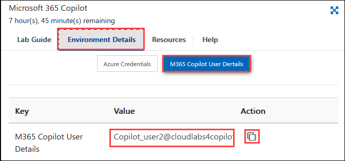

# Exercise 4.2: Administering M365 Copilot( Read-Only)

This exercise is aimed at understanding how to manage Microsoft 365 Copilot services through the Microsoft 365 Admin Center, even with read-only access. You will learn how to view and understand the configuration and management of various Copilot services.

## Introduction

This exercise is designed to provide a comprehensive understanding of how to effectively administer and manage the AI-powered **Microsoft Copilot** in a **Microsoft 365** environment through the **Microsoft 365 Admin Center**. Understanding these operations is crucial for the efficient utilization and management of Copilot in your organization. You will delve into the administrative side of **Microsoft Copilot**, exploring how to configure, manage, and optimize it for an organization's specific needs, equipping you with the knowledge and skills needed to maximize the benefits of this powerful tool in your organization.

## Manage Microsoft 365 Copilot Services

**Microsoft 365 Copilot** comes with different services that can be enabled or disabled as per your preferences. This can be configured from the **Microsoft 365 Admin Center**.

>**Note:** Your access has been set to Global Reader, meaning you won't be able to make changes. These instructions are for viewing only, reflecting the read-only access granted in your environment.

1. Navigate to the Environment details page and click on it. You will find M365 Copilot User Details tab. Click on the tab and copy the Username | Password provided there.

   

1. Log in to [Microsoft 365 Admin Center]`https://admin.microsoft.com/`.

1. Go to **Billing (1)** > **Licenses (2)**.

    

1. Scroll down and click **Microsoft Copilot for Microsoft 365**.

    

1. Select the user and select **Manage apps & services**.

   >**Note:** Temporarily, The **Manage apps & services** view is not visible to the **Read-Only** access you have been provided with. This feature is ONLY accessible to the ADMINS with Administrative level of access. Thus, please go through the lab guide to understand the feature purpose, and how admins can utilize it.

   

1. If you want to **Turn apps and services on or off**, uncheck any of the apps and services and click **Save**.
 
   
   
   Given below are the features of each of the following services of **Microsoft 365 Copilot**:

    - **Graph Connectors in Microsoft 365 Copilot:** These connectors enable Copilot to access data from **Microsoft Graph**, a cloud-based service that provides a unified programmability model to access data in Microsoft 365. This feature allows Copilot to source information from a wide range of Microsoft services and apps, enriching its responses with contextually relevant data.

    - **Intelligent Search:** This feature uses AI technology to streamline the process of searching for information across Microsoft 365 apps. Instead of merely returning results based on keywords, Intelligent Search understands the context of the search query, providing more relevant results. It can also suggest answers to questions or direct users to specific documents or data points.

    - **Microsoft 365 Chat:** **Microsoft 365 Copilot** enhances the chat experience by providing real-time assistance. It can generate responses to questions, provide suggestions, and even automate certain tasks within the chat. This feature can help streamline communications and increase productivity.

    - **Microsoft 365 Copilot in Teams:** In Teams, Copilot can help summarize key points in a conversation, suggest next steps, and even help with meeting notes. This feature can keep you updated and organized, and enhance the efficiency of teamwork by turning conversations into actions.

    - **Microsoft 365 Copilot in Productivity Apps:** Copilot is integrated with productivity apps like Word, Excel, PowerPoint, and more. It can provide suggestions, automate tasks, and even generate content based on user input. In PowerPoint, for example, it can help design slides, while in Word it can help draft and edit documents.

    - **Power Platform Connectors in Microsoft 365 Copilot:** These connectors allow Copilot to interact with the **Power Platform**, a suite of tools including Power Apps, Power Automate, Power BI, and Power Virtual Agents. This enables the AI to access data, perform operations, or trigger workflows within these tools, further enhancing its capabilities and the range of tasks it can help automate.

    Together, these features make **Microsoft 365 Copilot** a powerful tool that can significantly enhance productivity and simplify workflows in an organization.

## Conclusion

In conclusion, you have learned how to administer and manage the AI-powered **Microsoft Copilot** in a Microsoft 365 environment using the **Microsoft 365 Admin Center**. You explored how to configure, manage, and optimize Copilot according to an organization's specific needs like managing various services of Copilot, including Graph Connectors, Intelligent Search, Microsoft 365 Chat, Copilot in Teams, Copilot in Productivity Apps, and Power Platform Connectors. Through understanding these features, you have developed the skills necessary to maximize the benefits of Microsoft Copilot in an organization, enhancing productivity and simplifying workflows.

## Summary

In this exercise, you’ve explored how to view and understand the management of Microsoft 365 Copilot services in the Admin Center. Even with read-only access, you have learned about the various features of Copilot, including Graph Connectors, Intelligent Search, and integration with chat and productivity apps. This knowledge will help you support Copilot administration and optimize its use within your organization.
