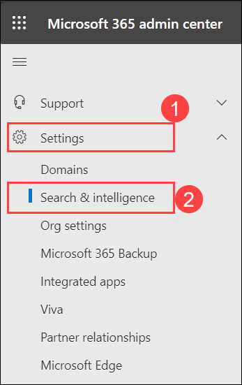
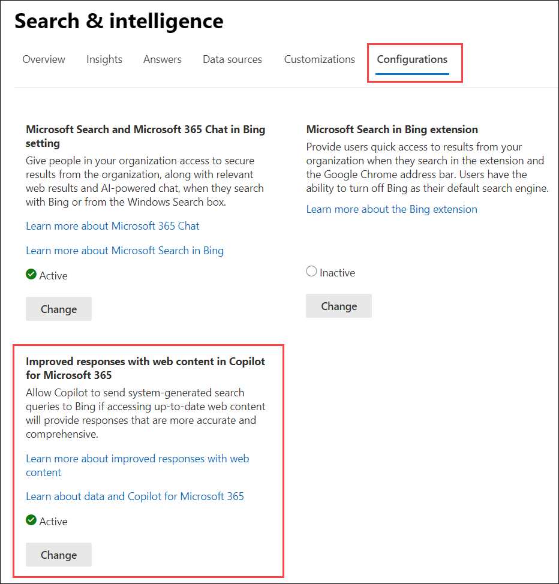
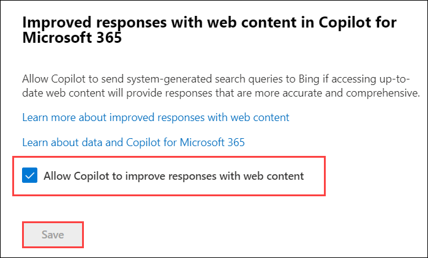
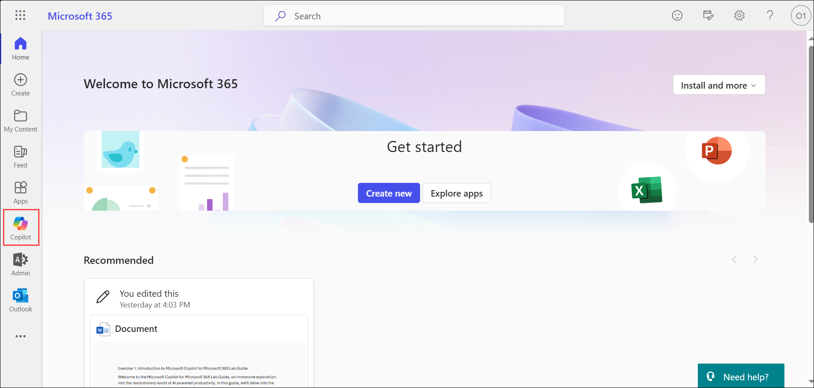
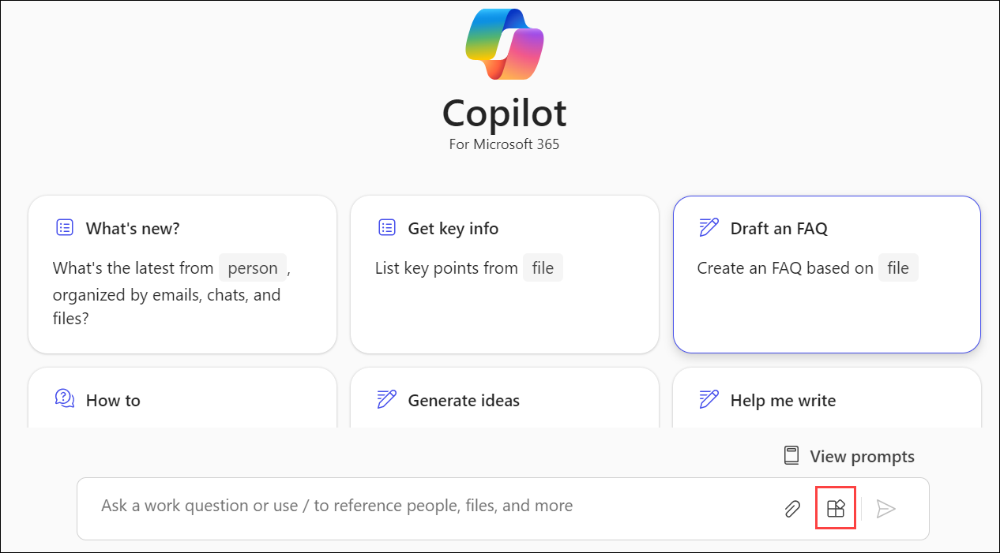
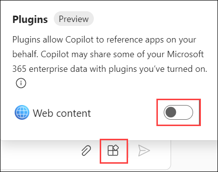

# Exercise 3.3: Administering M365 Copilot

This exercise is designed to provide a comprehensive understanding of how to effectively administer and manage the AI-powered **Microsoft Copilot** in a **Microsoft 365** environment through the **Microsoft 365 Admin Center**. Understanding these operations is crucial for the efficient utilization and management of Copilot in your organization. You will delve into the administrative side of **Microsoft Copilot**, exploring how to configure, manage, and optimize it for an organization's specific needs, equipping you with the knowledge and skills needed to maximize the benefits of this powerful tool in your organization.

## Managing Public web content access (Read Only)

**Microsoft Copilot for Microsoft 365** chat experiences in Bing, Microsoft Edge, and the Microsoft Teams app have a feature that allows Copilot to reference web content when responding to user prompts. Allowing **Copilot for Microsoft 365** to reference web content enhances the end-user experience and productivity with Copilot. The feature is automatically turned on when you first start using Copilot. You can turn off this feature by following these steps:

>**Note:** Your access has been set to Global Reader, meaning you won't be able to make changes. These instructions are for viewing only, reflecting the read-only access granted in your environment.

1. In the Microsoft 365 admin center, go to **Settings (1)** > **Search & intelligence (2)**.

    

1. On the **Configurations** page, select **Improved responses with web content in Copilot for Microsoft 365**.

    

1. Select **Change**.

1. Uncheck the checkbox for **Allow Copilot to reference web content**.

    

    >**Note:** In this case, you don't need to uncheck this option.

1. Select **Save**.

All admin setting updates may take up to 24 hours to reflect any changes.

- ### End-user Action Required

Once the admin provides access to let **M365 Copilot** access content from the web, the user need to manually turn it on as well. Follow the given steps below to allow the access to the web content for the Copilot:

1. Navigate to `https://www.office.com` and sign in using the **CloudLabs provided credentials**. Select **Copilot** icon from the left pane.

    

1. On the page of **M365 Copilot Chat**, select the icon for **Plugins**.

    

1. You will see a toggle for the plugin **Web Content** which is set off by default. Turn this toggle **ON**. Once it's ON, it allows Copilot to access web-based resources to improve its functionality and suggestions.

    

    Your Microsoft 365 Copilot Chat can, now, utilize web to display the responses to you.

>**Note:** If you turn off web access from the admin center, this control is disabled. However, if you enable web access, you must enable this toggle as well to allow web access for the Copilot. Remember, changes to the admin settings may take up to **24 hours** to reflect.

## Conclusion

In conclusion, you learnt how to manage **Microsoft 365 Copilot** licenses within your organization. You have understood how to assign and remove these licenses for users and how to enable or disable specific Copilot services based on your organization's needs. Additionally, you also understood how to configure Copilot's ability to reference web content, enhancing its utility and the end-user experience. This knowledge would allow you to effectively manage and tailor the Copilot experience to best suit your organizational requirements.
