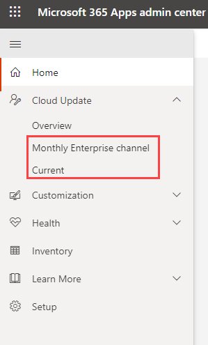

# Exercise 3.4: Administering M365 Copilot

This exercise is designed to provide a comprehensive understanding of how to effectively administer and manage the AI-powered **Microsoft Copilot** in a **Microsoft 365** environment through the **Microsoft 365 Admin Center**. Understanding these operations is crucial for the efficient utilization and management of Copilot in your organization. You will delve into the administrative side of **Microsoft Copilot**, exploring how to configure, manage, and optimize it for an organization's specific needs, equipping you with the knowledge and skills needed to maximize the benefits of this powerful tool in your organization.

## Change update channel of Microsoft 365 Apps to enable Copilot (Read Only)

One of the benefits of Microsoft 365 Apps is that Microsoft provides new (and updated) features for Office apps, such as Excel and Word, regularly. You can control how often the users in your organization get these new features by specifying the update channel. In addition to new features, update channels provide, as needed, security and non-security updates regularly, every month. Non-security updates provide fixes for known issues and provide stability or performance improvements for Office.

**Contoso Ltd**, a leading IT Consultancy firm, has decided to opt for the Monthly Enterprise Channel for their **Microsoft 365 Apps**. This decision was taken after a thorough assessment of the company’s needs and understanding the benefits of the Monthly Enterprise Channel. **Contoso Ltd.** is a dynamic organization that requires regular updates to keep their operations running smoothly and securely, but also needs stability and predictability in their software environment. The Monthly Enterprise Channel perfectly fits their needs as it provides new features, security and non-security updates on a predictable monthly schedule. Contoso appreciates the fact that these updates occur only once a month, allowing their IT team to plan and manage these updates efficiently. Furthermore, the Monthly Enterprise Channel offers Contoso a good balance between receiving the latest updates and having a stable, secure software environment.

In addition to the Monthly Enterprise Channel, Contoso Ltd has also decided to utilize Cloud updates as its management solution. This strategic decision is aimed at maximizing the benefits of cloud-based technologies in their software management processes. With Cloud updates, Contoso can enjoy a more streamlined, efficient, and automated update process. This solution reduces the manual intervention required from the IT team, freeing them up to focus on more strategic tasks. Cloud updates provide real-time access to the latest updates, ensuring that Contoso's Microsoft 365 Apps are always up-to-date with the latest features and security patches. Moreover, the cloud-based solution allows Contoso to manage updates across multiple devices and locations seamlessly, a feature that is particularly beneficial for a global corporation like Contoso Ltd.

>**Note:** Your access has been set to Global Reader, meaning you won't be able to make changes. These instructions are for viewing only, reflecting the read-only access granted in your environment.

- **Enable Cloud Update**

1. A Microsoft Entra ID security group must be established to enable the channel change feature to target an entire security group. This channel change feature can also target individual devices. In our scenario, we have already established a security group named **Copilot Users**.

1. Log into the **Microsoft 365 Apps admin center**, you should land on the Home page automatically. On the Recommendation based on your tenant card, select Enable cloud.

    

1. Please pause momentarily and refresh the page to ensure that both the Monthly Enterprise entry and the Current entry are listed under the Cloud Update navigation.

    

- **Initiate a Channel change**

1. While staying in the **Microsoft 365 Apps admin center**, navigate to **Inventory**. Select **Show all devices**. 

    

1. Select the **Switch device update channel** button on the top. You can enter device names or Microsoft Entra ID groups, or a mix of both. In this case, we will choose our Security group.

    

1. Select Move devices to initiate the channel change.

    

>**Note:** It might take up to 24 hours for the channel change to be completed by the device, assuming devices are online and can connect to the service.

## Conclusion

In conclusion, Contoso Ltd's decision to opt for the Monthly Enterprise Channel for their Microsoft 365 Apps and Cloud updates as their management solution is a strategic move that aligns perfectly with their business needs. The Monthly Enterprise Channel provides a balanced, predictable update schedule that ensures stability and security, while also offering the latest features. The Cloud updates complement this by providing an efficient, automated, and real-time update management process that can be tailored to meet Contoso's specific needs.
