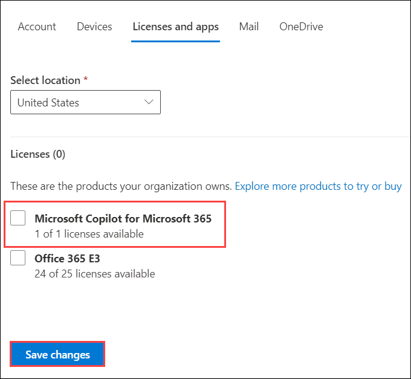
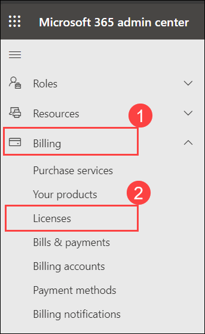
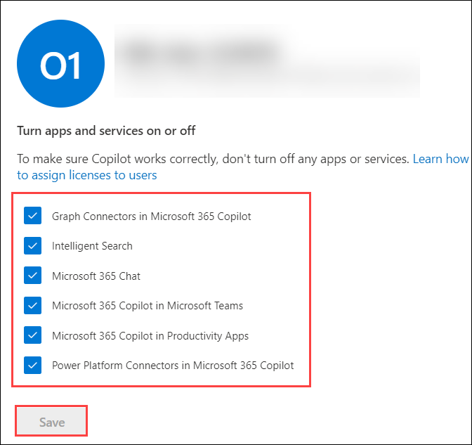

# Exercise 6: Manage Copilot

You can assign or remove Microsoft 365 Copilot licenses for users in your tenant through the Microsoft 365 Admin Center.

## Task 1: Managing Microsoft 365 Copilot Licenses in Admin Center

### Task 1.1: Assign a Copilot licenses to user

Follow these steps to assign a Copilot license for an existing user from the admin center:

1. Go to [Microsoft 365 Admin Center](admin.microsoft.com) and sign in with your admin credentials.

1. From the left side navigation pane, click on **Users (1)** and then choose **Active users (2)**.

    

1.  In the Active Users page, search or find the user you want to manage Copilot license. Click on their name.

    

1. In the user's profile page, on the right side click on **Licenses and apps** to go to their licenses details.

    

1. To assign, expand the **Licenses** section, select the boxes for the licenses that you want to assign, then select **Save changes**.

   >**Note:** In this case, we have already assigned the licences to the account.

    

 All license changes are saved automatically after you make an assignment change.

### Task 1.2: Remove a Copilot licenses

To remove an already assigned Copilot license:

1. Follow steps above to open the user's **Licenses and apps**.

    

1. Uncheck the **Microsoft Copilot for Microsoft 365** below the licenses.

    

    >**Note:** 

1. Changes apply automatically after saving.

Now the user's Copilot license assignment status will be updated.

### Task 1.3: Manage Microsoft 365 Copilot Services

Microsoft 365 Copilot comes with different services that can be enabled or disabled as per your preferences. This can be configured from the Microsoft 365 Admin Center.

1. Login to [Microsoft 365 Admin Center](admin.microsoft.com).

1. Go to **Billing (1)** > **Licences (2)**.

    

1. Scroll down and click **Microsoft Copilot for Microsoft 365**.

    

1. Select the **<inject key="AzureAdUserEmail"></inject> (1)** and select **Manage apps & services (2)**. 

   

1. If you want to **Turn apps and services on or off**, uncheck any of the apps and services and click **Save**.
 
   

