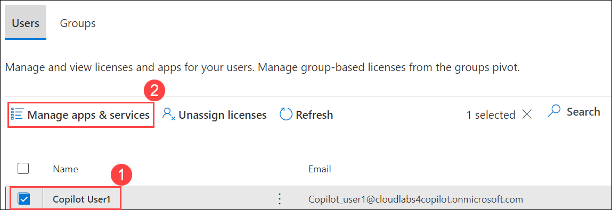
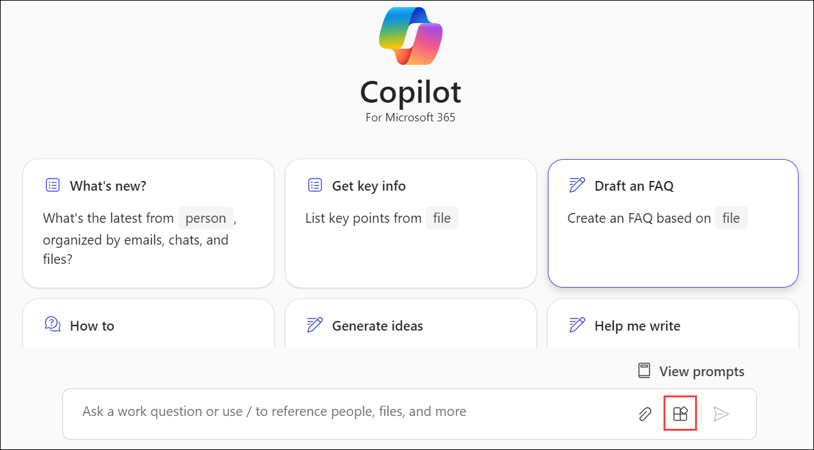
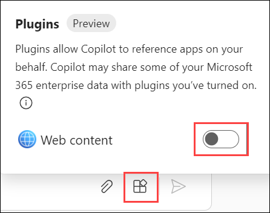
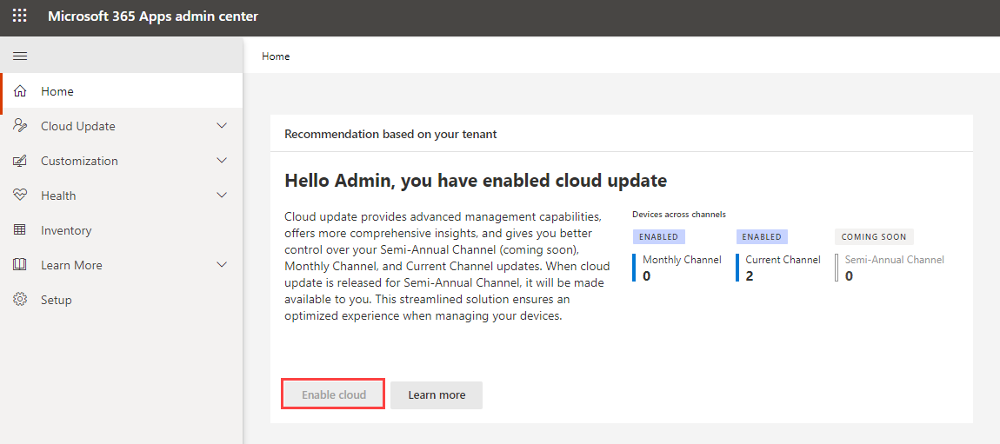
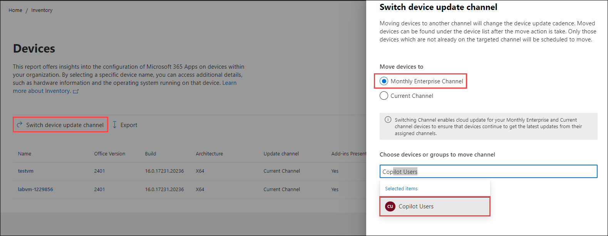

# Exercise 4: Manage Copilot

## Introduction

This exercise guides you through the process of managing Microsoft 365 Copilot licenses for users in your tenant through the Microsoft 365 Admin Center. You'll learn how to assign and remove licenses, manage Microsoft 365 Copilot services, and configure public web content access. Understanding these operations is crucial for the efficient utilization and management of Copilot in your organization.

## Task 1: Managing Microsoft 365 Copilot Licenses in Admin Center (Read Only)

>**Note:** Your access has been set to Global Reader, meaning you won't be able to make changes. These instructions are for viewing only, reflecting the read-only access granted in your environment.

### Task 1.1: Assign Copilot licenses to the user

Follow these steps to assign a Copilot license for an existing user from the admin center:

1. Go to [Microsoft 365 Admin Center] `https://admin.microsoft.com/` and sign in with your admin credentials.

1. From the left side navigation pane, click on **Users (1)** and then choose **Active users (2)**.

    

1.  In the Active Users page, search or find the user you want to manage the Copilot license. Click on the user.

    

1. On the user's profile page, on the right side click on **Licenses and apps** to go to their license details.

    

1. To assign, expand the **Licenses (1)** section, select the boxes for the licenses that you want to assign, then select **Save changes (3)**.

   >**Note:** In this case, we have already assigned the licences to the account.

    

 All license changes are saved automatically after you make an assignment change.

### Task 1.2: Remove a Copilot licenses

To remove an already assigned Copilot license:

1. Follow the steps above to open the user's **Licenses and apps**.

    

1. Uncheck the **Microsoft Copilot for Microsoft 365** under the licenses section.

    

    >**Note:** In this case, you don't need to remove the licenses.

1. Changes apply automatically after saving.

Now the user's Copilot license assignment status will be updated.

### Task 1.3: Manage Microsoft 365 Copilot Services 

Microsoft 365 Copilot comes with different services that can be enabled or disabled as per your preferences. This can be configured from the Microsoft 365 Admin Center.

1. log in to [Microsoft 365 Admin Center] `https://admin.microsoft.com/`.

1. Go to **Billing (1)** > **Licenses (2)**.

    

1. Scroll down and click **Microsoft Copilot for Microsoft 365**.

    

1. Select the user and select **Manage apps & services**. 

   

1. If you want to **Turn apps and services on or off**, uncheck any of the apps and services and click **Save**.
 
   
   
   Given below are the features of each of the following services of **Microsoft 365 Copilot**:

    - **Graph Connectors in Microsoft 365 Copilot:** These connectors enable Copilot to access data from **Microsoft Graph**, a cloud-based service that provides a unified programmability model to access data in Microsoft 365. This feature allows Copilot to source information from a wide range of Microsoft services and apps, enriching its responses with contextually relevant data.

    - **Intelligent Search:** This feature uses AI technology to streamline the process of searching for information across Microsoft 365 apps. Instead of merely returning results based on keywords, Intelligent Search understands the context of the search query, providing more relevant results. It can also suggest answers to questions or direct users to specific documents or data points.

    - **Microsoft 365 Chat:** **Microsoft 365 Copilot** enhances the chat experience by providing real-time assistance. It can generate responses to questions, provide suggestions, and even automate certain tasks within the chat. This feature can help streamline communications and increase productivity.

    - **Microsoft 365 Copilot in Teams:** In Teams, Copilot can help summarize key points in a conversation, suggest next steps, and even help with meeting notes. This feature can keep you updated and organized, and enhance the efficiency of teamwork by turning conversations into actions.

    - **Microsoft 365 Copilot in Productivity Apps:** Copilot is integrated with productivity apps like Word, Excel, PowerPoint, and more. It can provide suggestions, automate tasks, and even generate content based on user input. In PowerPoint, for example, it can help design slides, while in Word it can help draft and edit documents.

    - **Power Platform Connectors in Microsoft 365 Copilot:** These connectors allow Copilot to interact with the **Power Platform**, a suite of tools including Power Apps, Power Automate, Power BI, and Power Virtual Agents. This enables the AI to access data, perform operations, or trigger workflows within these tools, further enhancing its capabilities and the range of tasks it can help automate.

    Together, these features make **Microsoft 365 Copilot** a powerful tool that can significantly enhance productivity and simplify workflows in an organization.

### Task 2: Public web content access (Read Only)

**Microsoft Copilot for Microsoft 365** chat experiences in Bing, Microsoft Edge, and the Microsoft Teams app have a feature that allows Copilot to reference web content when responding to user prompts. Allowing Copilot for Microsoft 365 to reference web content enhances the end-user experience and productivity with Copilot. The feature is automatically turned on when you first start using Copilot. You can turn off this feature by following these steps:

1. In the Microsoft 365 admin center, go to **Settings (1)** > **Search & intelligence (2)**.

    

1. On the **Configurations** page, select **Improved responses with web content in Copilot for Microsoft 365**.

    

1. Select **Change**.

1. Uncheck the checkbox for **Allow Copilot to reference web content**.

    

    >**Note:** In this case, you don't need to uncheck this option.

1. Select **Save**.

All admin setting updates may take up to 24 hours to reflect any changes.

- ### End-user Action Required

Once the admin provides access to let **M365 Copilot** access content from the web, the user need to manually turn it on as well. Follow the given steps below to allow the access to the web content for the Copilot:

1. Navigate to `https://www.office.com` and sign in using the **CloudLabs provided credentials**. Select **Copilot** icon from the left pane.

    

1. On the page of **M365 Copilot Chat**, select the icon for **Plugins**.

    

1. You will see a toggle for the plugin **Web Content** which is set off by default. Turn this toggle **ON**. Once it's ON, it allows Copilot to access web-based resources to improve its functionality and suggestions.

    

    Your Microsoft 365 Copilot Chat can, now, utilize web to display the responses to you.

>**Note:** If you turn off web access from the admin center, this control is disabled. However, if you enable web access, you must enable this toggle as well to allow web access for the Copilot.

By the end of this task, you'll be well-equipped to manage Microsoft 365 Copilot licenses within your organization. You'll understand how to assign and remove these licenses for users and how to enable or disable specific Copilot services based on your organization's needs. Additionally, you'll learn how to configure Copilot's ability to reference web content, enhancing its utility and the end-user experience. Remember, changes to the admin settings may take up to 24 hours to reflect. This knowledge will allow you to effectively manage and tailor the Copilot experience to best suit your organizational requirements.

### Task 3: Change update channel of Microsoft 365 Apps to enable Copilot (Read Only)

One of the benefits of Microsoft 365 Apps is that Microsoft provides new (and updated) features for Office apps, such as Excel and Word, regularly. You can control how often the users in your organization get these new features by specifying the update channel. In addition to new features, update channels provide, as needed, security and non-security updates regularly, every month. Non-security updates provide fixes for known issues and provide stability or performance improvements for Office.

Contoso Ltd, a leading IT Consultancy firm, has decided to opt for the Monthly Enterprise Channel for their Microsoft 365 Apps. This decision was taken after a thorough assessment of the company’s needs and understanding the benefits of the Monthly Enterprise Channel. Contoso Ltd is a dynamic organization that requires regular updates to keep their operations running smoothly and securely, but also needs stability and predictability in their software environment. The Monthly Enterprise Channel perfectly fits their needs as it provides new features, security and non-security updates on a predictable monthly schedule. Contoso appreciates the fact that these updates occur only once a month, allowing their IT team to plan and manage these updates efficiently. Furthermore, the Monthly Enterprise Channel offers Contoso a good balance between receiving the latest updates and having a stable, secure software environment.

In addition to the Monthly Enterprise Channel, Contoso Ltd has also decided to utilize Cloud updates as its management solution. This strategic decision is aimed at maximizing the benefits of cloud-based technologies in their software management processes. With Cloud updates, Contoso can enjoy a more streamlined, efficient, and automated update process. This solution reduces the manual intervention required from the IT team, freeing them up to focus on more strategic tasks. Cloud updates provide real-time access to the latest updates, ensuring that Contoso's Microsoft 365 Apps are always up-to-date with the latest features and security patches. Moreover, the cloud-based solution allows Contoso to manage updates across multiple devices and locations seamlessly, a feature that is particularly beneficial for a global corporation like Contoso Ltd.

>**Note:** Your access has been set to Global Reader, meaning you won't be able to make changes. These instructions are for viewing only, reflecting the read-only access granted in your environment.

- **Enable Cloud Update**

1. A Microsoft Entra ID security group must be established to enable the channel change feature to target an entire security group. This channel change feature can also target individual devices. In our scenario, we have already established a security group named **Copilot Users**.

1. Log into the **Microsoft 365 Apps admin center**, you should land on the Home page automatically. On the Recommendation based on your tenant card, select Enable cloud.

    

1. Please pause momentarily and refresh the page to ensure that both the Monthly Enterprise entry and the Current entry are listed under the Cloud Update navigation.

    

- **Initiate a Channel change**

1. While staying in the **Microsoft 365 Apps admin center**, navigate to **Inventory**. Select **Show all devices**. 

    

1. Select the **Switch device update channel** button on the top. You can enter device names or Microsoft Entra ID groups, or a mix of both. In this case, we will choose our Security group.

    

1. Select Move devices to initiate the channel change.

    

>**Note:** It might take up to 24 hours for the channel change to be completed by the device, assuming devices are online and can connect to the service.

## Conclusion: 

In conclusion, Contoso Ltd's decision to opt for the Monthly Enterprise Channel for their Microsoft 365 Apps and Cloud updates as their management solution is a strategic move that aligns perfectly with their business needs. The Monthly Enterprise Channel provides a balanced, predictable update schedule that ensures stability and security, while also offering the latest features. The Cloud updates complement this by providing an efficient, automated, and real-time update management process that can be tailored to meet Contoso's specific needs.
