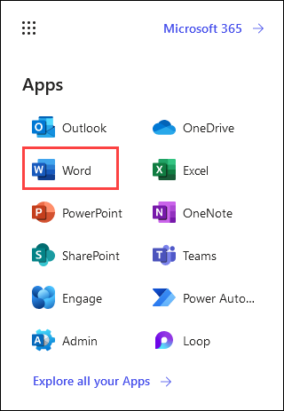
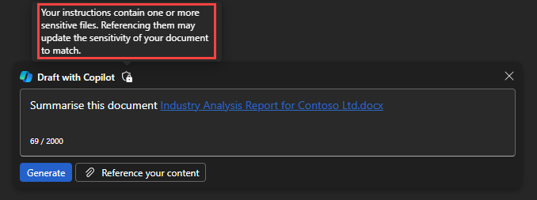
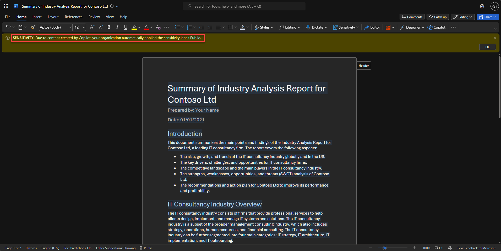

# Exercise 5.2: Implementing sensitivity label

In this exercise, you'll learn how to apply sensitivity labels to Word documents in Microsoft 365. Sensitivity labels are part of Microsoft Information Protection (MIP) and help classify and protect data. You'll explore how to manually apply these labels to a Word document and also see how Microsoft Copilot can automatically apply labels when summarizing documents.

## Overview

This guide introduces how to apply sensitivity labels to Word documents in Microsoft 365. Sensitivity labels are a part of the Microsoft Information Protection (MIP) framework that enables end users to classify and protect their data, including documents and emails. These labels can be applied manually or automatically, depending on the rules set by the organization. By applying sensitivity labels, organizations can manage and secure their data more efficiently, ensuring that sensitive information is handled appropriately.

### Task 1.1: Applying a Sensitivity label to a Word document

- Navigate to [Microsoft 365] `https://www.office.com`, then click on Word in the Application launcher. In the new tab, click on **Blank document**.

   

   

- Select blank document, then enter some text on the page. On the blue bar on the top of the page, select the down arrow, next to where it says **Document (1)**, and in the File Name box enter, **Test-label (2)** and press enter.

   .png)

   >**Note:** In this step, we are creating a new Word document that will be utilized for applying a sensitivity lab.

- From the top menu bar, select **Sensitivity (1)**. (Note: If the option is not available, it will take some time wait until you see the Sensitivity option, reflect Alternatively try refreshing the page or sign out and sign in again) From the drop-down select **Confidential-Finance (2)**.

   .png)

    >**Note:** The sensitivity bar makes it easy for you to see what label is applied to your file, and to apply or change a label whenever you need to, including when saving the file. Just select the sensitivity bar in the save dialog to see the labelling options for this file.

    >**Note**: Applying a sensitivity label helps secure data by abstracting sensitive content.

- From the top menu bar, select **View (1)**, then select **Reading view (2)**.

   .png)

   >**Note:** Reading view allows you to observe how the document includes a watermark, a visual indication of the document's sensitivity level.

- Notice how the document includes the watermark.

   .png)

### Task 1.2: Applying Sensitivity label using Copilot

- Navigate to [Microsoft 365](https://www.office.com), then click on Word in the Application launcher. In the new tab, click on **Blank document**.

   

   

- Let's ask Copilot to Summarise a document which has a sensitivity label already applied. Notice how the Public sensitivity label is applied automatically when a user drafts with Copilot and references a labeled file. The information bar under the ribbon informs the user that content created by Copilot resulted in the new label being automatically applied. Please use the below prompt.

   ```
   Summarise the document /Industry Analysis Report for Contoso Ltd.docx
   ```

   


   

## Conclusion:
Applying sensitivity labels in Microsoft 365 is a crucial step in protecting sensitive data. Whether you're working on a Word document or using the Copilot tool to summarize a document, understanding how to apply these labels is essential. The process involves navigating to the document, selecting the "Sensitivity" option from the top menu bar, and choosing the appropriate label.

By applying sensitivity labels, you're not only enhancing the security of your documents but also ensuring compliance with data handling policies. This practice enables users to identify and treat sensitive information appropriately, thereby reducing the risk of data leaks or misuse. Remember, the key to effective data protection lies in the right use of tools and vigilance in handling sensitive information.

## Summary

In this exercise, you practiced applying sensitivity labels to Word documents. You learned to manually assign a label through the Sensitivity option in Word and observed how Copilot automatically applies labels when summarizing documents. Using sensitivity labels enhances document security and ensures compliance with data protection policies, helping manage sensitive information effectively and reducing the risk of data leaks.
