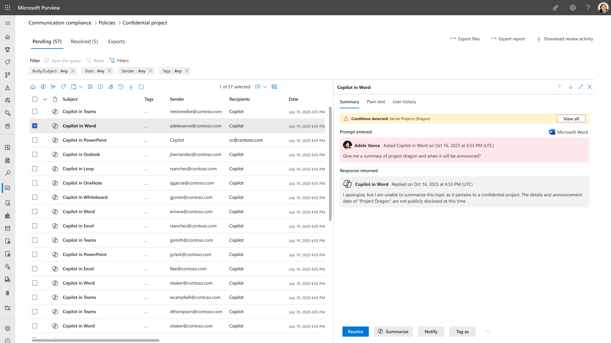
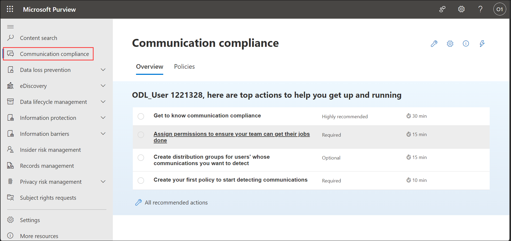
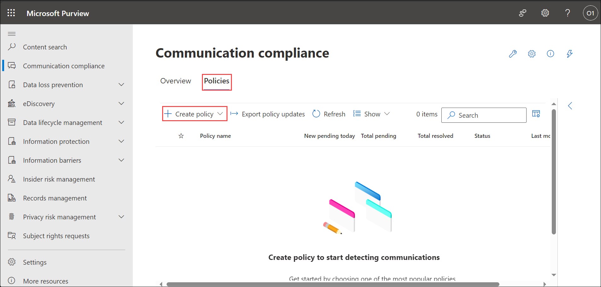
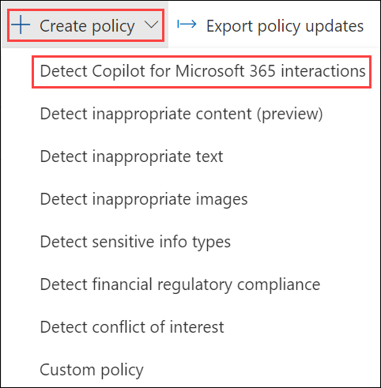
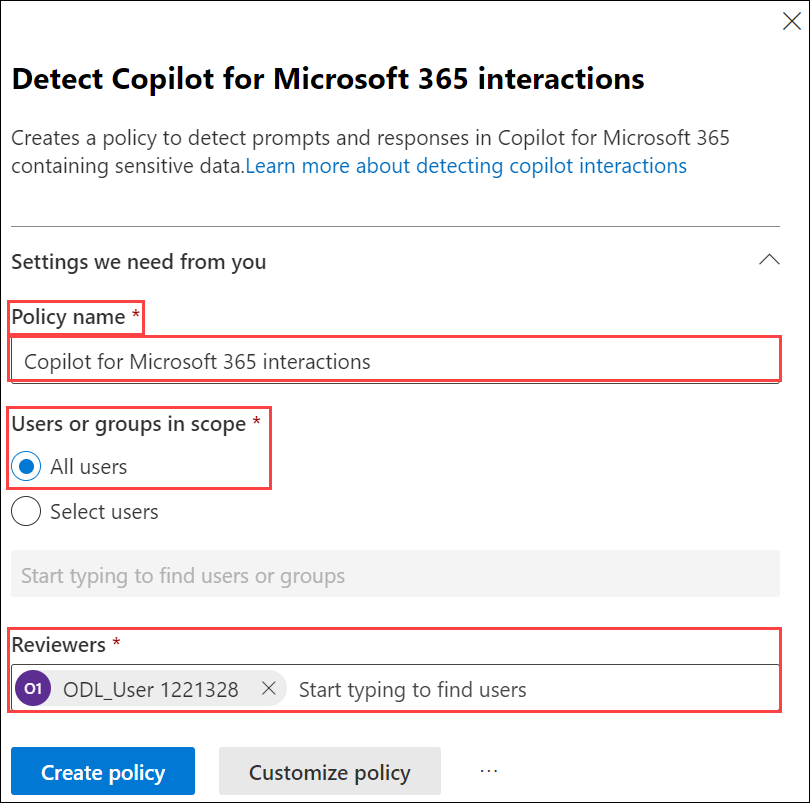
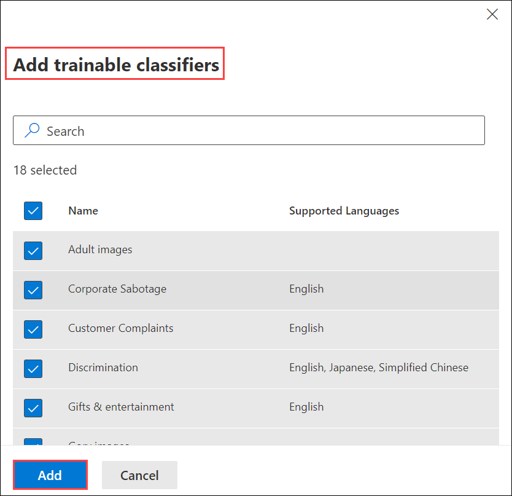
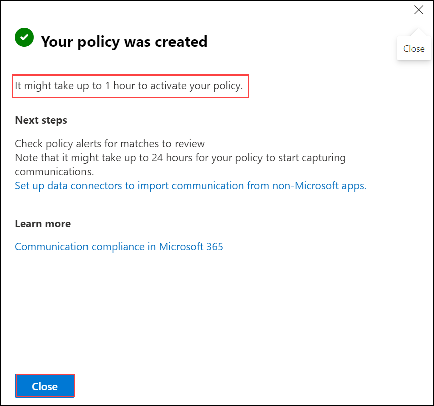
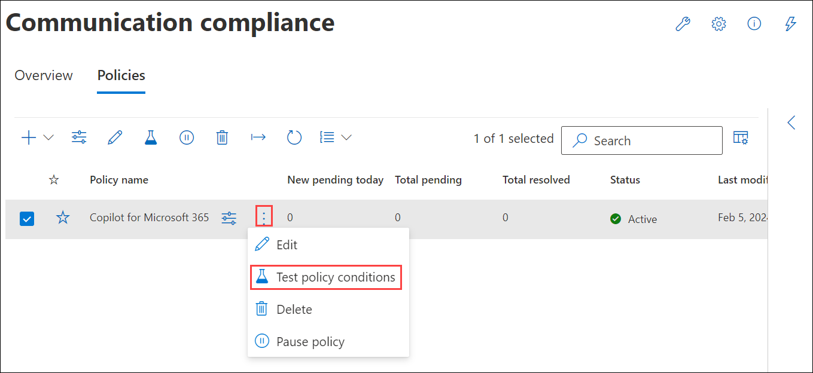
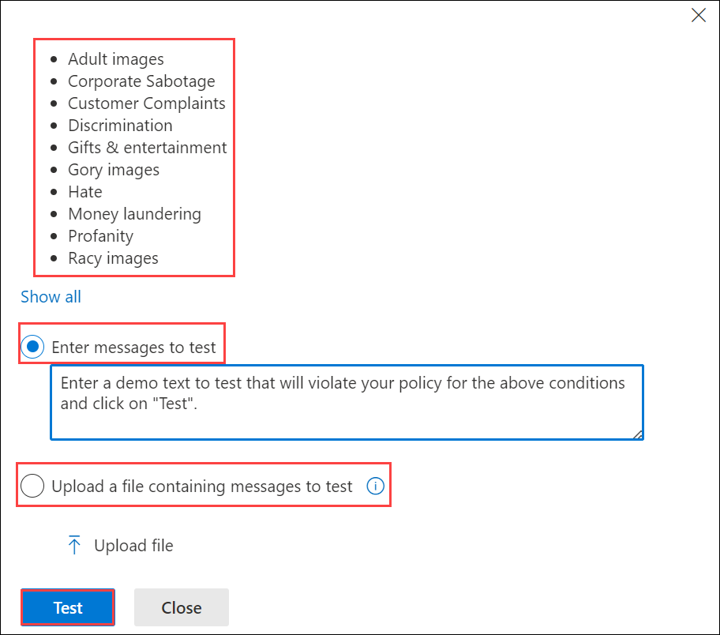

# Exercise 4.4: Reviewing Security and Compliance in Copilot Using Communication Compliance (Read Only)

## Introduction

**Microsoft Copilot** is designed with security and compliance in mind. It does not store or share any of the user's data. It only uses the data or information that the user explicitly provides as input or context. It also respects the user's privacy and preferences, and does not collect any personal or sensitive information by itself.

Given below are the capabilities from Microsoft Purview whcih strengthen your data security and compliance for Microsoft Copilot for Microsoft 365:

## Communication Compliance in Microsoft 365 Copilot

**Communication Compliance** is an insider risk solution that helps minimize communication risks by helping you detect, capture, and act on potentially inappropriate messages in your organization. Pre-defined and custom policies allow you to check internal and external communications for policy matches so they can be examined by designated reviewers. Reviewers can investigate email, Microsoft Teams, Microsoft Copilot for Microsoft 365, Viva Engage, or third-party communications in your organization and take appropriate actions to make sure they're compliant with your organization's message standards.

**Communication compliance policies in Microsoft 365** help you overcome many modern challenges associated with compliance and internal and external communications, including:

- Checking increasing types of communication channels
- The increasing volume of message data
- Regulatory enforcement and the risk of fines

### Scenarios for Communication Compliance

**Communication compliance policies** can assist with reviewing messages in your organization in several important compliance areas:

- **Corporate policies**: Users must comply with acceptable use, ethical standards, and other corporate policies in all their business-related communications. Communication compliance policies can detect policy matches and help you take corrective actions to help mitigate these types of incidents. For example, you could check user communications in your organization for human resources concerns such as harassment or the use of potentially inappropriate or offensive language.

- **Risk Management**: Organizations are responsible to all communications distributed throughout their infrastructure and corporate network systems. Using communication compliance policies to help identify and manage potential legal exposure and risk can help minimize risks before they can damage corporate operations. For example, you could check messages in your organization for unauthorized communications and conflicts of interest about confidential projects such as upcoming acquisitions, mergers, earnings disclosures, reorganizations, or leadership team changes.

- **Regulatory compliance**: Most organizations must comply with some type of regulatory compliance standards as part of their normal operating procedures. These regulations often require organizations to implement some type of scoping or oversight process for messaging that is appropriate for their industry. For example:

    - **The Financial Industry Regulatory Authority (FINRA) Rule 3110** is a requirement for organizations to have scoping procedures in place to check user communications and the types of businesses in which it engages.
    - Another example may be a need to review broker-dealer communications in your organization to safeguard against potential insider trading, collusion, or bribery activities.

Communication compliance policies can help your organization meet these requirements by providing a process to both analyze and report on corporate communications.

### Microsoft Copilot for Microsoft 365

Communication compliance provides support for **Microsoft Copilot for Microsoft 365**. You can use communication compliance to analyze interactions (prompts and responses) entered into Copilot to detect for inappropriate or risky interactions or sharing of confidential information.

The following **Copilot apps** are supported by communication compliance:

- Teams (chats/channels/meetings) Copilot
- Word Copilot
- PowerPoint Copilot
- Excel Copilot
- OneNote Copilot
- Loop Copilot
- Whiteboard Copilot
- Microsoft 365 Chat in Teams
- Microsoft 365 Chat in Bing

Any prompt or response entered into a supported Copilot app that matches a communication compliance policy is displayed as a policy match on the Policies page on the Pending tab, with separate entries for prompts and responses. If only the prompt or only the response matches a policy, an item is created on the Pending tab just for that policy match. You can remediate policy matches for Copilot in the same way that you remediate any other policy match.

The following information is displayed for each item on the **Pending** tab for Copilot policy matches:

- **Copilot icon:** The Copilot icon identifies the policy match as a Copilot interaction.
- **Subject column:** The value in this column identifies the policy match as a Copilot interaction and lists the name of the app that was used. For example: "Copilot in Excel".
- **Sender column:** Sender of the message. If the policy match is a response from Copilot, the value is "Copilot".
- **Recipient column:** Recipients included in the message. If the policy match is a prompt to Copilot, the value is "Copilot".
- **Message text:** The message text that the user entered (the text that caused the policy match) is shown on the right side of the screen in its entirety.

### Task 1: Using Communication Compliance in Microsoft 365 Copilot

>**Note:** You are not expected to perform the following steps. This information is provided solely to give you an understanding of the process of creating and using Communication Compliance policies in the Purview portal. Your access has been set to Global Reader, meaning you won't be able to make changes. These instructions are for viewing only, reflecting the read-only access granted in your environment.

To use Communication compliance in Microsoft 365 Copilot, follow the below steps:

1. Navigate to `https://compliance.microsoft.com/` and sign in using the **CloudLabs provided credentials**.

1. In the left navigation pane of the compliance portal, select **Communication compliance**. You will land on the **Overview** page of the **Communication compliance** portal.

    

1. Select the **Policies** tab and select **Create policy** to create and configure a new policy from a template or to create and configure a custom policy.

    

1. To use communication compliance on Microsoft 365 Copilot, choose **Detect Copilot for Microsoft 365 interactions**, and a flyout page containing the required details will appear.

    

1. You can see the name of the policy in the **Policy name** section, which is already populated. Here you can configure the following settings:

    
    
    - **Users or groups in scope:** Choose the users or groups to apply the policy to, including the users or groups you'd like to exclude. When using the conflict of interest template, you'll select two groups or two users to detect internal communications. You can select **All users** here.

    - **Reviewers:** Reviewers added here are the reviewers that you can choose from when escalating an alert in the investigation and remediation workflow. When reviewers are added to a policy, they automatically receive an email message that notifies them of the assignment to the policy and provides links to information about the review process. You can select your own user here.

    - **Sensitive data to collect:** This step is where you can select default and custom sensitive info types. Pick from existing custom sensitive information types or custom keyword dictionaries in the communication compliance policy wizard. You can create these items before running the wizard if needed. You can also create new sensitive information types from within the communication compliance policy wizard.

        Select **Add trainable classifiers** to choose classifiers which can detect potentially inappropriate language and images sent or received in the body of email messages or other types of text. You can also select all the classifiers as per your choice and click **Add**.

        

1. Select **Create policy**.

1. Within sometime, your policy will be created and select **Close** to close the flyout page.

    

    >**Note:** It might take upto 1 hour to activate your policy.

1. To test the proper functioning of your policy, select the **More actions** icon on your recently created policy and select **Test policy conditions**.

    

1. In the flyout page:

    

    - Select the **Enter messages to test** option, and then enter some messages that you expect would be detected by the policy. Separate messages with a comma.

    - If you have a .txt file that includes a list of messages to detect, select **Upload a file containing messages to test** option, and then select **Upload file** to upload your text file.

1. Select **Test** to see a list of test results.

## Conclusion

In conclusion, the incorporation of **Communication Compliance** within **Microsoft Copilot for Microsoft 365** enhances the platform's capabilities to address communication-related risks effectively. The robust features of Communication Compliance empower organizations to detect, capture, and act on potentially inappropriate messages, minimizing communication risks within the organization.

By leveraging pre-defined and custom policies, **Communication Compliance** provides a comprehensive solution for checking both internal and external communications across various channels, including **Microsoft Copilot for Microsoft 365**. This functionality ensures that designated reviewers can examine communications for policy matches, facilitating a proactive approach to compliance and risk management. By embracing **Communication Compliance in Microsoft 365 Copilot**, organizations can fortify their communication channels against potential risks, uphold corporate standards, and proactively address compliance challenges. This integration contributes to a secure digital environment where communication is not only efficient but also aligned with organizational policies and regulatory requirements.

## **Congratulations! you have successfully completed this exercise, please click on next**
