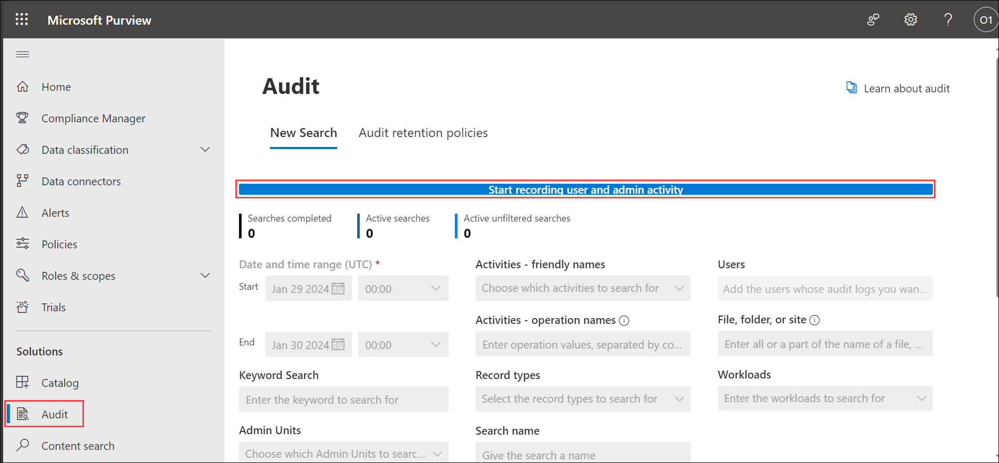
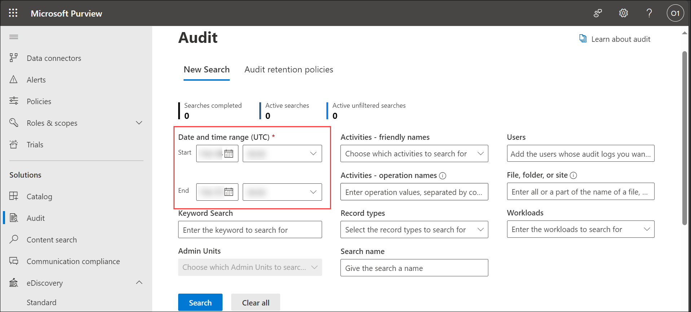
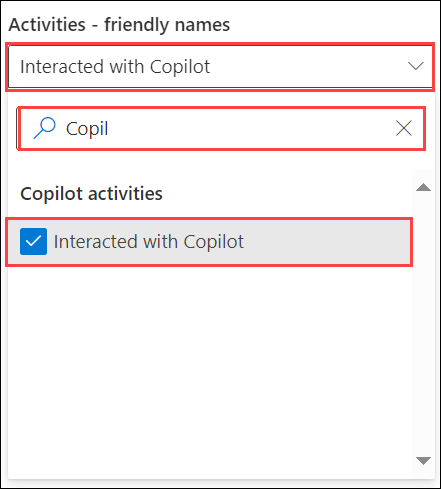
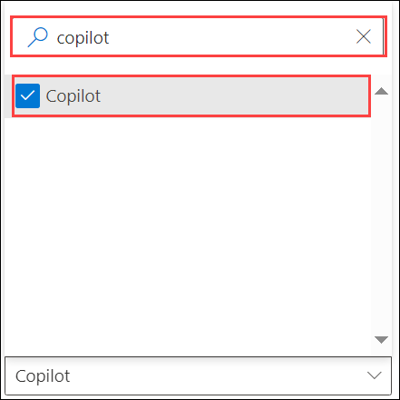
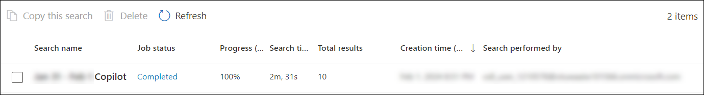
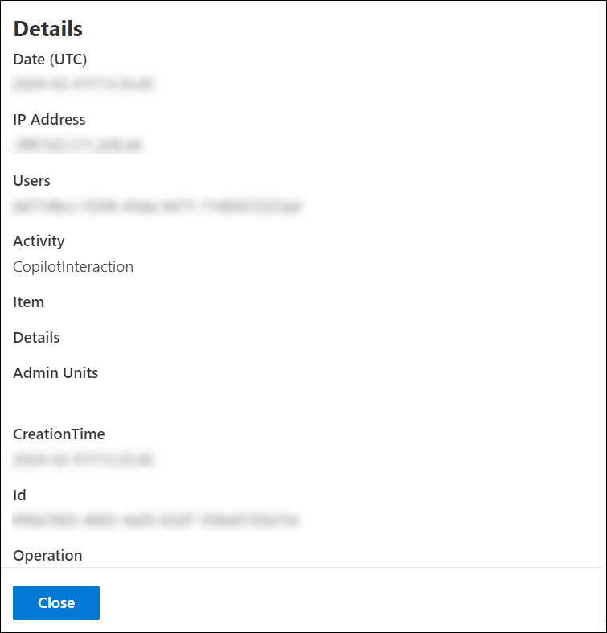
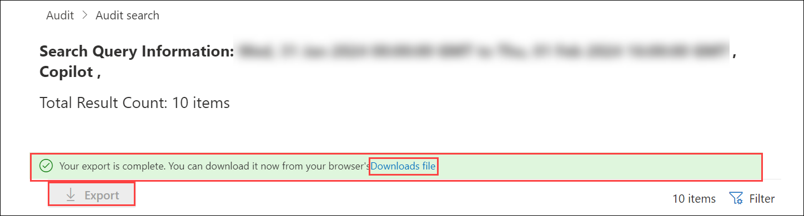

# Exercise 5.6: Reviewing Security and Compliance in Copilot Using Audit (Read Only)

In this exercise, we will review how auditing in Microsoft 365 Copilot enhances security and compliance. Auditing captures detailed records of user and admin activities, helping organizations respond to security events, conduct investigations, and meet compliance obligations.

## Introduction

**Microsoft Copilot** is designed with security and compliance in mind. It does not store or share any of the user's data. It only uses the data or information that the user explicitly provides as input or context. It also respects the user's privacy and preferences, and does not collect any personal or sensitive information by itself.

Given below are the capabilities from Microsoft Purview which strengthen your data security and compliance for Microsoft Copilot for Microsoft 365:

## Auditing in Microsoft 365 Copilot

Microsoft Purview auditing solutions provide an integrated solution to help organizations effectively respond to security events, forensic investigations, internal investigations, and compliance obligations. Thousands of user and admin operations performed in dozens of Microsoft 365 services including **M365 Copilot** and solutions are captured, recorded, and retained in your organization's unified audit log. Audit records for these events are searchable by security ops, IT admins, insider risk teams, and compliance and legal investigators in your organization. This capability provides visibility into the activities performed across your **Microsoft 365 organization**.

For **Auditing in M365 Copilot**, details are captured when users interact with Copilot. Events include how and when users interact with Copilot, in which Microsoft 365 service the activity took place, and references to the files stored in Microsoft 365 that were accessed during the interaction. If these files have a sensitivity label applied, that's also captured.

### Accessing the M365 Copilot Logs

>**Note:** You are not expected to perform the following steps. This information is provided solely to give you an understanding of the process of auditing logs in the Purview portal.

Copilot events can be accessed in the **Audit** solution from the **Microsoft Purview compliance portal**.

1. Navigate to the Environment details page and click on it. You will find M365 Copilot User Details tab. Click on the tab and copy the Username | Password provided there.

   

1. Navigate to `https://compliance.microsoft.com/` and sign in using the CloudLabs provided credentials.

1. In the left navigation pane of the compliance portal, select **Show all** and then select **Audit**.

1. Select **Start recording user and admin activity** to configure the Audit logging activities, and grant confirmation, if required.

    

1. On the **Audit** page, configure the search using the following conditions on the **New Search** tab.

    - **Date and time range:** Select a date and time range to display the activities that occurred within that period. The date and time are presented in Coordinated Universal Time (UTC). The last seven days are selected by default.
    
        

    - **Activities:** Select the activities to search for. Use the search box to search for activities to add to the list. Leave this box blank to return entries for all audited activities. To search for **Copilot events**, select **Copilot activities** and **Interacted with Copilot**.

        

        You can also select Copilot as a workload.

        

    - **Users:** Select this box and start typing the name of users to display search results for. The audit log entries for the selected activities performed by the users you select in this box are displayed in the list of results. Leave this box blank to return entries for all users (and service accounts) in your organization.

1. Select **Search** to run the search.

1. The audit log search starts running. When the search is completed, audit records are displayed on the page. Select a record to display a flyout page with detailed properties.

    

1. The screen gets displayed showing all the record entries of the required type.

1. Click on any entry to see it in more details.

    

1. If you want to download the results as a report to your local system, select **Export** on the top of the Audit search results page and choose **Downloads file**.

    

## Conclusion

In conclusion, the integration of auditing capabilities within **Microsoft 365 Copilot** through the Microsoft Purview auditing solutions provides organizations with a powerful tool to enhance security, facilitate forensic investigations, conduct internal inquiries, and meet compliance obligations effectively. By configuring audit logging activities, organizations can define specific conditions for their searches, including date and time range, activities, and users. This allows for a targeted investigation into Copilot events, providing detailed insights into user interactions and file access. By leveraging auditing capabilities in **Microsoft 365 Copilot**, organizations can reinforce their commitment to data security, user privacy, and compliance. This integrated solution contributes to a robust security posture, empowering organizations to monitor and respond to user activities within Copilot effectively.

## Summary

In this exercise, we examined how auditing in Microsoft 365 Copilot supports security and compliance. Auditing captures detailed logs of user interactions with Copilot, including activity timestamps and accessed files. By accessing and configuring these logs through the Microsoft Purview compliance portal, organizations can monitor activities, perform investigations, and ensure compliance. This capability strengthens data security and provides valuable insights into user interactions, contributing to a robust security and compliance framework.
