# Exercise 7.6: Reviewing Security and Compliance in Copilot Using Content Search

## Introduction

**Microsoft Copilot** is designed with security and compliance in mind. It does not store or share any of the user's data. It only uses the data or information that the user explicitly provides as input or context. It also respects the user's privacy and preferences, and does not collect any personal or sensitive information by itself.

Given below are the capabilities from Microsoft Purview whcih strengthen your data security and compliance for Microsoft Copilot for Microsoft 365:

## Using Content Search in Microsoft 365 Copilot

You can use the Content search eDiscovery tool in the **Microsoft Purview compliance portal** to search for in-place content such as email, documents, and instant messaging conversations including the responses with **M365 Copilot** in your organization.

After you run a search, the number of content locations and an estimated number of search results are displayed on the search flyout page. You can quickly view statistics, such as the content locations that have the most items that match the search query. After you run a search, you can preview the results or export them to a local computer.

When a user interacts with **Microsoft Copilot for Microsoft 365** apps (such as Word, PowerPoint, Excel, OneNote, Loop, or Whiteboard), data about these interactions is stored. The stored data includes the user's prompt, how Copilot responded, and information used to ground Copilot's response. **For example**, this stored data provides users with Copilot interaction history in Microsoft Copilot with Graph-grounded chat and meetings in Microsoft Teams. This data is processed and stored in alignment with contractual commitments with your organization’s other content in Microsoft 365. The data is encrypted while it's stored and isn't used to train foundation LLMs, including those used by **Microsoft Copilot for Microsoft 365**.

### Task 1: Creating and running a Search

1. Navigate to `https://compliance.microsoft.com/` and sign in using the **CloudLabs provided credentials**.

1. In the left navigation pane of the compliance portal, select **Content search**.

1. On the **Content search** page, select **New search**.

    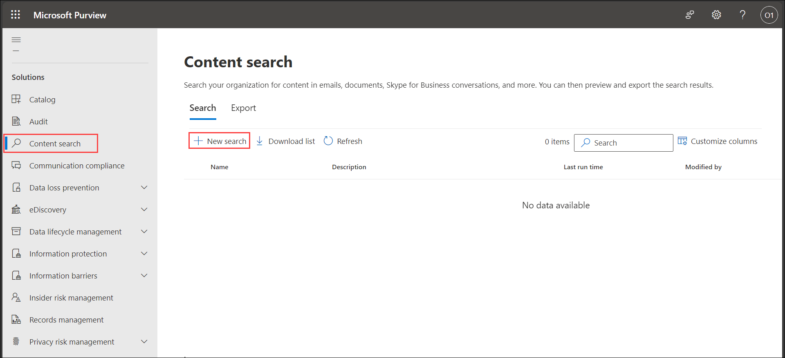

1. On the **Name and description** page, enter a name for the search, an optional description that helps identify the search. The name of the search must be unique in your organization. Select **Next**.

    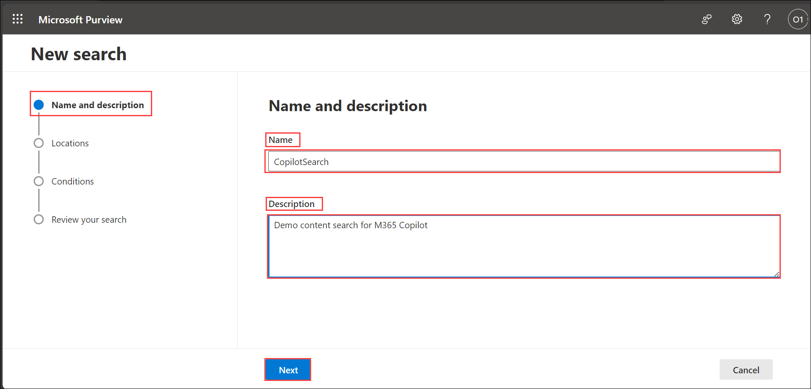

1. On the **Locations** page, choose the content locations that you want to search. You can search mailboxes, sites, and public folders. Select **Next**.

    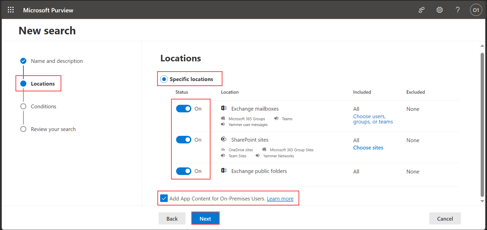

    - **Exchange mailboxes:** Set the toggle to **On**. The option to search all Exchange mailboxes is automatically selected. If needed, select **Choose users, groups, or teams** to specify the mailboxes to search. Use the search box to find user mailboxes and distribution groups. You can also search the mailbox associated with a Microsoft Team (for channel messages), Microsoft 365 Group, and Viva Engage Group. All Microsoft Copilot for Microsoft 365 activity data (user prompts and Copilot responses) generated in supported Microsoft 365 apps and services is stored in custodian mailboxes.

    - **SharePoint sites:** Set the toggle to **On**. The option to search all SharePoint sites is automatically selected. Select **Choose sites** to specify SharePoint sites and OneDrive sites to search. Enter the URL for each site that you want to search. You can also add the URL for the SharePoint site for a Microsoft Team, Microsoft 365 Group, or Viva Engage Group.

    - **Exchange public folders:** Set the toggle to **On**. The option to search all Exchange public folders is automatically selected to search all public folders in your Exchange Online organization. You can't choose specific public folders to search. Leave the toggle switch off if you don't want search all public folders.

    - **Add App Content for On-Premises Users:** Keep this checkbox selected to search for Teams content for on-premises users. For example, if you search all Exchange mailboxes in the organization and this checkbox is selected, the cloud-based storage used to store Teams chat data for on-premises users will be included in the scope of the search.

1. On the **Conditions** page, enter a keyword query and add conditions to the search query if necessary.

    - Specify keywords, message properties such as sent and received dates, or document properties such as file names or the date that a document was last changed. You can use more complex queries that use a Boolean operator, such as **AND, OR, NOT**, and **NEAR**. If you leave the keyword box empty, all content located in the specified content locations is included in the search results.

    - Alternatively, you can select the **Show keyword list** checkbox and the enter a keyword in each row. If you do this, the keywords on each row are connected by a logical operator (c:s) that is similar in functionality to the OR operator in the search query that's created.

    - You can add search conditions by selecting **Add condition** to narrow a search and return a more refined set of results. Each condition adds a clause to the search query that is created and run when you start the search. A condition is logically connected to the keyword query (specified in the keyword box) by a logical operator (c:c) that is similar in functionality to the AND operator. That means that items have to satisfy both the keyword query and one or more conditions to be included in the results. This is how conditions help to narrow your results.

    For **content search**, because user prompts to **Copilot** and responses from **Copilot** are stored in a user's mailbox, they can be searched and retrieved when the user's mailbox is selected as the source for a search query. Select and retrieve this data from the source mailbox by selecting **Add condition > Type > Copilot interactions**.

    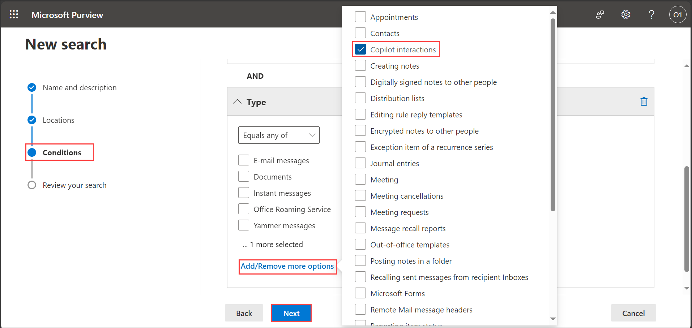
    
    Select **Next**.

1. Review the search settings, and then select **Submit** to start the search.

    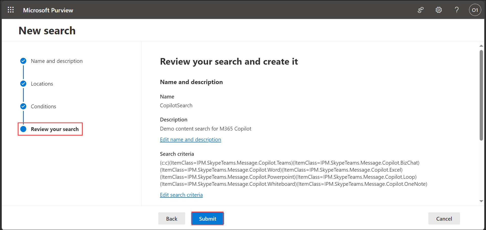

1. After some time, your Content search will be created. Click on **Done** and return to the **Content search** page.

    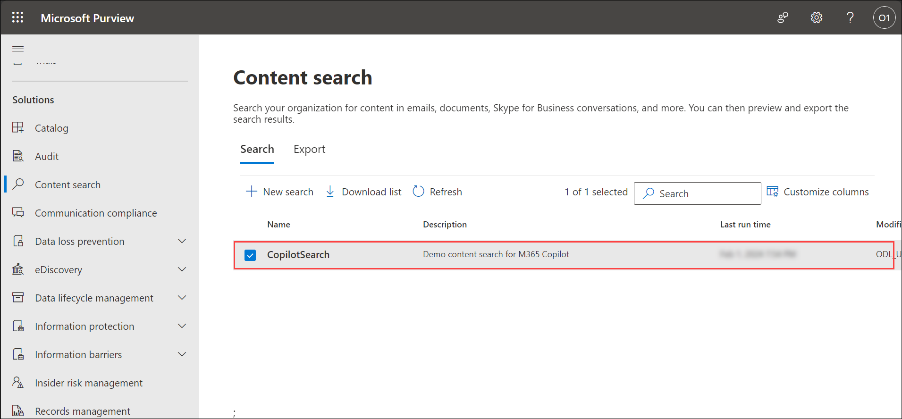

1. Select the newly created content search to see more details about it.

    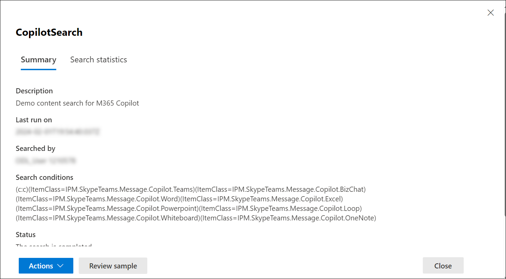

### Task 2: Exporting the report

After a **Content search** is successfully run, you can export the search report to your local computer. When you export a report, the report files are downloaded to a folder on your local computer that has the same name as the **Content Search**, but that's appended with **_ReportsOnly**. For example, if the Content Search is named **ContosoCase0815**, then the report is downloaded to a folder named **ContosoCase0815_ReportsOnly**.

Follow the given steps to download the content search report of your recently generated content search:

1. On the **Actions** menu at the bottom of the search flyout page of your Content search, select **Export report**.

    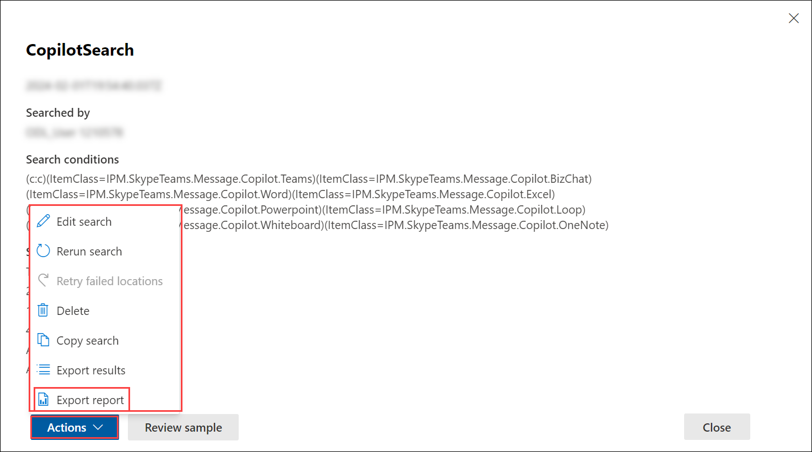

1. Under **Output** options, choose one of the following options:

    - **All items, excluding ones that have unrecognized format, are encrypted, or weren't indexed for other reasons:** This option only exports information about indexed items.

    - **All items, including ones that have unrecognized format, are encrypted, or weren't indexed for other reasons:** This option exports information about indexed and unindexed items.

    - **Only items that have an unrecognized format, are encrypted, or weren't indexed for other reasons.** This option only exports information about unindexed items.

    Select **Option 2** to include all the items.

    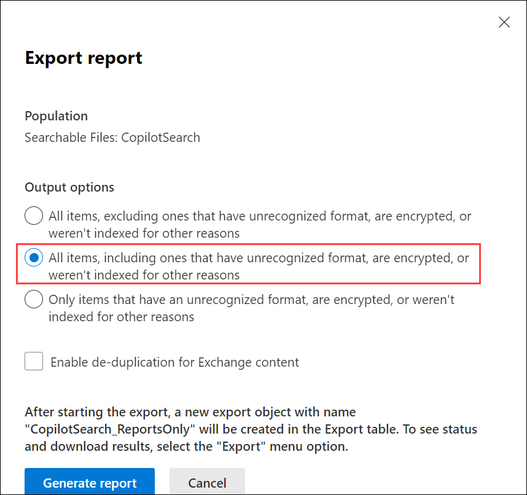

1. Select **Generate report**.

    The search reports are prepared for downloading, which means the report documents are uploaded to an Azure Storage location in the Microsoft cloud. This may take several minutes.

    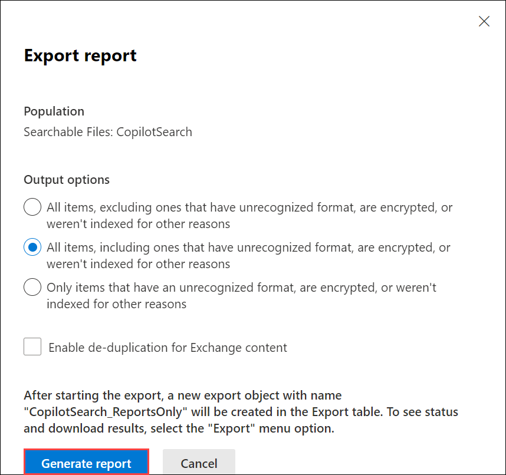

1. Click **Ok** when prompted.

    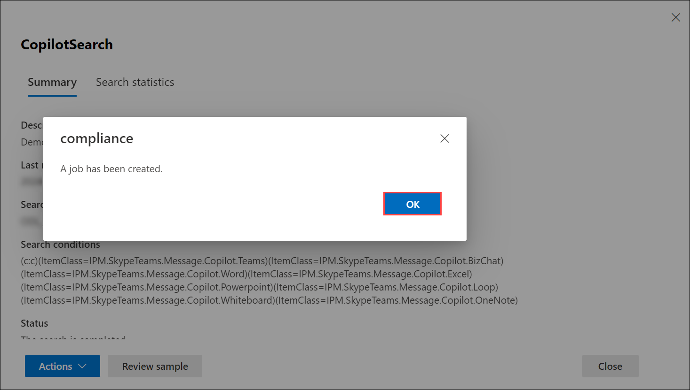

### Task 3: Downloading the report

Now, you need to download the report from the Azure Storage area to your local computer.

1. On the **Content search** page in the compliance portal, select the **Exports** tab.

    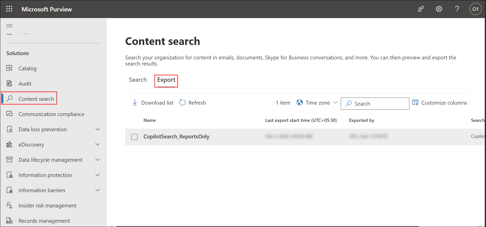

1. Select the export job that you created earlier, ending with **_ReportsOnly**.

    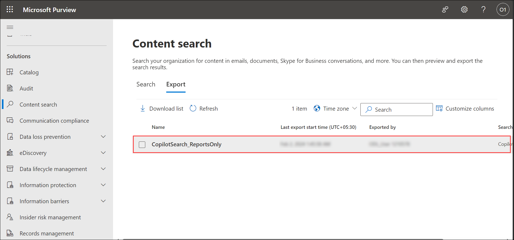

1. Under **Export Key** section, select **Copy to clipboard**. You will need this key to download the search report.

    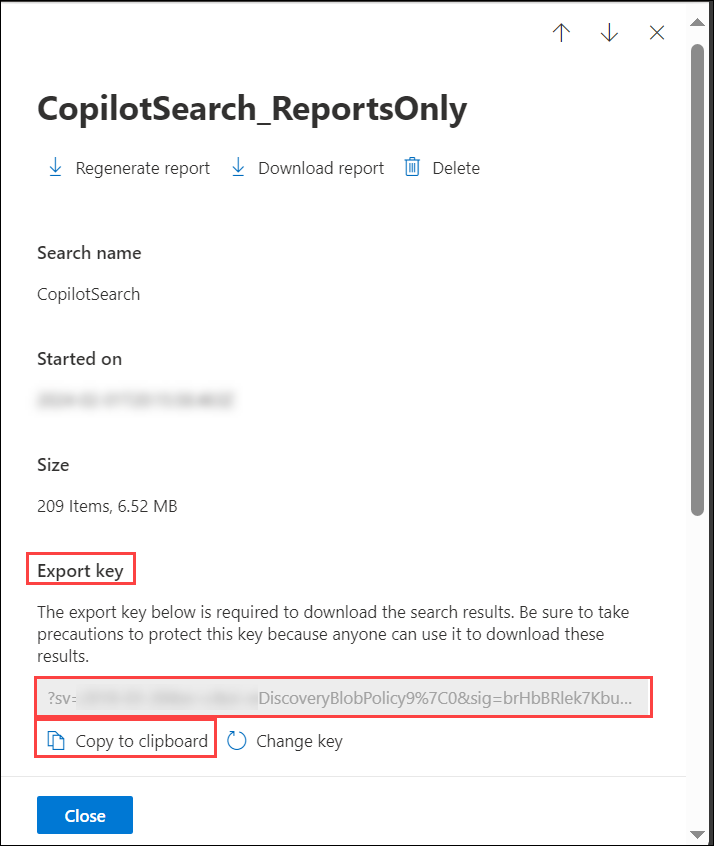

1. At the top of the flyout page, select **Download report**.

    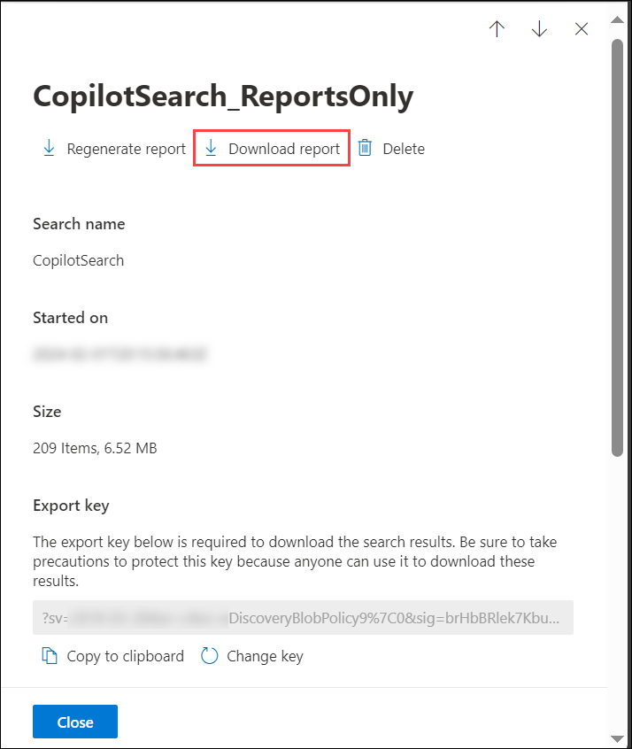

1. If you're prompted to install the **eDiscovery Export Tool**, select **Install**.

1. In the eDiscovery Export Tool, do the following:

    

    - Paste the export key that you copied in the appropriate box.

    - Select **Browse** to specify the location where you want to download the search report files.

1. Select **Start** to download the search results to your computer.

1. Once the report gets downloaded, goto the location of the downloaded folder and open it.

    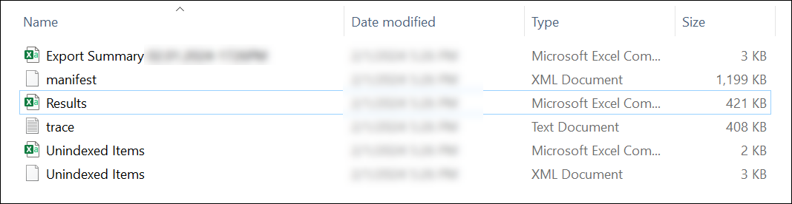

1. Open the **Results.csv** file and go through the report.

