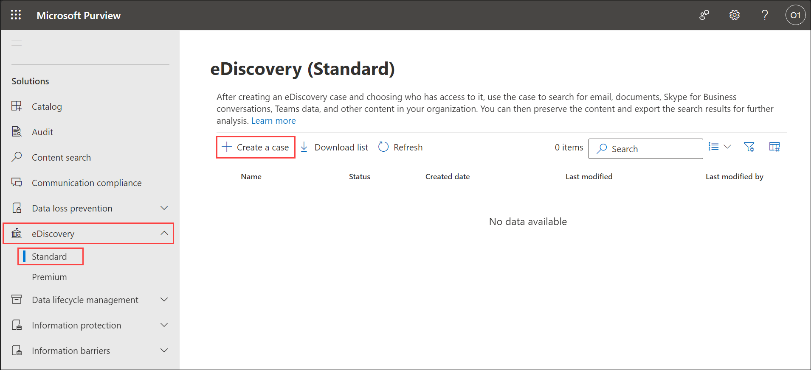
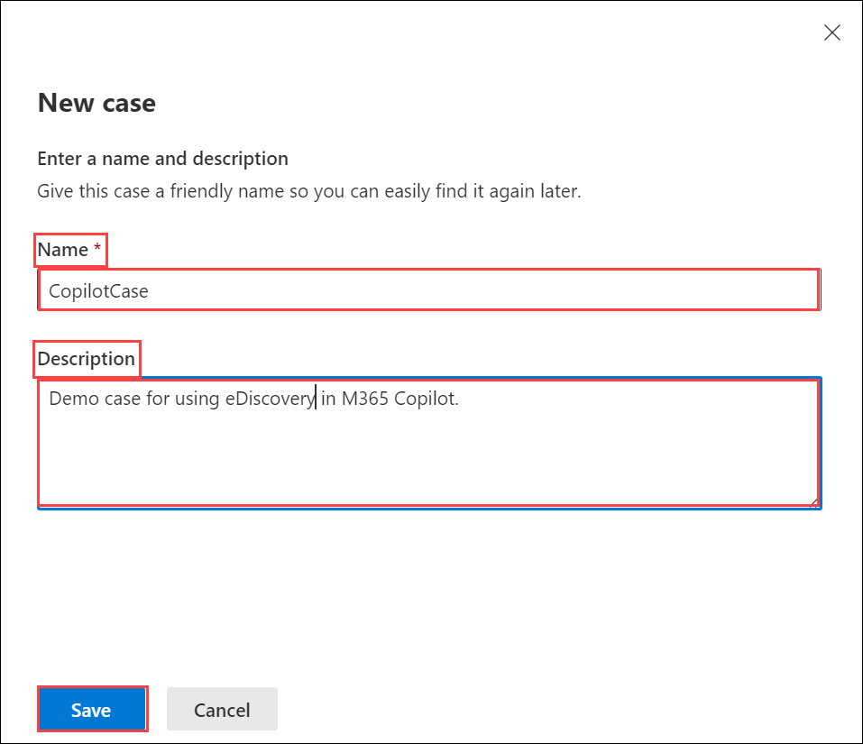
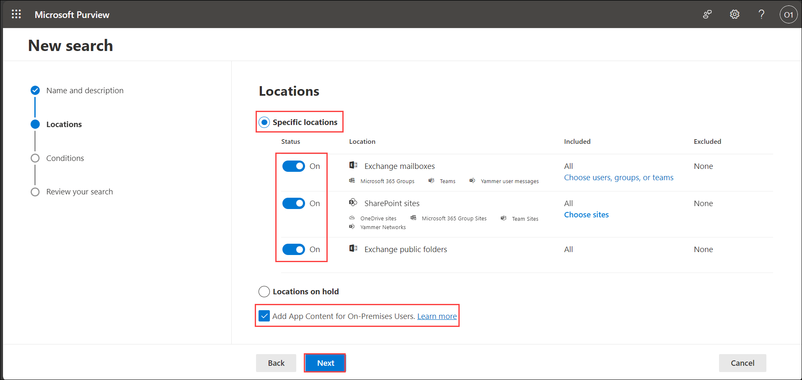
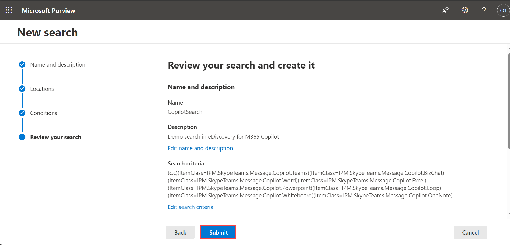
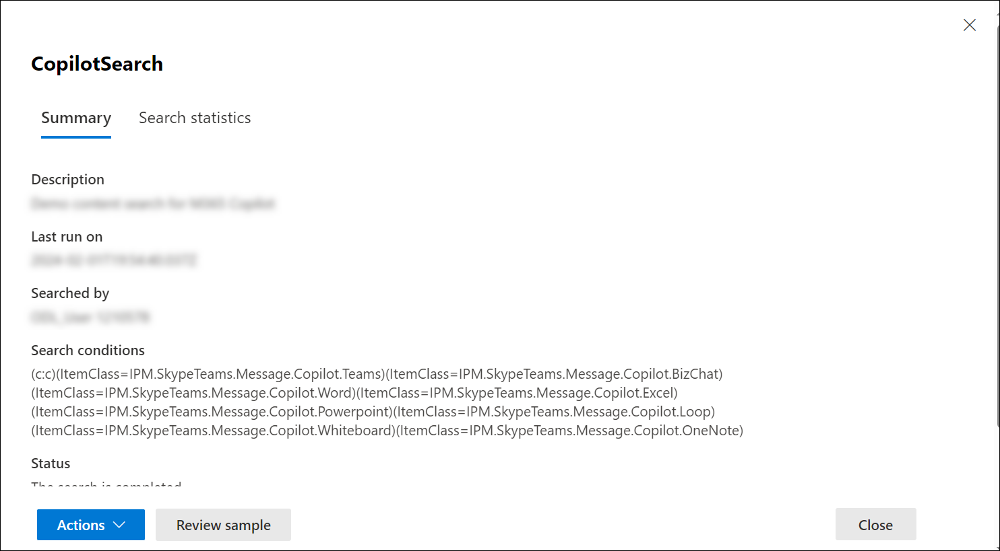
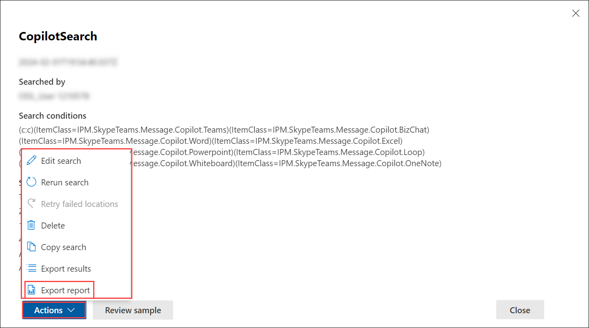
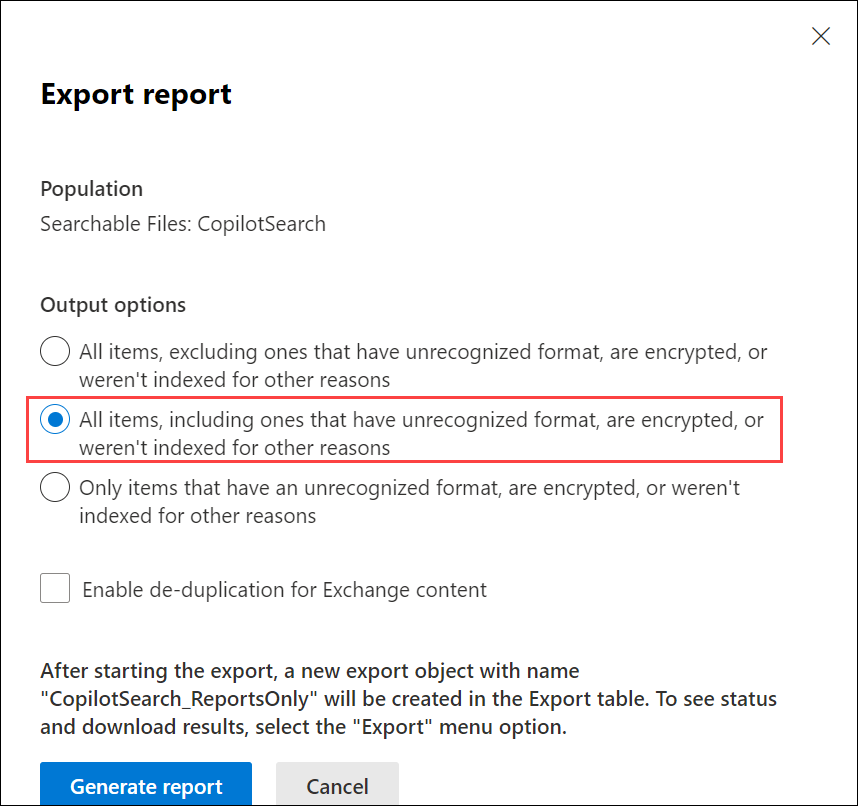
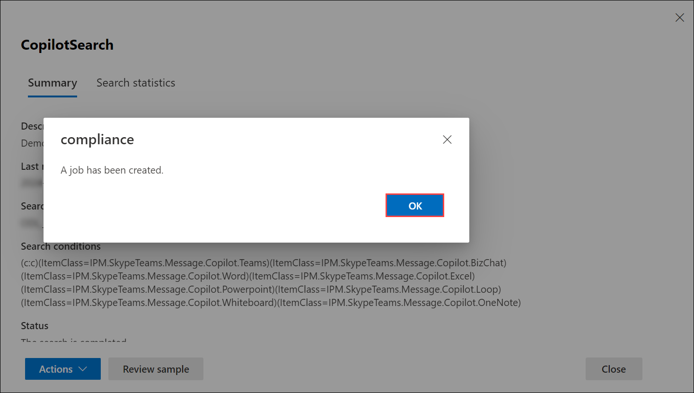
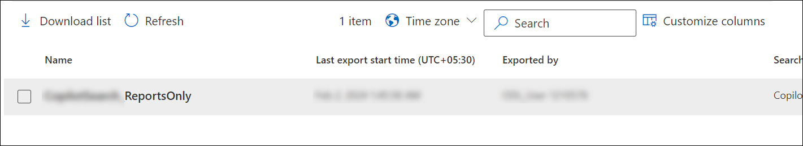
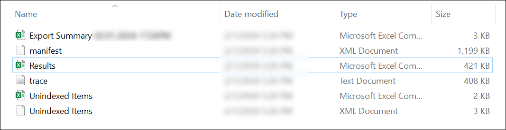

# Exercise 5.8: Reviewing Security and Compliance in Copilot Using eDiscovery (Read Only)

This exercise demonstrates how eDiscovery in Microsoft 365 Copilot helps manage and secure data by enabling searches, holds, and exports of relevant content.

## Overview

**Microsoft Copilot** is designed with security and compliance in mind. It does not store or share any of the user's data. It only uses the data or information that the user explicitly provides as input or context. It also respects the user's privacy and preferences, and does not collect any personal or sensitive information by itself.

Given below are the capabilities from Microsoft Purview which strengthen your data security and compliance for Microsoft Copilot for Microsoft 365:

## Using eDiscovery in M365 Copilot

**Microsoft Purview eDiscovery (Standard)** provides a basic eDiscovery tool that organizations can use to search and export content in Microsoft 365 and Office 365, including **M365 Copilot**. You can also use eDiscovery (Standard) to place an eDiscovery hold on content locations, such as Exchange mailboxes, SharePoint sites, OneDrive accounts, and Microsoft Teams.

When users within an organization leverage **Microsoft Copilot** to create prompt and response data, it may contain sensitive or confidential information, or evidence of intellectual property. Organizations need to have visibility and control over this data and be able to identify, preserve, collect, review and export it for legal, regulatory or data security investigation. That's why **Microsoft Purview eDiscovery** provides support for **Microsoft 365 Copilot interactions.**

**eDiscovery** has the ability to help with search, discovery, preservation, review and export of Copilot interactions in Microsoft 365 across Word, Excel, PowerPoint, Teams to name a few. It ensures these Copilot conversations are discoverable and actionable through the regular eDiscovery process. It also provides the ability to filter for specific Copilot interactions in the query building experience to make it easier to scope the searches.

>**Note:** You are not expected to perform the following steps. This information is provided solely to give you an understanding of the process of creating and using eDiscovery Cases in the Purview portal. Your access has been set to Global Reader, meaning you won't be able to make changes. These instructions are for viewing only, reflecting the read-only access granted in your environment.

### Task 1: Creating an eDiscovery Case

 Here are the steps to create a case on eDiscovery page in the **Microsoft Compliance portal**.

1. Navigate to the Environment details page and click on it. You will find M365 Copilot User Details tab. Click on the tab and copy the Username | Password provided there.

   

 1. Navigate to `https://compliance.microsoft.com/` and sign in using the **CloudLabs provided credentials**.

1. In the left navigation pane of the compliance portal, select **eDiscovery** and then, **Standard**.

    

1. On the **eDiscovery (Standard)** page, select **Create a case**.

    

1. On the **New case** flyout page, give the case a name (required) and then type an optional description. The case name must be unique in your organization.

    

1. Select **Save** to create the case.

### Optional Task: Creating an eDiscovery hold

After creating an eDiscovery case, you can place a hold (also called an **eDiscovery hold**) on the content locations of the people of interest in your investigation. Content locations include Exchange mailboxes, SharePoint sites, OneDrive accounts, and the mailboxes and sites associated with Microsoft Teams and Microsoft 365 Groups, along with **Microsoft 365 Copilot**. While this step is optional, creating an eDiscovery hold preserves content that may be relevant to the case during the investigation. When you create an **eDiscovery hold** you can preserve all content in specific content locations or you can create a query-based hold to preserve only the content that matches a hold query.

In addition to preserving content, another good reason to create **eDiscovery holds** is to quickly search the content locations on hold (instead of having to select each location to search) when you create and run searches in the next step. After you complete your investigation, you can release any hold that you created.

>**Note:** After you create an eDiscovery hold, it may take up to 24 hours for the hold to take effect.

To create an **eDiscovery hold** that's associated with a **eDiscovery (Standard) case**, follow the given steps:

1. Select the **eDiscovery case** that you created in the previous steps.

1. On the **Home** page for the case, select the **Hold** tab, and then select **Create**.

1. On the **Name your hold** wizard page, give the hold a name and add an optional description, and then select Next. The name of the hold must be unique in your organization.

1. On the **Choose locations** wizard page, choose the content locations that you want to place on hold. You can place mailboxes, sites, and public folders on hold.

    - **Exchange mailboxes:** Set the toggle to **On** and then select Choose users, groups, or teams to specify the mailboxes to place on hold. Use the search box to find user mailboxes and distribution groups (to place a hold on the mailboxes of group members) to place on hold. You can also place a hold on the associated mailbox for a Microsoft Team, Microsoft 365 group, and Viva Engage Group.

    - **SharePoint sites:** Set the toggle to **On** and then select Choose sites to specify SharePoint sites and OneDrive accounts to place on hold. Type the URL for each site that you want to place on hold. You can also add the URL for the SharePoint site for a Microsoft Team, Microsoft 365 group or a Yammer Group.

    - **Exchange public folders:** You can keep this toggle **Off**. You can't choose specific public folders to put on hold. Leave the toggle switch off if you don't want to put a hold on public folders.

    >**Note:** When adding **Exchange mailboxes** or **SharePoint sites** to a hold, you must explicitly add **at least one** content location to the hold. In other words, if you set the toggle to **On** for mailboxes or sites, you must select specific mailboxes or sites to add to the hold. **Otherwise**, the eDiscovery hold will be created but no mailboxes or sites will be added to the hold.

    Select **Next**.

1. To create a query-based hold using keywords or conditions, specifically for **Microsoft 365 Copilot** complete the following steps:

    - In the box under **Keywords**, type a query to preserve only the content that matches the query criteria. You can specify keywords, email message properties, or site properties, such as file names. You can also use more complex queries that use a Boolean operator, such as **AND**, **OR**, or **NOT**.

    - Select **Add condition** to add one or more conditions to narrow the query for the hold. Each condition adds a clause to the KQL search query that is created and run when you create the hold. For example, you can specify a date range so that email or site documents that were created within the date ranged are preserved. A condition is logically connected to the keyword query (specified in the **Keywords** box) and other conditions by the **AND** operator. That means items have to satisfy both the keyword query and the condition to be preserved.

    For creating a hold, because user prompts to **Copilot** and responses from **Copilot** are stored in a user's mailbox, they can be searched and retrieved when the user's mailbox is selected as the source for a search query. Select and retrieve this data from the source mailbox by selecting **Add condition > Type > Copilot interactions**.

    Select **Next**.

1. Review your settings, and then select **Submit**.

1. After some time, your **eDsiscovery hold** will be created. Click on **Done** and return to the **Hold** page.

1. Select your newly created hold and check it got created properly.

### Task 2: Creating a search in eDiscovery

After a **Microsoft Purview eDiscovery (Standard)** case is created, you can create and run one or more searches for content relevant to the case. Searches associated with a **eDiscovery (Standard)** case aren't listed on the Content search page in the **Microsoft Purview compliance portal**. These searches are listed on the **Searches** page of the **eDiscovery (Standard)** case the searches are associated with. This also means that searches associated with a case can only be accessed by case members.

To create a **eDiscovery (Standard)** search, follow the given steps:

1. Select the **eDiscovery case** that you created in the previous steps.

1. On the **Home** page for the case, select the **Searches** tab, and then select **New search**.

    

1. In the **New search** wizard, type a name for the search, and an optional description that helps identify the search. The name of the search must be unique in your organization. Select **Next**.

    

1. On the **Locations** page, choose the content locations that you want to search. You can search mailboxes, sites, and public folders.

    

    - **Exchange mailboxes:** Set the toggle to **On**. The option to put all Exchange mailboxes on hold is automatically selected. If you need to specify specific mailboxes to place on hold, **Choose users, groups, or teams**. Use the search box to find user mailboxes and distribution groups (to place a hold on the mailboxes of group members) to place on hold. You can also search the mailbox associated with a Microsoft Team (for channel messages), Office 365 Group, and Viva Engage Group. All Copilot activity data (user prompts and Copilot responses) generated in supported Microsoft 365 apps and services is stored in custodian mailboxes.

    - **SharePoint sites:** Set the toggle to **On**. The option to put all SharePoint sites on hold is automatically selected. If you need to specify specific SharePoint sites and OneDrive accounts to place on hold,  **Choose sites**. Type the URL for each site that you want to place on hold. You can also add the URL for the SharePoint site for a Microsoft Team, Office 365 Group, or Viva Engage Group.

    - **Exchange public folders:** Set the toggle to **On** to put all public folders in your Exchange Online organization on hold. You can't choose specific public folders to put on hold. Leave the toggle switch off if you don't want to put a hold on public folders.

    - **Add App Content for On-Premises Users:** Keep this checkbox selected to search for Teams content for on-premises users. For example, if you search all Exchange mailboxes in the organization and this checkbox is selected, the cloud-based storage used to store Teams chat data for on-premises users will be included in the scope of the search.

    >**Note:** Select the **Locations on hold** option ONLY if you have previously created any hold, to search all the content locations that have been placed on hold. If the case contains multiple eDiscovery holds, the content locations from all holds are searched when you select this option. Additionally, if a content location was placed on a query-based hold, only the items that match the hold query are searched when you run the search. In other words, only the content that matches both the hold criteria and the search criteria is returned with the search results.

    Select **Next**.

1. On the **Conditions** page, enter a keyword query and add conditions to the search query if necessary.

    - Specify keywords, message properties such as sent and received dates, or document properties such as file names or the date that a document was last changed. You can use more complex queries that use a Boolean operator, such as **AND, OR, NOT**, and **NEAR**. If you leave the keyword box empty, all content located in the specified content locations is included in the search results.

    - Alternatively, you can select the **Show keyword list** checkbox and the enter a keyword in each row. If you do this, the keywords on each row are connected by a logical operator (c:s) that is similar in functionality to the OR operator in the search query that's created.

    - You can add search conditions by selecting **Add condition** to narrow a search and return a more refined set of results. Each condition adds a clause to the search query that is created and run when you start the search. A condition is logically connected to the keyword query (specified in the keyword box) by a logical operator (c:c) that is similar in functionality to the AND operator. That means that items have to satisfy both the keyword query and one or more conditions to be included in the results. This is how conditions help to narrow your results.

    For **content search**, because user prompts to **Copilot** and responses from **Copilot** are stored in a user's mailbox, they can be searched and retrieved when the user's mailbox is selected as the source for a search query. Select and retrieve this data from the source mailbox by selecting **Add condition > Type > Copilot interactions**.

    
    
    Select **Next**.

1. Review the search settings, and then select **Submit** to start the search.

    

1. After some time, your Content search will be created. Click on **Done** and return to the **Content search** page.

1. Select the newly created content search to see more details about it.

    

### Task 3: Exporting the report

After a **Content search** is successfully run, you can export the search report to your local computer. When you export a report, the report files are downloaded to a folder on your local computer that has the same name as the **Content Search**, but that's appended with **_ReportsOnly**. For example, if the Content Search is named **ContosoCase0815**, then the report is downloaded to a folder named **ContosoCase0815_ReportsOnly**.

Follow the given steps to download the content search report of your recently generated content search:

1. On the **Actions** menu at the bottom of the search flyout page of your Content search, select **Export report**.

    

1. Under **Output** options, choose one of the following options:

    

    - **All items, excluding ones that have unrecognized format, are encrypted, or weren't indexed for other reasons:** This option only exports information about indexed items.

    - **All items, including ones that have unrecognized format, are encrypted, or weren't indexed for other reasons:** This option exports information about indexed and unindexed items.

    - **Only items that have an unrecognized format, are encrypted, or weren't indexed for other reasons.** This option only exports information about unindexed items.

    Select **Option 2** to include all the items.

1. Select **Generate report**.

    

    The search reports are prepared for downloading, which means the report documents are uploaded to an Azure Storage location in the Microsoft cloud. This may take several minutes.

1. Click **Ok** when prompted.

    

### Task 4: Downloading the report

Now, you need to download the report from the Azure Storage area to your local computer.

1. On the **eDiscovery** page in the compliance portal, select your case, and select the **Exports** tab.

1. Select the export job that you created earlier, ending with **_ReportsOnly**.

    

1. Under **Export Key** section, select **Copy to clipboard**. You will need this key to download the search report.

    

1. At the top of the flyout page, select **Download report**.

    

1. If you're prompted to install the **eDiscovery Export Tool**, select **Install**.

1. In the eDiscovery Export Tool, do the following:

    

    - Paste the export key that you copied in the appropriate box.

    - Select **Browse** to specify the location where you want to download the search report files.

1. Select **Start** to download the search results to your computer.

1. Once the report gets downloaded, goto the location of the downloaded folder and open it.

    

1. Open the **Results.csv** file and go through the report.

## Conclusion

In conclusion, the use of **eDiscovery in Microsoft Copilot** through Microsoft Purview is an integral part of ensuring robust security and compliance measures within Microsoft 365. This exercise has guided users through the process of creating an eDiscovery case, implementing holds on relevant content locations, and performing searches tailored to their investigative needs.

By following these steps, users are equipped with the knowledge and skills to leverage eDiscovery in **Microsoft Copilot** effectively, demonstrating a commitment to maintaining compliance, protecting sensitive data, and swiftly responding to legal or security requirements. The security and privacy principles inherent in **Microsoft Copilot** align with organizational needs, ensuring a balance between innovation and data governance.

## Summary

The exercise covered the use of eDiscovery in Microsoft 365 Copilot for security and compliance. You learned how to create eDiscovery cases, place holds on content locations, and perform searches for Copilot interactions. This process helps organizations manage sensitive data and comply with legal and regulatory requirements. The steps also include exporting and downloading search reports, ensuring that data management and compliance are effectively maintained.
