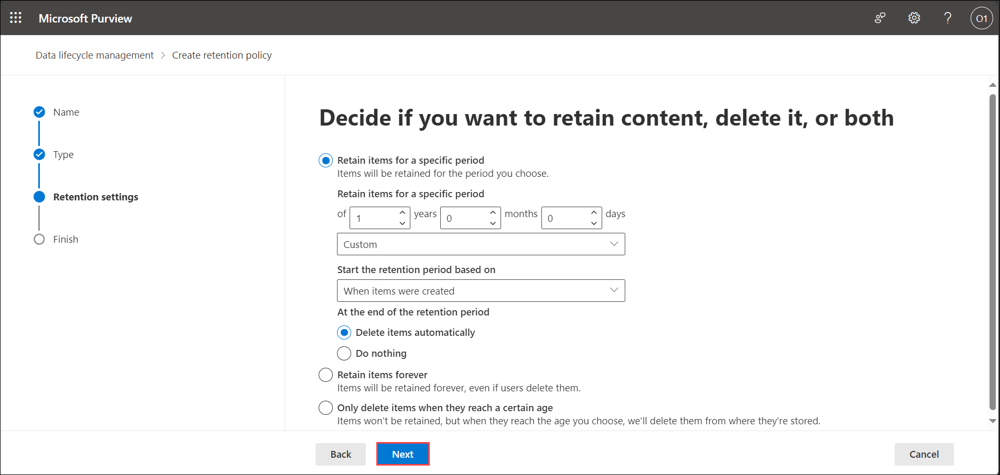

# Exercise 5.9: Reviewing Security and Compliance in Copilot using Retention Policies (Read Only)

This exercise focuses on using Retention Policies in Microsoft 365 Copilot to manage data retention and deletion, ensuring compliance and data security.

## Introduction

**Microsoft Copilot** is designed with security and compliance in mind. It does not store or share any of the user's data. It only uses the data or information that the user explicitly provides as input or context. It also respects the user's privacy and preferences, and does not collect any personal or sensitive information by itself.

Given below are the capabilities from Microsoft Purview which strengthen your data security and compliance for Microsoft Copilot for Microsoft 365:

## Retention and Deletion in Microsoft 365 Copilot

You can use a retention policy to retain data from messages in **Microsoft Copilot for Microsoft 365**, and delete those messages. Behind the scenes, Exchange mailboxes are used to store data copied from these messages. Data from **Copilot** messages is stored in a hidden folder in the mailbox of the user who runs **Copilot**. This hidden folder isn't designed to be directly accessible to users or administrators, but instead, store data that compliance administrators can search with **eDiscovery tools**.

The Exchange mailbox for retaining **Microsoft Copilot for Microsoft 365** messages has the RecipientTypeDetails attribute of **UserMailbox**, which also stores message data for **Teams** private channels and cloud-based **Teams** users. The copy is retained in a hidden folder named **SubstrateHolds** as a subfolder in the Exchange **Recoverable Items** folder.

After a retention policy is configured for **Microsoft Copilot for Microsoft 365** interactions, a timer job from the Exchange service periodically evaluates items in the hidden mailbox folder where these messages are stored. The timer job typically takes **1-7 days** to run. When these items have expired their retention period, they're moved to the SubstrateHolds folder—another hidden folder that's in every user mailbox to store "soft-deleted" items before they're permanently deleted. After a **retention policy** is configured for **Microsoft Copilot for Microsoft 365**, the paths the content takes depend on whether the retention policy is to retain and then delete, to retain only, or delete only.

The following diagram represents the flow in details:

For the two paths in the diagram:

1. **If messages are removed from Copilot**, the message is moved to the SubstrateHolds folder where it remains for at least 1 day. When the retention period expires, the message is permanently deleted the next time the timer job runs (typically between 1-7 days).

1. **If messages remain in Copilot** after the retention period expires, the message is copied to the SubstrateHolds folder. This action typically takes between 1-7 days from the expiry date. When the message is in the SubstrateHolds folder, it's stored there for at least 1 day, and then the message is permanently deleted the next time the timer job runs (typically between 1-7 days).

>**Note:** Messages stored in mailboxes, including the hidden folders, are searchable by **eDiscovery tools**. Until messages are permanently deleted from the SubstrateHolds folder, they remain searchable by **eDiscovery tools**.

When the retention period expires and copies a message to the SubstrateHolds folder, a delete operation is communicated to the backend service for Copilot, that then relays the same operation to the user app with Copilot. Delays in this communication or caching can explain why, for a short period of time, users continue to see these messages in Copilot.

### Content paths for retain-only retention policy

1. **If messages are removed from Copilot** the message is moved to the SubstrateHolds folder after the retention period expires. This action typically takes between 1-7 days from the expiry date. If the retention policy is configured to retain forever, the item remains there. If the retention policy has an end date for the retention period and it expires, the message is permanently deleted the next time the timer job runs (typically between 1-7 days).

1. **If messages remain in Copilot** after the retention period expires, nothing happens before and after the retention period; the message remains in its original location.

### Content paths for delete-only retention policy

1. **If messages are removed from Copilot** during the retention period, the message is moved to the SubstrateHolds folder. The message is stored in the SubstrateHolds folder for at least 1 day and permanently deleted the next time the timer job runs (typically between 1-7 days).

1. **If messages remain in Copilot** after the retention period expires, the message is copied to the SubstrateHolds folder. This action typically takes between 1-7 days from the expiry date. The message is retained there for at least 1 day and then permanently deleted the next time the timer job runs (typically between 1-7 days).

### Creating and Configuring Retenetion Policies

>**Note:** You are not expected to perform the following steps. This information is provided solely to give you an understanding of the process of creating and using Retention Policies in the Purview portal.  Your access has been set to Global Reader, meaning you won't be able to make changes. These instructions are for viewing only, reflecting the read-only access granted in your environment.

A **retention policy** lets you manage the data for your organization by deciding proactively whether to retain content, delete content, or retain and then delete the content very efficiently by assigning the same retention settings at the container level to be automatically inherited by content in that container. For example, retention policies for the location **Teams chats and Copilot interactions** include user prompts to **Microsoft Copilot for Microsoft 365**, and the Copilot responses to users. These messages can be retained and deleted for compliance reasons.

To create a retention policy to for all the interactions with **Microsoft 365 Copilot**, follow the given steps:

1. Navigate to the Environment details page and click on it. You will find M365 Copilot User Details tab. Click on the tab and copy the Username | Password provided there.

   

1. Navigate to `https://compliance.microsoft.com/` and sign in using the **CloudLabs provided credentials**.

1. In the left navigation pane of the compliance portal, select **Data lifecycle management** and then, **Microsoft 365**.

    

1. Under **Retention policies** tab, select **New retention policy** to start creating a new retention policy.

    

1. Provide the name and description of your retention policy in the appropriate boxes, and select **Next**.

    

1. On the **Administrative Units** page, click **Next** by keeping the default of **Full directory**.

1. For the **Choose the type of retention policy to create** page, select **Static** and then, **Next** to select the locations (**Microsoft 365 Copilot**) manually, for which you want the retention policy to be applied.

    

    Deselect all the locations and select **Teams chats and Copilot interactions** ONLY to apply the policy on **Copilot for Microsoft 365**, and its all user prompts to Copilot and all Copilot responses. Select **Next**.

    

    >**Note:** By default, all teams and all users are selected, but you can refine this by selecting the **Choose** and **Exclude** options.

1. For **Decide if you want to retain content, delete it, or both** page, specify the configuration options for retaining and deleting content. You can also provide your custom period by choosing **Custom** from the drop-down menu and specifying the period after that.

    

    You can create a retention policy that just retains content without deleting, retains and then deletes after a specified period of time, or just deletes content after a specified period of time. Select **Next**.

1. On the **Review and Finish** page, review your settings and select **Submit**. Select **Done** when required.

    

1. Select your recently created policy to see it in details and also check its status.

    

    >**Note:** When you create and submit a retention policy, it can take up to seven days for the retention policy to be applied.

If a user leaves your organization and their **Microsoft 365 account** is deleted, their **Copilot** messages that are subject to retention are stored in an inactive mailbox. The Copilot messages remain subject to any retention policy that was placed on the user before their mailbox was made inactive, and the contents are available to an **eDiscovery search**.

## Conclusion

In conclusion, the integration of **Retention Policies with Microsoft Copilot for Microsoft 365** plays a crucial role in enhancing security and compliance measures. By utilizing retention policies, organizations can retain, delete, or apply a combination of retention and deletion to Copilot messages. The detailed content paths for various scenarios, such as messages being removed or remaining in Copilot after the retention period, provided clarity on the lifecycle of Copilot messages.

By completing this lab, users are now equipped with the knowledge and skills to leverage retention policies effectively in the context of **Microsoft Copilot**. This ensures that organizations can meet compliance requirements, manage data lifecycle efficiently, and uphold the highest standards of security and privacy within the **Microsoft 365** environment.

## Summary

The exercise explains how Retention Policies in Microsoft 365 Copilot help manage data by retaining or deleting Copilot messages based on policy settings. Copilot interactions are stored in a hidden Exchange mailbox folder, and their retention or deletion follows a specific path depending on the policy configuration. You learned how to create and configure retention policies, apply them to Copilot interactions, and understand their impact on data lifecycle management. This process supports compliance, data governance, and security within Microsoft 365
