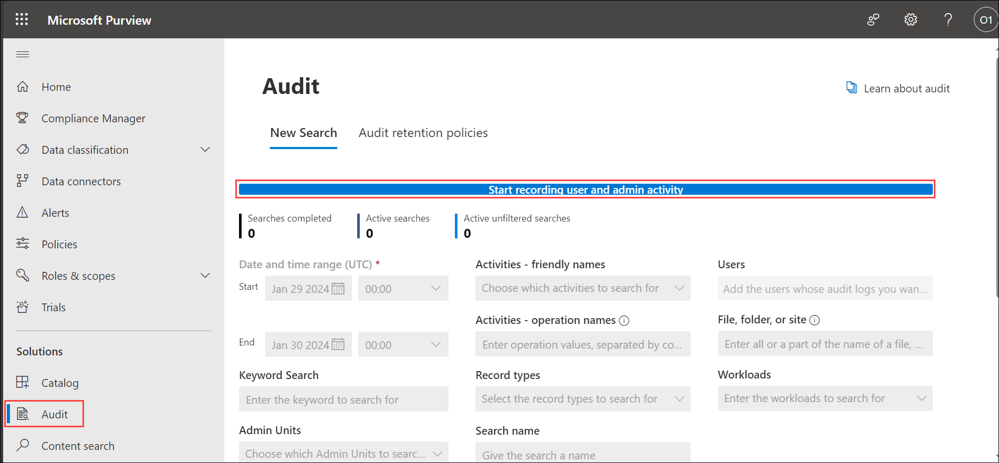
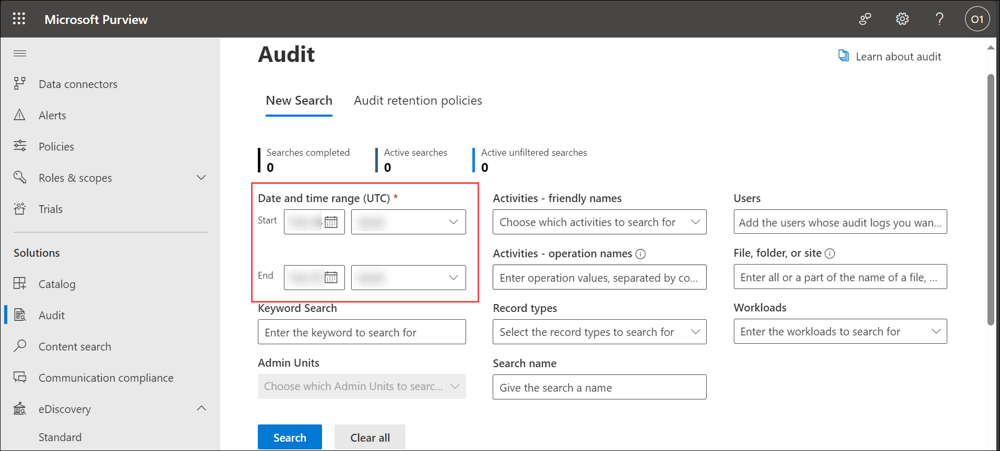
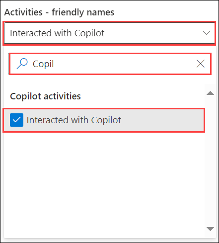
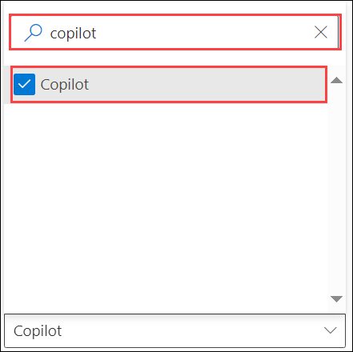
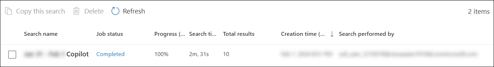
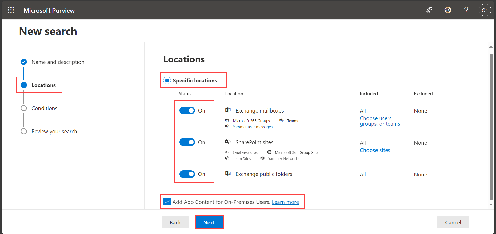
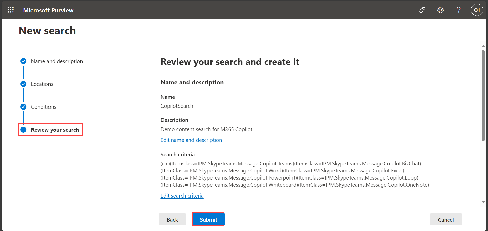
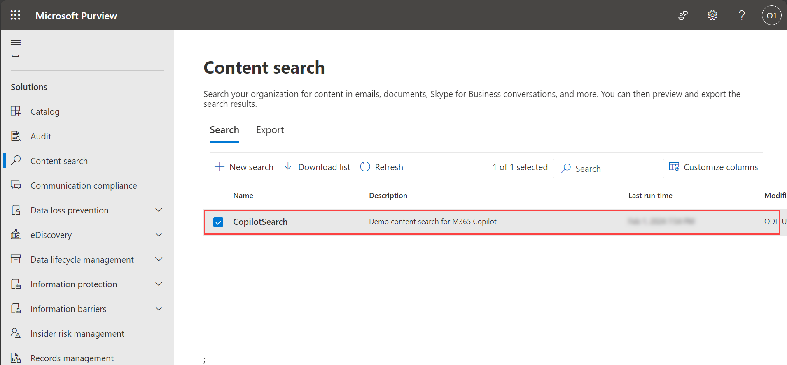
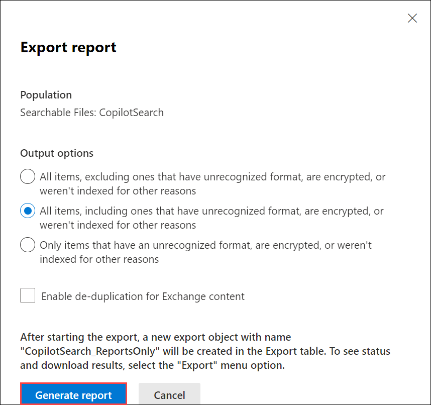
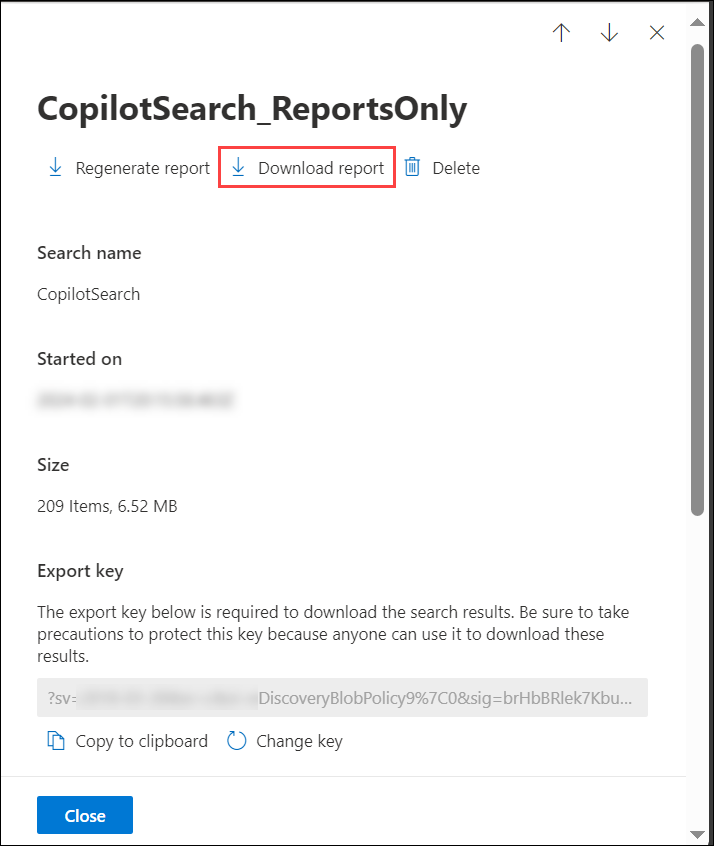

# Reviewing Security and Compliance in Copilot

## Introduction

**Microsoft Copilot** is designed with security and compliance in mind. It does not store or share any of the user's data. It only uses the data or information that the user explicitly provides as input or context. It also respects the user's privacy and preferences, and does not collect any personal or sensitive information by itself.

Given below are the capabilities from Microsoft Purview whcih strengthen your data security and compliance for Microsoft Copilot for Microsoft 365:

## Task 1: Using Sensitivity Labels in MS 365 Copilot

**Sensitivity labels** from Microsoft Purview Information Protection let you classify and protect your organization's data, while making sure that user productivity and their ability to collaborate isn't hindered.

Sensitivity labels offer the following capabilities:

1. **Customiable:** Specific to your organization and business needs, you can create categories for different levels of sensitive content in your organization. For example, Personal, Public, General, Confidential, and Highly Confidential.

1. **Clear Text:** Because a label is stored in clear text in the metadata for files and emails, third-party apps and services can read it and then apply their own protective actions, if required.

1. **Persistent**: Because the label is stored in metadata for files and emails, the label stays with the content, no matter where it's saved or stored. The label identification that's unique to your organization becomes the basis for applying and enforcing policies that you configure.

The sensitivity labels that you use to protect your organization's data are recognized and used by **Microsoft Copilot for Microsoft 365** to provide an extra layer of protection. For example, in Microsoft Copilot Graph-grounded chat conversations that can reference data from different types of items, the sensitivity label with the highest priority (typically, the most restrictive label) is visible to users. Similarly, when sensitivity label inheritance is supported by Copilot, the sensitivity label with the highest priority is selected.

If the labels applied encryption from Microsoft Purview Information Protection, Copilot checks the usage rights for the user. Only if the user is granted permissions to copy (the **EXTRACT** usage right) from an item, is data from that item returned by Copilot.

In short, the user that uses **Microsoft Copilot**, cannot access labeled documents where he/she has not been added to the permissions for the label. When the user has been added to the permissions, with either Reviewer or Viewer permission, then the document can also not be accessed.

In summary, **Microsoft 365 Copilot** is more stringent when handling encrypted documents with a sensitivity label. As you will need either custom permissions or at least the Co-author role, sensitive information is safeguarded. Provided, of course, that:

1. you have sensitivity labels employed within the enterprise;
1. you have set the right level of permissions to the labels;
1. you are protecting your most sensitive information using labels.

## Task 2: Using Data Classification in MS 365 Copilot

**Data classification** plays a critical role in helping businesses organize and safeguard their data. Sorting information by its level of sensitivity — like personally identifiable information or confidential records — lets organizations put in place tailored security measures against unauthorized intrusion and data leaks. Additionally, data classification enables businesses to comply with industry regulations and legal requirements by helping ensure that sensitive information is handled appropriately.

**Data classification** forms the foundation needed for Copilot to function efficiently. By accurately categorizing data, Copilot can provide more precise recommendations, making the classification process faster and more reliable. **Copilot** uses AI and ML technologies to make the categorization of data automated and more efficient. By integrating with existing data management systems, such as SharePoint or OneDrive, Copilot analyses the content of documents and automatically assigns appropriate classification labels. This automation eliminates the need for manual classification, saving time and reducing the risk of human error.

One of the key benefits of Copilot is its ability to learn from user interactions. As users review and validate the classification suggestions Copilot provides, the system becomes more accurate over time, resulting in improved classification outcomes. This iterative learning process ensures that the system aligns with each organization's specific needs and requirements, making it an asset for data management.

### Preparing your data for Copilot

Before deploying Copilot, it is essential to prepare your data to maximize its effectiveness. Consider the following guidelines for effective preparation:

- **Data inventory and analysis:** Conduct a comprehensive inventory of your data and analyze its content to identify patterns and commonalities. This step will help in defining appropriate classification categories and labels.

- **Data cleansing and normalization:** Cleanse and normalize your data by removing duplicates, standardizing formats, removing old or legacy versions and ensuring consistency. This process will improve classification accuracy and optimize Copilot's performance by enabling it to surface accurate data.

- **Engage stakeholders:** Involve key stakeholders, such as legal, compliance and IT teams, in the data preparation process. Their input will ensure the classification process aligns with regulatory requirements and organizational policies.

- **Training and awareness:** Provide training and awareness sessions to users and administrators about the importance of data classification and how to effectively use Copilot. This approach will facilitate a smooth transition and increase user adoption. In addition, utilize organizational change management strategies to champion the process and educate the workforce on how data classification and sanitization can expedite Copilot’s ingestion of the data.

## Task 3: Using Customer Keys in Microsoft 365 Copilot

A **Customer Key** provides extra protection against viewing of data by unauthorized systems or personnel, and complements BitLocker disk encryption and SSE in Microsoft data centers. It helps you meet regulatory or compliance obligations for controlling root keys. You explicitly authorize Microsoft 365 services to use your encryption keys to provide value added cloud services, such as eDiscovery, anti-malware, anti-spam, search indexing, and so on.

Customer Key is built on service encryption and lets you provide and control encryption keys. Microsoft 365 then uses these keys to encrypt your data at rest and helps you meet compliance obligations because you control the encryption keys that Microsoft 365 uses to encrypt and decrypt data.

When you revoke access to your keys as part of leaving the service, the availability key is deleted, resulting in cryptographic deletion of your data. Cryptographic deletion mitigates the risk of data remanence, which is important for meeting both security and compliance obligations.

As with other Microsoft 365 services, such as eDiscovery and search, items encrypted with Microsoft Purview Customer Key are supported and eligible to be returned by **Copilot for Microsoft 365**.

### Encryption Ciphers used by Customer Key

Customer Key uses various encryption ciphers to encrypt keys as shown in the following figure:

## Task 4: Communication Compliance in Microsoft 365 Copilot

**Communication Compliance** is an insider risk solution that helps minimize communication risks by helping you detect, capture, and act on potentially inappropriate messages in your organization. Pre-defined and custom policies allow you to check internal and external communications for policy matches so they can be examined by designated reviewers. Reviewers can investigate email, Microsoft Teams, Microsoft Copilot for Microsoft 365, Viva Engage, or third-party communications in your organization and take appropriate actions to make sure they're compliant with your organization's message standards.

**Communication compliance policies in Microsoft 365** help you overcome many modern challenges associated with compliance and internal and external communications, including:

- Checking increasing types of communication channels
- The increasing volume of message data
- Regulatory enforcement and the risk of fines

### Scenarios for Communication Compliance

**Communication compliance policies** can assist with reviewing messages in your organization in several important compliance areas:

- **Corporate policies**: Users must comply with acceptable use, ethical standards, and other corporate policies in all their business-related communications. Communication compliance policies can detect policy matches and help you take corrective actions to help mitigate these types of incidents. For example, you could check user communications in your organization for human resources concerns such as harassment or the use of potentially inappropriate or offensive language.

- **Risk Management**: Organizations are responsible to all communications distributed throughout their infrastructure and corporate network systems. Using communication compliance policies to help identify and manage potential legal exposure and risk can help minimize risks before they can damage corporate operations. For example, you could check messages in your organization for unauthorized communications and conflicts of interest about confidential projects such as upcoming acquisitions, mergers, earnings disclosures, reorganizations, or leadership team changes.

- **Regulatory compliance**: Most organizations must comply with some type of regulatory compliance standards as part of their normal operating procedures. These regulations often require organizations to implement some type of scoping or oversight process for messaging that is appropriate for their industry. For example:

    - **The Financial Industry Regulatory Authority (FINRA) Rule 3110** is a requirement for organizations to have scoping procedures in place to check user communications and the types of businesses in which it engages.
    - Another example may be a need to review broker-dealer communications in your organization to safeguard against potential insider trading, collusion, or bribery activities.

Communication compliance policies can help your organization meet these requirements by providing a process to both analyze and report on corporate communications.

### Microsoft Copilot for Microsoft 365

Communication compliance provides support for **Microsoft Copilot for Microsoft 365**. You can use communication compliance to analyze interactions (prompts and responses) entered into Copilot to detect for inappropriate or risky interactions or sharing of confidential information.

The following **Copilot apps** are supported by communication compliance:

- Teams (chats/channels/meetings) Copilot
- Word Copilot
- PowerPoint Copilot
- Excel Copilot
- OneNote Copilot
- Loop Copilot
- Whiteboard Copilot
- Microsoft 365 Chat in Teams
- Microsoft 365 Chat in Bing

Any prompt or response entered into a supported Copilot app that matches a communication compliance policy is displayed as a policy match on the Policies page on the Pending tab, with separate entries for prompts and responses. If only the prompt or only the response matches a policy, an item is created on the Pending tab just for that policy match. You can remediate policy matches for Copilot in the same way that you remediate any other policy match.

The following information is displayed for each item on the **Pending** tab for Copilot policy matches:

- **Copilot icon:** The Copilot icon identifies the policy match as a Copilot interaction.
- **Subject column:** The value in this column identifies the policy match as a Copilot interaction and lists the name of the app that was used. For example: "Copilot in Excel".
- **Sender column:** Sender of the message. If the policy match is a response from Copilot, the value is "Copilot".
- **Recipient column:** Recipients included in the message. If the policy match is a prompt to Copilot, the value is "Copilot".
- **Message text:** The message text that the user entered (the text that caused the policy match) is shown on the right side of the screen in its entirety.

## Task 5: Auditing in Microsoft 365 Copilot

Microsoft Purview auditing solutions provide an integrated solution to help organizations effectively respond to security events, forensic investigations, internal investigations, and compliance obligations. Thousands of user and admin operations performed in dozens of Microsoft 365 services including **M365 Copilot** and solutions are captured, recorded, and retained in your organization's unified audit log. Audit records for these events are searchable by security ops, IT admins, insider risk teams, and compliance and legal investigators in your organization. This capability provides visibility into the activities performed across your **Microsoft 365 organization**.

For **auditing in M365 Copilot**, details are captured when users interact with Copilot. Events include how and when users interact with Copilot, in which Microsoft 365 service the activity took place, and references to the files stored in Microsoft 365 that were accessed during the interaction. If these files have a sensitivity label applied, that's also captured.

### Accessing the M365 Copilot Logs

Copilot events can be accessed in the **Audit** solution from the **Microsoft Purview compliance portal**.

1. Navigate to `https://compliance.microsoft.com/` and sign in using the CloudLabs provided credentials.

1. In the left navigation pane of the compliance portal, select **Show all** and then select **Audit**.

1. Select **Start recording user and admin activity** to configure the Audit logging activities, and grant confirmation, if required.

    

1. On the **Audit** page, configure the search using the following conditions on the **New Search** tab.

    - **Date and time range:** Select a date and time range to display the activities that occurred within that period. The date and time are presented in Coordinated Universal Time (UTC). The last seven days are selected by default.
    
        

    - **Activities:** Select the activities to search for. Use the search box to search for activities to add to the list. Leave this box blank to return entries for all audited activities. To search for **Copilot events**, select **Copilot activities** and **Interacted with Copilot**.

        

        You can also select Copilot as a workload.

        

    - **Users:** Select this box and start typing the name of users to display search results for. The audit log entries for the selected activities performed by the users you select in this box are displayed in the list of results. Leave this box blank to return entries for all users (and service accounts) in your organization.

1. Select **Search** to run the search.

1. The audit log search starts running. When the search is completed, audit records are displayed on the page. Select a record to display a flyout page with detailed properties.

    

1. The screen gets displayed showing all the record entries of the required type.

1. Click on any entry to see it in more details.

    

1. If you want to download the results as a report to your local system, select **Export** on the top of the Audit search results page and choose **Downloads file**.

    

## Task 6: Using Content Search in Microsoft 365 Copilot

You can use the Content search eDiscovery tool in the **Microsoft Purview compliance portal** to search for in-place content such as email, documents, and instant messaging conversations including the responses with **M365 Copilot** in your organization.

After you run a search, the number of content locations and an estimated number of search results are displayed on the search flyout page. You can quickly view statistics, such as the content locations that have the most items that match the search query. After you run a search, you can preview the results or export them to a local computer.

When a user interacts with **Microsoft Copilot for Microsoft 365** apps (such as Word, PowerPoint, Excel, OneNote, Loop, or Whiteboard), data about these interactions is stored. The stored data includes the user's prompt, how Copilot responded, and information used to ground Copilot's response. **For example**, this stored data provides users with Copilot interaction history in Microsoft Copilot with Graph-grounded chat and meetings in Microsoft Teams. This data is processed and stored in alignment with contractual commitments with your organization’s other content in Microsoft 365. The data is encrypted while it's stored and isn't used to train foundation LLMs, including those used by **Microsoft Copilot for Microsoft 365**.

### Task 6.1: Creating and running a Search

1. Navigate to `https://compliance.microsoft.com/` and sign in using the **CloudLabs provided credentials**.

1. In the left navigation pane of the compliance portal, select **Content search**.

1. On the **Content search** page, select **New search**.

    

1. On the **Name and description** page, enter a name for the search, an optional description that helps identify the search. The name of the search must be unique in your organization. Select **Next**.

    

1. On the **Locations** page, choose the content locations that you want to search. You can search mailboxes, sites, and public folders. Select **Next**.

    

    - **Exchange mailboxes:** Set the toggle to **On**. The option to search all Exchange mailboxes is automatically selected. If needed, select **Choose users, groups, or teams** to specify the mailboxes to search. Use the search box to find user mailboxes and distribution groups. You can also search the mailbox associated with a Microsoft Team (for channel messages), Microsoft 365 Group, and Viva Engage Group. All Microsoft Copilot for Microsoft 365 activity data (user prompts and Copilot responses) generated in supported Microsoft 365 apps and services is stored in custodian mailboxes.

    - **SharePoint sites:** Set the toggle to **On**. The option to search all SharePoint sites is automatically selected. Select **Choose sites** to specify SharePoint sites and OneDrive sites to search. Enter the URL for each site that you want to search. You can also add the URL for the SharePoint site for a Microsoft Team, Microsoft 365 Group, or Viva Engage Group.

    - **Exchange public folders:** Set the toggle to **On**. The option to search all Exchange public folders is automatically selected to search all public folders in your Exchange Online organization. You can't choose specific public folders to search. Leave the toggle switch off if you don't want search all public folders.

    - **Add App Content for On-Premises Users:** Keep this checkbox selected to search for Teams content for on-premises users. For example, if you search all Exchange mailboxes in the organization and this checkbox is selected, the cloud-based storage used to store Teams chat data for on-premises users will be included in the scope of the search.

1. On the **Conditions** page, enter a keyword query and add conditions to the search query if necessary.

    - Specify keywords, message properties such as sent and received dates, or document properties such as file names or the date that a document was last changed. You can use more complex queries that use a Boolean operator, such as **AND, OR, NOT**, and **NEAR**. If you leave the keyword box empty, all content located in the specified content locations is included in the search results.

    - Alternatively, you can select the **Show keyword list** checkbox and the enter a keyword in each row. If you do this, the keywords on each row are connected by a logical operator (c:s) that is similar in functionality to the OR operator in the search query that's created.

    - You can add search conditions by selecting **Add condition** to narrow a search and return a more refined set of results. Each condition adds a clause to the search query that is created and run when you start the search. A condition is logically connected to the keyword query (specified in the keyword box) by a logical operator (c:c) that is similar in functionality to the AND operator. That means that items have to satisfy both the keyword query and one or more conditions to be included in the results. This is how conditions help to narrow your results.

    For **content search**, because user prompts to **Copilot** and responses from **Copilot** are stored in a user's mailbox, they can be searched and retrieved when the user's mailbox is selected as the source for a search query. Select and retrieve this data from the source mailbox by selecting **Add condition > Type > Copilot interactions**.

    
    
    Select **Next**.

1. Review the search settings, and then select **Submit** to start the search.

    

1. After some time, your Content search will be created. Click on **Done** and return to the **Content search** page.

    

1. Select the newly created content search to see more details about it.

    

### Task 6.2: Exporting the report

After a **Content search** is successfully run, you can export the search report to your local computer. When you export a report, the report files are downloaded to a folder on your local computer that has the same name as the **Content Search**, but that's appended with **_ReportsOnly**. For example, if the Content Search is named **ContosoCase0815**, then the report is downloaded to a folder named **ContosoCase0815_ReportsOnly**.

Follow the given steps to download the content search report of your recently generated content search:

1. On the **Actions** menu at the bottom of the search flyout page of your Content search, select **Export report**.

    

1. Under **Output** options, choose one of the following options:

    - **All items, excluding ones that have unrecognized format, are encrypted, or weren't indexed for other reasons:** This option only exports information about indexed items.

    - **All items, including ones that have unrecognized format, are encrypted, or weren't indexed for other reasons:** This option exports information about indexed and unindexed items.

    - **Only items that have an unrecognized format, are encrypted, or weren't indexed for other reasons.** This option only exports information about unindexed items.

    Select **Option 2** to include all the items.

    

1. Select **Generate report**.

    The search reports are prepared for downloading, which means the report documents are uploaded to an Azure Storage location in the Microsoft cloud. This may take several minutes.

    

1. Click **Ok** when prompted.

    

### Task 6.3: Downloading the report

Now, you need to download the report from the Azure Storage area to your local computer.

1. On the **Content search** page in the compliance portal, select the **Exports** tab.

    

1. Select the export job that you created earlier, ending with **_ReportsOnly**.

    

1. Under **Export Key** section, select **Copy to clipboard**. You will need this key to download the search report.

    

1. At the top of the flyout page, select **Download report**.

    

1. If you're prompted to install the **eDiscovery Export Tool**, select **Install**.

1. In the eDiscovery Export Tool, do the following:

    

    - Paste the export key that you copied in the appropriate box.

    - Select **Browse** to specify the location where you want to download the search report files.

1. Select **Start** to download the search results to your computer.

1. Once the report gets downloaded, goto the location of the downloaded folder and open it.

    

1. Open the **Results.csv** file and go through the report.

## Task 7: Using eDiscovery in M365 Copilot

**Microsoft Purview eDiscovery (Standard)** provides a basic eDiscovery tool that organizations can use to search and export content in Microsoft 365 and Office 365, including **M365 Copilot**. You can also use eDiscovery (Standard) to place an eDiscovery hold on content locations, such as Exchange mailboxes, SharePoint sites, OneDrive accounts, and Microsoft Teams.

When users within an organization leverage **Microsoft Copilot** to create prompt and response data, it may contain sensitive or confidential information, or evidence of intellectual property. Organizations need to have visibility and control over this data and be able to identify, preserve, collect, review and export it for legal, regulatory or data security investigation. That's why M**icrosoft Purview eDiscovery** provides support for **Microsoft 365 Copilot interactions.**

**eDiscovery** has the ability to help with search, discovery, preservation, review and export of Copilot interactions in Microsoft 365 across Word, Excel, PowerPoint, Teams to name a few. It ensures these Copilot conversations are discoverable and actionable through the regular eDiscovery process. It also provides the ability to filter for specific Copilot interactions in the query building experience to make it easier to scope the searches.

### Task 7.1: Creating an eDiscovery Case

 Here are the steps to create a case on eDiscovery page in the **Microsoft Compliance portal**.

 1. Navigate to `https://compliance.microsoft.com/` and sign in using the **CloudLabs provided credentials**.

1. In the left navigation pane of the compliance portal, select **eDiscovery** and then, **Standard**.

    

1. On the **eDiscovery (Standard)** page, select **Create a case**.

    

1. On the **New case** flyout page, give the case a name (required) and then type an optional description. The case name must be unique in your organization.

    

1. Select **Save** to create the case.

### Optional Task: Creating an eDiscovery hold

After creating an eDiscovery case, you can place a hold (also called an **eDiscovery hold**) on the content locations of the people of interest in your investigation. Content locations include Exchange mailboxes, SharePoint sites, OneDrive accounts, and the mailboxes and sites associated with Microsoft Teams and Microsoft 365 Groups, along with **Microsoft 365 Copilot**. While this step is optional, creating an eDiscovery hold preserves content that may be relevant to the case during the investigation. When you create an **eDiscovery hold** you can preserve all content in specific content locations or you can create a query-based hold to preserve only the content that matches a hold query.

In addition to preserving content, another good reason to create **eDiscovery holds** is to quickly search the content locations on hold (instead of having to select each location to search) when you create and run searches in the next step. After you complete your investigation, you can release any hold that you created.

>**Note:** After you create an eDiscovery hold, it may take up to 24 hours for the hold to take effect.

To create an **eDiscovery hold** that's associated with a **eDiscovery (Standard) case**, follow the given steps:

1. Select the **eDiscovery case** that you created in the previous steps.

1. On the **Home** page for the case, select the **Hold** tab, and then select **Create**.

1. On the **Name your hold** wizard page, give the hold a name and add an optional description, and then select Next. The name of the hold must be unique in your organization.

1. On the **Choose locations** wizard page, choose the content locations that you want to place on hold. You can place mailboxes, sites, and public folders on hold.

    - **Exchange mailboxes:** Set the toggle to **On** and then select Choose users, groups, or teams to specify the mailboxes to place on hold. Use the search box to find user mailboxes and distribution groups (to place a hold on the mailboxes of group members) to place on hold. You can also place a hold on the associated mailbox for a Microsoft Team, Microsoft 365 group, and Viva Engage Group.

    - **SharePoint sites:** Set the toggle to **On** and then select Choose sites to specify SharePoint sites and OneDrive accounts to place on hold. Type the URL for each site that you want to place on hold. You can also add the URL for the SharePoint site for a Microsoft Team, Microsoft 365 group or a Yammer Group.

    - **Exchange public folders:** You can keep this toggle **Off**. You can't choose specific public folders to put on hold. Leave the toggle switch off if you don't want to put a hold on public folders.

    >**Note:** When adding **Exchange mailboxes** or **SharePoint sites** to a hold, you must explicitly add **at least one** content location to the hold. In other words, if you set the toggle to **On** for mailboxes or sites, you must select specific mailboxes or sites to add to the hold. **Otherwise**, the eDiscovery hold will be created but no mailboxes or sites will be added to the hold.

    Select **Next**.

1. To create a query-based hold using keywords or conditions, specifically for **Microsoft 365 Copilot** complete the following steps:

    - In the box under **Keywords**, type a query to preserve only the content that matches the query criteria. You can specify keywords, email message properties, or site properties, such as file names. You can also use more complex queries that use a Boolean operator, such as **AND**, **OR**, or **NOT**.

    - Select **Add condition** to add one or more conditions to narrow the query for the hold. Each condition adds a clause to the KQL search query that is created and run when you create the hold. For example, you can specify a date range so that email or site documents that were created within the date ranged are preserved. A condition is logically connected to the keyword query (specified in the **Keywords** box) and other conditions by the **AND** operator. That means items have to satisfy both the keyword query and the condition to be preserved.

    For creating a hold, because user prompts to **Copilot** and responses from **Copilot** are stored in a user's mailbox, they can be searched and retrieved when the user's mailbox is selected as the source for a search query. Select and retrieve this data from the source mailbox by selecting **Add condition > Type > Copilot interactions**.

    Select **Next**.

1. Review your settings, and then select **Submit**.

1. After some time, your **eDsiscovery hold** will be created. Click on **Done** and return to the **Hold** page.

1. Select your newly created hold and check it got created properly.

### Task 7.2: Creating a search in eDiscovery

After a **Microsoft Purview eDiscovery (Standard)** case is created, you can create and run one or more searches for content relevant to the case. Searches associated with a **eDiscovery (Standard)** case aren't listed on the Content search page in the **Microsoft Purview compliance portal**. These searches are listed on the **Searches** page of the **eDiscovery (Standard)** case the searches are associated with. This also means that searches associated with a case can only be accessed by case members.

To create a **eDiscovery (Standard)** search, follow the given steps:

1. Select the **eDiscovery case** that you created in the previous steps.

1. On the **Home** page for the case, select the **Searches** tab, and then select **New search**.

    

1. In the **New search** wizard, type a name for the search, and an optional description that helps identify the search. The name of the search must be unique in your organization. Select **Next**.

    

1. On the **Locations** page, choose the content locations that you want to search. You can search mailboxes, sites, and public folders.

    

    - **Exchange mailboxes:** Set the toggle to **On**. The option to put all Exchange mailboxes on hold is automatically selected. If you need to specify specific mailboxes to place on hold, **Choose users, groups, or teams**. Use the search box to find user mailboxes and distribution groups (to place a hold on the mailboxes of group members) to place on hold. You can also search the mailbox associated with a Microsoft Team (for channel messages), Office 365 Group, and Viva Engage Group. All Copilot activity data (user prompts and Copilot responses) generated in supported Microsoft 365 apps and services is stored in custodian mailboxes.

    - **SharePoint sites:** Set the toggle to **On**. The option to put all SharePoint sites on hold is automatically selected. If you need to specify specific SharePoint sites and OneDrive accounts to place on hold,  **Choose sites**. Type the URL for each site that you want to place on hold. You can also add the URL for the SharePoint site for a Microsoft Team, Office 365 Group, or Viva Engage Group.

    - **Exchange public folders:** Set the toggle to **On** to put all public folders in your Exchange Online organization on hold. You can't choose specific public folders to put on hold. Leave the toggle switch off if you don't want to put a hold on public folders.

    - **Add App Content for On-Premises Users:** Keep this checkbox selected to search for Teams content for on-premises users. For example, if you search all Exchange mailboxes in the organization and this checkbox is selected, the cloud-based storage used to store Teams chat data for on-premises users will be included in the scope of the search.

    >**Note:** Select the **Locations on hold** option ONLY if you have previously created any hold, to search all the content locations that have been placed on hold. If the case contains multiple eDiscovery holds, the content locations from all holds are searched when you select this option. Additionally, if a content location was placed on a query-based hold, only the items that match the hold query are searched when you run the search. In other words, only the content that matches both the hold criteria and the search criteria is returned with the search results.

    Select **Next**.

1. On the **Conditions** page, enter a keyword query and add conditions to the search query if necessary.

    - Specify keywords, message properties such as sent and received dates, or document properties such as file names or the date that a document was last changed. You can use more complex queries that use a Boolean operator, such as **AND, OR, NOT**, and **NEAR**. If you leave the keyword box empty, all content located in the specified content locations is included in the search results.

    - Alternatively, you can select the **Show keyword list** checkbox and the enter a keyword in each row. If you do this, the keywords on each row are connected by a logical operator (c:s) that is similar in functionality to the OR operator in the search query that's created.

    - You can add search conditions by selecting **Add condition** to narrow a search and return a more refined set of results. Each condition adds a clause to the search query that is created and run when you start the search. A condition is logically connected to the keyword query (specified in the keyword box) by a logical operator (c:c) that is similar in functionality to the AND operator. That means that items have to satisfy both the keyword query and one or more conditions to be included in the results. This is how conditions help to narrow your results.

    For **content search**, because user prompts to **Copilot** and responses from **Copilot** are stored in a user's mailbox, they can be searched and retrieved when the user's mailbox is selected as the source for a search query. Select and retrieve this data from the source mailbox by selecting **Add condition > Type > Copilot interactions**.

    
    
    Select **Next**.

1. Review the search settings, and then select **Submit** to start the search.

    

1. After some time, your Content search will be created. Click on **Done** and return to the **Content search** page.

1. Select the newly created content search to see more details about it.

    

### Task 7.3: Exporting the report

After a **Content search** is successfully run, you can export the search report to your local computer. When you export a report, the report files are downloaded to a folder on your local computer that has the same name as the **Content Search**, but that's appended with **_ReportsOnly**. For example, if the Content Search is named **ContosoCase0815**, then the report is downloaded to a folder named **ContosoCase0815_ReportsOnly**.

Follow the given steps to download the content search report of your recently generated content search:

1. On the **Actions** menu at the bottom of the search flyout page of your Content search, select **Export report**.

    

1. Under **Output** options, choose one of the following options:

    

    - **All items, excluding ones that have unrecognized format, are encrypted, or weren't indexed for other reasons:** This option only exports information about indexed items.

    - **All items, including ones that have unrecognized format, are encrypted, or weren't indexed for other reasons:** This option exports information about indexed and unindexed items.

    - **Only items that have an unrecognized format, are encrypted, or weren't indexed for other reasons.** This option only exports information about unindexed items.

    Select **Option 2** to include all the items.

1. Select **Generate report**.

    

    The search reports are prepared for downloading, which means the report documents are uploaded to an Azure Storage location in the Microsoft cloud. This may take several minutes.

1. Click **Ok** when prompted.

    

### Task 7.4: Downloading the report

Now, you need to download the report from the Azure Storage area to your local computer.

1. On the **eDiscovery** page in the compliance portal, select your case, and select the **Exports** tab.

1. Select the export job that you created earlier, ending with **_ReportsOnly**.

    

1. Under **Export Key** section, select **Copy to clipboard**. You will need this key to download the search report.

    

1. At the top of the flyout page, select **Download report**.

    

1. If you're prompted to install the **eDiscovery Export Tool**, select **Install**.

1. In the eDiscovery Export Tool, do the following:

    

    - Paste the export key that you copied in the appropriate box.

    - Select **Browse** to specify the location where you want to download the search report files.

1. Select **Start** to download the search results to your computer.

1. Once the report gets downloaded, goto the location of the downloaded folder and open it.

    

1. Open the **Results.csv** file and go through the report.

## Task 8: Retention and Deletion in Microsoft 365 Copilot

You can use a retention policy to retain data from messages in **Microsoft Copilot for Microsoft 365**, and delete those messages. Behind the scenes, Exchange mailboxes are used to store data copied from these messages. Data from **Copilot** messages is stored in a hidden folder in the mailbox of the user who runs **Copilot**. This hidden folder isn't designed to be directly accessible to users or administrators, but instead, store data that compliance administrators can search with **eDiscovery tools**.

The Exchange mailbox for retaining **Microsoft Copilot for Microsoft 365** messages has the RecipientTypeDetails attribute of **UserMailbox**, which also stores message data for **Teams** private channels and cloud-based **Teams** users. The copy is retained in a hidden folder named **SubstrateHolds** as a subfolder in the Exchange **Recoverable Items** folder.

After a retention policy is configured for **Microsoft Copilot for Microsoft 365** interactions, a timer job from the Exchange service periodically evaluates items in the hidden mailbox folder where these messages are stored. The timer job typically takes **1-7 days** to run. When these items have expired their retention period, they're moved to the SubstrateHolds folder—another hidden folder that's in every user mailbox to store "soft-deleted" items before they're permanently deleted. After a **retention policy** is configured for **Microsoft Copilot for Microsoft 365**, the paths the content takes depend on whether the retention policy is to retain and then delete, to retain only, or delete only.

The following diagram represents the flow in details:

For the two paths in the diagram:

1. **If messages are removed from Copilot**, the message is moved to the SubstrateHolds folder where it remains for at least 1 day. When the retention period expires, the message is permanently deleted the next time the timer job runs (typically between 1-7 days).

1. **If messages remain in Copilot** after the retention period expires, the message is copied to the SubstrateHolds folder. This action typically takes between 1-7 days from the expiry date. When the message is in the SubstrateHolds folder, it's stored there for at least 1 day, and then the message is permanently deleted the next time the timer job runs (typically between 1-7 days).

>**Note:** Messages stored in mailboxes, including the hidden folders, are searchable by **eDiscovery tools**. Until messages are permanently deleted from the SubstrateHolds folder, they remain searchable by **eDiscovery tools**.

When the retention period expires and copies a message to the SubstrateHolds folder, a delete operation is communicated to the backend service for Copilot, that then relays the same operation to the user app with Copilot. Delays in this communication or caching can explain why, for a short period of time, users continue to see these messages in Copilot.

### Content paths for retain-only retention policy

1. **If messages are removed from Copilot** the message is moved to the SubstrateHolds folder after the retention period expires. This action typically takes between 1-7 days from the expiry date. If the retention policy is configured to retain forever, the item remains there. If the retention policy has an end date for the retention period and it expires, the message is permanently deleted the next time the timer job runs (typically between 1-7 days).

1. **If messages remain in Copilot** after the retention period expires, nothing happens before and after the retention period; the message remains in its original location.

### Content paths for delete-only retention policy

1. **If messages are removed from Copilot** during the retention period, the message is moved to the SubstrateHolds folder. The message is stored in the SubstrateHolds folder for at least 1 day and permanently deleted the next time the timer job runs (typically between 1-7 days).

1. **If messages remain in Copilot** after the retention period expires, the message is copied to the SubstrateHolds folder. This action typically takes between 1-7 days from the expiry date. The message is retained there for at least 1 day and then permanently deleted the next time the timer job runs (typically between 1-7 days).

### Creating and Configuring Retenetion Policies

A **retention policy** lets you manage the data for your organization by deciding proactively whether to retain content, delete content, or retain and then delete the content very efficiently by assigning the same retention settings at the container level to be automatically inherited by content in that container. For example, retention policies for the location **Teams chats and Copilot interactions** include user prompts to **Microsoft Copilot for Microsoft 365**, and the Copilot responses to users. These messages can be retained and deleted for compliance reasons.

To create a retention policy to for all the interactions with **Microsoft 365 Copilot**, follow the given steps:

1. Navigate to `https://compliance.microsoft.com/` and sign in using the **CloudLabs provided credentials**.

1. In the left navigation pane of the compliance portal, select **Data lifecycle management** and then, **Microsoft 365**.

1. Under **Retentionpolicies** tab, select **New retention policy**