# Exercise 6: Exploring Microsoft Copilot Lab

In this exercise, you will explore Microsoft Copilot Lab, a tool designed to help users practice prompt engineering with Microsoft Copilot. It offers a variety of prompts to assist with tasks across different Microsoft 365 applications, helping users to streamline their work processes and enhance productivity.

## Overview

**Microsoft Copilot** is a new feature that became available for all Microsoft 365 users. It’s an AI-powered tool that can help you with various tasks, such as writing documents, creating presentations, sending emails, and summarizing meetings. All you need to do is click a button and let Copilot do the work for you.

**Copilot Lab** is a collection of prompts that you can use to explore and experiment with Copilot. You can also see how other users and experts are using Copilot and learn from their tips and tricks.

- **Prompt Engineering:** Prompt engineering is the skill of knowing when and how to ask Copilot to do something for you. It’s like giving instructions to a smart assistant. You want to be clear, concise, and specific, so that Copilot can understand your goal and deliver the best results.

## Features of Copilot Lab

Here are some of the main features of Copilot Lab:

1. Copilot Lab is designed to help you learn prompt engineering in a fun and easy way. You can browse through different categories of prompts, such as business, education, entertainment, and more. You can also search for prompts by keywords or topics.

1. It helps to try out any prompt you like and see how Copilot responds. You can also edit the prompt or the response to see how it changes the outcome. You can also share your prompts and responses with other users and get feedback and suggestions.

1. By using Copilot Lab, you can discover new ways to use Copilot and improve your prompt engineering skills. You can also learn from other users and experts who have created and shared their own prompts. You can also contribute to the Copilot Lab community by creating and sharing your own prompts.

## Using Copilot Lab

1. Navigate back to **Microsoft 365** tab.

   ```
   https://m365.cloud.microsoft/
   ```
   
1. On the **Copilot Lab** page, review the available prompt suggestions and select **Show more** to load additional prompts.

    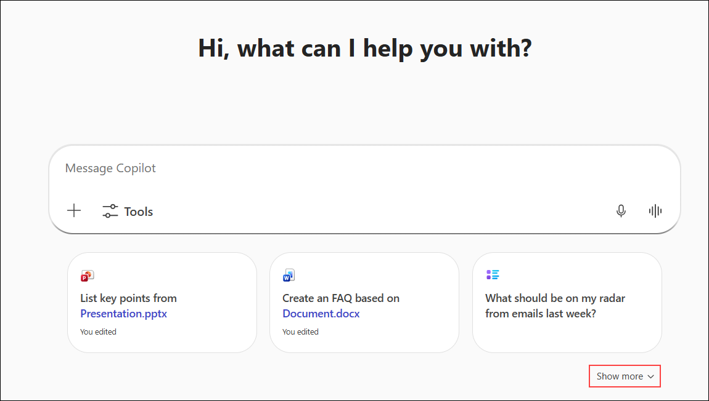

1. From the prompt suggestions section, select **Prompt Gallery** to explore additional prompts.

    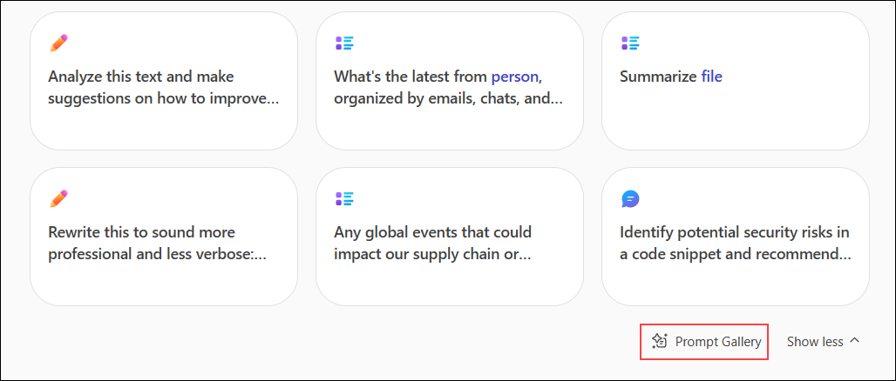

1. You will find a large number of example prompts here, based on different situations and tones, for various all kinds of Microsoft 365 apps.

    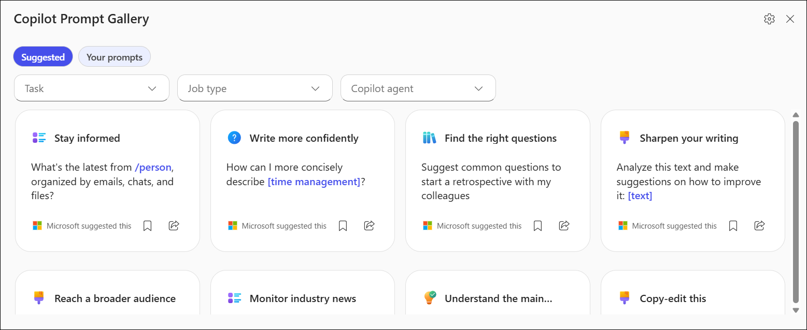

1. In the **Copilot** message box, enter the following prompt and text **(1)**, and then select **Send (2)**.

    ```
    Contoso is exploring new ways to improve productivity and collaboration across its teams by adopting modern digital tools. The organization wants employees to spend less time on repetitive tasks such as drafting emails, summarizing documents, and preparing reports, and more time focusing on strategic work and innovation. As part of this effort, the company is evaluating AI-powered assistants that can help streamline daily workflows, support better decision-making, and enhance overall efficiency across departments.
    ```

    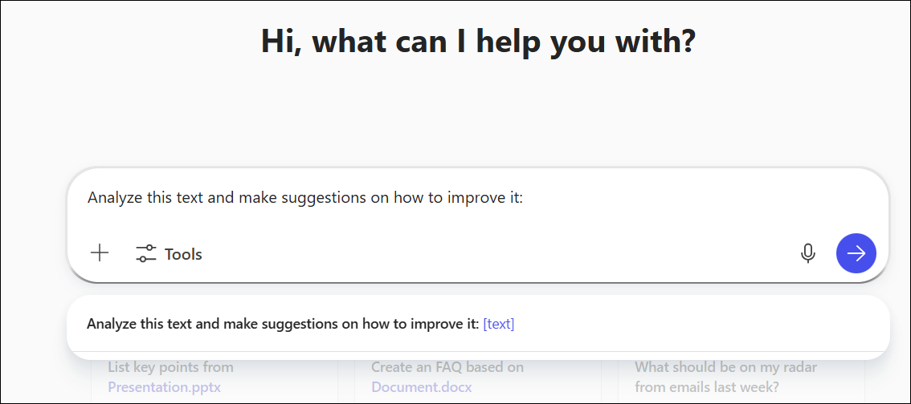

    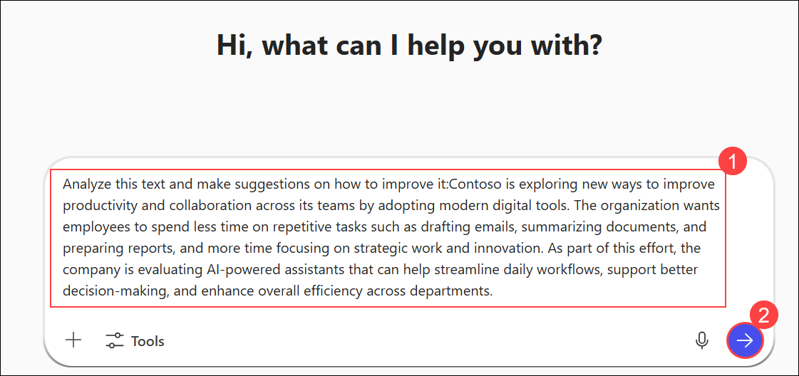

1. Review the response generated by **Copilot** and observe the suggestions and improvements provided for the submitted text.

    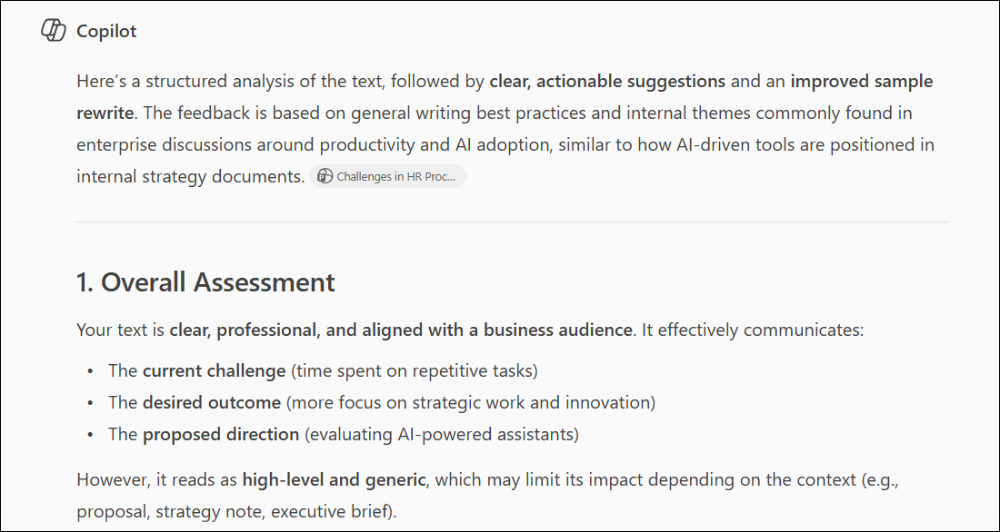

1. From the left navigation pane, select **New chat**.

    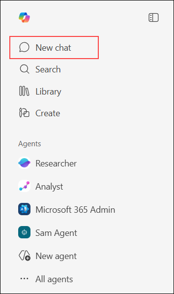

1. On the **Copilot Lab** page, review the available prompt suggestions and select **Show more** to load additional prompts.

    

1. From the prompt suggestions section, select **Prompt Gallery** to explore additional prompts.

    

1. From the **Copilot Prompt Gallery**, review the available prompts and select the **Save prompt** icon on a prompt you want to save.

    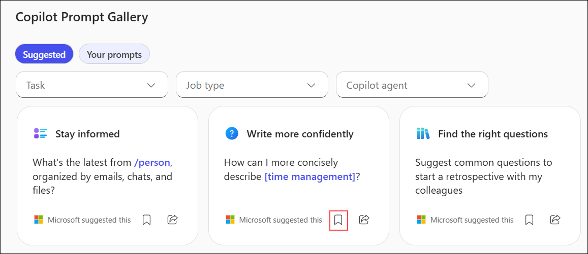

### Filtering the prompts

You can also filter the prompts as per the application where you need them, like PowerPoint, Word, Excel etc. or as per the scenarios where you want to use the, like for creating a documnet, understanding an email or report etc.

1. In the **Copilot Prompt Gallery**, select **Task (1)** and choose a category from the available options **(2)** to filter prompts.

    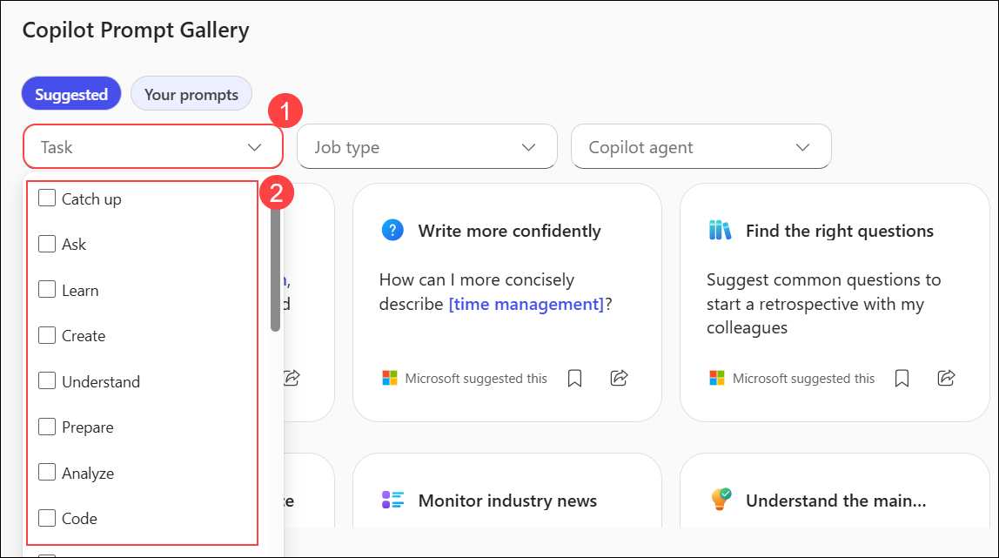

1. In the **Copilot Prompt Gallery**, select **Job type (1)** and choose a department from the available options **(2)** to filter prompts.

    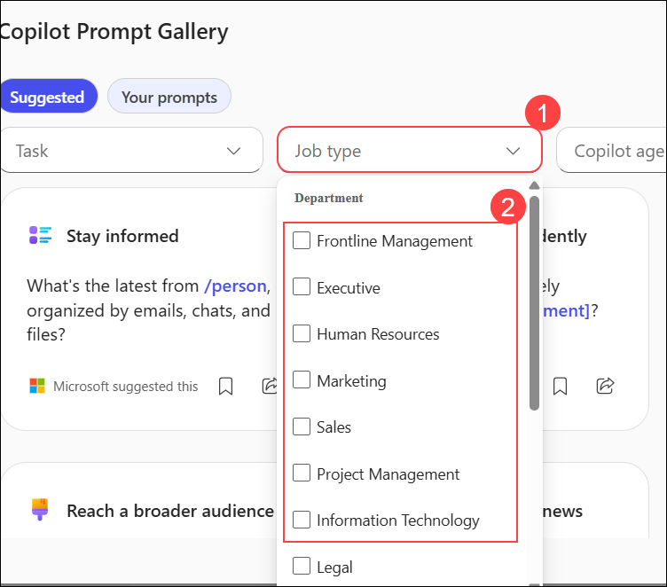

1. In the **Copilot Prompt Gallery**, select **Copilot agent (1)** and choose an agent from the available options **(2)** to filter prompts.

    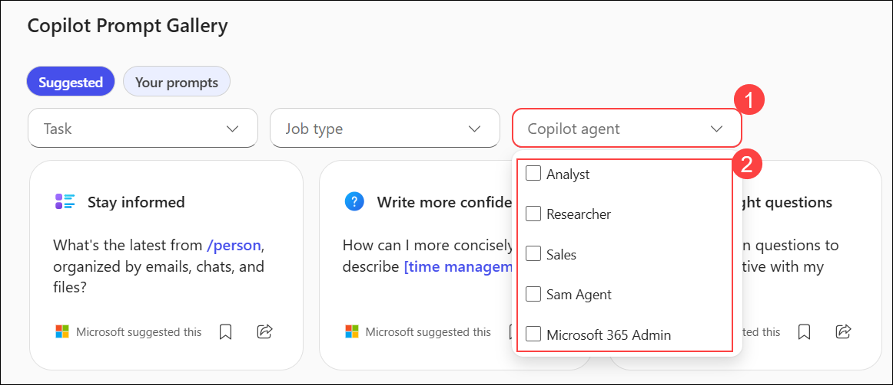

1. In the **Copilot Prompt Gallery**, select **Your prompts (1)** to view all the prompts you saved earlier **(2)**.

    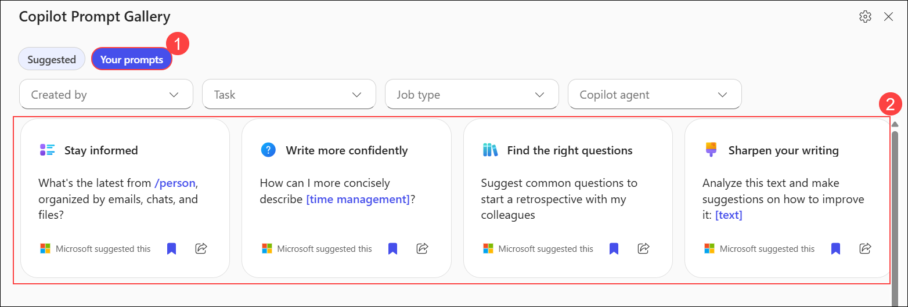

## Conclusion

You've successfully explored Microsoft Copilot Lab and learned how to discover and use pre-written prompts. You browsed the Prompt Gallery, tested a prompt with sample text about Contoso's productivity goals, and learned how to filter prompts by task, job type, and application. You also saved prompts for future use. This experience demonstrates how Copilot Lab can help you learn effective prompt engineering techniques and discover new ways to use Copilot across Microsoft 365 applications.

## Summary

In this exercise, you explored Microsoft Copilot Lab and its Prompt Gallery. You tested prompts with sample text, learned to filter prompts by various categories (task, job type, application), and saved prompts for later use. This hands-on experience helped you understand how to craft better prompts and use Copilot more effectively.
