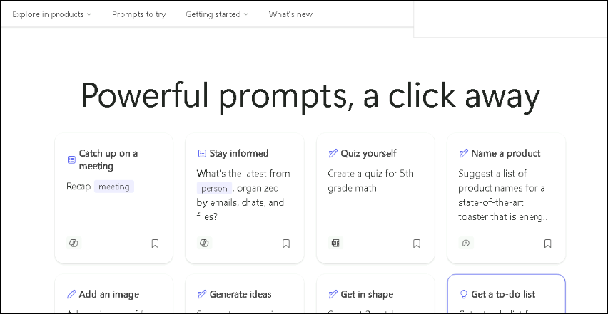

# Exercise 5: Exploring Microsoft Copilot Lab

## Introduction

**Microsoft Copilot** is a new feature that became available for all Microsoft 365 users. It’s an AI-powered tool that can help you with various tasks, such as writing documents, creating presentations, sending emails, and summarizing meetings. All you need to do is click a button and let Copilot do the work for you.

**Copilot Lab** is a collection of prompts that you can use to explore and experiment with Copilot. You can also see how other users and experts are using Copilot and learn from their tips and tricks.

- **Prompt Engineering:** Prompt engineering is the skill of knowing when and how to ask Copilot to do something for you. It’s like giving instructions to a smart assistant. You want to be clear, concise, and specific, so that Copilot can understand your goal and deliver the best results.

## Features of Copilot Lab

Here are some of the main features of Copilot Lab:

1. Copilot Lab is designed to help you learn prompt engineering in a fun and easy way. You can browse through different categories of prompts, such as business, education, entertainment, and more. You can also search for prompts by keywords or topics.

1. It helps to try out any prompt you like and see how Copilot responds. You can also edit the prompt or the response to see how it changes the outcome. You can also share your prompts and responses with other users and get feedback and suggestions.

1. By using Copilot Lab, you can discover new ways to use Copilot and improve your prompt engineering skills. You can also learn from other users and experts who have created and shared their own prompts. You can also contribute to the Copilot Lab community by creating and sharing your own prompts.

## Using Copilot Lab

1. Navigate to `https://copilot.cloud.microsoft/prompts` to open **Copilot Lab**. scroll down and You will see a similar screen:

    

    You will find a large number of example prompts here, based on different situations and tones, for various all kinds of Microsoft 365 apps.

1. Go through the list of prompts and try to find one as per your needs. Click on **Show more** to load more prompts.

1. Select a desired prompt and its popup will appear, showing the recommended app where it will work, in the **Works in** section. Select **Copy** icon to copy it.

    

    You can also save it for later by clicking on **Save prompt** icon and also share it by clicking on **Share prompt with others** icon.

1. Many prompts are customizable so you can modify them to suit your needs. The customizable portion of the prompt is found between brackets. For example, in the prompt “Create a presentation about how to [effectively volunteer for non-profit organizations] with a slide about how to evaluate impact” you can edit the prompt to include the information you want in your presentation.

1. Go to the related application where you want to try the prompt out and notice the outputs.

### Filtering the prompts

You can also filter the prompts as per the application where you need them, like PowerPoint, Word, Excel etc. or as per the scenarios where you want to use the, like for creating a documnet, understanding an email or report etc.

1. In the **Copilot Lab** portal, click on the *App* dropdown menu present under the **Prompts to try** section.

    

1. Choose the application whose prompts you want to see and only the selected application prompts will appear. You can select more than 1 apps at a time.

    

1. To filter prompts as per different scenarios, choose **Task** drop-down menu. You can select different categories for which you want to see the prompts.

    

1. You can also click on **Saved prompts** to see all the prompts you saved earlier, at once.

    

## Using Copilot Lab in Word and PowerPoint

**Copilot Lab** is also integrated in MS Word and MS PowerPoint, and the prompts can directly be referenced from the apps, without separately navigating to the Copilot Lab portal.

To use Copilot Lab prompts, follow the below steps:

1. Open Word or PowerPoint in your web browser.

1. Create a new document or presentation or open an existing one.

1. Choose the **Copilot** button on the top and the related pane will appear.

1. Click on the **View prompts** icon to explore prompts. A drop-down menu with prompt categories and **View more** prompts option will open.

    

1. Click on each category and explore the related prompts. To find more prompts, select the **View more prompts** option. The Copilot Lab dialog box will open.
    
    >**Note**: You can also save a prompt for quick access in future by clicking on **Save prompt** icon.

1. Select a prompt as per your requirement. Provide any optional details in the chatbox and choose **Send**.

    >**Note**: You can also click on **Saved prompts** to see the saved prompts (if you saved earlier for quick access), and can also click on drop-down menu besides it to filter them as per categories.
    

## Using Copilot Lab in Microsoft Chat

1. Navigate to **Microsoft Copilot Chat** by clicking on **Copilot** icon from the left pane.

    

1. Move through the sample prompts and select the one you need. The prompt will appear in the Copilot edit box. Click on **Send** icon to generate the response in the Copilot chat pane.

1. To explore more prompts, click on **View prompts** button and the **Copilot Lab** dialog box will appear.

    

1. Select a prompt as per your requirement. Provide any optional details in the chatbox and choose **Send**.

    

    >**Note**: You can also save a prompt for quick access in future by clicking on **Save prompt** icon.

    >**Note**: You can also click on **Saved prompts** to see the saved prompts (if you saved earlier for quick access), and can also click on drop-down menu besides it to filter them as per categories.

## Conclusion

Microsoft Copilot Lab presents a dynamic and engaging platform for users to enhance their prompt engineering skills and leverage the capabilities of Microsoft Copilot. This innovative tool offers a diverse range of prompts across various categories, empowering users to effortlessly navigate and experiment with prompts tailored to their needs. The ability to customize prompts, explore responses in real applications, and share insights with the community fosters a collaborative learning environment. The integration of Copilot Lab into Microsoft Word, PowerPoint, and Chat further streamlines the workflow, allowing users to seamlessly access prompts directly within their familiar workspace.
