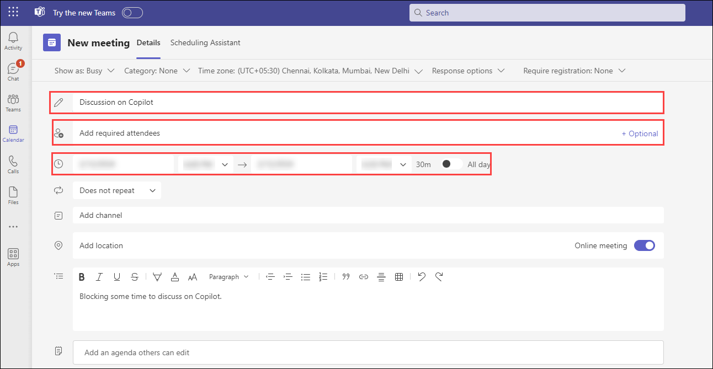
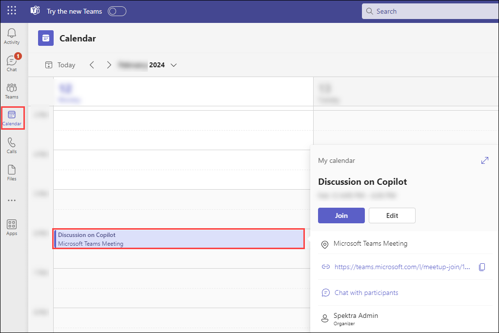
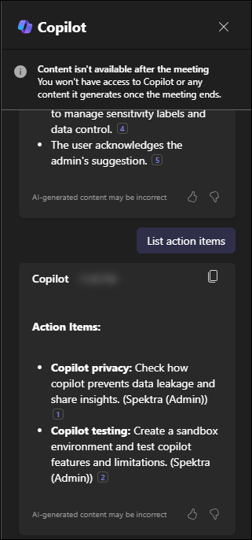
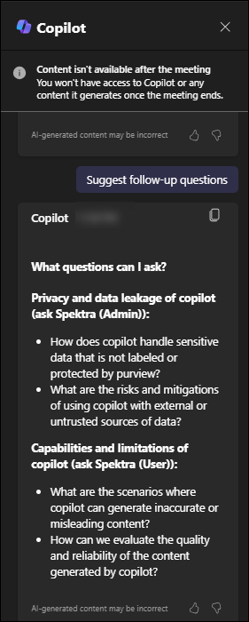
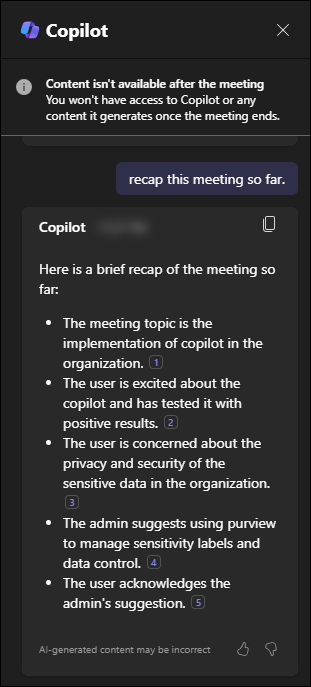
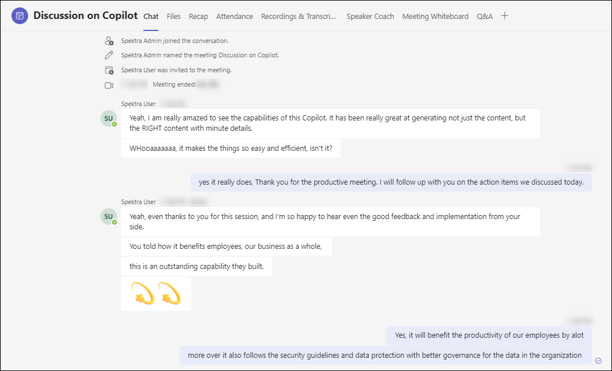
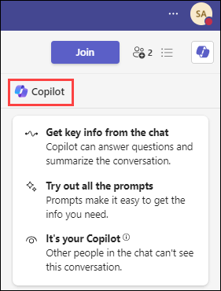
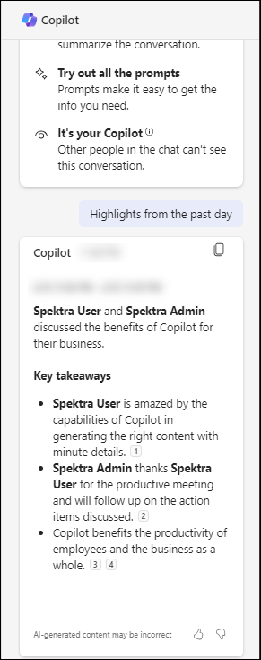
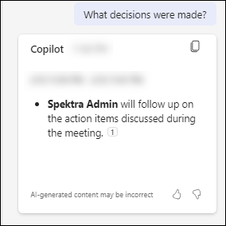

# Exercise 7: Try Out Your Organizational Use Cases with M365 Copilot Capabilities

## Introduction

This exercise is designed to demonstrate the practical utility and capabilities of the M365 Copilot in a real-world context. You'll conduct a meeting and a chat conversation with your colleagues, using the M365 Copilot to streamline and summarize these interactions. The goal is to gain hands-on experience with the tool and understand its potential to enhance productivity and communication within your organization.

## Task 1: Utilize M365 Copilot in teams.

### Scheduling a Meeting

To schedule a meeting in Microsodt Teams with your colleagues, follow the given steps:

1. Open **Microsoft Teams** and select **Calender** from the left pane. Choose **New Meeting** from the top right corner.

1. A  new page will open where you can add a title to your meeting, add required attendees, select the date and time and add any other required information.

    Give a name to your meeting and add your colleagues by typing their usernames in the appropriate box, and choose your favourable time slot.

    

1. Select **Save** from the top right corner. A meeting invite will be sent to the attendees of the meeting. You can find it on your **Calender** page in the time slot you chose.

    

1. To start the meeting, click on the invite and select **Join**.

### Utilizing M365 Copilot during the Meeting

To utilise the capabilities of Microsoft 365 Copilot in a meeting, follow the given steps:

1. Organise a meeting and select **Copilot** from the top bar. A side pane will open where you can give prompts to the Copilot.

1. During the meeting, ask Copilot to take notes, list action items or generate relevant questions.

    

    

1. Review the Meeting Summary by asking Copilot to provide a summary of the meeting when it's about to end, which will highlight key points, decisions, and action items.

    

    Share the summary with others who may have missed the meeting.

### Conduct a Chat Conversation

After the meeting, continue the discussion through a chat conversation with your colleagues on Microsoft Teams.

1. On the chat conversation page, select the **Copilot** icon on the top right corner to utilise the Copilot.

    

1. Ask Copilot about highlights from the conversation, any decisions derived out of it or even to summarise the whole chat.

    

    

### Review and Analyze

1. Review and go through the summaries and other answers provided by the M365 Copilot.

1. Reflect on how accurately and effectively M365 Copilot captured the key points of your communication.

## Conclusion: 
By the end of this exercise, you'll have a clear understanding of how M365 Copilot can assist you in summarizing meetings and chat conversations. This hands-on experience will demonstrate the tool's potential to enhance productivity and efficiency in your professional communication. Remember to provide feedback and suggestions for improvements to further refine the capabilities of M365 Copilot.
