# Exercise 7: Try Out Your Organizational Use Cases with M365 Copilot Capabilities

In this exercise, you will schedule a meeting in Microsoft Teams, explore how Copilot can assist during meetings, and use Copilot to summarize chat conversations.

## Overview

In this exercise, you will gain hands-on experience with **Microsoft 365 Copilot** in a real-world Teams scenario. You'll schedule a meeting in Teams with an agenda about discussing Copilot capabilities, then explore how Copilot can be used during meetings to take notes, identify action items, and generate summaries. While the meeting scenario in this lab is for demonstration purposes (Copilot won't generate live content without active participants), you'll learn about Copilot's meeting capabilities and how it can capture key points in real meetings. You'll also use Copilot in Teams chat to summarize conversations, demonstrating how it can help you quickly catch up on discussions and extract important information.

## Task 1: Utilize M365 Copilot in teams.

### Scheduling a Meeting

To schedule a meeting in Microsoft Teams with your colleagues, follow the given steps:

1. Navigate to **Microsoft Teams** using the following URL.

    ```
    https://teams.microsoft.com/v2/
    ```

1. If prompted to sign in, use the lab credentials to sign in.

   - **Email/Username:** <inject key="AzureAdUserEmail"></inject>
   
   - **Temporary Access Pass:** <inject key="AzureAdUserPassword"></inject>

1. In **Microsoft Teams**, select **Calendar (1)** from the left pane, and then choose a preferred date and time slot from the calendar view **(2)**.

    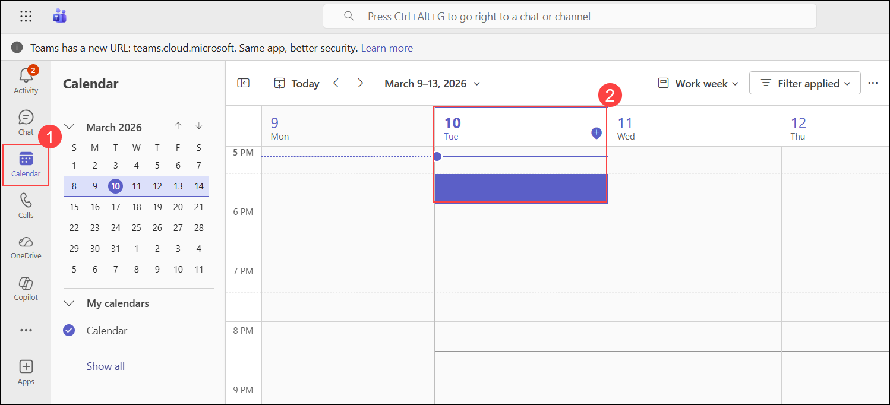

1. In the meeting details page, enter **Discussion on Copilot (1)** as the meeting title and add the following description in the meeting details **(2)**.

    ```
    This meeting will focus on discussing how Microsoft Copilot can support daily work and improve productivity across teams. We will review key Copilot capabilities, explore practical use cases in applications such as Word, Excel, PowerPoint, and Outlook, and discuss how AI can help with tasks like summarizing meetings, drafting emails, and generating reports. The session will also include an open discussion to identify potential scenarios where Copilot can be used within our organization.
    ```

    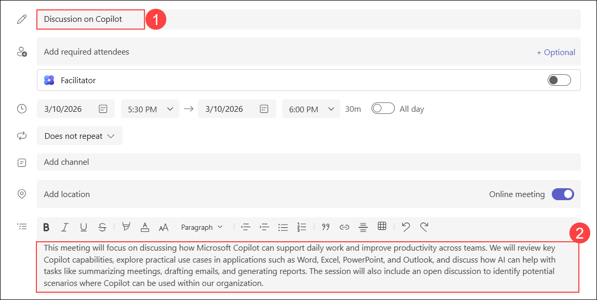

1. On the meeting details page, select **Add an agenda** to include an agenda for the meeting.

    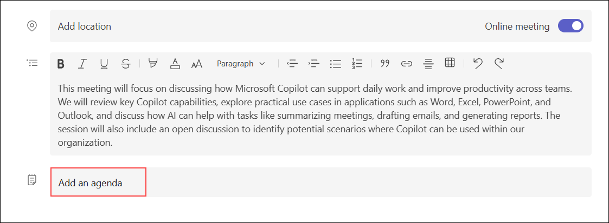

1. In the agenda section, clear the existing template content, and then enter the following meeting agenda.

    ```
    • Overview of Microsoft Copilot capabilities
    • Examples of using Copilot in Word, Excel, PowerPoint, and Outlook
    • Discussion on how teams can use Copilot for meeting summaries, email drafting, and document creation
    • Identify potential use cases within our organization
    • Next steps and action items
    ```

    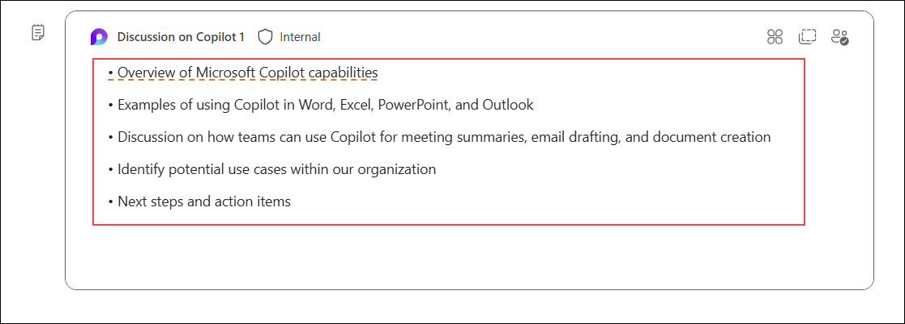

1. Select **Save** to schedule the meeting.

    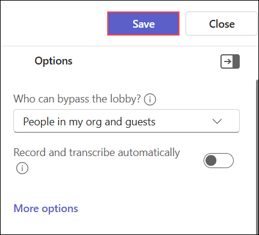

1. A meeting invite will be sent to the attendees of the meeting. You can find it on your **Calendar** page in the time slot you chose.

    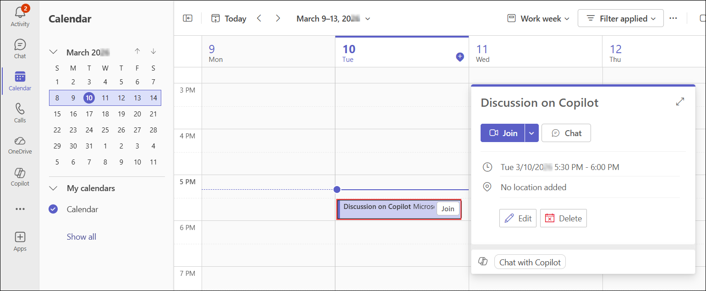

1. To start the meeting, click on the invite and select **Join**.

1. On the meeting join screen, review the audio settings and select **Join now** to start the meeting.

    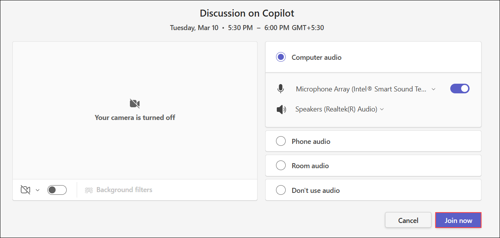

1. During the meeting, select **Copilot** from the meeting toolbar to open the Copilot pane.

    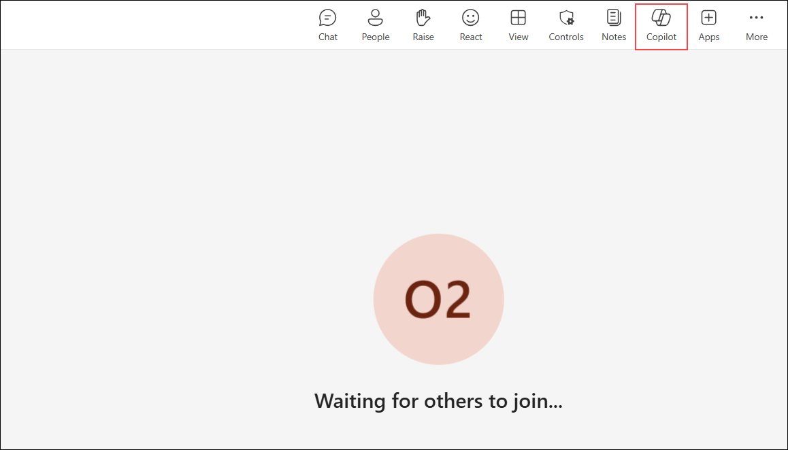

1. In the language selection dialog, review the **Spoken language** setting and select **Confirm**.

    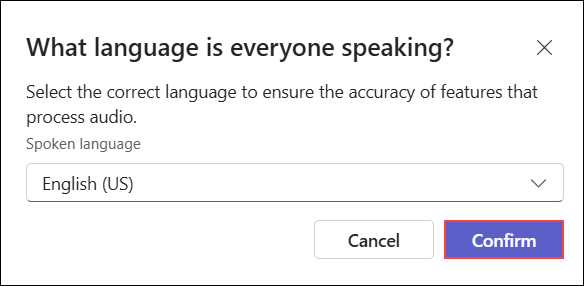

### Utilizing M365 Copilot during the Meeting (Read Only)

> **Note:** In this lab environment, the meeting scenario is provided for demonstration purposes only. Because this is not a live meeting with participants speaking, Microsoft 365 Copilot will not generate real-time notes, action items, or summaries. In a real meeting where participants are actively speaking, Copilot can automatically capture discussions, identify key decisions, generate action items, and provide meeting summaries.

1. A side pane will open where you can give prompts to the Copilot.

1. During the meeting, ask Copilot to take notes, list action items, or generate relevant questions.

    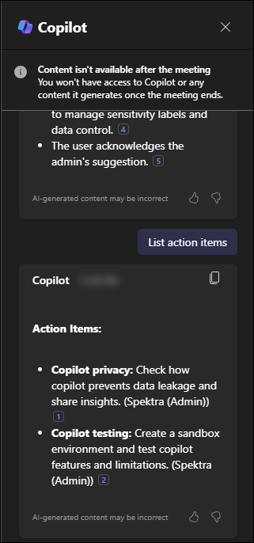

    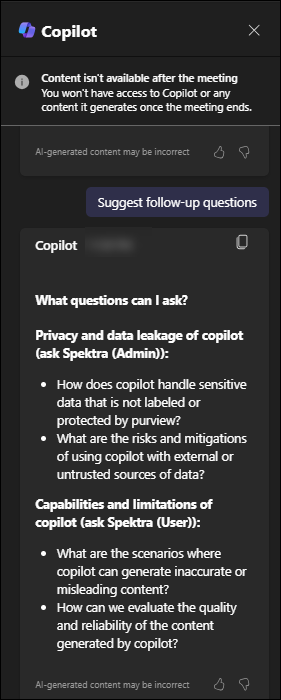

1. Review the Meeting Summary by asking Copilot to provide a summary of the meeting when it's about to end, which will highlight key points, decisions, and action items.

    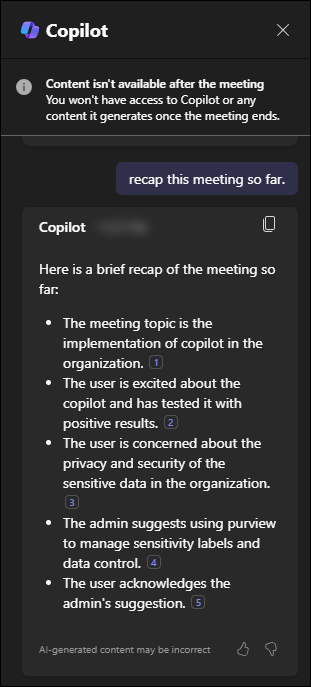

    Share the summary with others who may have missed the meeting.

1. On the chat conversation page, select the **Copilot** icon on the top right corner to utilise the Copilot.

    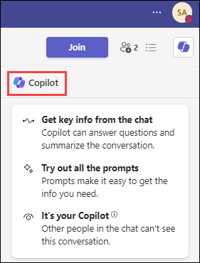

1. Ask Copilot about highlights from the conversation, any decisions derived from it, or even to summarise the whole chat.

    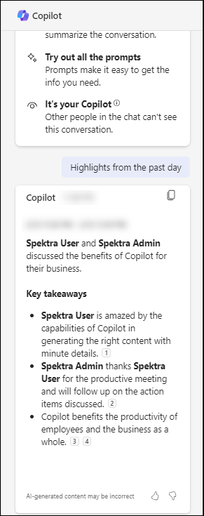

    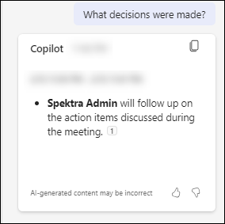

### Review and Analyze

1. Review and go through the summaries and other answers provided by the M365 Copilot.

1. Reflect on how accurately and effectively M365 Copilot captured the key points of your communication.

## Conclusion: 

You've successfully explored how Microsoft 365 Copilot can be used in Microsoft Teams for meetings and chats. You scheduled a meeting with an agenda, learned about Copilot's capabilities for taking notes, identifying action items, and generating meeting summaries, and explored how Copilot can summarize chat conversations. While the lab environment provides a demonstration scenario, you now understand how Copilot can enhance real-world team communication by automatically capturing key discussions, helping team members stay aligned, and making it easier to catch up on missed conversations.
