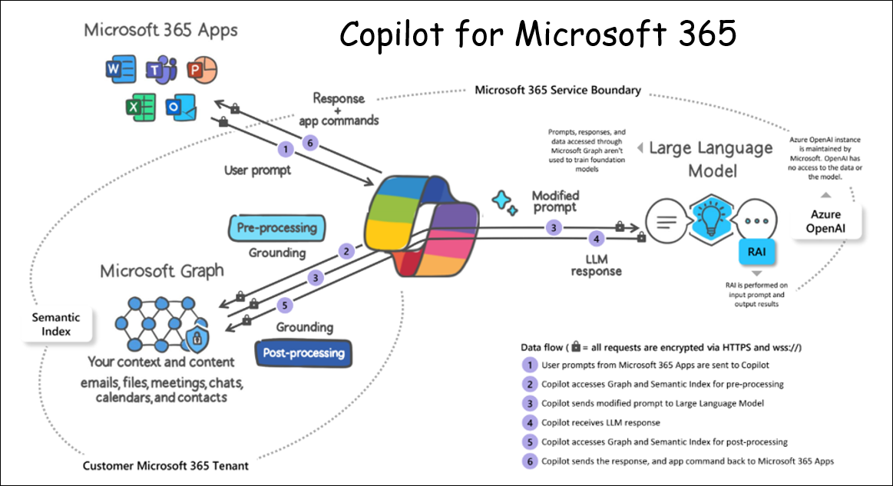
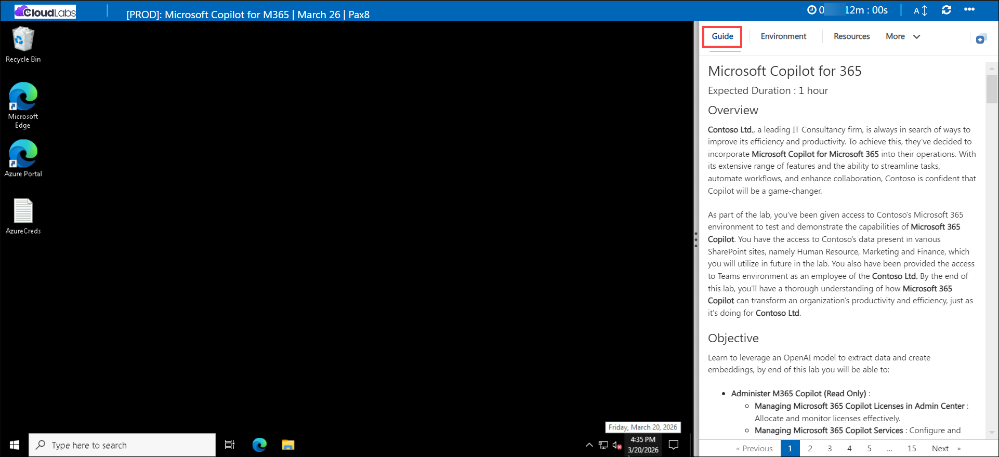
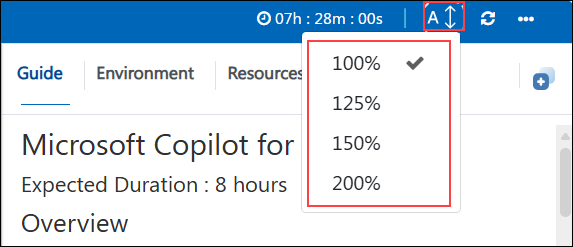
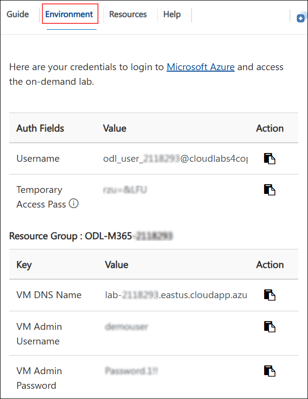
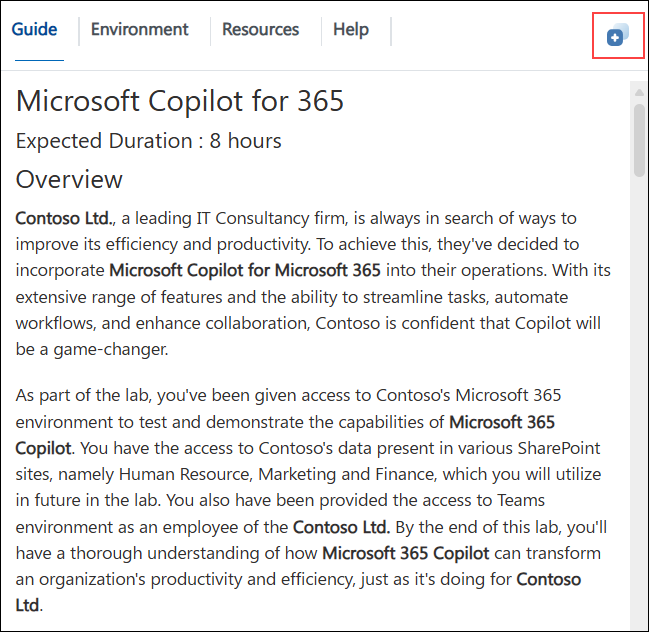
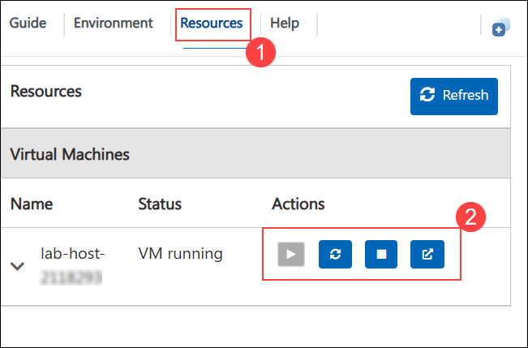
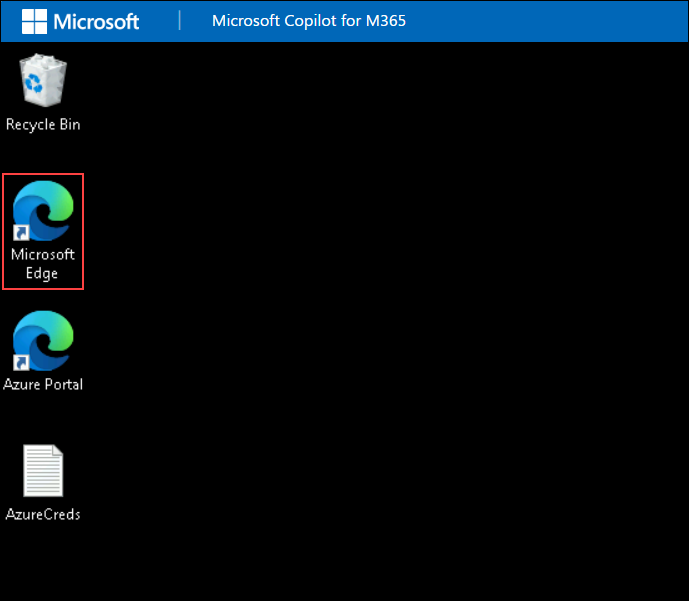
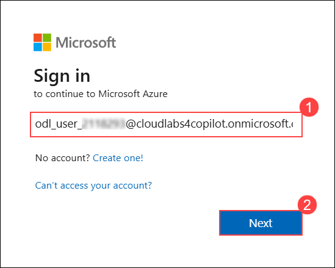
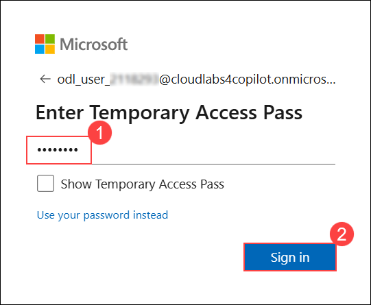
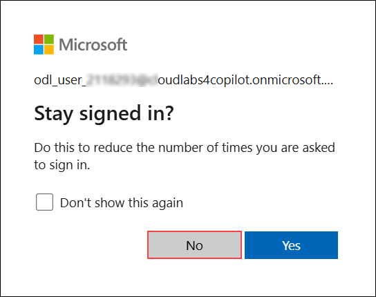

# Microsoft Copilot for M365

### Expected Duration : 1 hour

## Overview

**Contoso Ltd.**, a leading IT Consultancy firm, is always in search of ways to improve its efficiency and productivity. To achieve this, they've decided to incorporate **Microsoft Copilot for Microsoft 365** into their operations. With its extensive range of features and the ability to streamline tasks, automate workflows, and enhance collaboration, Contoso is confident that Copilot will be a game-changer.

As part of the lab, you've been given access to Contoso's Microsoft 365 environment to test and demonstrate the capabilities of **Microsoft 365 Copilot**. You have the access to Contoso's data present in various SharePoint sites, namely Human Resource, Marketing and Finance, which you will utilize in future in the lab. You also have been provided the access to Teams environment as an employee of the **Contoso Ltd.** By the end of this lab, you'll have a thorough understanding of how **Microsoft 365 Copilot** can transform an organization's productivity and efficiency, just as it's doing for **Contoso Ltd**.

## Objective

Learn to leverage an OpenAI model to extract data and create embeddings, by end of this lab you will be able to:

- **Administer M365 Copilot (Read Only)** :
  - **Managing Microsoft 365 Copilot Licenses in Admin Center** : Allocate and monitor licenses effectively.
  - **Managing Microsoft 365 Copilot Services** : Configure and manage Copilot services for optimal performance.
  - **Managing Public web content access** : Control Copilot's access to web content for compliance.
  - **Change update channel of Microsoft 365 Apps to enable Copilot** : Adjust update settings for Copilot functionality.
  
- **Reviewing Security and Compliance in Copilot (Read Only)** : 
  - **Reviewing Security and Compliance in Copilot using Sensitivity Labels** : Protect content with appropriate labels.
  - **Implementing sensitivity label** : Apply labels to classify and secure data.
  - **Reviewing Security and Compliance in Copilot Using Data Classification** : Organize data based on sensitivity and usage.
  - **Reviewing Security and Compliance in Copilot Using Customer Keys** : Use customer keys for data encryption.
  - **Reviewing Security and Compliance in Copilot Using Communication Compliance** : Monitor and manage communication policies.
  - **Reviewing Security and Compliance in Copilot Using Audit** : Track user activities and system changes.
  - **Reviewing Security and Compliance in Copilot Using Content Search** : Perform advanced searches for compliance and security.
  - **Reviewing Security and Compliance in Copilot Using eDiscovery** : Manage legal and investigative workflows.
  - **Reviewing Security and Compliance in Copilot using Retention Policies** : Retain and manage important data efficiently.
  
  - **The Spark – Identifying Chaos - Intelligent Search & Content Analysis (HOL)**: Use Copilot Chat to retrieve and summarize web information, and leverage Copilot to analyze documents and generate actionable insights.
 
## Important:

This lab contains a total of 15 pages. The first 14 pages provide read-only content on administering M365 Copilot and reviewing security and compliance in Copilot. Page 15 includes the hands-on tasks.

If you’d like to perform the tasks, you can directly navigate to page 15. You can also save this [Lab Guide Preview Link](https://experience.cloudlabs.ai/#labguidepreview/13b37205-ec6b-47d3-91ed-3b678d6324ee/1) to revisit the read-only content anytime later.

## Prerequisites

Participants should have:

- **Basic Knowledge of Microsoft 365 Services**: Familiarity with core M365 applications such as Word, Excel, PowerPoint, Teams, and SharePoint.
- **Azure Active Directory (Azure AD) Basics**: Understanding of user management, groups, and access permissions in Azure AD.
- **Administrative Access to Microsoft 365 Tenant**: Ensure you have admin privileges to configure Copilot services, licenses, and compliance settings.
- **Access to Microsoft 365 E5 License**: A Microsoft 365 E5 license or equivalent is required for accessing advanced Copilot features.
- **Set Up of Microsoft 365 Environment**: A fully configured M365 environment with necessary applications installed, including SharePoint, Teams, and Outlook.
- **Knowledge of Security and Compliance in Microsoft 365**: Familiarity with sensitivity labels, retention policies, and compliance tools like eDiscovery and audit logs.

## Architecture

Microsoft 365 Copilot's architecture seamlessly integrates advanced AI capabilities with Microsoft 365 applications to enhance productivity and user experience. It uses Microsoft Graph to provide real-time insights and contextual understanding across apps like Word, Excel, PowerPoint, Teams, Outlook, Loop, and SharePoint. The Semantic Index is a key component, optimizing data retrieval by structuring and indexing files and conversations for Copilot. Integration with Azure Cognitive Services enhances capabilities such as personalized recommendations and language understanding. The architecture also incorporates Microsoft Purview to ensure security and compliance, leveraging tools like sensitivity labels, data classification, retention policies, and eDiscovery. This architecture supports robust management features, including licensing and service configurations, while maintaining adherence to organizational policies, creating a unified framework for deploying, managing, and exploring M365 Copilot capabilities effectively.

## Architecture Diagram

## Explanation of Components

- Word: Automate document creation, editing, and summarization.
- Outlook: Streamline email drafting, responses, and scheduling.
- PowerPoint: Generate professional presentations with AI-powered design and content suggestions.
- Excel: Analyze data, build charts, and gain insights with AI.
- Teams: Enhance collaboration, summarize chats, and manage tasks efficiently.
- Loop: Enable real-time collaboration with dynamic and adaptive content blocks.
- M365 Chat: Consolidate insights and facilitate conversations using data from Microsoft 365.
- Managing Microsoft 365 Copilot Licenses in Admin Center: Allocate, monitor, and manage user licenses efficiently.
- Managing Microsoft 365 Copilot Services: Configure Copilot services for optimal use across the organization.
- Managing Public Web Content Access: Ensure compliance by controlling access to public content sources.
- Sensitivity Labels: Apply labels to classify and protect sensitive data.
- Data Classification: Organize and manage data based on its sensitivity and use cases.
- Customer Keys: Enhance encryption with customer-managed encryption keys.
- Communication Compliance: Monitor and enforce organizational communication policies.

## Getting Started with Microsoft Copilot for Microsoft 365

Welcome to your **Microsoft Copilot for Microsoft 365** lab! We've prepared a seamless environment for you to explore and learn about **Microsoft Copilot for Microsoft 365**. Let's begin by making the most of this experience:

## Accessing Your Lab Environment

Once you're ready to dive in, your virtual machine and lab guide will be right at your fingertips within your web browser.

## Accessing Your Lab Environment
 
Once you are ready to dive in, your virtual machine and **Guide** will be right at your fingertips within your web browser.

   

## Lab Guide Zoom In/Zoom Out

To adjust the zoom level for the environment page, click the **A↕: 100%** icon located next to the timer in the lab environment.

   

## Virtual Machine & Lab Guide
 
Your virtual machine is your workhorse throughout the workshop. The lab guide is your roadmap to success.
 
## Exploring Your Lab Resources
 
To get a better understanding of your lab resources and credentials, navigate to the **Environment** tab.
 
   
 
## Utilizing the Split Window Feature
 
For convenience, you can open the lab guide in a separate window by selecting the **Split Window** button from the top right corner.
 
   
 
## Managing Your Virtual Machine
 
Feel free to **start, stop, or restart (2)** your virtual machine as needed from the **Resources (1)** tab. Your experience is in your hands!
 
   

## Let's Get Started

1. On your virtual machine, click on the **Microsoft Edge** icon as shown below:

   
   
1. You will see the **Sign in to the Microsoft Azure** tab. Here, enter your credentials:
 
   - **Email/Username:** <inject key="AzureAdUserEmail"></inject>
 
      
 
1. Next, provide your Temporary Access Password:
 
   - **Temporary Access Pass:** <inject key="AzureAdUserPassword"></inject>
 
      
    
1. If prompted to stay signed in, you can click **No**.

   
 
1. If a **Welcome to Microsoft Azure** pop-up window appears, click **Cancel** to skip the tour.

## Support Contact

The CloudLabs support team is available 24/7, 365 days a year, via email and live chat to ensure seamless assistance anytime. We offer dedicated support channels tailored specifically for learners and instructors, ensuring that all your needs are promptly and efficiently addressed.

Learner Support Contacts:

- Email Support: cloudlabs-support@spektrasystems.com
- Live Chat Support: https://cloudlabs.ai/labs-support

Click **Next** from the lower right corner to move on to the next page.

## Happy Learning!!
