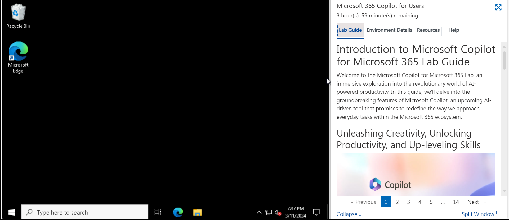
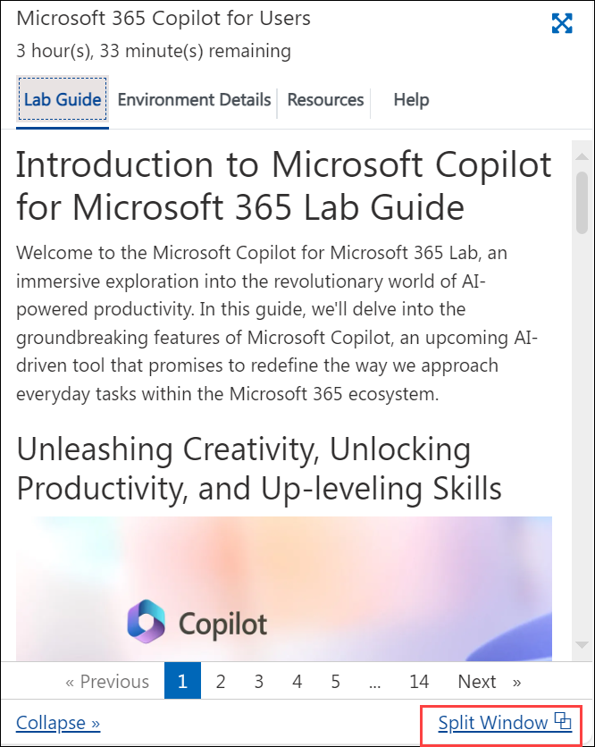
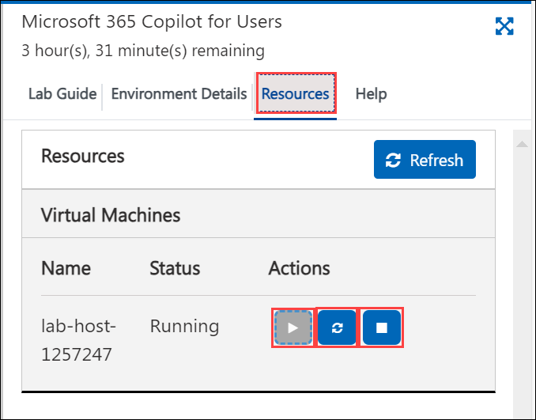

# Getting Started with Microsoft Copilot for Microsoft 365

Welcome to your **Microsoft Copilot for Microsoft 365** lab! We've prepared a seamless environment for you to explore and learn about **Microsoft Copilot for Microsoft 365**. Let's begin by making the most of this experience:

## Accessing Your Lab Environment

Once you're ready to dive in, your virtual machine and lab guide will be right at your fingertips within your web browser.

## Virtual Machine & Lab Guide

Your virtual machine is your workhorse throughout the workshop. The lab guide is your roadmap to success.

  

## Exploring Your Lab Resources

To get a better understanding of your lab resources and credentials, navigate to the **Environment Details** tab. You will find your credentials under **M365 Copilot User Details**. The value before the **|** will be your User ID and the value after **|** will be your User password to log into Microsoft 365 applications and utilize the lab environment.

  

## Utilizing the Split Window Feature

For convenience, you can open the lab guide in a separate window by selecting the **Split Window** button from the bottom right corner.

  

## Managing Your Virtual Machine

Feel free to start, stop, or restart your virtual machine as needed from the **Resources** tab. Your experience is in your hands!

  
