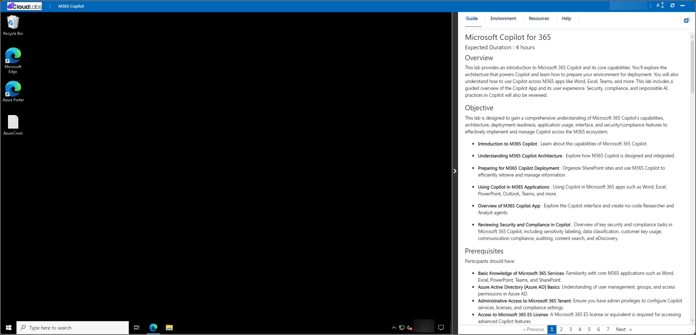
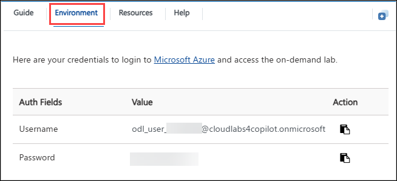
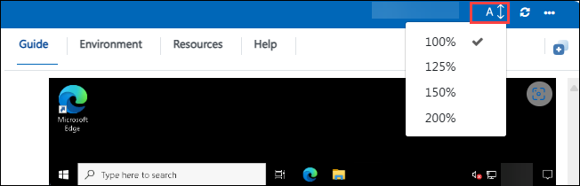
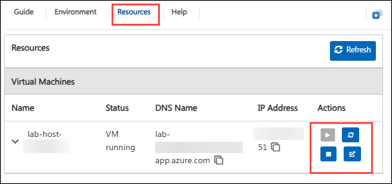

# Microsoft Copilot for M365

### Expected Duration : 4 hours

## Overview

This lab provides an introduction to Microsoft 365 Copilot and its core capabilities.
You’ll explore the architecture that powers Copilot and learn how to prepare your environment for deployment.
You will also understand how to use Copilot across M365 apps like Word, Excel, Teams, and more.
This lab includes a guided overview of the Copilot App and its user experience.
Security, compliance, and responsible AI practices in Copilot will also be reviewed.

## Objective
This lab is designed to gain a comprehensive understanding of Microsoft 365 Copilot’s capabilities, architecture, deployment readiness, application usage, interface, and security/compliance features to effectively implement and manage Copilot across the M365 ecosystem.

- **Introduction to M365 Copilot** : Learn about the capabilities of Microsoft 365 Copilot.
- **Understanding M365 Copilot Architecture** : Explore how M365 Copilot is designed and integrated.
- **Preparing for M365 Copilot Deployment** : Organize SharePoint sites and use M365 Copilot to efficiently retrieve and manage information.

- **Using Copilot in M365 Applications** : Using Copilot in Microsoft 365 apps such as Word, Excel, PowerPoint, Outlook, Teams, and more.
   
- **Overview of M365 Copilot App** : Explore the Copilot interface and create no-code Researcher and Analyst agents
  
- **Reviewing Security and Compliance in Copilot** : Overview of key security and compliance tasks in Microsoft 365 Copilot, including sensitivity labeling, data classification, customer key usage, communication compliance, auditing, content search, and eDiscovery.
  

## Prerequisites

Participants should have:

- **Basic Knowledge of Microsoft 365 Services**: Familiarity with core M365 applications such as Word, Excel, PowerPoint, Teams, and SharePoint.

- **Set Up of Microsoft 365 Environment**: A fully configured M365 environment with necessary applications installed, including SharePoint, Teams, and Outlook.

- **Knowledge of Security and Compliance in Microsoft 365**: Familiarity with sensitivity labels, retention policies, and compliance tools like eDiscovery and audit logs.

## Architecture

Microsoft 365 Copilot's architecture seamlessly integrates advanced AI capabilities with Microsoft 365 applications to enhance productivity and user experience. It uses Microsoft Graph to provide real-time insights and contextual understanding across apps like Word, Excel, PowerPoint, Teams, Outlook, Loop, and SharePoint. The Semantic Index is a key component, optimizing data retrieval by structuring and indexing files and conversations for Copilot. Integration with Azure Cognitive Services enhances capabilities such as personalized recommendations and language understanding. The architecture also incorporates Microsoft Purview to ensure security and compliance, leveraging tools like sensitivity labels, data classification, retention policies, and eDiscovery. This architecture supports robust management features, including licensing and service configurations, while maintaining adherence to organizational policies, creating a unified framework for deploying, managing, and exploring M365 Copilot capabilities effectively.

## Architecture Diagram

## Explanation of Components

- **Word:** Automate document creation, editing, and summarization.

- **Outlook:** Streamline email drafting, responses, and scheduling.

- **PowerPoint:** Generate professional presentations with AI-powered design and content suggestions.

- **Excel:** Analyze data, build charts, and gain insights with AI.

- **Teams:** Enhance collaboration, summarize chats, and manage tasks efficiently.

- **Loop:** Enable real-time collaboration with dynamic and 
adaptive content blocks.

- **M365 Chat:** Consolidate insights and facilitate conversations using data from Microsoft 365.

- **Managing Public Web Content Access:** Ensure compliance by controlling access to public content sources.

- **Sensitivity Labels:** Apply labels to classify and protect sensitive data.

- **Data Classification:** Organize and manage data based on its sensitivity and use cases.

- **Customer Keys:** Enhance encryption with customer-managed encryption keys.

- **Communication Compliance:** Monitor and enforce organizational communication policies.

## Getting Started with Microsoft Copilot for Microsoft 365

Welcome to your **Microsoft Copilot for Microsoft 365** lab! We've prepared a seamless environment for you to explore and learn about **Microsoft Copilot for Microsoft 365**. Let's begin by making the most of this experience:

## Accessing Your Lab Environment

Once you're ready to dive in, your virtual machine and lab guide will be right at your fingertips within your web browser.

## Virtual Machine & Lab Guide

In the integrated environment, the lab VM serves as the designated workspace, while the lab guide is accessible on the right side of the screen.

  

  > **Note:** Kindly ensure that you are following the instructions carefully to ensure the lab runs smoothly and provides an optimal user experience.

## Exploring Your Lab Resources

To get a better understanding of your lab resources and credentials, navigate to the **Environment** tab. You will find your credentials to log into Microsoft 365 applications and utilize the lab environment.

  

## Utilizing the Split Window Feature

For convenience, you can open the lab guide in a separate window by selecting the **Split Window** button from the Upper right corner.

  

## Lab Guide Zoom In/Zoom Out
 
To adjust the zoom level for the environment page, click the **A↕ : 100%** icon located next to the timer in the lab environment.

 

## Managing Your Virtual Machine

Feel free to start, stop, or restart your virtual machine as needed from the **Resources** tab. Your experience is in your hands!

  

Now, click on Next from the lower right corner to move on to the next page.

  

## Support Contact
The CloudLabs support team is available 24/7, 365 days a year, via email and live chat to ensure seamless assistance at any time. We offer dedicated support channels tailored specifically for both learners and instructors, ensuring that all your needs are promptly and efficiently addressed.

Learner Support Contacts:

* Email Support: cloudlabs-support@spektrasystems.com
* Live Chat Support: https://cloudlabs.ai/labs-support

## Happy Learning!!
