# Exercise 3: The Spark – Identifying Chaos - Intelligent Search & Content Analysis (HOL) 

#### Estimated Duration: 40 Minutes

### Overview

In this immersive experience, you will step into the role of a Transformation Lead at Contoso Corp. a rapidly growing organization facing operational chaos due to disconnected reporting, inconsistent policies, and siloed data. Your mission is to leverage both the free version of Copilot Chat and Microsoft 365 Copilot Chat to uncover inefficiencies, analyze organizational data, and drive strategic transformation.

Through a series of guided tasks, you will explore how AI-powered tools can:
- Analyze documents and policies for inconsistencies.
- Surface insights from internal communications and business data.
- Prioritize operational challenges and propose actionable solutions.

**Copilot Chat vs. Microsoft 365 Copilot:**<br>
At the start of this lab, it's important to understand the distinction between: 
 - **Copilot Chat (Free, Web-Based) →** A publicly accessible AI-powered chat tool that allows users to upload documents, ask questions, and receive general guidance. It operates using publicly available information. 
 - **Microsoft 365 Copilot (Work, Enterprise-Level) →** An AI-powered assistant deeply integrated with Microsoft 365 tools (Word, PowerPoint, Outlook, Excel, and Teams). It can access internal files, emails, calendars, and chats to provide organization-specific insights based on a company’s existing data. 

This lab simulates a real-world transformation journey, empowering you to apply AI-driven diagnostics and decision-making in a corporate setting.

>**Note:** `Copilot may generate outputs that differ slightly from the screenshots provided—please proceed with the workflow as expected `.

### Objectives

+ **Task 1:** Understanding Contoso Corp’s Chaos (Exploring the free Version of Copilot Chat) 
+ **Task 2:** Leveraging Organizational Data for Insights (Exploring M365 Copilot Chat) 

### Task 1: Understanding Contoso Corp’s Chaos (Exploring the Free Version of Copilot Chat) 

In this task, you will simulate a real-world scenario where you analyze internal documentation by using the Free version of Copilot chat. We're using Copilot Chat (Free) with Enterprise Data protection, using our user's organizational identity (Entra ID). 

1. In the virtual machine (VM) desktop, type **Microsoft 365 Copilot (1)** in the search bar and select **Microsoft 365 Copilot (2)** from the results to open.

   >**Note:** You can also open the **Microsoft 365 Copilot** by clicking the  icon on the taskbar.
   
   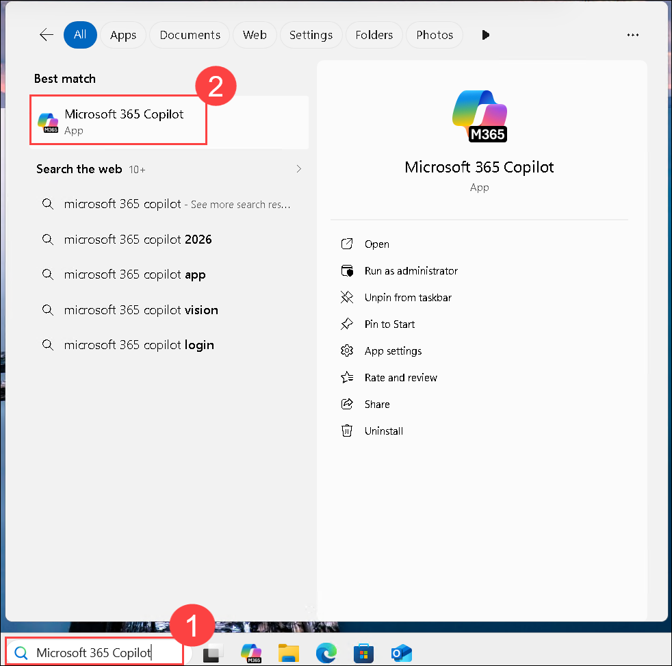

1. On **Choose a Microsoft account** pop-up, click **Create or Sign in with a different account**.

   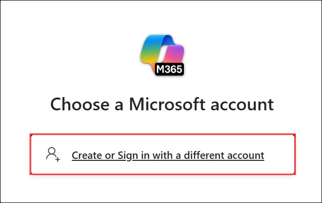

   - On the **Sign in** page enter **Email/Username:** **<inject key="AzureAdUserEmail"></inject>** **(1)** and click on **Next (2)**.
 
      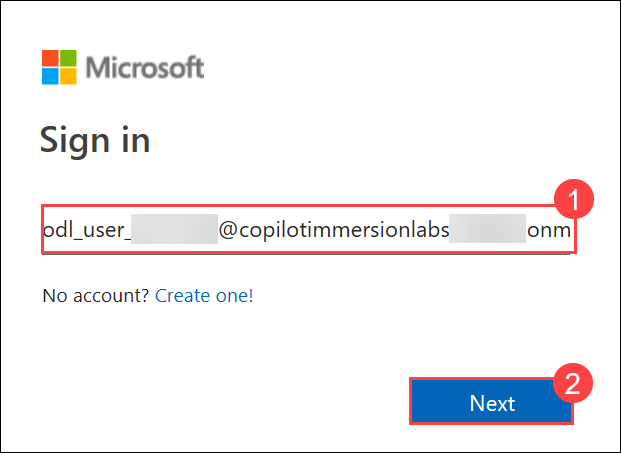
 
   - Enter **Temporary Access Pass:** **<inject key="AzureAdUserPassword"></inject>** **(1)** and click on **Sign in (2)**. 

      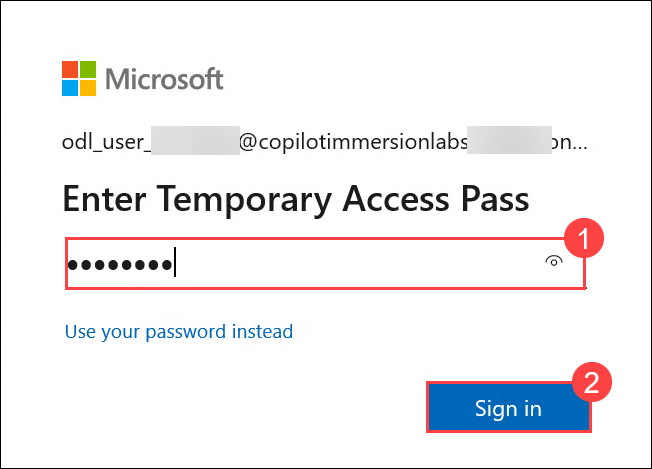

   - On **Sign in to all apps, websites, and services on this device?** page, select **Yes**.

      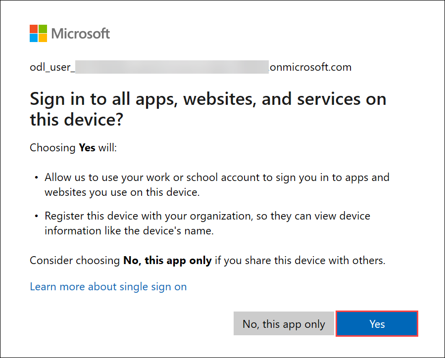

      >**Note:** If you encounter any error, click **OK** and wait a few seconds for the page to load.

1. On the M365 copilot page, from the left panel, select **New chat (1)**, switch it to **Web (2)**, and then provide the following prompt:

    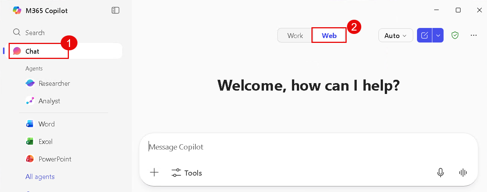

   **Prompt:**
   ```
   Create a case study for Contoso Corp that highlights their struggle with operational inefficiencies due to siloed reporting and inconsistent policies, and position the Transformation Lead as the key driver of organizational change.
   ```

   **Expected Output:**

   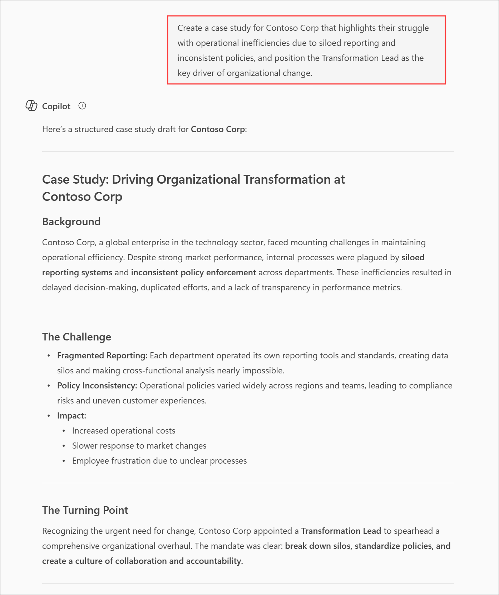

   >**Note:** `In some cases, after launching the Microsoft 365 Copilot app, the Enter button may appear unresponsive and display a message such as Service communication is currently unavailable. This behavior is expected during initial service initialization. If this happens, close the Microsoft 365 Copilot app, right-click on the desktop and select Refresh, and then reopen the app. This helps reinitialize the service connection.`
   
   >**Note:** If the issue persists, wait a few minutes, then sign out and sign back in to the application before retrying. The issue typically resolves automatically.

   - This slide highlights Contoso Corp’s operational inefficiencies caused by siloed reporting and inconsistent policies, visually represented through a disorganized dashboard. As Transformation Lead, you're tasked with bringing structure and alignment to this fragmented landscape.

1. To provide Copilot with internal context, upload the policy document by selecting the **+ (1)** symbol and select **Upload images and files (2)**.

   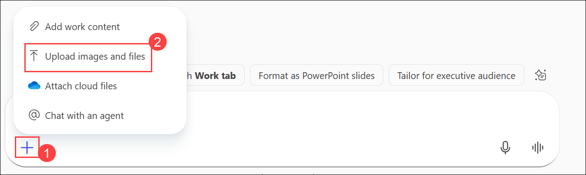
   
1. Navigate to the `C:\LabFiles\Documents` **(1)** path, then select the document named `Contoso_Support_Policy.docx` **(2)**,  and then **Open (3)**.

   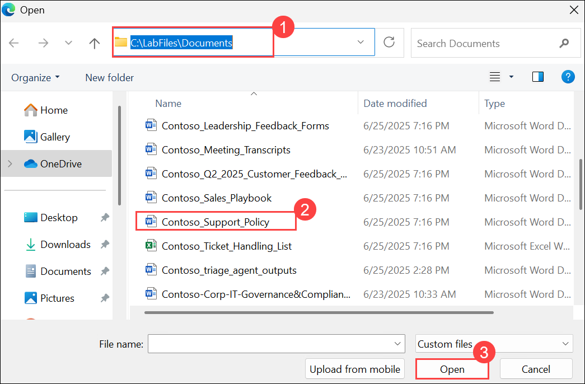

   > **Note:** `If Copilot chat is not responding, or the document upload fails, please sign out and sign in again, then retry the action.`

1. Once the files are uploaded, provide the following prompt **(1)** and then click on **Send (2)**:

   **Prompt:**
   ```
   Summarize this document.
   ```
   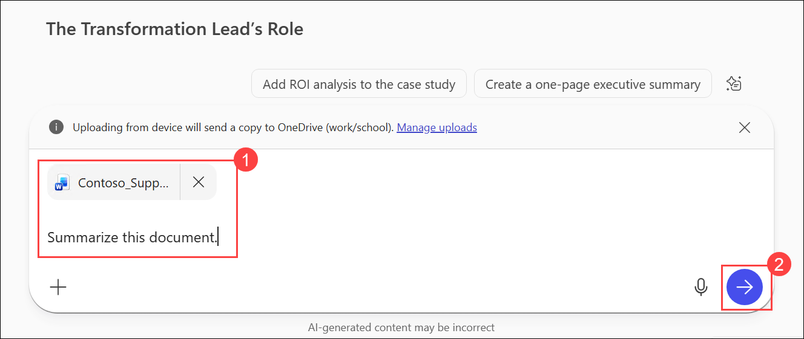

   **Expected Output:**

   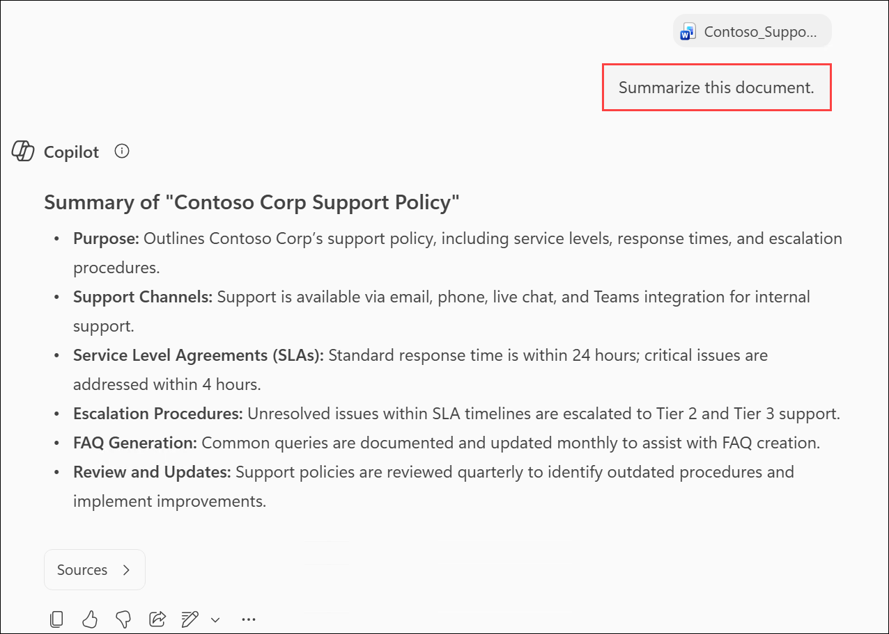

   - A concise summary of the policy’s purpose, scope, and key sections (e.g., **Support Channels, Escalation Procedures, SLAs**).

1. After reviewing the summary, generate FAQs to identify the areas that are most likely to require clarification.  

   **Prompt:**
   ```
   What are the top 5 FAQs based on this document?
   ```

   **Expected Output:** 

   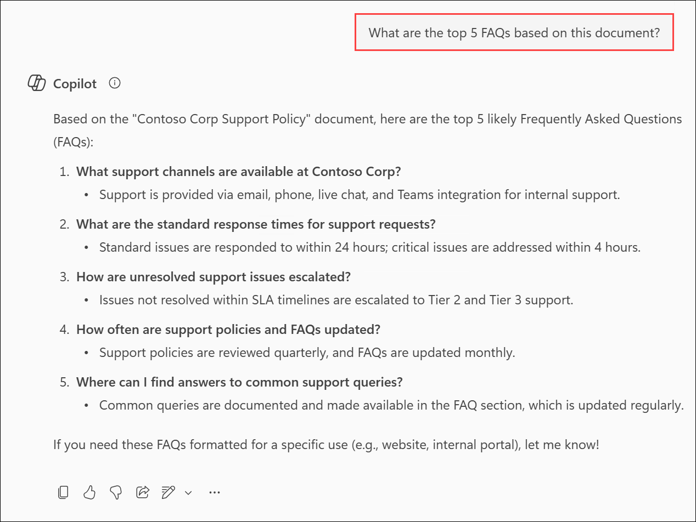

   A list of frequently asked questions, such as:
   - What are the response and resolution times for critical support issues?
   - Who do I escalate to if my issue isn’t resolved promptly?
   - When is support available for different teams?
   - How are requests like new user setups, course creation, or workspace moves handled?
   - What’s the protocol for dealing with cybersecurity threats or policy violations?

1. To identify policy inconsistencies, provide another prompt that will find out the gaps or contradictions in the policy that may vary across departments.
 
    **Prompt:**
    ```
    Are there any inconsistencies or unclear sections in this document?
    ```

    **Expected Output:** 

   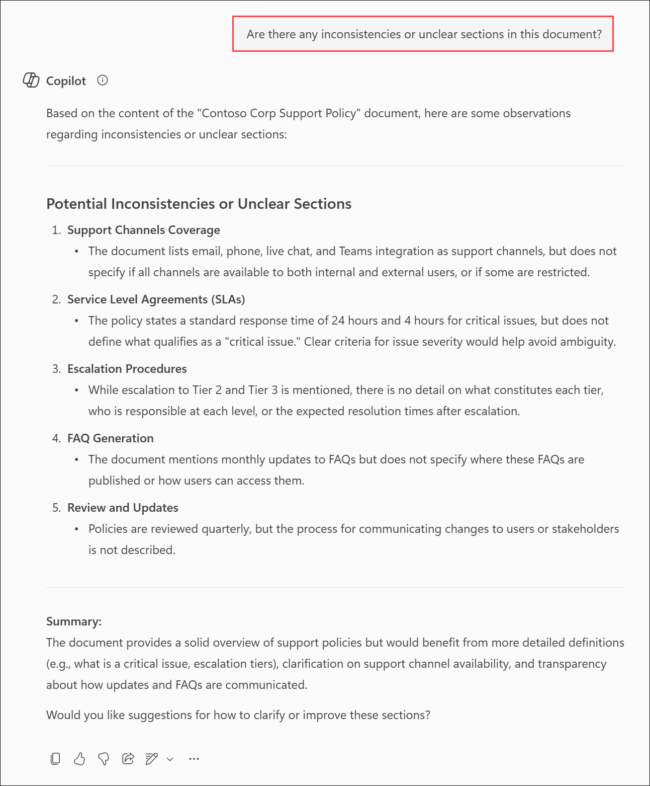

   Copilot may highlight:
     - Conflicting escalation paths
     - Department-specific exceptions are not clearly defined
     - Ambiguities in SLA definitions

    > **Note:** This helps participants practice iterative prompting and critical thinking.

### Task 2: Leveraging Organizational Data for Insights (Exploring M365 Copilot Chat)

We’re now switching to Microsoft 365 Copilot, the paid add-on powered by organizational data and protected within the secure Microsoft 365 ecosystem. The objective of this task is to demonstrate how M365 Copilot Chat can analyze an organization's internal data, like emails, meetings, and documents to uncover operational inefficiencies, detect critical issues across departments, and generate contextual insights for strategic decision-making. It emphasizes real-time, data-driven diagnostics using natural language prompts within the secure M365 ecosystem.

>**Note:** `Copilot may generate outputs that differ slightly from the screenshots provided, please proceed with the workflow as expected`.

1. In the virtual machine (VM) desktop, type **Microsoft 365 Copilot (1)** in the search bar and select **Microsoft 365 Copilot (2)** from the results to open.
   
   

   - **Purpose:** Enables secure access to your org’s structured and unstructured data emails, OneDrive files, Teams chats, SharePoint pages, calendar items, and more.

1. Select the **New chat (1)** from the left panel, and then switch it from **Web** to **Work (licensed version) (2)**.

   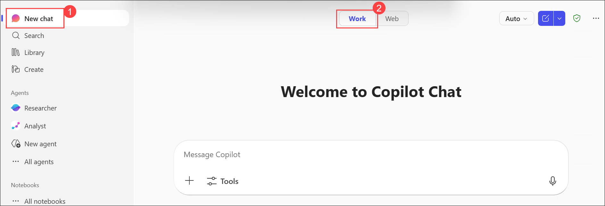

1. In the prompt box, enter the following prompt to explore the types of business data available on the Contoso SharePoint site, then click **Send**:

   **Prompt:**
   ```
   Explore the Contoso Corp<inject key="DeploymentID" enableCopy="false"/> SharePoint site and identify the various categories of business data available on the platform.
   ```

   **Expected Output:**

    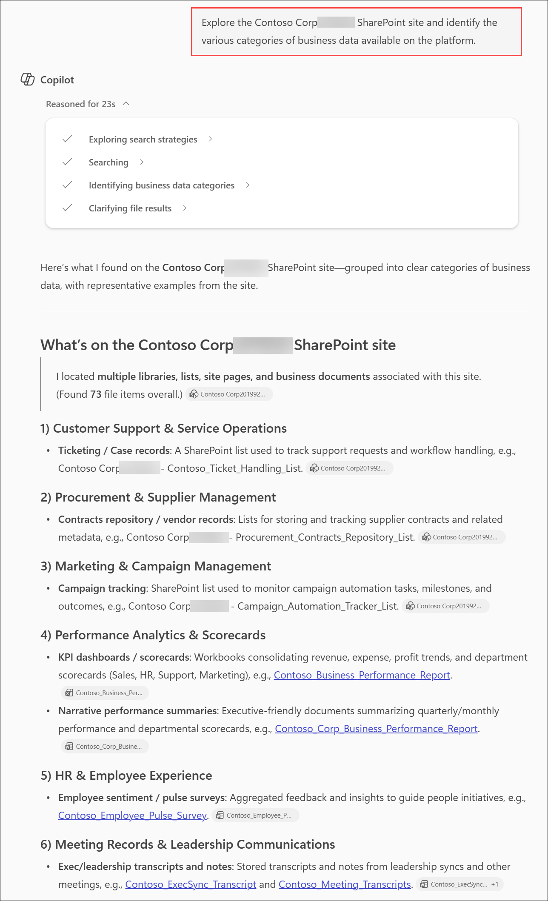

   >**Note:** If the expected output is not displayed, proceed with the subsequent steps without waiting. After completing all lab exercises, you may revisit this step and run the prompts again, as the expected output may take several hours to appear due to SharePoint indexing latency, which affects Copilot’s ability to surface results.
   
1. Analyze Business Performance Using Prompts. Use a high-level prompt to trigger pattern detection and summarization across organizational content.

   **Prompt:**
   ```
   Access Contoso_business_performance_report.xlsx you can see the rapid growth has outpaced its current processes. What are some immediate actions we can take to restore structure and improve operational control?
   ```
   **Expected Output:**

    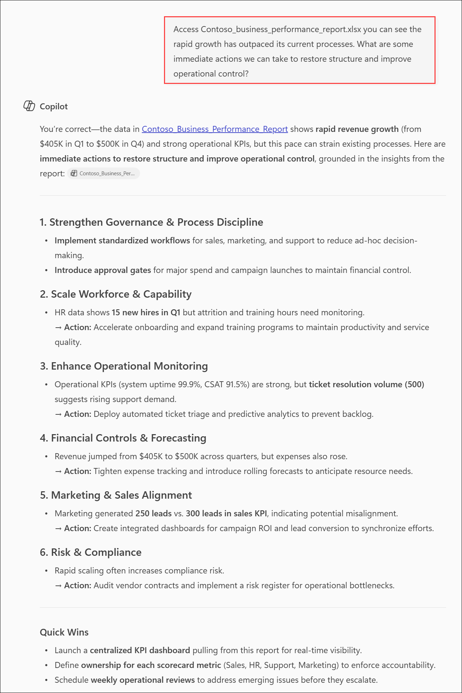    
  
   >**Note:** It will scan relevant reports, internal audits, org charts, and conversations to detect fragmentation points, proposing action items like standardization, documentation gaps, or automation needs.

1. To demonstrate Copilot’s contextual reasoning by referencing actual internal data sources, open the **Microsoft Teams desktop app**.

1. On the Windows taskbar, click the **Search** icon and type **Microsoft Teams (1)**. From the search results, select the **Microsoft Teams app (2)** to open it.

    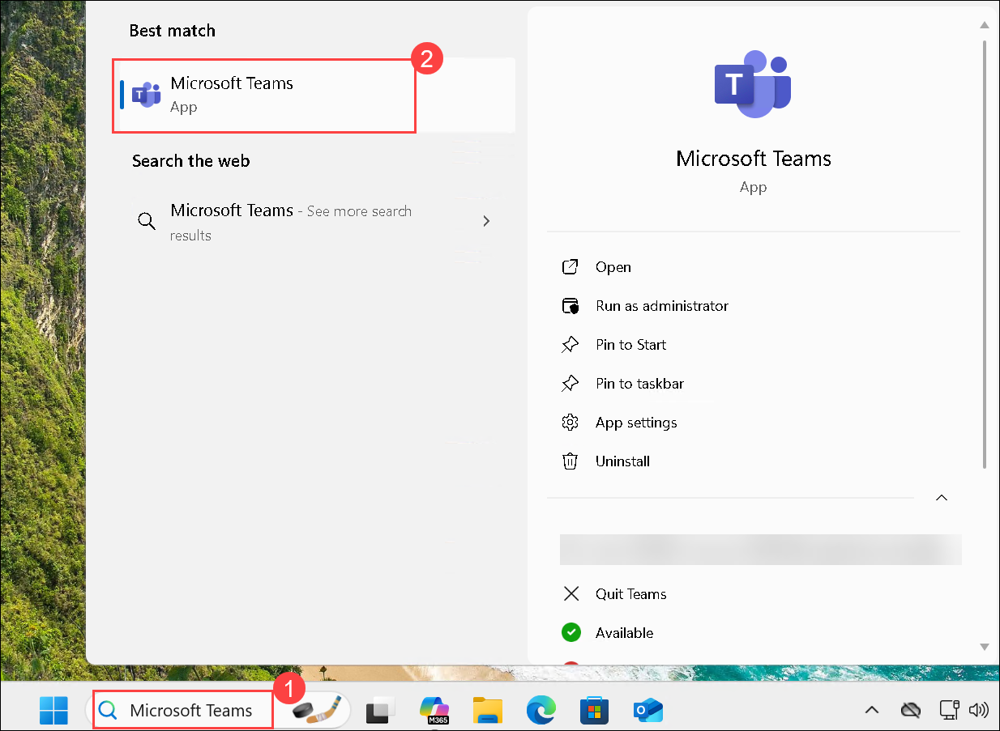

1. Once the team is open, click on **ODL_User<inject key="DeploymentID" enableCopy="false"/>** to proceed.

    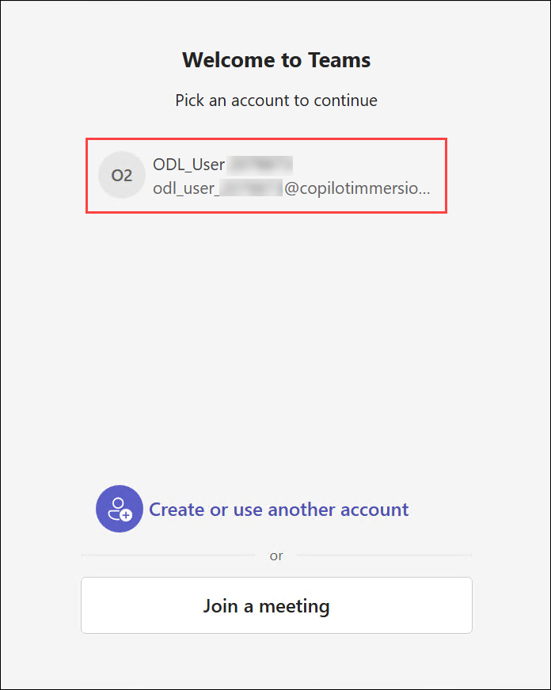

1. Once Teams opens, select the **Contoso executive group (1)** and then access **Copilot (2)** from the top-right corner. Provide the below prompt.

   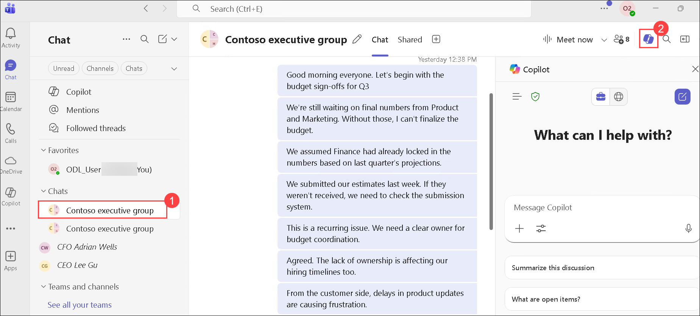

   > **Note:** <span style="color:red">If you don’t see **Copilot icon** in Teams, it might take additional time due to **Copilot indexing** or **Graph connection** not being fully synced yet. In that case, open **Microsoft Edge** and access Microsoft Teams by visiting **https://teams.microsoft.com/**</span>.

   > If prompted, sign-in with the credentials, **Email/Username:** <inject key="AzureAdUserEmail"></inject> and **Password:** <inject key="AzureAdUserPassword"></inject>. 

   >**Note:** Once signed in using the credentials, select the **Contoso executive group (1)** and then access **Copilot (2)** from the top-right corner to continue.  

   **Prompt:**
   ```
   Summarize Q2 strategy discussions from this Teams chat.
   ```

   **Expected Output**

    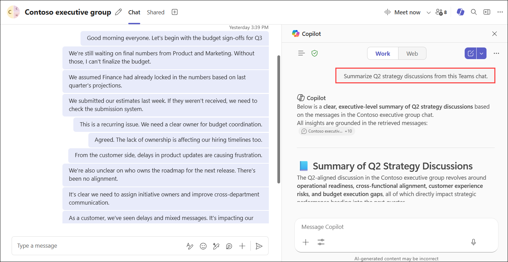

1. On Microsoft Teams Copilot, try out the following prompt to analyze leadership discussions:

   ```
   What’s the sentiment in recent leadership discussions in this Teams chat?
   ```

   **Expected Output**

   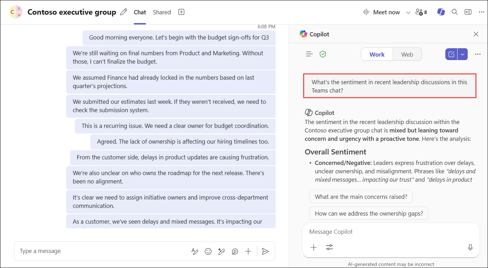

1. Switch back to **M365 Copilot**, select the **Work** tab at the top, and enter the following prompt to draft FAQs from internal documents:
   ```
   Draft a concise FAQ based on the onboarding materials available on the ContosoCorp site, specifically referencing the Leadership Feedback Forms, HR Handbook, and Support Policy documents.
   ```

   **Expected Output**

   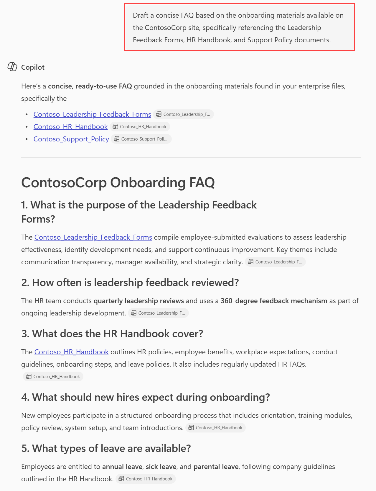 

1. On the Lab VM, open the **Edge browser (1)** from the desktop, copy the url **<inject key="sharepointsite"></inject> (2)** and paste it into a new tab to navigate directly to the **Contoso Corp<inject key="DeploymentID" enableCopy="false" />** SharePoint site.

   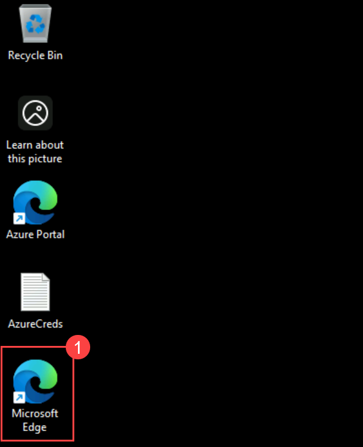 

   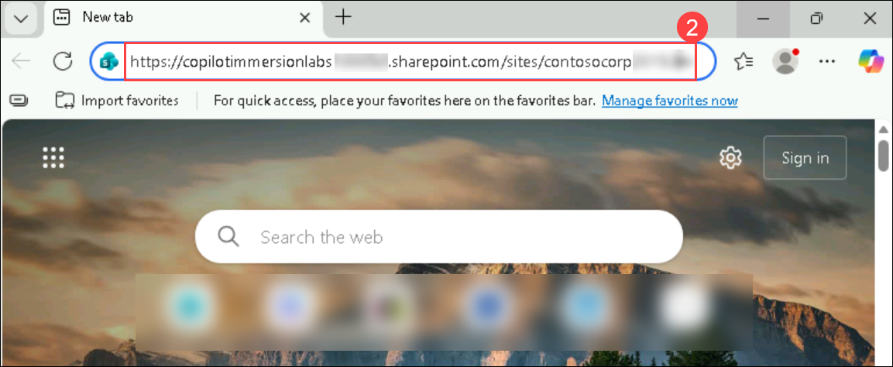 

1. On the **Contoso Corp<inject key="DeploymentID" enableCopy="false" />** SharePoint site, navigate to **Documents (1)** from the left panel, click on the **Open Agents (2)** icon from the top-right corner, and enter the prompt provided below.

    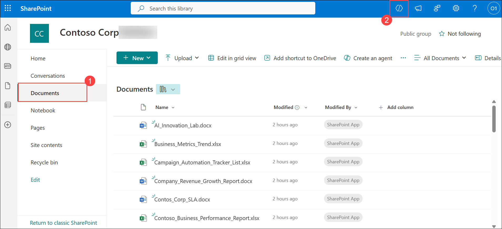

   ```
   What are the top 3 issues facing Contoso in Q3?
   ```

   **Expected Output**

   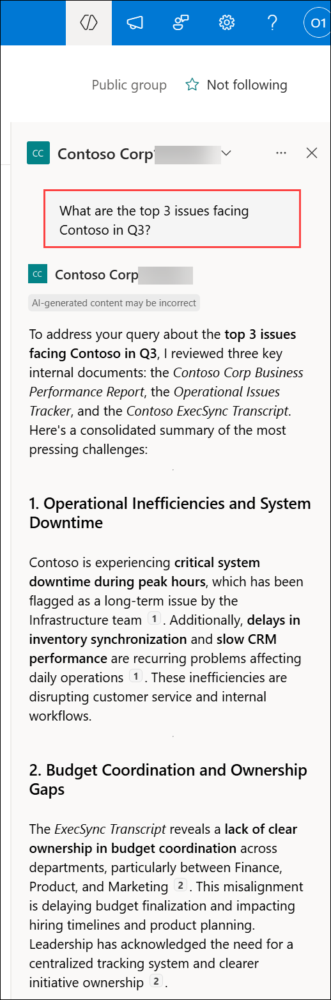      

   > **Note:** If the expected output is not displayed, proceed with the subsequent steps without waiting. After completing all lab exercises, you may revisit this step and run the prompts again, as the expected output may take several hours to appear due to SharePoint indexing latency, which affects Copilot’s ability to surface results. 

1. Ask What’s Going Wrong at Contoso Corp? This diagnostic-style prompt activates pattern-matching against operational signals and anomalies. Go to **M365 Copilot** and provide the below prompt.

   **Prompt:**
   ```
   Review the Contoso_Employee_Pulse_Survey available on the ContosoCorp site and highlight the most commonly reported concerns reflected in recent HR complaints.
   ```
   
   **Expected Output**

   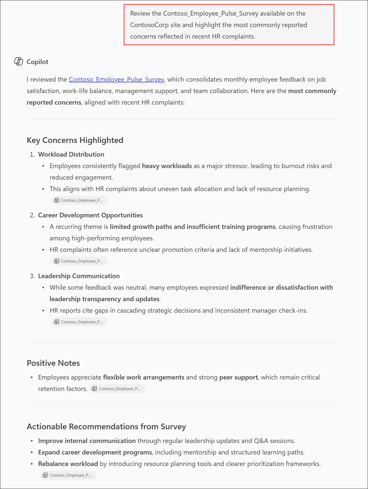 

1. To detect the top 5 urgent problems across key departments. Please enter the below prompts.

   **Prompt:**
   ```
   Access Contoso_Corp_Business_Performance_Report document and identify recurring escalation themes within the Support team over the past 60 days.
   ```

   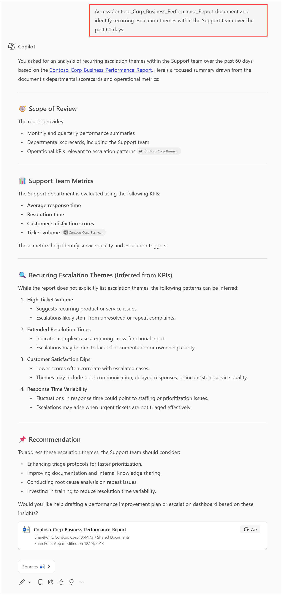

1. Use @ Mentions and Slash (/) Commands for Precision. Please provide the below prompt.

    **Prompt:**
    ```
     Analyze the Q2 strategic priorities using @Lee Gu’s comments from /Contoso_Meeting_Transcripts.docx and /Contoso_ExecSync_Transcript.docx, insights from /June_Operational_Challenges_Summary_Report.docx, and strategic plan 2025 from /Executive_Action_Plan.docx, and identify key themes and potential risks.
    ```

    **Expected Output**

    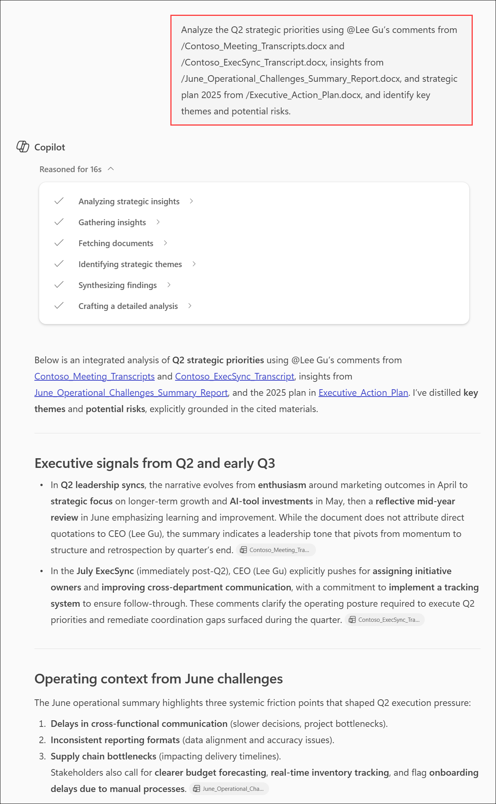   

     >**Note:** This enhances Copilot’s accuracy by grounding context in specific assets.

1. On **M365 Copilot chat**, provide the following prompt to create a visual summary of the most critical operational issues:

    **Prompt:**
    ```
    Create a slide summary of the most critical operational issues at Contoso and rank them by urgency and display it in table format
    ```

    **Expected Output**
      
     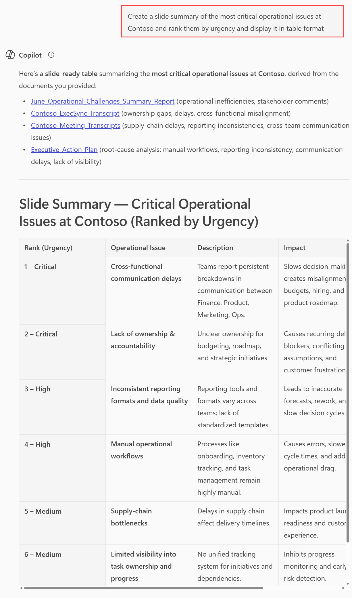

1. Cross-check the most frequently mentioned issues across emails and meeting notes for validation. Please provide the below prompt.

    **Prompt:**
    ```
    Access the leadership alignment reports and customer feedback summaries stored in our ContosoCorp SharePoint site. Review the available documents in those categories, identify recurring operational issues that appear in both sets, and summarize them to validate common concerns impacting strategic execution and customer trust.  
    ```

    **Expected Output**

    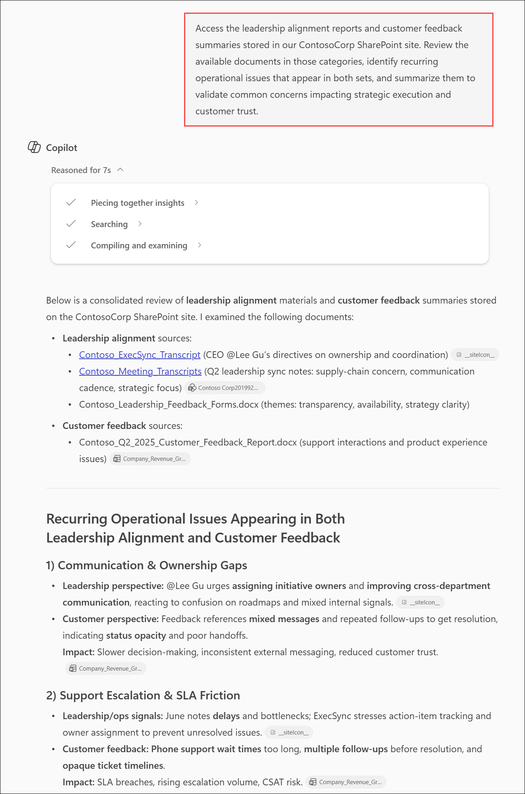    
     
1. Identify any trends or recurring bottlenecks causing operational inefficiencies. Please provide the below prompts.

    **Prompt:**
    ```
    Highlight the top five operational inefficiencies that have persisted since the last quarter.
    ```
    
    **Expected Output**
   
    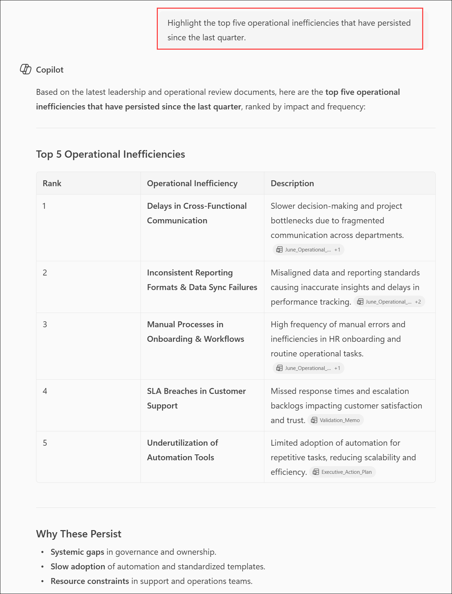

    ```
    Identify departments with consistent SLA violations over the past reporting period.
    ```

    **Expected Output**
   
    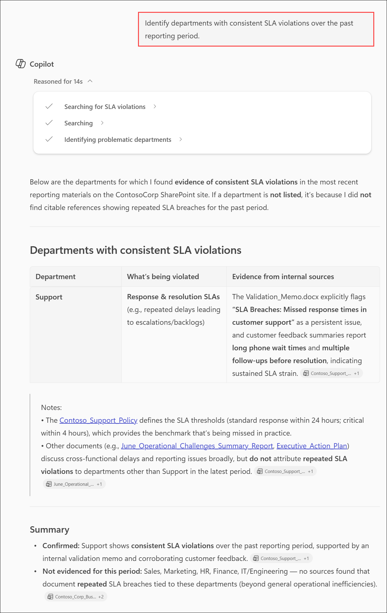
      
### Review

In this exercise, organizational challenges at Contoso Corp were explored and validated using Copilot tools across different contexts. Copilot Chat was first used to identify policy gaps and inconsistencies from unstructured documentation. These initial findings were then validated using Microsoft 365 Copilot against internal organizational data. Finally, Microsoft Teams Copilot was used to transform unstructured discussions into a structured execution plan with clear priorities, ownership, and measurable outcomes.

Successfully completed the following  tasks for prompting:

- Understanding Contoso Corp’s Chaos
- Leveraging Organizational Data for Insights
- Prioritizing and Structuring Key Findings  
    
**You have successfully completed the lab!**

